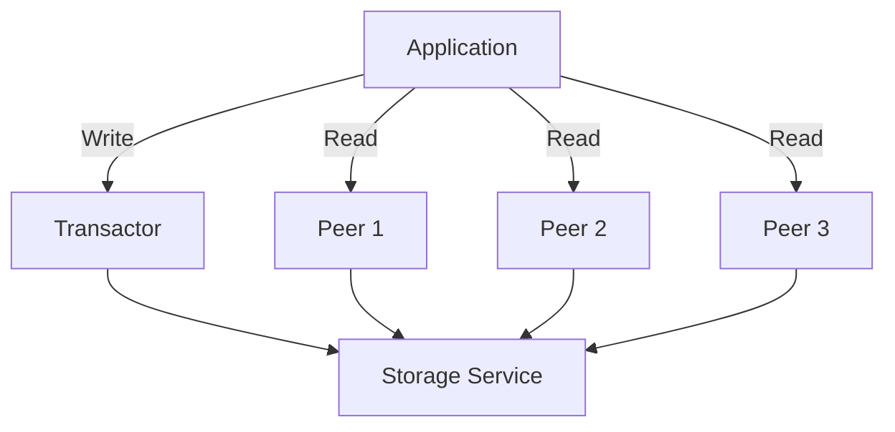

## 14.1.2 Benefits of Using Datomic

Datomic is a unique database system that offers several compelling advantages for developers, particularly those working with Clojure. This section delves into the key benefits of using Datomic, focusing on scalability, rich querying capabilities through Datalog, and robust data integrity features. By understanding these benefits, developers can make informed decisions about integrating Datomic into their data solutions.

### Scalability

One of the standout features of Datomic is its approach to scalability. Unlike traditional databases that often struggle with scaling read and write operations simultaneously, Datomic separates these concerns, allowing for more efficient scaling strategies.

#### Horizontal Scaling of Read Operations

Datomic excels in scaling read operations horizontally. This is achieved by adding more peers to the system. Peers in Datomic are responsible for executing queries and can be distributed across multiple machines to handle increased load. This architecture allows Datomic to efficiently manage large volumes of read requests without compromising performance.

**Example: Scaling Reads with Peers**

Consider a scenario where your application experiences a surge in user activity, resulting in a high volume of read requests. By deploying additional peers, you can distribute the query load across these peers, ensuring that each peer handles a manageable portion of the requests. This horizontal scaling approach not only improves performance but also enhances fault tolerance, as the failure of a single peer does not impact the overall system.

```clojure
;; Example of configuring a Datomic peer
(def peer-config
  {:uri "datomic:dev://localhost:4334/my-db"
   :read-concurrency 10})

;; Function to execute a query using a peer
(defn execute-query [query]
  (let [conn (d/connect peer-config)]
    (d/q query (d/db conn))))
```

#### Centralized Writes for Simplified Consistency

While read operations can be scaled horizontally, writes in Datomic are centralized. This centralization simplifies consistency management, as all write operations are funneled through a single transactor. The transactor ensures that writes are applied in a consistent and ordered manner, maintaining the integrity of the database.

**Diagram: Datomic Architecture**



This architecture allows Datomic to provide strong consistency guarantees while still supporting high read throughput. By decoupling reads and writes, Datomic offers a scalable solution that can handle the demands of modern applications.

### Rich Querying with Datalog

Datomic's querying capabilities are another significant advantage, particularly its use of Datalog, a powerful and expressive query language. Datalog enables developers to perform complex queries and work with recursive relationships, making it an ideal choice for applications with intricate data requirements.

#### Powerful and Expressive Query Language

Datalog is a declarative query language that allows developers to express complex queries concisely. It supports pattern matching, logical conjunctions, disjunctions, and negations, providing a rich set of tools for querying data.

**Example: Basic Datalog Query**

```clojure
;; Query to find all users with a specific role
(def query '[:find ?user
             :in $ ?role
             :where [?user :user/role ?role]])

;; Execute the query
(defn find-users-by-role [db role]
  (d/q query db role))
```

#### Supporting Complex Queries and Recursive Relationships

Datalog's ability to handle recursive queries is particularly beneficial for applications that need to model hierarchical or graph-like data structures. Recursive queries allow developers to traverse relationships and extract insights from interconnected data.

**Example: Recursive Query**

```clojure
;; Recursive query to find all descendants of a given entity
(def recursive-query '[:find ?descendant
                       :in $ ?ancestor
                       :where
                       [?ancestor :entity/child ?descendant]
                       (recursive ?descendant)])

;; Execute the recursive query
(defn find-descendants [db ancestor]
  (d/q recursive-query db ancestor))
```

### Data Integrity

Data integrity is a critical aspect of any database system, and Datomic provides robust features to ensure the consistency and validity of data. These features include schema enforcement, advanced data validation, and ACID transactions.

#### Schema Enforcement and Advanced Data Validation

Datomic allows developers to define schemas that enforce data integrity rules. Schemas specify the structure and constraints of data, ensuring that only valid data is stored in the database. This schema enforcement is complemented by advanced data validation capabilities, allowing developers to implement custom validation logic.

**Example: Defining a Schema**

```clojure
;; Define a schema for user entities
(def user-schema
  [{:db/ident :user/name
    :db/valueType :db.type/string
    :db/cardinality :db.cardinality/one
    :db/doc "The name of the user"}
   {:db/ident :user/email
    :db/valueType :db.type/string
    :db/cardinality :db.cardinality/one
    :db/unique :db.unique/identity
    :db/doc "The email of the user"}])

;; Transact the schema
(d/transact conn {:tx-data user-schema})
```

#### ACID Transactions for Consistency

Datomic supports ACID (Atomicity, Consistency, Isolation, Durability) transactions, ensuring that all operations are applied consistently and reliably. ACID transactions provide strong guarantees about the state of the database, even in the presence of concurrent operations or system failures.

**Example: Performing an ACID Transaction**

```clojure
;; Function to update a user's email within a transaction
(defn update-user-email [conn user-id new-email]
  (d/transact conn
              {:tx-data [{:db/id user-id
                          :user/email new-email}]}))
```

### Conclusion

Datomic offers a range of benefits that make it an attractive choice for developers seeking a scalable, query-rich, and integrity-focused database solution. Its ability to scale read operations horizontally, support complex queries with Datalog, and ensure data integrity through schema enforcement and ACID transactions positions it as a powerful tool for modern data applications.

By leveraging these benefits, developers can build robust and scalable applications that meet the demands of today's data-driven world. Whether you're working on a small project or a large enterprise application, Datomic provides the flexibility and power needed to handle complex data requirements with ease.

## Quiz Time!



### What is one of the primary scalability features of Datomic?

- [x] Horizontal scaling of read operations by adding more peers.
- [ ] Vertical scaling of write operations by adding more transactors.
- [ ] Automatic scaling of both read and write operations.
- [ ] Decentralized scaling of both read and write operations.

> **Explanation:** Datomic scales read operations horizontally by adding more peers, allowing it to handle increased read loads efficiently.

### How does Datomic handle write operations?

- [x] Centralized writes through a single transactor.
- [ ] Decentralized writes across multiple transactors.
- [ ] Distributed writes through peer nodes.
- [ ] Writes are handled directly by the storage service.

> **Explanation:** Datomic centralizes writes through a single transactor, simplifying consistency management and ensuring ordered application of writes.

### What query language does Datomic use?

- [x] Datalog
- [ ] SQL
- [ ] GraphQL
- [ ] SPARQL

> **Explanation:** Datomic uses Datalog, a powerful and expressive query language that supports complex queries and recursive relationships.

### What type of queries can Datalog handle effectively?

- [x] Complex queries and recursive relationships.
- [ ] Only simple key-value lookups.
- [ ] Only flat, non-recursive queries.
- [ ] Only queries with predefined joins.

> **Explanation:** Datalog can handle complex queries and recursive relationships, making it suitable for applications with intricate data requirements.

### How does Datomic ensure data integrity?

- [x] Schema enforcement and ACID transactions.
- [ ] Only through schema enforcement.
- [ ] Only through ACID transactions.
- [ ] By using eventual consistency models.

> **Explanation:** Datomic ensures data integrity through schema enforcement and ACID transactions, providing strong consistency guarantees.

### What is a benefit of using ACID transactions in Datomic?

- [x] Ensures consistent and reliable application of operations.
- [ ] Allows for eventual consistency across nodes.
- [ ] Simplifies schema migration processes.
- [ ] Enables decentralized data storage.

> **Explanation:** ACID transactions in Datomic ensure that operations are applied consistently and reliably, even in the presence of concurrent operations or system failures.

### How does Datomic's architecture benefit read operations?

- [x] By allowing horizontal scaling through additional peers.
- [ ] By centralizing read operations through a single transactor.
- [ ] By distributing reads directly to the storage service.
- [ ] By using a peer-to-peer network for reads.

> **Explanation:** Datomic's architecture benefits read operations by allowing horizontal scaling through additional peers, distributing the query load effectively.

### What is the role of the transactor in Datomic?

- [x] To centralize and order write operations.
- [ ] To execute read queries across peers.
- [ ] To manage schema migrations.
- [ ] To handle distributed transactions across nodes.

> **Explanation:** The transactor in Datomic centralizes and orders write operations, ensuring consistency and integrity of the database.

### What is a key advantage of using schemas in Datomic?

- [x] Enforces data integrity and structure.
- [ ] Allows for dynamic, schema-less data storage.
- [ ] Simplifies query execution.
- [ ] Enables automatic data partitioning.

> **Explanation:** Schemas in Datomic enforce data integrity and structure, ensuring that only valid data is stored in the database.

### True or False: Datomic supports eventual consistency models.

- [ ] True
- [x] False

> **Explanation:** Datomic does not support eventual consistency models; it provides strong consistency through centralized writes and ACID transactions.


