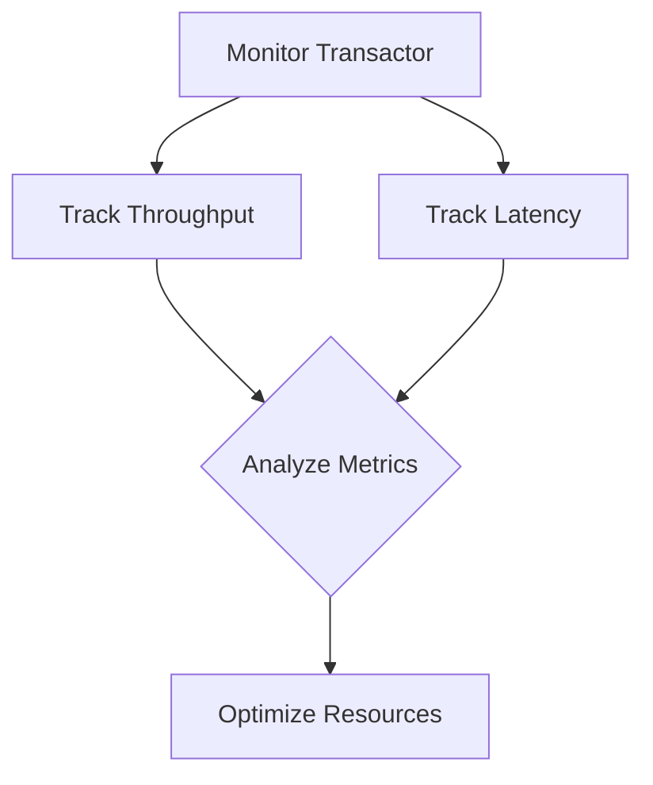

---

linkTitle: "14.5.2 Write Scalability Considerations"
title: "Scalability Considerations for Datomic in Clojure Applications"
description: "Explore scalability considerations for Datomic in Clojure applications, focusing on the single transactor model, transaction optimization, and monitoring strategies."
categories:
- Clojure
- NoSQL
- Datomic
tags:
- Scalability
- Clojure
- Datomic
- NoSQL
- Transaction Optimization
date: 2024-10-25
type: docs
nav_weight: 1452000
canonical: "https://clojureforjava.com/5/14/5/2"
license: "© 2024 Tokenizer Inc. CC BY-NC-SA 4.0"
---

## 14.5.2 Write Scalability Considerations

As we delve into the scalability considerations for Datomic within Clojure applications, it's crucial to understand the architectural nuances that influence performance and scalability. Datomic, a distributed database designed to provide ACID transactions, horizontal read scalability, and a unique time model, offers a compelling choice for applications requiring complex queries and historical data insights. However, its architecture, particularly the single transactor model, presents unique challenges and opportunities for optimization.

### Understanding the Single Transactor Model

Datomic's architecture is centered around a single transactor, a component responsible for coordinating all write operations. This design ensures strong consistency and simplifies the transaction model, but it also introduces potential bottlenecks, especially in write-intensive scenarios.

#### The Role of the Transactor

The transactor in Datomic is akin to a gatekeeper, ensuring that all transactions adhere to the database's consistency model. It serializes writes, applying them in a consistent order, which is crucial for maintaining the integrity of the database. However, this serialization can become a limiting factor as the volume of write operations increases.

#### Bottlenecks in Write-Intensive Applications

In applications with high write demands, the single transactor can become a bottleneck. Since all write operations must pass through this single point, the transactor's capacity to handle concurrent transactions is finite. This limitation can lead to increased latency and reduced throughput, affecting the overall performance of the application.

### Optimizing Transactions for Scalability

To mitigate the potential bottlenecks associated with the single transactor model, several strategies can be employed to optimize transactions and enhance scalability.

#### Batch Writes to Reduce Overhead

One effective strategy is to batch writes, reducing the overhead associated with individual transactions. By grouping multiple operations into a single transaction, you can minimize the frequency of interactions with the transactor, thereby improving throughput.

```clojure
(ns my-app.transactions
  (:require [datomic.api :as d]))

(defn batch-write [conn data]
  (d/transact conn {:tx-data data}))

;; Example usage
(batch-write conn [{:db/id #db/id[:db.part/user]
                    :person/name "Alice"}
                   {:db/id #db/id[:db.part/user]
                    :person/name "Bob"}])
```

In the example above, two entities are created in a single transaction, reducing the number of interactions with the transactor.

#### Designing for Append-Only Patterns

Another approach to optimize transactions is to design for append-only patterns. By structuring your data model to favor appends over updates, you can reduce contention and improve write performance. This pattern aligns well with Datomic's immutable data model, where new facts are added rather than existing ones being modified.

#### Minimizing Transaction Contention

Minimizing contention in transactions is crucial for maintaining high throughput. This can be achieved by designing transactions that operate on disjoint sets of data, thereby reducing the likelihood of conflicts.

### Monitoring and Scaling the Transactor

Effective monitoring and resource allocation are essential for ensuring the transactor operates efficiently and can handle the demands of your application.

#### Allocating Sufficient Resources

The transactor's performance is heavily influenced by the resources allocated to it. Ensuring that the transactor has adequate CPU and memory resources is critical for maintaining high throughput and low latency.

#### Monitoring Transaction Throughput and Latency

Regular monitoring of transaction throughput and latency provides insights into the transactor's performance and can help identify potential bottlenecks. Tools such as Datomic's built-in metrics and external monitoring solutions can be used to track these metrics.



The flowchart above illustrates a typical monitoring process, where throughput and latency metrics are tracked and analyzed to inform resource optimization decisions.

### Best Practices for Scalability

To ensure your Datomic-based applications scale effectively, consider the following best practices:

- **Design for Read Scalability:** Leverage Datomic's architecture to scale reads horizontally, distributing the load across multiple peers.
- **Optimize Data Model:** Structure your data model to minimize contention and favor append-only patterns.
- **Regularly Review Resource Allocation:** Continuously monitor and adjust the resources allocated to the transactor based on application demands.
- **Implement Efficient Caching:** Use caching strategies to reduce the load on the transactor and improve read performance.

### Common Pitfalls and How to Avoid Them

While Datomic offers robust scalability features, there are common pitfalls that can hinder performance:

- **Ignoring Resource Constraints:** Failing to allocate sufficient resources to the transactor can lead to performance degradation.
- **Overloading the Transactor:** Designing applications with high write demands without considering the transactor's limitations can result in bottlenecks.
- **Neglecting Monitoring:** Without regular monitoring, performance issues can go unnoticed until they significantly impact the application.

### Conclusion

Scalability in Datomic requires a thoughtful approach to transaction design, resource allocation, and monitoring. By understanding the limitations of the single transactor model and employing strategies to optimize transactions, you can build scalable, high-performance applications with Datomic and Clojure.

## Quiz Time!



### What is the primary role of the transactor in Datomic?

- [x] To serialize and coordinate all write operations
- [ ] To handle all read operations
- [ ] To manage data replication
- [ ] To perform data backups

> **Explanation:** The transactor in Datomic is responsible for serializing and coordinating all write operations to ensure consistency.

### How can batch writes improve scalability in Datomic?

- [x] By reducing the frequency of interactions with the transactor
- [ ] By increasing the number of transactions
- [ ] By decreasing read latency
- [ ] By simplifying data models

> **Explanation:** Batch writes reduce the overhead of individual transactions, improving throughput by minimizing interactions with the transactor.

### What is a common pattern to minimize transaction contention in Datomic?

- [x] Designing for append-only patterns
- [ ] Using complex joins
- [ ] Increasing transaction size
- [ ] Reducing read operations

> **Explanation:** Designing for append-only patterns reduces contention by minimizing conflicts in transactions.

### Why is monitoring transaction throughput important?

- [x] To identify potential bottlenecks and optimize performance
- [ ] To increase transaction size
- [ ] To reduce data redundancy
- [ ] To simplify data models

> **Explanation:** Monitoring transaction throughput helps identify bottlenecks, allowing for performance optimization.

### What is a potential bottleneck in Datomic's architecture?

- [x] The single transactor model
- [ ] The peer nodes
- [ ] The storage service
- [ ] The query engine

> **Explanation:** The single transactor model can become a bottleneck in write-intensive applications due to its role in serializing writes.

### How can resource allocation affect the transactor's performance?

- [x] Adequate resources ensure high throughput and low latency
- [ ] More resources increase data redundancy
- [ ] Less resources simplify data models
- [ ] Resource allocation does not affect performance

> **Explanation:** Allocating sufficient CPU and memory resources to the transactor is crucial for maintaining high throughput and low latency.

### What is a benefit of designing for read scalability in Datomic?

- [x] It allows for horizontal scaling of reads
- [ ] It reduces write latency
- [ ] It simplifies transaction design
- [ ] It increases data redundancy

> **Explanation:** Designing for read scalability leverages Datomic's architecture to distribute read load across multiple peers.

### What is a common pitfall in Datomic scalability?

- [x] Overloading the transactor with high write demands
- [ ] Underutilizing read capabilities
- [ ] Over-replicating data
- [ ] Simplifying data models

> **Explanation:** Overloading the transactor with high write demands can lead to bottlenecks and reduced performance.

### How can caching strategies improve performance in Datomic?

- [x] By reducing the load on the transactor
- [ ] By increasing transaction size
- [ ] By simplifying data models
- [ ] By increasing data redundancy

> **Explanation:** Efficient caching strategies reduce the load on the transactor, improving read performance.

### True or False: Datomic's transactor can handle unlimited concurrent write operations.

- [ ] True
- [x] False

> **Explanation:** The transactor has a finite capacity to handle concurrent write operations, which can become a bottleneck in write-intensive applications.


