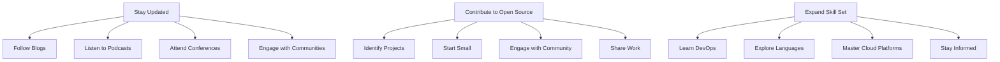

## 16.5.1 Continuous Learning and Adaptation

In the rapidly evolving landscape of software development, where technologies and methodologies are in a constant state of flux, continuous learning and adaptation are not just beneficial—they are essential. For Java developers venturing into the realms of Clojure and NoSQL, this chapter provides a roadmap for staying relevant and effective. We will explore strategies to keep abreast of industry trends, engage with the open-source community, and expand your skill set to include complementary technologies.

### Stay Updated with Industry Trends

Staying informed about the latest developments in Clojure and NoSQL is crucial for maintaining a competitive edge. Here are some effective strategies to ensure you are always in the loop:

#### Follow Blogs and Online Publications

Blogs and online publications are excellent resources for timely information. They often provide insights into new features, best practices, and case studies. Some recommended blogs and sites include:

- **Clojure.org Blog**: The official blog for Clojure updates and community news.
- **Planet Clojure**: An aggregator of Clojure-related blog posts.
- **NoSQL Databases Blog**: Covers a wide range of topics related to NoSQL databases.

#### Listen to Podcasts

Podcasts offer a convenient way to learn while on the go. They often feature interviews with industry experts and discussions on emerging trends. Consider subscribing to:

- **Cognicast**: A podcast by Cognitect, the creators of Clojure, covering a range of topics from language features to community events.
- **The NoSQL Database Podcast**: Focuses on the latest in NoSQL database technologies.

#### Attend Conferences and Meetups

Conferences and meetups provide opportunities to learn from experts, network with peers, and gain hands-on experience. Some notable events include:

- **Clojure/conj**: An annual conference dedicated to Clojure, featuring talks and workshops.
- **NoSQL Now! Conference**: Focuses on the latest advancements in NoSQL technologies.

#### Engage with Online Communities

Online communities are valuable for real-time discussions and problem-solving. Platforms like Stack Overflow, Reddit's r/Clojure, and the Clojure Slack channel are great places to ask questions and share knowledge.

### Contribute to Open Source

Contributing to open-source projects is an excellent way to deepen your understanding of Clojure and NoSQL, while also giving back to the community. Here’s how you can get involved:

#### Identify Projects of Interest

Start by identifying projects that align with your interests and expertise. GitHub is a great place to discover open-source projects. Look for repositories tagged with "Clojure" or "NoSQL."

#### Start Small

Begin with small contributions, such as fixing bugs or improving documentation. This will help you familiarize yourself with the project's codebase and build confidence.

#### Engage with the Community

Join the project's mailing list or chat channels to interact with other contributors. This is a great way to learn from others and stay informed about project developments.

#### Share Your Work

Once you’ve made significant contributions, consider sharing your experiences through blog posts or talks. This not only helps others but also establishes you as a knowledgeable member of the community.

### Expand Your Skill Set

To remain versatile and adaptable, it's important to expand your skill set beyond Clojure and NoSQL. Here are some areas to consider:

#### Learn DevOps Tools

Understanding DevOps practices and tools can greatly enhance your ability to deploy and manage applications. Tools like Docker, Kubernetes, and Jenkins are widely used in the industry.

#### Explore Other Programming Languages

Learning additional programming languages can provide new perspectives and enhance your problem-solving skills. Consider languages that complement Clojure, such as:

- **Scala**: Known for its functional programming capabilities and compatibility with Java.
- **Python**: Popular for data analysis and machine learning applications.

#### Master Cloud Platforms

With the growing trend towards cloud computing, familiarity with cloud platforms like AWS, Google Cloud, and Azure is increasingly valuable. Understanding how to deploy and manage applications in the cloud can open up new opportunities.

#### Stay Informed About Emerging Technologies

Keep an eye on emerging technologies such as machine learning, blockchain, and the Internet of Things (IoT). These fields are rapidly evolving and offer exciting new possibilities for application development.

### Practical Code Examples and Snippets

To illustrate the concepts discussed, let's explore some practical code examples and snippets that demonstrate continuous learning and adaptation in action.

#### Example 1: Contributing to an Open Source Clojure Project

Suppose you want to contribute to a popular Clojure library on GitHub. Here’s a step-by-step guide:

1. **Fork the Repository**: Create a personal copy of the repository on GitHub.
2. **Clone the Repository**: Use Git to clone the repository to your local machine.
   ```bash
   git clone https://github.com/your-username/project-name.git
   ```
3. **Create a New Branch**: Create a new branch for your changes.
   ```bash
   git checkout -b feature-branch
   ```
4. **Make Your Changes**: Implement your changes and commit them to your branch.
   ```bash
   git commit -m "Description of changes"
   ```
5. **Push Your Changes**: Push your changes to your forked repository.
   ```bash
   git push origin feature-branch
   ```
6. **Submit a Pull Request**: Go to the original repository and submit a pull request.

#### Example 2: Using Docker for Clojure Development

Docker is a powerful tool for creating consistent development environments. Here’s how you can set up a Docker container for a Clojure project:

1. **Create a Dockerfile**: Define the environment for your Clojure application.
   ```dockerfile
   FROM clojure:openjdk-11-lein
   WORKDIR /app
   COPY . /app
   RUN lein deps
   CMD ["lein", "run"]
   ```
2. **Build the Docker Image**: Build the image from your Dockerfile.
   ```bash
   docker build -t clojure-app .
   ```
3. **Run the Docker Container**: Run your application in a container.
   ```bash
   docker run -p 3000:3000 clojure-app
   ```

### Diagrams and Visual Aids

To enhance understanding, let's incorporate a flowchart that illustrates the process of continuous learning and adaptation.



### Best Practices, Common Pitfalls, and Optimization Tips

#### Best Practices

- **Set Learning Goals**: Define clear learning objectives to guide your efforts.
- **Schedule Regular Learning Time**: Dedicate time each week to learning and skill development.
- **Diversify Learning Sources**: Use a mix of blogs, podcasts, books, and courses to gain different perspectives.

#### Common Pitfalls

- **Overcommitting**: Avoid taking on too many learning projects at once, which can lead to burnout.
- **Neglecting Fundamentals**: Ensure a strong understanding of core concepts before diving into advanced topics.

#### Optimization Tips

- **Use Automation Tools**: Leverage tools like RSS readers and podcast apps to streamline content consumption.
- **Join Study Groups**: Collaborate with peers to enhance learning and accountability.

### Conclusion

Continuous learning and adaptation are vital for success in the ever-evolving fields of Clojure and NoSQL. By staying updated with industry trends, contributing to open-source projects, and expanding your skill set, you can remain at the forefront of technology and innovation. Embrace the journey of lifelong learning, and you will not only enhance your career but also contribute to the growth and advancement of the software development community.

## Quiz Time!



### Which of the following is a recommended blog for staying updated with Clojure developments?

- [x] Clojure.org Blog
- [ ] JavaWorld Blog
- [ ] Python Weekly
- [ ] SQL Server Central

> **Explanation:** The Clojure.org Blog is the official source for updates and news related to Clojure.

### What is a benefit of contributing to open-source projects?

- [x] Deepening understanding of technologies
- [ ] Guaranteed financial compensation
- [ ] Immediate recognition as an expert
- [ ] Avoiding collaboration with others

> **Explanation:** Contributing to open-source projects helps deepen your understanding of technologies and build community connections.

### Which podcast is recommended for learning about NoSQL databases?

- [x] The NoSQL Database Podcast
- [ ] Java Posse
- [ ] The Python Podcast
- [ ] SQL Server Radio

> **Explanation:** The NoSQL Database Podcast focuses specifically on NoSQL technologies and trends.

### What is the first step in contributing to an open-source project on GitHub?

- [x] Fork the repository
- [ ] Clone the repository
- [ ] Create a new branch
- [ ] Submit a pull request

> **Explanation:** Forking the repository creates a personal copy that you can work on.

### Which tool is recommended for creating consistent development environments?

- [x] Docker
- [ ] Eclipse
- [ ] IntelliJ IDEA
- [ ] Visual Studio

> **Explanation:** Docker is widely used for creating consistent and reproducible development environments.

### What is a common pitfall in continuous learning?

- [x] Overcommitting to too many projects
- [ ] Setting clear learning goals
- [ ] Scheduling regular learning time
- [ ] Diversifying learning sources

> **Explanation:** Overcommitting can lead to burnout and hinder effective learning.

### Which of the following is a DevOps tool that can enhance your skill set?

- [x] Kubernetes
- [ ] React
- [ ] Angular
- [ ] Bootstrap

> **Explanation:** Kubernetes is a popular DevOps tool for managing containerized applications.

### What is a benefit of attending conferences and meetups?

- [x] Networking with peers
- [ ] Guaranteed job offers
- [ ] Avoiding new technologies
- [ ] Working in isolation

> **Explanation:** Conferences and meetups provide opportunities to network and learn from industry experts.

### Which cloud platform is mentioned as valuable to learn for expanding your skill set?

- [x] AWS
- [ ] WordPress
- [ ] Drupal
- [ ] Joomla

> **Explanation:** AWS is a leading cloud platform that offers a wide range of services for application deployment and management.

### Continuous learning and adaptation are essential for success in which fields?

- [x] Clojure and NoSQL
- [ ] Only Java development
- [ ] Only SQL databases
- [ ] Only front-end development

> **Explanation:** Continuous learning and adaptation are crucial for staying relevant in the dynamic fields of Clojure and NoSQL.


