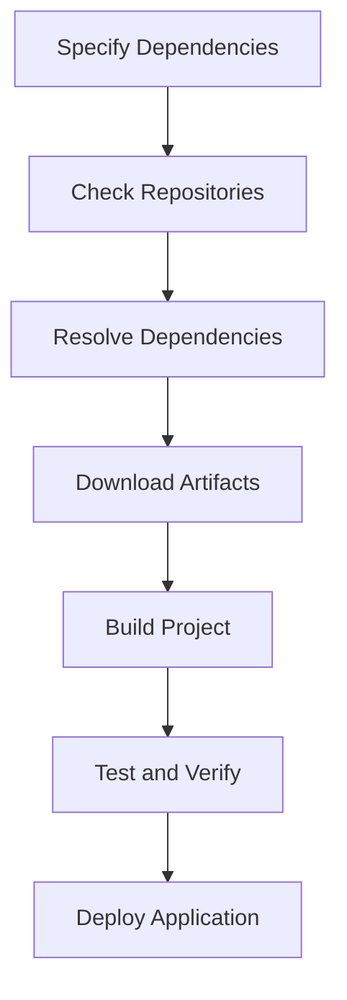

## B.4.2 Adding Dependencies

In the realm of software development, managing dependencies is a critical aspect that can significantly affect the maintainability, scalability, and functionality of your projects. For Java developers transitioning to Clojure, understanding how to handle dependencies in Clojure projects using Leiningen is essential. This section delves into the intricacies of specifying dependencies, managing repositories, and handling versioning in Clojure projects.

### Specifying Dependencies

Dependencies in Clojure are specified in the `project.clj` file, which is the configuration file for Leiningen, the build automation tool used in Clojure projects. Dependencies are declared as vectors consisting of the group ID, artifact ID, and version of the library you wish to include.

#### Basic Dependency Declaration

Here is a basic example of how to declare dependencies in a Clojure project:

```clojure
(defproject my-clojure-project "0.1.0-SNAPSHOT"
  :description "A sample Clojure project"
  :dependencies [[org.clojure/clojure "1.10.3"]
                 [cheshire "5.10.0"]])
```

In this example, the project depends on Clojure version 1.10.3 and the Cheshire library version 5.10.0. The dependencies are specified as vectors within the `:dependencies` key.

#### Understanding Group ID, Artifact ID, and Version

- **Group ID**: This is typically the reverse domain name of the organization or individual that maintains the library. For example, `org.clojure` is the group ID for the official Clojure libraries.
- **Artifact ID**: This is the name of the library or project. For instance, `clojure` and `cheshire` are artifact IDs.
- **Version**: This specifies the version of the library you want to use. It's crucial to specify the correct version to ensure compatibility and stability in your project.

### Repositories

Leiningen uses Maven Central as the default repository for resolving dependencies. However, there might be scenarios where you need to add custom repositories, such as when using libraries that are not available on Maven Central.

#### Adding Custom Repositories

To add custom repositories, you can use the `:repositories` key in your `project.clj` file:

```clojure
(defproject my-clojure-project "0.1.0-SNAPSHOT"
  :description "A sample Clojure project"
  :dependencies [[org.clojure/clojure "1.10.3"]
                 [cheshire "5.10.0"]]
  :repositories [["clojars" "https://repo.clojars.org/"]
                 ["my-private-repo" "https://my-private-repo.com/maven2"]])
```

In this example, we have added two additional repositories: Clojars and a hypothetical private repository. This allows Leiningen to search these locations for dependencies that are not found in Maven Central.

### Managing Versions

Version management is a crucial aspect of dependency management. It involves selecting the appropriate versions of libraries to ensure compatibility and stability.

#### Specifying Versions

When specifying versions, you can choose to use fixed versions, version ranges, or even dynamic versions. However, it's generally recommended to use specific versions to avoid unexpected changes in your dependencies.

```clojure
:dependencies [[org.clojure/clojure "1.10.3"]
               [cheshire "5.10.0"]]
```

#### Version Ranges

While not commonly used in Clojure, version ranges can be specified to allow flexibility in dependency resolution. This is more prevalent in Maven-based projects.

#### Tools for Managing Versions

To keep your dependencies up-to-date, you can use tools like [antq](https://github.com/liquidz/antq), which helps in checking for outdated dependencies and suggesting updates.

```bash
lein antq
```

Running this command will provide a report of outdated dependencies and their latest versions, making it easier to maintain your project.

### Practical Code Examples

Let's explore some practical examples to illustrate the concepts discussed.

#### Example 1: Adding a JSON Parsing Library

Suppose you want to add a JSON parsing library to your project. You can add the `cheshire` library as follows:

```clojure
(defproject json-parser "0.1.0-SNAPSHOT"
  :description "A JSON parsing project"
  :dependencies [[org.clojure/clojure "1.10.3"]
                 [cheshire "5.10.0"]])
```

You can then use Cheshire in your Clojure code to parse JSON:

```clojure
(ns json-parser.core
  (:require [cheshire.core :as json]))

(defn parse-json [json-str]
  (json/parse-string json-str true))
```

#### Example 2: Adding a Database Driver

To connect to a PostgreSQL database, you might want to add the PostgreSQL JDBC driver:

```clojure
(defproject database-connector "0.1.0-SNAPSHOT"
  :description "A database connection project"
  :dependencies [[org.clojure/clojure "1.10.3"]
                 [org.postgresql/postgresql "42.2.18"]])
```

This allows you to use the JDBC driver in your project to connect to PostgreSQL databases.

### Best Practices

- **Use Specific Versions**: Always specify exact versions for your dependencies to avoid unexpected changes.
- **Regularly Update Dependencies**: Use tools like `antq` to keep your dependencies up-to-date.
- **Test After Updates**: Always run your test suite after updating dependencies to catch any compatibility issues.
- **Use Private Repositories for Internal Libraries**: If you have internal libraries, consider setting up a private Maven repository.

### Common Pitfalls

- **Version Conflicts**: Be aware of potential version conflicts when multiple libraries depend on different versions of the same library.
- **Over-reliance on SNAPSHOT Versions**: Avoid using SNAPSHOT versions in production as they can change unexpectedly.
- **Ignoring Security Updates**: Regularly check for security updates in your dependencies and apply them promptly.

### Optimization Tips

- **Minimize Dependencies**: Only include necessary dependencies to reduce the complexity and size of your project.
- **Use Dependency Exclusions**: If a dependency pulls in unwanted transitive dependencies, use exclusions to prevent them from being included.

### Diagrams and Charts

To visualize the dependency management process, consider the following flowchart:



This flowchart outlines the typical process of managing dependencies in a Clojure project, from specifying dependencies to deploying the application.

### Conclusion

Managing dependencies in Clojure projects is a crucial skill for any developer, especially those transitioning from Java. By understanding how to specify dependencies, manage repositories, and handle versioning, you can ensure that your projects are stable, maintainable, and scalable. By following best practices and avoiding common pitfalls, you can streamline your development process and focus on building robust applications.

## Quiz Time!



### What is the default repository used by Leiningen for resolving dependencies?

- [x] Maven Central
- [ ] Clojars
- [ ] JCenter
- [ ] GitHub Packages

> **Explanation:** Leiningen uses Maven Central as the default repository for resolving dependencies.

### How are dependencies specified in a Clojure project?

- [x] As vectors with group ID, artifact ID, and version
- [ ] As JSON objects
- [ ] As XML elements
- [ ] As YAML entries

> **Explanation:** Dependencies in Clojure are specified as vectors consisting of the group ID, artifact ID, and version in the `project.clj` file.

### Which tool can be used to check for outdated dependencies in a Clojure project?

- [x] antq
- [ ] Maven
- [ ] Gradle
- [ ] npm

> **Explanation:** The `antq` tool is used to check for outdated dependencies in Clojure projects.

### What is a common pitfall when managing dependencies?

- [x] Version conflicts
- [ ] Using specific versions
- [ ] Regularly updating dependencies
- [ ] Using private repositories

> **Explanation:** Version conflicts can occur when multiple libraries depend on different versions of the same library.

### Which of the following is a best practice for managing dependencies?

- [x] Use specific versions
- [ ] Use SNAPSHOT versions in production
- [x] Regularly update dependencies
- [ ] Ignore security updates

> **Explanation:** Using specific versions and regularly updating dependencies are best practices for managing dependencies.

### How can you add a custom repository in Leiningen?

- [x] By using the `:repositories` key in `project.clj`
- [ ] By editing the `pom.xml` file
- [ ] By using the `package.json` file
- [ ] By modifying the `build.gradle` file

> **Explanation:** Custom repositories can be added in Leiningen by using the `:repositories` key in the `project.clj` file.

### What should you do after updating dependencies?

- [x] Run your test suite
- [ ] Delete the `project.clj` file
- [x] Check for compatibility issues
- [ ] Ignore the changes

> **Explanation:** After updating dependencies, you should run your test suite and check for compatibility issues.

### What is a potential issue with using SNAPSHOT versions?

- [x] They can change unexpectedly
- [ ] They are always stable
- [ ] They are more secure
- [ ] They are faster to download

> **Explanation:** SNAPSHOT versions can change unexpectedly, which can lead to instability in your project.

### How can you prevent unwanted transitive dependencies from being included?

- [x] Use dependency exclusions
- [ ] Use more dependencies
- [ ] Ignore the issue
- [ ] Use SNAPSHOT versions

> **Explanation:** Dependency exclusions can be used to prevent unwanted transitive dependencies from being included.

### True or False: It is recommended to minimize dependencies in your project.

- [x] True
- [ ] False

> **Explanation:** Minimizing dependencies reduces the complexity and size of your project, making it easier to maintain.


