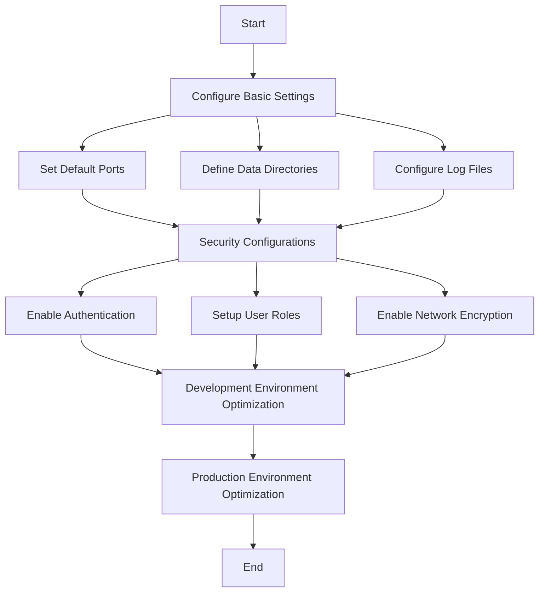

## 2.2.2 Configuring MongoDB Instances

Configuring MongoDB instances is a crucial step in ensuring that your database performs optimally and securely. In this section, we will explore the various configuration options available for MongoDB, focusing on basic settings, security configurations, and environment-specific optimizations. This guide is designed for Java developers who are transitioning to Clojure and are looking to integrate MongoDB into their applications.

### Basic Configuration Settings

Before diving into more advanced configurations, it's essential to understand the basic settings that every MongoDB instance requires. These include default ports, data directories, and log files.

#### Default Ports

MongoDB uses port 27017 by default for client connections. However, in a production environment, you might want to change this to enhance security or avoid conflicts with other applications.

To change the default port, you can modify the MongoDB configuration file, typically located at `/etc/mongod.conf` on Linux systems. Here is an example of how to set a custom port:

```yaml

net:
  port: 28017
```

After making changes, restart the MongoDB service:

```bash
sudo systemctl restart mongod
```

#### Data Directories

The data directory is where MongoDB stores its data files. By default, this is set to `/var/lib/mongodb`. For better performance and data management, you may want to move this directory to a dedicated disk or partition.

To change the data directory, update the `storage` section in the configuration file:

```yaml

storage:
  dbPath: /mnt/mongodb/data
```

Ensure that the MongoDB user has the necessary permissions to read and write to the new directory:

```bash
sudo chown -R mongodb:mongodb /mnt/mongodb/data
```

#### Log Files

Proper logging is essential for monitoring and troubleshooting. MongoDB logs are stored in `/var/log/mongodb/mongod.log` by default. You can change the log file location or enable log rotation to manage log file sizes.

To configure logging, modify the `systemLog` section:

```yaml

systemLog:
  destination: file
  path: /var/log/mongodb/mongod.log
  logAppend: true
```

### Security Configurations

Security is a critical aspect of any database configuration. MongoDB provides several features to secure your data, including authentication, authorization, and network encryption.

#### Enabling Authentication

By default, MongoDB does not require authentication, which can be a significant security risk. Enabling authentication ensures that only authorized users can access the database.

To enable authentication, add the following to your configuration file:

```yaml

security:
  authorization: enabled
```

After enabling authentication, you need to create administrative users. Connect to the MongoDB shell and run the following commands:

```javascript
use admin
db.createUser({
  user: "admin",
  pwd: "securepassword",
  roles: [{ role: "userAdminAnyDatabase", db: "admin" }]
})
```

#### Setting Up User Roles

MongoDB supports role-based access control (RBAC), allowing you to define roles with specific permissions. This is useful for granting users the minimum necessary privileges.

For example, to create a read-only user for a specific database:

```javascript
use mydatabase
db.createUser({
  user: "readonly",
  pwd: "readonlypassword",
  roles: [{ role: "read", db: "mydatabase" }]
})
```

#### Network Encryption

Encrypting data in transit protects against eavesdropping and man-in-the-middle attacks. MongoDB supports TLS/SSL for encrypting client-server communication.

To enable TLS/SSL, you need a valid certificate and key file. Update the `net` section in the configuration file:

```yaml

net:
  ssl:
    mode: requireSSL
    PEMKeyFile: /etc/ssl/mongodb.pem
```

### Optimizing Configurations for Development vs. Production

The configuration needs of a development environment differ significantly from those of a production environment. Here are some tips for optimizing MongoDB configurations based on your environment.

#### Development Environment

In a development environment, ease of use and flexibility are often prioritized over security and performance. Here are some recommended settings:

- **Disable Authentication**: For local development, you might choose to disable authentication to simplify access.
- **Enable Verbose Logging**: Detailed logs can help with debugging and understanding application behavior.
- **Use Small Data Sets**: Keep data sets small to reduce resource usage and speed up testing.

#### Production Environment

In a production environment, security, performance, and reliability are paramount. Consider the following optimizations:

- **Enable Authentication and Authorization**: Always secure your production databases with authentication and appropriate user roles.
- **Optimize Storage**: Use SSDs for data storage to improve read/write performance.
- **Configure Backups**: Implement regular backups and test recovery procedures to prevent data loss.
- **Monitor Performance**: Use monitoring tools to track performance metrics and identify bottlenecks.

### Practical Code Examples and Snippets

Let's explore some practical examples of configuring MongoDB instances using Clojure. We'll use the `monger` library to interact with MongoDB from a Clojure application.

#### Connecting to MongoDB

First, add the `monger` dependency to your `project.clj` file:

```clojure
(defproject my-clojure-app "0.1.0-SNAPSHOT"
  :dependencies [[org.clojure/clojure "1.10.3"]
                 [com.novemberain/monger "3.1.0"]])
```

Here's a simple example of connecting to a MongoDB instance:

```clojure
(ns my-clojure-app.core
  (:require [monger.core :as mg]
            [monger.collection :as mc]))

(defn connect-to-mongo []
  (let [conn (mg/connect)
        db (mg/get-db conn "mydatabase")]
    (println "Connected to MongoDB!")
    db))
```

#### Performing CRUD Operations

Once connected, you can perform CRUD operations using the `monger` library. Here's an example of inserting a document:

```clojure
(defn insert-document [db]
  (mc/insert db "mycollection" {:name "John Doe" :age 30}))
```

And a query to find documents:

```clojure
(defn find-documents [db]
  (mc/find-maps db "mycollection" {:age {$gte 25}}))
```

### Diagrams and Charts

To better understand the configuration process, let's visualize the MongoDB architecture and configuration flow using a Mermaid diagram.



### Best Practices and Common Pitfalls

#### Best Practices

- **Regularly Update MongoDB**: Keep your MongoDB version up to date to benefit from the latest features and security patches.
- **Use Strong Passwords**: Ensure that all user accounts have strong, unique passwords.
- **Limit Network Exposure**: Bind MongoDB to localhost or use a firewall to restrict access to trusted IP addresses.

#### Common Pitfalls

- **Ignoring Security**: Running MongoDB without authentication is a common mistake that can lead to data breaches.
- **Overlooking Backups**: Failing to implement a robust backup strategy can result in data loss during failures.
- **Misconfiguring Storage**: Using default storage settings without considering performance implications can lead to slow database operations.

### Conclusion

Configuring MongoDB instances effectively is key to building scalable and secure applications. By understanding and applying the configuration options discussed in this section, you can optimize your MongoDB setup for both development and production environments. Whether you're a seasoned Java developer or new to Clojure, these insights will help you integrate MongoDB seamlessly into your data solutions.

## Quiz Time!



### Which default port does MongoDB use for client connections?

- [x] 27017
- [ ] 28017
- [ ] 3306
- [ ] 5432

> **Explanation:** MongoDB uses port 27017 by default for client connections.

### What is the default data directory for MongoDB on Linux systems?

- [x] /var/lib/mongodb
- [ ] /usr/local/mongodb
- [ ] /etc/mongodb
- [ ] /opt/mongodb/data

> **Explanation:** The default data directory for MongoDB on Linux systems is /var/lib/mongodb.

### How can you enable authentication in MongoDB?

- [x] Add `authorization: enabled` to the `security` section in the configuration file.
- [ ] Use the `--auth` command-line option when starting MongoDB.
- [ ] Create a user with the `admin` role.
- [ ] Set `auth: true` in the `net` section.

> **Explanation:** To enable authentication, you add `authorization: enabled` to the `security` section in the MongoDB configuration file.

### What is the purpose of role-based access control (RBAC) in MongoDB?

- [x] To define roles with specific permissions for users.
- [ ] To encrypt data at rest.
- [ ] To enable network encryption.
- [ ] To manage data replication.

> **Explanation:** RBAC in MongoDB allows you to define roles with specific permissions, ensuring users have the minimum necessary privileges.

### Which of the following is a recommended practice for a production environment?

- [x] Enable authentication and authorization.
- [ ] Disable logging for performance.
- [ ] Use default storage settings.
- [ ] Allow access from any IP address.

> **Explanation:** In a production environment, it's crucial to enable authentication and authorization to secure the database.

### What is the benefit of using SSDs for MongoDB data storage?

- [x] Improved read/write performance.
- [ ] Reduced data redundancy.
- [ ] Enhanced security.
- [ ] Lower cost.

> **Explanation:** SSDs offer improved read/write performance, which can significantly enhance MongoDB's performance.

### How can you encrypt client-server communication in MongoDB?

- [x] Enable TLS/SSL in the `net` section of the configuration file.
- [ ] Use a VPN for all database connections.
- [ ] Set `encryption: true` in the `security` section.
- [ ] Configure IP whitelisting.

> **Explanation:** Enabling TLS/SSL in the `net` section of the MongoDB configuration file encrypts client-server communication.

### What is a common pitfall when configuring MongoDB?

- [x] Running MongoDB without authentication.
- [ ] Using strong passwords.
- [ ] Regularly updating MongoDB.
- [ ] Implementing a robust backup strategy.

> **Explanation:** Running MongoDB without authentication is a common pitfall that can lead to security vulnerabilities.

### Which tool can be used to monitor MongoDB performance metrics?

- [x] MongoDB Atlas
- [ ] Git
- [ ] Docker
- [ ] Jenkins

> **Explanation:** MongoDB Atlas provides tools for monitoring performance metrics and identifying bottlenecks.

### True or False: In a development environment, it's recommended to enable verbose logging.

- [x] True
- [ ] False

> **Explanation:** In a development environment, enabling verbose logging can help with debugging and understanding application behavior.


