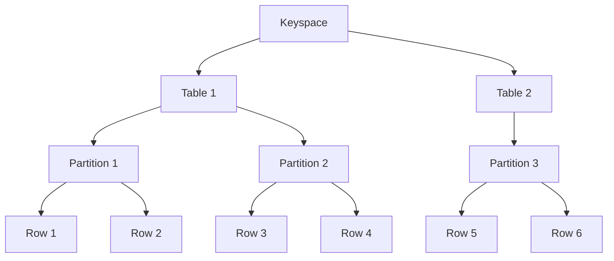

---

linkTitle: "3.1.1 Understanding Cassandra's Data Model"
title: "Understanding Cassandra's Data Model: Keyspaces, Tables, Partitions, and Clusters"
description: "Dive deep into Cassandra's unique data model, exploring keyspaces, tables, partitions, and clusters, and understand how it differs from traditional relational databases."
categories:
- NoSQL
- Data Modeling
- Cassandra
tags:
- Cassandra
- NoSQL
- Data Model
- Keyspaces
- Partitions
- Clusters
date: 2024-10-25
type: docs
nav_weight: 311000
canonical: "https://clojureforjava.com/5/3/1/1"
license: "© 2024 Tokenizer Inc. CC BY-NC-SA 4.0"
---

## 3.1.1 Understanding Cassandra's Data Model

Apache Cassandra is a highly scalable, distributed NoSQL database designed to handle large amounts of data across many commodity servers, providing high availability with no single point of failure. Its data model is quite different from traditional relational databases, offering a unique approach to data storage and retrieval that is optimized for performance and scalability. In this section, we will explore the fundamental components of Cassandra's data model, including keyspaces, tables, partitions, and clusters, and discuss how these elements work together to provide a robust data solution.

### Keyspaces: The Top-Level Namespace

In Cassandra, a keyspace is the outermost container for data, analogous to a database in relational database systems. It defines the replication strategy and the number of replicas for the data it contains. Keyspaces are crucial for managing how data is distributed and replicated across the nodes in a Cassandra cluster.

#### Keyspace Definition

A keyspace is defined with the following attributes:

- **Replication Strategy**: Determines how data is replicated across the cluster. Common strategies include `SimpleStrategy` for single data centers and `NetworkTopologyStrategy` for multiple data centers.
- **Replication Factor**: Specifies the number of replicas for each piece of data. A higher replication factor increases data redundancy and fault tolerance.
- **Durable Writes**: A boolean flag that indicates whether write operations are logged to disk, ensuring data durability.

Here is an example of creating a keyspace in Cassandra:

```sql
CREATE KEYSPACE my_keyspace WITH REPLICATION = 
{ 'class' : 'NetworkTopologyStrategy', 'datacenter1' : 3 }
AND DURABLE_WRITES = true;
```

### Tables: Organizing Data

Tables in Cassandra, formerly known as column families, are where data is stored. Unlike relational databases, Cassandra tables are designed to handle large volumes of data with a flexible schema. Each table is defined by a set of columns, and data is organized into rows.

#### Table Structure

Cassandra tables consist of:

- **Primary Key**: Composed of a partition key and optional clustering columns. The partition key determines the distribution of data across the cluster, while clustering columns define the order of data within a partition.
- **Columns**: Define the data stored in the table. Cassandra supports various data types, including text, int, float, and more complex types like lists, sets, and maps.

Here's an example of creating a table in Cassandra:

```sql
CREATE TABLE users (
    user_id UUID PRIMARY KEY,
    name TEXT,
    email TEXT,
    age INT
);
```

### Partitions: Distributing Data

Partitions are a core concept in Cassandra's data model, determining how data is distributed across the nodes in a cluster. Each row in a table is assigned to a partition based on its partition key, ensuring that related data is stored together for efficient access.

#### Partition Key

The partition key is the first part of the primary key and is crucial for data distribution. It determines which node in the cluster will store the data. A well-chosen partition key ensures even data distribution and avoids hotspots.

#### Clustering Columns

Clustering columns define the order of rows within a partition. They allow for efficient range queries and sorting of data. For example, in a table storing user activity logs, the partition key might be the user ID, and the clustering column could be the timestamp of the activity.

### Clusters: The Distributed Architecture

Cassandra's architecture is based on a peer-to-peer model, where each node in the cluster is equal and can handle read and write requests. This design ensures high availability and fault tolerance.

#### Cluster Components

- **Nodes**: Individual servers in the cluster that store data and handle requests.
- **Data Centers**: Groups of nodes, often located in the same physical location, used to improve data locality and fault tolerance.
- **Rings**: The logical structure of the cluster, where nodes are arranged in a ring and data is distributed across them.

### Differences from Relational Databases

Cassandra's data model differs significantly from traditional relational databases in several ways:

- **Schema Flexibility**: Cassandra allows for dynamic schemas, where new columns can be added to a table without altering existing data.
- **Denormalization**: Data is often denormalized in Cassandra to optimize read performance, leading to duplication of data across tables.
- **Eventual Consistency**: Cassandra prioritizes availability and partition tolerance, allowing for eventual consistency rather than strict ACID transactions.

### Visualizing Data Organization

To better understand Cassandra's data model, let's visualize how data is organized within a cluster:



In this diagram, we see a keyspace containing two tables. Each table is divided into partitions, and each partition contains multiple rows. This hierarchical structure allows Cassandra to efficiently store and retrieve large volumes of data.

### Best Practices and Optimization Tips

- **Choose Partition Keys Wisely**: Ensure even data distribution by selecting partition keys that avoid hotspots.
- **Use Clustering Columns for Ordering**: Optimize queries by using clustering columns to order data within partitions.
- **Monitor and Tune Replication**: Adjust replication strategies and factors based on workload and fault tolerance requirements.

### Common Pitfalls

- **Hotspots**: Poorly chosen partition keys can lead to uneven data distribution and performance bottlenecks.
- **Over-Denormalization**: Excessive denormalization can lead to data consistency issues and increased storage requirements.

### Conclusion

Understanding Cassandra's data model is essential for designing scalable and efficient data solutions. By leveraging keyspaces, tables, partitions, and clusters, developers can build robust applications that handle large volumes of data with ease. As you continue to explore Cassandra, keep these concepts in mind to optimize your data architecture and achieve the best performance.

## Quiz Time!



### What is a keyspace in Cassandra?

- [x] A container for data that defines replication strategy and factor
- [ ] A table within a database
- [ ] A single node in the cluster
- [ ] A query language for accessing data

> **Explanation:** A keyspace is the top-level container in Cassandra that defines how data is replicated across the cluster.

### What is the primary function of a partition key in Cassandra?

- [x] To determine the distribution of data across nodes
- [ ] To define the order of data within a partition
- [ ] To specify the replication factor
- [ ] To create a unique identifier for each row

> **Explanation:** The partition key determines how data is distributed across the nodes in a Cassandra cluster.

### How does Cassandra handle schema changes?

- [x] Allows dynamic schema changes without altering existing data
- [ ] Requires a full database migration
- [ ] Locks the database during schema changes
- [ ] Uses a separate schema management tool

> **Explanation:** Cassandra supports dynamic schemas, allowing new columns to be added without affecting existing data.

### What is the role of clustering columns in Cassandra?

- [x] To define the order of rows within a partition
- [ ] To determine data distribution across nodes
- [ ] To specify the replication strategy
- [ ] To manage data consistency

> **Explanation:** Clustering columns define how rows are ordered within a partition, enabling efficient range queries.

### Which of the following is a common pitfall in Cassandra?

- [x] Hotspots due to poorly chosen partition keys
- [ ] Over-normalization of data
- [ ] Lack of support for dynamic schemas
- [ ] Inability to handle large volumes of data

> **Explanation:** Poorly chosen partition keys can lead to uneven data distribution, resulting in hotspots and performance issues.

### What is the primary advantage of Cassandra's peer-to-peer architecture?

- [x] High availability with no single point of failure
- [ ] Simplified data modeling
- [ ] Support for complex joins
- [ ] Strong consistency guarantees

> **Explanation:** Cassandra's peer-to-peer architecture ensures high availability and fault tolerance, with no single point of failure.

### How does Cassandra differ from traditional relational databases?

- [x] It uses a flexible schema and supports eventual consistency
- [ ] It enforces strict ACID transactions
- [ ] It requires a fixed schema and supports strong consistency
- [ ] It uses a master-slave architecture

> **Explanation:** Cassandra offers a flexible schema and prioritizes availability and partition tolerance, allowing for eventual consistency.

### What is the purpose of a replication factor in Cassandra?

- [x] To specify the number of replicas for each piece of data
- [ ] To define the order of data within a partition
- [ ] To determine data distribution across nodes
- [ ] To manage data consistency

> **Explanation:** The replication factor specifies how many copies of each piece of data are stored in the cluster, enhancing fault tolerance.

### Which statement about Cassandra's data model is true?

- [x] Data is often denormalized to optimize read performance
- [ ] Data is always normalized to reduce redundancy
- [ ] Joins are commonly used to combine data from multiple tables
- [ ] Transactions are used to ensure data consistency

> **Explanation:** In Cassandra, data is often denormalized to optimize read performance, even though this may lead to data duplication.

### True or False: In Cassandra, each node in the cluster is equal and can handle read and write requests.

- [x] True
- [ ] False

> **Explanation:** Cassandra's peer-to-peer architecture means each node is equal and capable of handling read and write requests, ensuring high availability.


