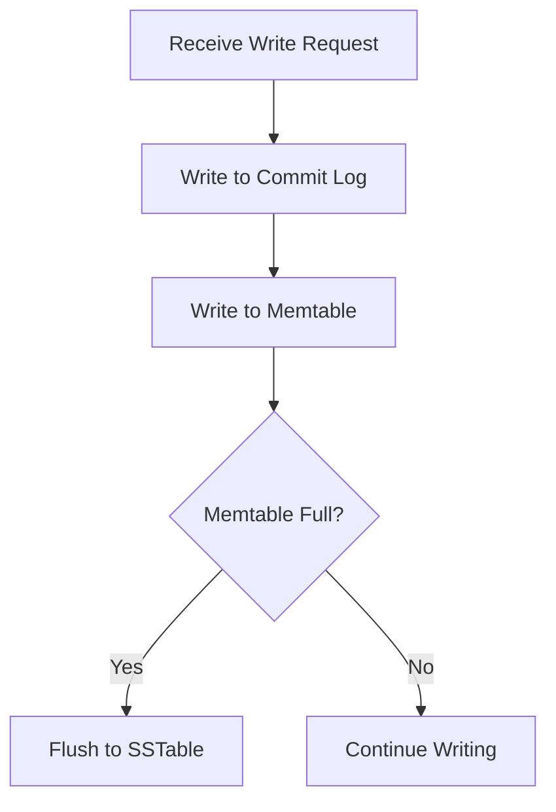
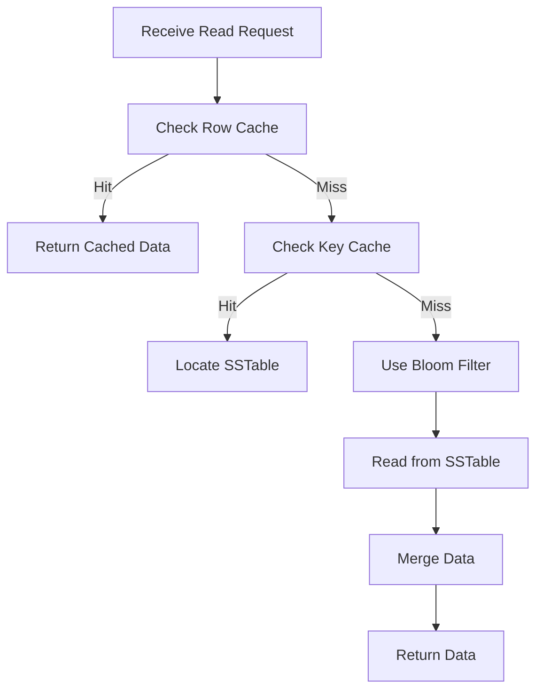

## 3.1.2 The Write and Read Path

Apache Cassandra, a highly scalable NoSQL database, is designed to handle large amounts of data across many commodity servers, providing high availability with no single point of failure. Understanding the write and read paths in Cassandra is crucial for optimizing performance and ensuring data integrity. This section delves into the mechanisms Cassandra uses to handle write operations through commit logs and memtables, the role of SSTables in persisting data to disk, and the read path involving bloom filters and caching mechanisms.

### Understanding the Write Path in Cassandra

Cassandra's write path is designed to be fast and efficient, ensuring that data is quickly written to the database while maintaining consistency and durability. The write path involves several key components: commit logs, memtables, and eventually, SSTables.

#### Commit Logs: Ensuring Durability

When a write request is received, Cassandra first writes the data to a commit log. The commit log is an append-only file that ensures durability. In the event of a node failure, the commit log can be replayed to recover any lost writes. This mechanism is crucial for maintaining data integrity and preventing data loss.

The commit log is stored on disk, and each write operation is appended to it. This process is fast because it involves sequential writes, which are generally more efficient than random writes. Once the data is safely written to the commit log, Cassandra acknowledges the write to the client, ensuring low-latency write operations.

#### Memtables: In-Memory Data Storage

After writing to the commit log, Cassandra writes the data to an in-memory structure called a memtable. Memtables are sorted data structures that store writes in memory before they are flushed to disk as SSTables. Memtables allow Cassandra to accumulate writes and perform them in bulk, which is more efficient than writing each operation individually to disk.

Memtables are organized by column family, and each memtable stores the most recent updates for its respective column family. When a memtable reaches a certain size threshold, it is marked as immutable and scheduled to be flushed to disk.

#### Flushing to SSTables: Persistent Data Storage

Once a memtable is full, it is flushed to disk as a Sorted String Table (SSTable). SSTables are immutable, disk-based data structures that store data in a sorted order. This immutability is a key feature of Cassandra's architecture, as it allows for efficient data retrieval and compaction processes.

The process of flushing a memtable to an SSTable involves writing the data to disk in a sorted order, along with associated metadata such as bloom filters and indexes. This ensures that data can be quickly located and retrieved during read operations.

### Exploring the Read Path in Cassandra

The read path in Cassandra is designed to be efficient and fast, leveraging various mechanisms to minimize disk I/O and improve performance. Key components of the read path include bloom filters, caching mechanisms, and the use of SSTables.

#### Bloom Filters: Reducing Disk I/O

Bloom filters are probabilistic data structures used to quickly determine whether a particular row might exist in an SSTable. When a read request is received, Cassandra uses bloom filters to check if the requested data might be present in a particular SSTable. If the bloom filter indicates that the data is not present, Cassandra can skip reading that SSTable, reducing unnecessary disk I/O.

Bloom filters are stored in memory and provide a fast way to eliminate SSTables that do not contain the requested data. This optimization significantly improves read performance, especially in scenarios where there are many SSTables.

#### Caching Mechanisms: Enhancing Read Performance

Cassandra employs several caching mechanisms to enhance read performance, including the row cache and key cache. These caches store frequently accessed data in memory, allowing for faster retrieval without the need to access disk-based SSTables.

- **Row Cache:** Stores entire rows in memory, providing the fastest possible read performance. However, it requires significant memory resources and is best suited for workloads with a high degree of data locality.
  
- **Key Cache:** Stores the locations of row keys in SSTables, allowing Cassandra to quickly locate and retrieve data without scanning the entire SSTable. The key cache is more memory-efficient than the row cache and is suitable for a wider range of workloads.

#### Reading from SSTables: Merging and Compaction

When a read request cannot be satisfied from the cache, Cassandra must read data from SSTables. This process involves merging data from multiple SSTables to construct the requested row. Cassandra uses a process called compaction to periodically merge SSTables, reducing the number of SSTables that must be read and improving read performance.

Compaction is an essential maintenance task that consolidates SSTables, removes deleted data, and ensures that data is stored efficiently. By reducing the number of SSTables, compaction minimizes the overhead of merging data during read operations.

### Practical Code Examples

To illustrate the concepts discussed above, let's explore some practical code examples using Clojure to interact with Cassandra.

#### Writing Data to Cassandra

```clojure
(ns cassandra-example.core
  (:require [qbits.alia :as alia]))

(def session (alia/connect {:contact-points ["127.0.0.1"]}))

(defn write-data [key value]
  (alia/execute session
                (alia/prepare "INSERT INTO my_keyspace.my_table (key, value) VALUES (?, ?)")
                {:key key :value value}))

(write-data "my-key" "my-value")
```

In this example, we use the `qbits.alia` library to connect to a Cassandra cluster and write data to a table. The data is first written to the commit log and then stored in a memtable.

#### Reading Data from Cassandra

```clojure
(defn read-data [key]
  (first (alia/execute session
                       (alia/prepare "SELECT value FROM my_keyspace.my_table WHERE key = ?")
                       {:key key})))

(println (read-data "my-key"))
```

This example demonstrates how to read data from Cassandra using a prepared statement. The read operation leverages bloom filters and caching mechanisms to efficiently retrieve the requested data.

### Diagrams and Flowcharts

To better understand the write and read paths in Cassandra, let's visualize these processes using flowcharts.

#### Write Path Flowchart



#### Read Path Flowchart



### Best Practices and Optimization Tips

- **Optimize Commit Log Configuration:** Ensure that the commit log is stored on a separate disk from data files to improve write performance and reduce contention.
  
- **Tune Memtable Settings:** Adjust memtable size and flush thresholds based on workload characteristics to balance memory usage and write throughput.
  
- **Leverage Caching:** Enable and configure caching mechanisms based on access patterns to improve read performance and reduce disk I/O.
  
- **Monitor and Manage Compaction:** Regularly monitor compaction processes and adjust compaction strategies to maintain optimal read performance.

### Common Pitfalls

- **Overloading the Commit Log Disk:** Placing the commit log on the same disk as data files can lead to I/O contention and degrade performance.
  
- **Inadequate Memory for Caching:** Insufficient memory allocation for caching can result in frequent cache misses and increased read latency.
  
- **Ignoring Compaction:** Failing to manage compaction can lead to an excessive number of SSTables, increasing read overhead and degrading performance.

### Conclusion

Understanding the write and read paths in Cassandra is essential for optimizing performance and ensuring data integrity. By leveraging commit logs, memtables, SSTables, bloom filters, and caching mechanisms, Cassandra provides a robust and efficient architecture for handling large-scale data workloads. By following best practices and avoiding common pitfalls, developers can maximize the benefits of Cassandra's architecture and build scalable, high-performance applications.

## Quiz Time!



### What is the primary purpose of the commit log in Cassandra?

- [x] To ensure durability of write operations
- [ ] To store data permanently
- [ ] To manage read operations
- [ ] To handle compaction processes

> **Explanation:** The commit log is used to ensure the durability of write operations by recording all writes before they are acknowledged.

### How does Cassandra store data in memory before flushing to disk?

- [x] Using memtables
- [ ] Using SSTables
- [ ] Using bloom filters
- [ ] Using key caches

> **Explanation:** Cassandra uses memtables, which are in-memory data structures, to store data before flushing it to disk as SSTables.

### What is the role of SSTables in Cassandra?

- [x] To store data persistently on disk
- [ ] To manage in-memory data
- [ ] To handle read requests
- [ ] To perform caching

> **Explanation:** SSTables are immutable, disk-based data structures that store data persistently in a sorted order.

### How do bloom filters improve read performance in Cassandra?

- [x] By reducing unnecessary disk I/O
- [ ] By storing entire rows in memory
- [ ] By merging data from multiple SSTables
- [ ] By handling write operations

> **Explanation:** Bloom filters are used to quickly determine if a row might exist in an SSTable, reducing unnecessary disk reads.

### What caching mechanism stores entire rows in memory for fast retrieval?

- [x] Row cache
- [ ] Key cache
- [ ] Commit log
- [ ] Memtable

> **Explanation:** The row cache stores entire rows in memory, providing the fastest possible read performance.

### What process in Cassandra merges SSTables to improve read performance?

- [x] Compaction
- [ ] Flushing
- [ ] Caching
- [ ] Indexing

> **Explanation:** Compaction is the process of merging SSTables to reduce the number of SSTables and improve read performance.

### Which component of Cassandra's architecture is responsible for handling write operations first?

- [x] Commit log
- [ ] Memtable
- [ ] SSTable
- [ ] Bloom filter

> **Explanation:** The commit log handles write operations first to ensure durability before data is written to memtables.

### What is the main advantage of using memtables in Cassandra?

- [x] To accumulate writes in memory for efficient bulk operations
- [ ] To store data permanently
- [ ] To manage read operations
- [ ] To handle compaction processes

> **Explanation:** Memtables accumulate writes in memory, allowing for efficient bulk operations when flushing to disk.

### How does the key cache enhance read performance in Cassandra?

- [x] By storing the locations of row keys in SSTables
- [ ] By storing entire rows in memory
- [ ] By reducing write latency
- [ ] By handling compaction

> **Explanation:** The key cache stores the locations of row keys, allowing for quick data retrieval without scanning entire SSTables.

### True or False: Bloom filters in Cassandra can definitively determine if a row exists in an SSTable.

- [ ] True
- [x] False

> **Explanation:** Bloom filters are probabilistic and can only indicate if a row might exist, potentially resulting in false positives.


