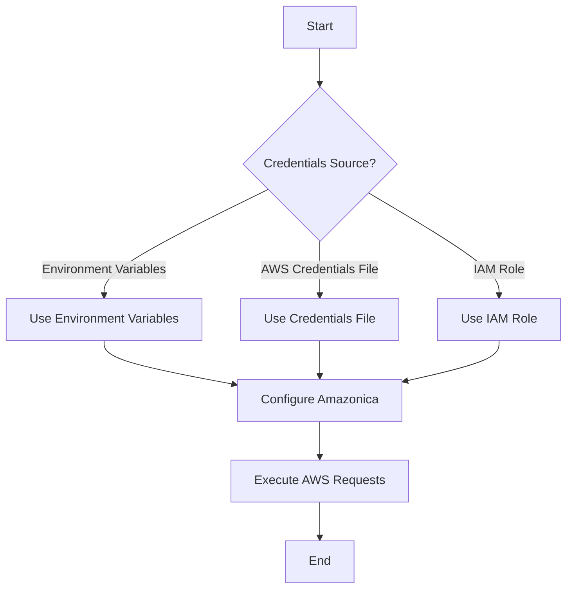

## 4.3.2 Configuring AWS Credentials and Client

In the realm of cloud computing, Amazon Web Services (AWS) stands out as a leading provider, offering a plethora of services that cater to various needs, from storage and computing to machine learning and analytics. For developers working with Clojure, integrating AWS services can be a seamless experience, thanks to libraries like Amazonica. However, before diving into the code, it's crucial to understand how to securely configure AWS credentials and clients. This section will guide you through the process, emphasizing best practices to ensure your applications remain secure and efficient.

### Understanding AWS Credentials

AWS credentials are essential for authenticating and authorizing requests to AWS services. They typically consist of an Access Key ID and a Secret Access Key. These credentials can be provided in several ways:

1. **Environment Variables**: This method involves setting the AWS credentials as environment variables on your machine or server.
2. **AWS Credentials File**: A file stored on your system that contains your AWS credentials.
3. **IAM Roles**: A more secure method, especially for applications running on AWS infrastructure, where credentials are automatically managed by AWS.

#### Method 1: Environment Variables

Setting AWS credentials as environment variables is a straightforward approach, especially for local development. You can set these variables in your terminal or through your operating system's environment settings.

```bash
export AWS_ACCESS_KEY_ID=your_access_key_id
export AWS_SECRET_ACCESS_KEY=your_secret_access_key
```

This method is simple and effective for development purposes. However, it is not recommended for production environments due to security concerns, as environment variables can be exposed.

#### Method 2: AWS Credentials File

The AWS credentials file is another common way to store your credentials. This file is typically located at `~/.aws/credentials` on Unix-based systems or `C:\Users\USERNAME\.aws\credentials` on Windows. The file should be structured as follows:

```ini
[default]
aws_access_key_id=your_access_key_id
aws_secret_access_key=your_secret_access_key
```

You can also define multiple profiles in this file, which is useful for managing different environments (e.g., development, testing, production).

#### Method 3: IAM Roles

IAM roles are the most secure method for managing AWS credentials, especially for applications running on AWS infrastructure like EC2 instances or Lambda functions. With IAM roles, AWS automatically handles the generation and rotation of credentials, eliminating the need to hardcode or manually manage them.

To use IAM roles, you need to:

1. **Create an IAM Role**: Define the permissions required by your application.
2. **Attach the Role to Your AWS Resource**: For example, assign the role to an EC2 instance or a Lambda function.

IAM roles are recommended for production environments due to their enhanced security features.

### Configuring the AWS Client in Clojure with Amazonica

Amazonica is a Clojure library that provides a comprehensive interface to AWS services. It abstracts the complexity of the AWS SDK, allowing you to interact with AWS services using idiomatic Clojure code.

#### Setting Up Amazonica

To use Amazonica, you need to add it as a dependency in your `project.clj` file:

```clojure
(defproject your-project "0.1.0-SNAPSHOT"
  :dependencies [[org.clojure/clojure "1.10.3"]
                 [amazonica "0.3.151"]])
```

Once Amazonica is added to your project, you can start configuring the AWS client.

#### Configuring Credentials

Amazonica automatically picks up AWS credentials from the environment variables, AWS credentials file, or IAM roles. Here's how you can configure the AWS client in Clojure:

```clojure
(ns your-namespace
  (:require [amazonica.aws.s3 :as s3]))

;; Example function to list S3 buckets
(defn list-s3-buckets []
  (s3/list-buckets))
```

In this example, Amazonica will use the credentials from the environment variables, credentials file, or IAM role, in that order of precedence.

#### Using Profiles

If you have multiple profiles in your AWS credentials file, you can specify which profile to use by setting the `AWS_PROFILE` environment variable:

```bash
export AWS_PROFILE=your_profile_name
```

Alternatively, you can specify the profile in your Clojure code:

```clojure
(defn list-s3-buckets-with-profile []
  (s3/list-buckets :profile "your_profile_name"))
```

### Security Best Practices

When working with AWS credentials, security should be a top priority. Here are some best practices to follow:

1. **Avoid Hardcoding Credentials**: Never hardcode your AWS credentials in your codebase. Use environment variables, credentials files, or IAM roles instead.
2. **Use IAM Roles**: Whenever possible, use IAM roles for applications running on AWS infrastructure. This eliminates the need to manage credentials manually.
3. **Restrict Permissions**: Follow the principle of least privilege by granting only the permissions necessary for your application to function.
4. **Rotate Credentials Regularly**: Regularly rotate your AWS credentials to minimize the risk of exposure.
5. **Monitor and Audit**: Use AWS CloudTrail and other monitoring tools to track the usage of your AWS credentials and detect any unauthorized access.

### Practical Code Examples

Let's explore some practical examples of using Amazonica to interact with AWS services.

#### Example 1: Uploading a File to S3

```clojure
(ns your-namespace
  (:require [amazonica.aws.s3 :as s3]
            [clojure.java.io :as io]))

(defn upload-file-to-s3 [bucket-name file-path]
  (let [file (io/file file-path)]
    (s3/put-object :bucket-name bucket-name
                   :key (.getName file)
                   :file file)))
```

This function uploads a file to an S3 bucket. Amazonica handles the authentication using the configured AWS credentials.

#### Example 2: Querying DynamoDB

```clojure
(ns your-namespace
  (:require [amazonica.aws.dynamodbv2 :as dynamo]))

(defn query-dynamodb [table-name]
  (dynamo/scan :table-name table-name))
```

This function scans a DynamoDB table and returns the results. Again, Amazonica uses the configured credentials to authenticate the request.

### Diagrams and Flowcharts

To better understand the flow of AWS credential configuration and client setup, consider the following flowchart:



### Conclusion

Configuring AWS credentials and clients in Clojure using Amazonica is a straightforward process, provided you follow best practices for security and efficiency. By leveraging environment variables, AWS credentials files, and IAM roles, you can ensure your applications are both secure and scalable. Amazonica simplifies the interaction with AWS services, allowing you to focus on building robust applications without worrying about the underlying complexities of the AWS SDK.

### Further Reading

For more information on AWS credentials and best practices, consider the following resources:

- [AWS Security Best Practices](https://docs.aws.amazon.com/general/latest/gr/aws-security-best-practices.html)
- [Amazonica GitHub Repository](https://github.com/mcohen01/amazonica)
- [AWS IAM Roles Documentation](https://docs.aws.amazon.com/IAM/latest/UserGuide/id_roles.html)

## Quiz Time!



### What is the most secure method for managing AWS credentials for applications running on AWS infrastructure?

- [ ] Environment Variables
- [ ] AWS Credentials File
- [x] IAM Roles
- [ ] Hardcoding in Code

> **Explanation:** IAM roles are the most secure method as they automatically manage credentials and eliminate the need for manual handling.

### How can you specify which AWS profile to use in your Clojure code with Amazonica?

- [ ] By hardcoding the credentials
- [x] By setting the `AWS_PROFILE` environment variable
- [x] By specifying the profile in the function call
- [ ] By using a different library

> **Explanation:** You can specify the profile by setting the `AWS_PROFILE` environment variable or by passing the profile name in the function call.

### Which AWS credentials method should be avoided in production environments due to security concerns?

- [x] Environment Variables
- [ ] AWS Credentials File
- [ ] IAM Roles
- [ ] Using Amazonica

> **Explanation:** Environment variables can be exposed and are not recommended for production environments.

### What is the primary advantage of using IAM roles over other credential methods?

- [ ] Easier to manage
- [x] Enhanced security through automatic credential management
- [ ] Faster performance
- [ ] Reduced cost

> **Explanation:** IAM roles provide enhanced security by automatically managing and rotating credentials.

### Which library is used in Clojure to interact with AWS services?

- [ ] AWS SDK for Java
- [ ] Clojure AWS SDK
- [x] Amazonica
- [ ] AWS Lambda

> **Explanation:** Amazonica is a Clojure library that provides a comprehensive interface to AWS services.

### What is the recommended practice for granting permissions to AWS resources?

- [ ] Grant all permissions to simplify access
- [x] Follow the principle of least privilege
- [ ] Use default permissions
- [ ] Avoid using permissions

> **Explanation:** Following the principle of least privilege ensures that only necessary permissions are granted, enhancing security.

### How can you monitor the usage of your AWS credentials?

- [ ] By checking logs manually
- [x] By using AWS CloudTrail
- [ ] By using Amazonica
- [ ] By using IAM roles

> **Explanation:** AWS CloudTrail is a service that enables governance, compliance, and operational and risk auditing of your AWS account.

### What should you do to minimize the risk of credential exposure?

- [x] Rotate credentials regularly
- [ ] Use hardcoded credentials
- [ ] Share credentials with team members
- [ ] Disable all security features

> **Explanation:** Regularly rotating credentials minimizes the risk of exposure and unauthorized access.

### Which file typically contains AWS credentials on a Unix-based system?

- [ ] /etc/aws/credentials
- [x] ~/.aws/credentials
- [ ] /usr/local/aws/credentials
- [ ] /opt/aws/credentials

> **Explanation:** The AWS credentials file is typically located at `~/.aws/credentials` on Unix-based systems.

### True or False: Amazonica requires manual handling of AWS credentials in your code.

- [ ] True
- [x] False

> **Explanation:** Amazonica automatically picks up AWS credentials from environment variables, credentials files, or IAM roles, eliminating the need for manual handling.


