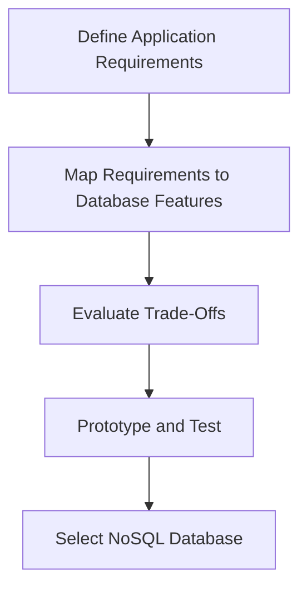

## 6.5.1 Evaluating Data Access Patterns

In the realm of NoSQL databases, understanding and evaluating data access patterns is crucial for designing scalable and efficient data solutions. This section delves into the intricacies of analyzing read/write patterns, data size, and latency requirements, providing a comprehensive decision-making framework for selecting the most suitable NoSQL database for your Clojure applications. We will also explore the trade-offs between consistency models, scalability, and complexity, ensuring that you are well-equipped to make informed decisions that align with your application's unique needs.

### Understanding Data Access Patterns

Data access patterns refer to the ways in which data is read from and written to a database. These patterns are influenced by the application's requirements, including the frequency and type of operations performed, the size of the data, and the expected latency. By thoroughly understanding these patterns, you can optimize the performance and scalability of your NoSQL database.

#### Analyzing Read/Write Patterns

1. **Read-Heavy vs. Write-Heavy Workloads**: Determine whether your application is predominantly read-heavy, write-heavy, or balanced. Read-heavy applications, such as content delivery networks, require databases optimized for fast data retrieval. Write-heavy applications, like logging systems, need efficient data ingestion capabilities.

2. **Read/Write Ratios**: Calculate the ratio of read to write operations. This ratio helps in selecting a database that can handle the expected load efficiently. For instance, a 90% read and 10% write workload may benefit from a database with strong read optimization features.

3. **Batch vs. Real-Time Processing**: Identify whether data operations occur in batches or require real-time processing. Batch processing can tolerate higher latencies, while real-time applications demand low-latency responses.

#### Evaluating Data Size and Latency Requirements

1. **Data Volume**: Assess the total volume of data your application will handle. Large datasets may require databases with horizontal scaling capabilities, such as Cassandra or MongoDB, to distribute data across multiple nodes.

2. **Data Growth Rate**: Consider the rate at which your data grows. Rapidly growing datasets necessitate databases that can scale seamlessly without compromising performance.

3. **Latency Sensitivity**: Determine the acceptable latency for your application. Applications with stringent latency requirements, such as online gaming or financial trading platforms, need databases that offer low-latency data access.

### Decision-Making Framework for NoSQL Database Selection

Selecting the right NoSQL database involves evaluating various factors, including data access patterns, consistency models, scalability, and complexity. The following framework provides a structured approach to making this decision:

#### Step 1: Define Application Requirements

- **Functional Requirements**: Identify the core functionalities your application must support. Consider the types of queries, data structures, and operations required.
- **Non-Functional Requirements**: Outline performance, scalability, and availability requirements. Determine the acceptable trade-offs between consistency and availability.

#### Step 2: Map Requirements to Database Features

- **Consistency Models**: Evaluate the consistency models offered by different NoSQL databases. Choose between strong consistency, eventual consistency, or tunable consistency based on your application's needs.
- **Scalability**: Assess the database's ability to scale horizontally or vertically. Consider sharding, replication, and partitioning strategies.
- **Complexity**: Consider the complexity of integrating the database with your existing infrastructure and the learning curve for your development team.

#### Step 3: Evaluate Trade-Offs

- **Consistency vs. Availability**: Understand the CAP theorem and its implications. Decide whether your application can tolerate eventual consistency in exchange for higher availability.
- **Performance vs. Complexity**: Balance the need for high performance with the complexity of managing and maintaining the database.

#### Step 4: Prototype and Test

- **Prototype**: Develop a prototype to test the database's capabilities with your specific data access patterns. Use real-world scenarios to evaluate performance and scalability.
- **Benchmarking**: Conduct benchmarking tests to measure latency, throughput, and resource utilization under different loads.

### Trade-Offs in Consistency Models, Scalability, and Complexity

NoSQL databases offer various consistency models, each with its trade-offs. Understanding these trade-offs is essential for selecting the right database for your application.

#### Consistency Models

1. **Strong Consistency**: Guarantees that all reads return the most recent write. Suitable for applications requiring immediate consistency, such as financial transactions. However, it may impact availability and performance.

2. **Eventual Consistency**: Ensures that all replicas eventually converge to the same state. Ideal for applications that can tolerate temporary inconsistencies, like social media feeds. Offers higher availability and performance.

3. **Tunable Consistency**: Allows configuring the level of consistency based on specific requirements. Databases like Cassandra provide tunable consistency, enabling a balance between consistency and availability.

#### Scalability Considerations

1. **Horizontal vs. Vertical Scaling**: Horizontal scaling involves adding more nodes to distribute the load, while vertical scaling increases the capacity of existing nodes. NoSQL databases like Cassandra and MongoDB excel at horizontal scaling.

2. **Sharding and Partitioning**: Distributes data across multiple nodes to improve performance and scalability. Effective sharding strategies are crucial for maintaining balanced loads and minimizing latency.

3. **Replication**: Enhances data availability and fault tolerance by maintaining multiple copies of data across nodes. Choose between synchronous and asynchronous replication based on consistency and latency requirements.

#### Complexity and Integration

1. **Integration Complexity**: Evaluate the ease of integrating the NoSQL database with your existing infrastructure. Consider the availability of drivers, libraries, and community support.

2. **Operational Complexity**: Assess the complexity of managing and maintaining the database. Consider factors such as backup and recovery, monitoring, and scaling operations.

3. **Learning Curve**: Consider the learning curve for your development team. Choose a database with comprehensive documentation and a supportive community to facilitate adoption.

### Practical Code Examples and Snippets

To illustrate the concepts discussed, let's explore some practical code examples in Clojure for interacting with NoSQL databases.

#### Example: Connecting to MongoDB with Clojure

```clojure
(ns myapp.mongodb
  (:require [monger.core :as mg]
            [monger.collection :as mc]))

(defn connect-to-mongodb []
  (let [conn (mg/connect)
        db (mg/get-db conn "mydatabase")]
    db))

(defn insert-document [db]
  (mc/insert db "mycollection" {:name "John Doe" :age 30}))

(defn find-document [db]
  (mc/find-maps db "mycollection" {:name "John Doe"}))
```

In this example, we establish a connection to a MongoDB database using the `monger` library, insert a document, and retrieve it based on a query.

#### Example: Performing CRUD Operations with Cassandra

```clojure
(ns myapp.cassandra
  (:require [qbits.alia :as alia]))

(defn connect-to-cassandra []
  (alia/cluster {:contact-points ["127.0.0.1"]}))

(defn create-keyspace [session]
  (alia/execute session "CREATE KEYSPACE IF NOT EXISTS mykeyspace
                         WITH replication = {'class': 'SimpleStrategy', 'replication_factor': 1}"))

(defn insert-data [session]
  (alia/execute session "INSERT INTO mykeyspace.mytable (id, name, age) VALUES (uuid(), 'Jane Doe', 25)"))

(defn query-data [session]
  (alia/execute session "SELECT * FROM mykeyspace.mytable WHERE name = 'Jane Doe'"))
```

This example demonstrates how to connect to a Cassandra cluster using the `alia` library, create a keyspace, insert data, and query it.

### Diagrams and Visualizations

To enhance understanding, let's include a diagram illustrating the decision-making framework for selecting a NoSQL database.



This flowchart outlines the steps involved in evaluating data access patterns and selecting the appropriate NoSQL database.

### Best Practices and Common Pitfalls

#### Best Practices

1. **Thoroughly Analyze Data Access Patterns**: Invest time in understanding your application's data access patterns to make informed decisions.
2. **Prototype and Benchmark**: Always prototype and benchmark databases with real-world scenarios to validate their performance.
3. **Leverage Community Resources**: Utilize community resources, documentation, and forums for guidance and support.

#### Common Pitfalls

1. **Ignoring Data Growth**: Failing to account for data growth can lead to performance bottlenecks and scalability issues.
2. **Overlooking Consistency Requirements**: Neglecting consistency requirements can result in data integrity issues and unexpected behavior.
3. **Underestimating Operational Complexity**: Underestimating the complexity of managing and maintaining a NoSQL database can lead to operational challenges.

### Conclusion

Evaluating data access patterns is a critical step in designing scalable and efficient NoSQL data solutions for Clojure applications. By analyzing read/write patterns, data size, and latency requirements, and using a structured decision-making framework, you can select the most suitable NoSQL database for your needs. Understanding the trade-offs between consistency models, scalability, and complexity ensures that you make informed decisions that align with your application's unique requirements.

## Quiz Time!



### What is the primary purpose of evaluating data access patterns in NoSQL databases?

- [x] To optimize performance and scalability
- [ ] To increase data redundancy
- [ ] To simplify database management
- [ ] To enhance data security

> **Explanation:** Evaluating data access patterns helps in optimizing the performance and scalability of NoSQL databases by understanding how data is read and written.

### Which of the following is a characteristic of a read-heavy workload?

- [x] High frequency of data retrieval operations
- [ ] High frequency of data insertion operations
- [ ] Equal frequency of read and write operations
- [ ] Low frequency of data retrieval operations

> **Explanation:** A read-heavy workload is characterized by a high frequency of data retrieval operations compared to data insertion operations.

### What is the significance of the read/write ratio in database selection?

- [x] It helps in selecting a database that can handle the expected load efficiently
- [ ] It determines the database's security features
- [ ] It influences the database's cost
- [ ] It affects the database's user interface

> **Explanation:** The read/write ratio helps in selecting a database that can efficiently handle the expected load based on the frequency of read and write operations.

### Which consistency model guarantees that all reads return the most recent write?

- [x] Strong consistency
- [ ] Eventual consistency
- [ ] Tunable consistency
- [ ] Weak consistency

> **Explanation:** Strong consistency guarantees that all reads return the most recent write, ensuring immediate consistency.

### What is the primary advantage of eventual consistency?

- [x] Higher availability and performance
- [ ] Immediate consistency
- [ ] Simplified database management
- [ ] Enhanced data security

> **Explanation:** Eventual consistency offers higher availability and performance by allowing temporary inconsistencies that eventually converge.

### What is the role of sharding in NoSQL databases?

- [x] To distribute data across multiple nodes for improved performance
- [ ] To enhance data security
- [ ] To simplify database queries
- [ ] To increase data redundancy

> **Explanation:** Sharding distributes data across multiple nodes to improve performance and scalability by balancing the load.

### Which of the following is a common pitfall when evaluating data access patterns?

- [x] Ignoring data growth
- [ ] Overestimating data security
- [ ] Simplifying database management
- [ ] Enhancing data redundancy

> **Explanation:** Ignoring data growth can lead to performance bottlenecks and scalability issues, making it a common pitfall.

### What is the purpose of prototyping and benchmarking in database selection?

- [x] To validate the database's performance with real-world scenarios
- [ ] To simplify database management
- [ ] To enhance data security
- [ ] To increase data redundancy

> **Explanation:** Prototyping and benchmarking help validate the database's performance with real-world scenarios, ensuring it meets the application's requirements.

### Which scaling strategy involves adding more nodes to distribute the load?

- [x] Horizontal scaling
- [ ] Vertical scaling
- [ ] Linear scaling
- [ ] Exponential scaling

> **Explanation:** Horizontal scaling involves adding more nodes to distribute the load, improving performance and scalability.

### True or False: The CAP theorem states that a distributed database can achieve consistency, availability, and partition tolerance simultaneously.

- [ ] True
- [x] False

> **Explanation:** The CAP theorem states that a distributed database can achieve only two out of the three properties: consistency, availability, and partition tolerance, simultaneously.


