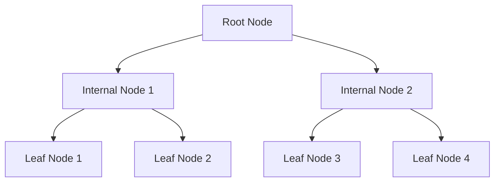

---

linkTitle: "9.1.1 Understanding Index Basics"
title: "Understanding Index Basics: Enhancing Data Retrieval in NoSQL with Clojure"
description: "Explore the fundamentals of indexing in NoSQL databases, including types of indexes and their impact on data retrieval speed, with practical Clojure examples."
categories:
- NoSQL
- Clojure
- Database Design
tags:
- Indexing
- Data Retrieval
- NoSQL Databases
- Clojure Programming
- Performance Optimization
date: 2024-10-25
type: docs
nav_weight: 911000
canonical: "https://clojureforjava.com/5/9/1/1"
license: "© 2024 Tokenizer Inc. CC BY-NC-SA 4.0"
---

## 9.1.1 Understanding Index Basics

In the realm of NoSQL databases, indexing is a pivotal concept that significantly enhances data retrieval speed. As data volumes grow exponentially, efficient data access becomes crucial for maintaining performance and scalability. This section delves into the fundamentals of indexing, explores various types of indexes, and provides practical insights into implementing these concepts using Clojure. By the end of this chapter, you will have a comprehensive understanding of how to leverage indexes to optimize your NoSQL database operations.

### The Role of Indexes in Data Retrieval

Indexes are data structures that improve the speed of data retrieval operations on a database table at the cost of additional writes and storage space. They are akin to the index of a book, which allows readers to quickly locate information without scanning every page. In databases, indexes serve a similar purpose by enabling rapid access to rows in a table based on key values.

#### How Indexes Work

When a query is executed, the database engine typically scans the entire dataset to find the relevant records. This full table scan can be time-consuming, especially with large datasets. Indexes mitigate this by providing a more efficient pathway to the data. They store a sorted list of key values and pointers to the corresponding records, allowing the database engine to quickly locate the desired data without scanning the entire table.

For instance, consider a collection of documents in a MongoDB database where each document represents a user profile. Without an index, querying for a user by their email address would require scanning every document in the collection. However, with an index on the email field, the database can quickly locate the user profile associated with a specific email address.

#### Benefits of Indexing

- **Improved Query Performance:** Indexes significantly reduce the time required to execute queries, especially for large datasets.
- **Efficient Sorting and Filtering:** Indexes facilitate efficient sorting and filtering of data, enabling complex queries to be executed swiftly.
- **Reduced Resource Consumption:** By minimizing the need for full table scans, indexes reduce CPU and memory usage, leading to better overall system performance.

### Types of Indexes

Indexes come in various forms, each suited to different types of queries and data structures. Understanding the different types of indexes and their use cases is essential for designing efficient database schemas.

#### Single-Field Indexes

Single-field indexes are the most basic type of index, created on a single field within a document or table. They are ideal for queries that filter or sort based on a single attribute. For example, in a user profile collection, a single-field index on the `email` field would expedite queries searching for users by their email addresses.

```clojure
;; Clojure example: Creating a single-field index in MongoDB using Monger
(require '[monger.core :as mg]
         '[monger.collection :as mc])

(defn create-single-field-index []
  (let [conn (mg/connect)
        db (mg/get-db conn "user_profiles")]
    (mc/ensure-index db "profiles" {:email 1})))

(create-single-field-index)
```

In this example, we use the Monger library to create a single-field index on the `email` field of the `profiles` collection. The `1` indicates ascending order, which is the default for indexes.

#### Compound Indexes

Compound indexes are created on multiple fields within a document or table. They are useful for queries that filter or sort based on multiple attributes. For instance, if you frequently query user profiles by both `last_name` and `first_name`, a compound index on these fields would enhance query performance.

```clojure
;; Clojure example: Creating a compound index in MongoDB using Monger
(defn create-compound-index []
  (let [conn (mg/connect)
        db (mg/get-db conn "user_profiles")]
    (mc/ensure-index db "profiles" {:last_name 1 :first_name 1})))

(create-compound-index)
```

Here, we create a compound index on the `last_name` and `first_name` fields. This index will optimize queries that filter or sort by both fields.

#### Multikey Indexes

Multikey indexes are designed for fields that hold arrays. They enable efficient querying of documents based on elements within an array. For example, if each user profile document contains an array of `tags`, a multikey index on the `tags` field would speed up searches for profiles containing specific tags.

```clojure
;; Clojure example: Creating a multikey index in MongoDB using Monger
(defn create-multikey-index []
  (let [conn (mg/connect)
        db (mg/get-db conn "user_profiles")]
    (mc/ensure-index db "profiles" {:tags 1})))

(create-multikey-index)
```

In this example, we create a multikey index on the `tags` field, allowing efficient querying of documents based on array elements.

### Practical Considerations for Indexing

While indexes offer significant performance benefits, they also introduce trade-offs that must be carefully managed.

#### Trade-offs and Limitations

- **Increased Storage Requirements:** Indexes consume additional disk space, which can be substantial for large datasets with multiple indexes.
- **Slower Write Operations:** Indexes must be updated with each insert, update, or delete operation, which can slow down write performance.
- **Complexity in Index Management:** Maintaining a large number of indexes can complicate database administration and increase the risk of index fragmentation.

#### Best Practices for Indexing

- **Index Selectively:** Only create indexes on fields that are frequently queried. Avoid indexing fields that are rarely used in queries.
- **Monitor Index Usage:** Regularly analyze query performance and index usage to identify underutilized or redundant indexes.
- **Balance Read and Write Performance:** Consider the trade-offs between read and write performance when designing indexes. In write-heavy applications, prioritize indexes that provide the most significant read performance gains.

### Indexing in Clojure: A Step-by-Step Guide

To effectively implement indexing in Clojure applications, it's essential to understand the integration between Clojure and NoSQL databases. This section provides a step-by-step guide to creating and managing indexes using Clojure.

#### Setting Up Your Clojure Environment

Before diving into indexing, ensure your Clojure development environment is set up with the necessary libraries for interacting with your chosen NoSQL database.

1. **Install Clojure and Leiningen:** Follow the instructions in Appendix A to set up Clojure and Leiningen, the build tool for Clojure projects.

2. **Add Dependencies:** Include the appropriate library for your NoSQL database in your `project.clj` file. For MongoDB, add the Monger library:

   ```clojure
   :dependencies [[org.clojure/clojure "1.10.3"]
                  [com.novemberain/monger "3.1.0"]]
   ```

3. **Connect to the Database:** Establish a connection to your NoSQL database using the library's connection functions.

   ```clojure
   (require '[monger.core :as mg])

   (def conn (mg/connect))
   (def db (mg/get-db conn "your_database_name"))
   ```

#### Creating and Managing Indexes

With your environment set up, you can proceed to create and manage indexes in your NoSQL database.

1. **Create Single-Field Indexes:** Use the library's index functions to create single-field indexes on frequently queried fields.

   ```clojure
   (require '[monger.collection :as mc])

   (defn create-index [field]
     (mc/ensure-index db "your_collection_name" {field 1}))
   ```

2. **Create Compound Indexes:** For queries involving multiple fields, create compound indexes to optimize performance.

   ```clojure
   (defn create-compound-index [fields]
     (mc/ensure-index db "your_collection_name" fields))
   ```

3. **Monitor Index Performance:** Regularly monitor index performance using database profiling tools and adjust your indexing strategy as needed.

4. **Remove Unused Indexes:** Periodically review and remove indexes that are no longer needed to free up resources.

   ```clojure
   (defn drop-index [index-name]
     (mc/drop-index db "your_collection_name" index-name))
   ```

### Visualizing Index Structures

To better understand how indexes work, it's helpful to visualize their structure. The following diagram illustrates the concept of a B-tree, a common data structure used for indexing.



In this B-tree diagram, the root node contains pointers to internal nodes, which in turn point to leaf nodes. Each node contains key values and pointers to child nodes, enabling efficient data retrieval.

### Conclusion

Indexes are a powerful tool for optimizing data retrieval in NoSQL databases. By understanding the different types of indexes and their use cases, you can design efficient database schemas that balance read and write performance. In Clojure, libraries like Monger provide the necessary functions to create and manage indexes, allowing you to leverage the full potential of indexing in your applications.

As you continue to explore the world of NoSQL databases, keep in mind the trade-offs and best practices associated with indexing. By carefully selecting and managing indexes, you can ensure that your applications remain performant and scalable, even as data volumes grow.

## Quiz Time!



### What is the primary purpose of an index in a database?

- [x] To improve the speed of data retrieval operations
- [ ] To increase the storage capacity of the database
- [ ] To slow down write operations
- [ ] To enhance data security

> **Explanation:** Indexes are primarily used to improve the speed of data retrieval operations by providing a more efficient pathway to the data.

### Which type of index is created on a single field within a document or table?

- [x] Single-field index
- [ ] Compound index
- [ ] Multikey index
- [ ] Full-text index

> **Explanation:** A single-field index is created on a single field within a document or table, optimizing queries that filter or sort based on that field.

### What is a compound index?

- [x] An index created on multiple fields within a document or table
- [ ] An index created on a single field within a document or table
- [ ] An index designed for fields that hold arrays
- [ ] An index used for full-text search

> **Explanation:** A compound index is created on multiple fields within a document or table, optimizing queries that filter or sort based on multiple attributes.

### What is the primary trade-off associated with using indexes?

- [x] Increased storage requirements
- [ ] Decreased query performance
- [ ] Enhanced data security
- [ ] Reduced data integrity

> **Explanation:** Indexes consume additional disk space, which can be substantial for large datasets with multiple indexes.

### Which type of index is designed for fields that hold arrays?

- [x] Multikey index
- [ ] Single-field index
- [ ] Compound index
- [ ] Full-text index

> **Explanation:** Multikey indexes are designed for fields that hold arrays, enabling efficient querying of documents based on elements within an array.

### What is the purpose of a B-tree in indexing?

- [x] To provide a data structure for efficient data retrieval
- [ ] To increase the complexity of database queries
- [ ] To slow down write operations
- [ ] To enhance data security

> **Explanation:** A B-tree is a common data structure used for indexing, providing efficient data retrieval by organizing key values and pointers.

### How can you monitor index performance in a database?

- [x] Using database profiling tools
- [ ] By increasing the number of indexes
- [ ] By reducing query complexity
- [ ] By enhancing data security

> **Explanation:** Database profiling tools can be used to monitor index performance and identify underutilized or redundant indexes.

### What is the impact of indexes on write operations?

- [x] They can slow down write operations
- [ ] They enhance write performance
- [ ] They have no impact on write operations
- [ ] They increase data integrity

> **Explanation:** Indexes must be updated with each insert, update, or delete operation, which can slow down write performance.

### Why should you periodically review and remove unused indexes?

- [x] To free up resources and improve performance
- [ ] To increase storage requirements
- [ ] To enhance data security
- [ ] To reduce query complexity

> **Explanation:** Removing unused indexes frees up resources and can improve overall database performance.

### True or False: Indexes are only beneficial for read-heavy applications.

- [x] True
- [ ] False

> **Explanation:** Indexes are particularly beneficial for read-heavy applications, as they significantly improve query performance by reducing the need for full table scans.


