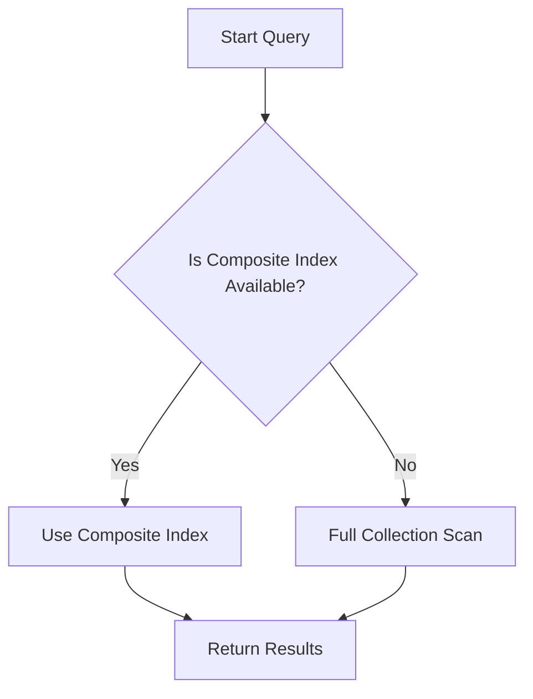

## 9.3.1 Composite Indexes

In the realm of NoSQL databases, where data models diverge significantly from traditional relational databases, the concept of indexing remains a cornerstone for optimizing query performance. Composite indexes, which involve indexing multiple fields within a document or record, are particularly powerful in enhancing query efficiency and reducing latency. This section delves into the creation and utilization of composite indexes, with a focus on how field order can significantly impact their effectiveness. We will explore practical examples using Clojure, providing insights and best practices for Java developers transitioning to Clojure and NoSQL environments.

### Understanding Composite Indexes

Composite indexes, also known as multi-field or compound indexes, are indexes that include more than one field from a document or record. They are designed to optimize queries that filter or sort data based on multiple criteria. By indexing multiple fields together, composite indexes can significantly reduce the number of documents that need to be scanned to satisfy a query, thus improving performance.

#### Why Use Composite Indexes?

1. **Performance Optimization**: Composite indexes can drastically reduce query execution time by narrowing down the search space.
2. **Complex Query Support**: They enable efficient execution of complex queries that involve multiple fields.
3. **Sorting and Filtering**: Composite indexes can be used to optimize both sorting and filtering operations.
4. **Reduced Resource Consumption**: By minimizing the number of documents scanned, they help in reducing CPU and memory usage.

### Creating Composite Indexes

Creating composite indexes involves specifying multiple fields that should be indexed together. The syntax and capabilities for creating composite indexes can vary across different NoSQL databases. Let's explore how to create composite indexes in MongoDB and Cassandra, two popular NoSQL databases, using Clojure.

#### Composite Indexes in MongoDB

MongoDB, a document-oriented NoSQL database, provides robust support for composite indexes. The `createIndex` method allows you to specify multiple fields to be indexed.

**Example: Creating a Composite Index in MongoDB**

Suppose you have a collection of documents representing orders, each with fields such as `customerId`, `orderDate`, and `status`. To optimize queries that filter by `customerId` and `orderDate`, you can create a composite index on these fields.

```clojure
(ns myapp.db
  (:require [monger.core :as mg]
            [monger.collection :as mc]))

(defn create-composite-index []
  (let [conn (mg/connect)
        db (mg/get-db conn "orders-db")]
    (mc/create-index db "orders" {:customerId 1 :orderDate 1})))
```

In this example, the composite index is created on the `orders` collection, indexing both `customerId` and `orderDate` in ascending order.

#### Composite Indexes in Cassandra

Cassandra, a wide-column store, uses a different approach for indexing. Composite keys in Cassandra can be used to create multi-field indexes.

**Example: Creating a Composite Index in Cassandra**

Consider a table `orders` with columns `customer_id`, `order_date`, and `status`. You can create a composite primary key to optimize queries involving `customer_id` and `order_date`.

```clojure
(ns myapp.cassandra
  (:require [clojure.java.jdbc :as jdbc]))

(def db-spec {:subprotocol "cassandra"
              :subname "//localhost:9042/orders_db"})

(defn create-composite-key []
  (jdbc/execute! db-spec
                 ["CREATE TABLE IF NOT EXISTS orders (
                    customer_id UUID,
                    order_date TIMESTAMP,
                    status TEXT,
                    PRIMARY KEY ((customer_id), order_date))"]))
```

In this example, the composite primary key consists of `customer_id` and `order_date`, allowing efficient queries on these fields.

### Impact of Field Order in Composite Indexes

The order of fields in a composite index is crucial and can significantly affect query performance. The general rule is to place the most selective fields first, followed by less selective fields. This ordering helps in maximizing the index's efficiency.

#### Field Order Considerations

1. **Selectivity**: Fields with higher selectivity (i.e., fields that reduce the result set size the most) should be placed first.
2. **Query Patterns**: Analyze common query patterns and order fields based on their usage frequency and importance.
3. **Sorting Requirements**: If queries involve sorting, ensure that the index order aligns with the sort order.

**Example: Field Order Impact in MongoDB**

Consider a scenario where you frequently query the `orders` collection by `status` and `orderDate`. If `status` is more selective than `orderDate`, it should be placed first in the index.

```clojure
(mc/create-index db "orders" {:status 1 :orderDate 1})
```

This index will efficiently support queries like:

```clojure
(mc/find-maps db "orders" {:status "shipped"} {:sort {:orderDate 1}})
```

### Best Practices for Composite Indexes

1. **Analyze Query Patterns**: Regularly analyze and profile your queries to identify which fields are most frequently used together.
2. **Monitor Index Usage**: Use database tools to monitor index usage and identify unused or redundant indexes.
3. **Balance Indexing and Write Performance**: While indexes improve read performance, they can degrade write performance. Balance the number of indexes with your application's write requirements.
4. **Regularly Review and Update Indexes**: As application requirements evolve, periodically review and update your indexes to ensure they remain optimal.

### Common Pitfalls and Optimization Tips

- **Over-Indexing**: Avoid creating too many indexes, as they can slow down write operations and increase storage requirements.
- **Index Maintenance**: Regularly rebuild or defragment indexes to maintain performance, especially in databases that do not automatically optimize index storage.
- **Field Type Considerations**: Ensure that indexed fields are of appropriate data types and sizes to avoid unnecessary overhead.

### Practical Code Examples and Configurations

Let's explore more practical examples and configurations for creating and using composite indexes in Clojure with MongoDB and Cassandra.

#### Example: Optimizing a Query with a Composite Index in MongoDB

Suppose you have a query that retrieves orders for a specific customer within a date range and sorts them by `orderDate`.

```clojure
(mc/find-maps db "orders"
              {:customerId "12345"
               :orderDate {$gte "2023-01-01" $lte "2023-12-31"}}
              {:sort {:orderDate 1}})
```

To optimize this query, create a composite index on `customerId` and `orderDate`.

```clojure
(mc/create-index db "orders" {:customerId 1 :orderDate 1})
```

This index will ensure that the query executes efficiently, leveraging both filtering and sorting capabilities.

#### Example: Using Composite Keys in Cassandra

In Cassandra, composite keys can be used to efficiently retrieve data based on multiple fields. Consider a query that fetches all orders for a specific customer and sorts them by `order_date`.

```clojure
(jdbc/query db-spec
            ["SELECT * FROM orders WHERE customer_id = ? ORDER BY order_date"
             (java.util.UUID/fromString "123e4567-e89b-12d3-a456-426614174000")])
```

By defining a composite primary key with `customer_id` and `order_date`, Cassandra can efficiently execute this query.

### Diagrams and Visualizations

To better understand the impact of composite indexes, let's visualize how they work using a flowchart.



This flowchart illustrates the decision-making process when executing a query with a composite index. If a composite index is available, the database uses it to efficiently retrieve results; otherwise, it performs a full collection scan.

### Conclusion

Composite indexes are a powerful tool for optimizing query performance in NoSQL databases. By understanding how to create and utilize them effectively, and considering the impact of field order, developers can significantly enhance the performance of their applications. As with any optimization technique, it's essential to balance the benefits of composite indexes with their impact on write performance and storage requirements. Regularly reviewing and updating indexes based on evolving application needs will ensure that your NoSQL database remains efficient and responsive.

## Quiz Time!



### What is a composite index?

- [x] An index that includes multiple fields from a document or record.
- [ ] An index that includes only a single field.
- [ ] An index that is automatically created by the database.
- [ ] An index that is used only for sorting data.

> **Explanation:** A composite index includes multiple fields from a document or record, optimizing queries that filter or sort data based on multiple criteria.

### Why is field order important in composite indexes?

- [x] It affects the efficiency of query execution.
- [ ] It determines the storage size of the index.
- [ ] It only matters for sorting operations.
- [ ] It has no impact on query performance.

> **Explanation:** Field order affects the efficiency of query execution because the most selective fields should be indexed first to maximize performance.

### Which NoSQL database supports composite indexes using the `createIndex` method?

- [x] MongoDB
- [ ] Cassandra
- [ ] Redis
- [ ] Neo4j

> **Explanation:** MongoDB supports composite indexes using the `createIndex` method, allowing multiple fields to be indexed together.

### In Cassandra, how are composite keys used?

- [x] To create multi-field indexes.
- [ ] To store binary data.
- [ ] To manage database transactions.
- [ ] To automatically partition data.

> **Explanation:** In Cassandra, composite keys are used to create multi-field indexes, optimizing queries that involve multiple fields.

### What is the primary benefit of using composite indexes?

- [x] Improved query performance.
- [ ] Reduced database storage.
- [ ] Simplified database schema.
- [ ] Enhanced security features.

> **Explanation:** The primary benefit of using composite indexes is improved query performance, as they reduce the number of documents scanned.

### What is a common pitfall when using composite indexes?

- [x] Over-indexing, which can degrade write performance.
- [ ] Under-indexing, which increases storage requirements.
- [ ] Using too few fields in the index.
- [ ] Relying solely on automatic indexing.

> **Explanation:** A common pitfall is over-indexing, which can degrade write performance and increase storage requirements.

### How can you monitor index usage in a NoSQL database?

- [x] Use database tools to analyze query performance.
- [ ] Manually inspect each query.
- [ ] Disable all indexes and observe changes.
- [ ] Rely on application logs.

> **Explanation:** Database tools can be used to monitor index usage and analyze query performance, helping identify unused or redundant indexes.

### What should be considered when balancing indexing and write performance?

- [x] The number of indexes and the application's write requirements.
- [ ] The size of the database storage.
- [ ] The type of database hardware.
- [ ] The frequency of database backups.

> **Explanation:** Balancing indexing and write performance involves considering the number of indexes and the application's write requirements.

### What is the role of selectivity in determining field order for composite indexes?

- [x] More selective fields should be indexed first.
- [ ] Less selective fields should be indexed first.
- [ ] Selectivity has no impact on field order.
- [ ] Selectivity only affects sorting operations.

> **Explanation:** More selective fields should be indexed first to maximize the efficiency of the composite index.

### Composite indexes can be used to optimize both filtering and sorting operations.

- [x] True
- [ ] False

> **Explanation:** Composite indexes can optimize both filtering and sorting operations by indexing multiple fields together, enhancing query performance.


