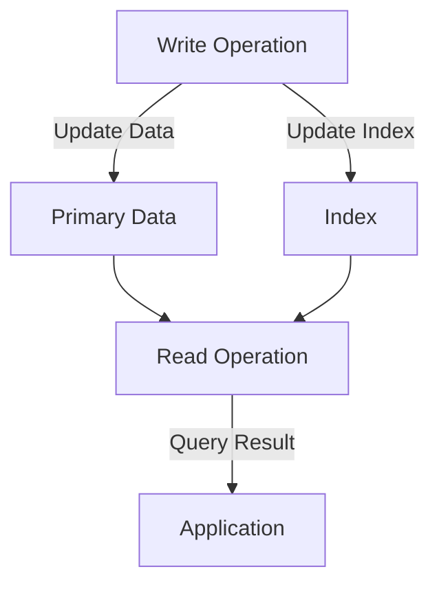

## 9.5.1 Impact of Indexes on Write Performance

In the realm of NoSQL databases, indexes play a crucial role in optimizing read performance by allowing quick data retrieval. However, this comes at a cost to write performance. Understanding the trade-offs and implementing strategies to balance these aspects is essential for designing scalable data solutions. This section delves into the impact of indexes on write operations and offers practical strategies for achieving an optimal balance between read and write performance in NoSQL databases, particularly when using Clojure.

### Understanding the Impact of Indexes on Write Performance

Indexes are additional data structures that store a subset of the data in a way that makes queries more efficient. While they significantly enhance read operations, they can also slow down write operations due to the additional overhead involved in maintaining these structures.

#### How Indexes Affect Write Operations

1. **Additional Write Overhead**: Every time a write operation (insert, update, or delete) occurs, the database must update not only the primary data but also the associated indexes. This results in additional I/O operations, which can slow down the overall write performance.

2. **Increased Complexity**: The complexity of maintaining indexes increases with the number of indexes and the size of the data. This can lead to increased CPU usage and memory consumption, further impacting write performance.

3. **Lock Contention**: In some databases, updating indexes may require locking mechanisms to ensure data consistency. This can lead to contention and delays, especially in high-concurrency environments.

4. **Replication Lag**: In distributed systems, the need to update indexes across multiple nodes can introduce replication lag, affecting the consistency and availability of the data.

### Strategies for Balancing Read and Write Performance

To mitigate the impact of indexes on write performance, several strategies can be employed. These strategies involve careful planning and understanding of the specific use case requirements.

#### 1. Selective Indexing

- **Prioritize Essential Indexes**: Only create indexes that are absolutely necessary for the application's query patterns. Avoid over-indexing, which can unnecessarily burden write operations.
  
- **Use Compound Indexes**: Instead of creating multiple single-field indexes, consider using compound indexes that cover multiple fields used together in queries. This reduces the number of indexes that need to be updated during write operations.

#### 2. Index Maintenance Strategies

- **Deferred Index Updates**: Some databases allow for deferred index updates, where index maintenance is postponed to a later time. This can help improve write performance during peak load periods.

- **Batch Indexing**: Accumulate changes and update indexes in batches rather than individually. This can reduce the overhead associated with frequent index updates.

#### 3. Database Design Considerations

- **Denormalization**: In some cases, denormalizing the data model can reduce the need for complex indexes by storing redundant data in a way that aligns with query patterns.

- **Sharding and Partitioning**: Distributing data across multiple nodes can help manage the load and reduce the impact of index updates on write performance.

#### 4. Monitoring and Tuning

- **Performance Monitoring**: Regularly monitor the performance of write operations and the impact of indexes. Use tools to analyze query performance and identify bottlenecks.

- **Index Tuning**: Periodically review and adjust indexes based on changing query patterns and application requirements. Remove unused or redundant indexes to optimize performance.

### Practical Code Examples and Configurations

To illustrate these strategies, let's explore some practical examples using Clojure and popular NoSQL databases like MongoDB and Cassandra.

#### Example: Selective Indexing in MongoDB with Clojure

```clojure
(ns myapp.db
  (:require [monger.core :as mg]
            [monger.collection :as mc]))

(defn create-indexes []
  (let [conn (mg/connect)
        db (mg/get-db conn "mydb")]
    ;; Create a compound index on fields "name" and "age"
    (mc/ensure-index db "users" {:name 1 :age 1})))

(create-indexes)
```

In this example, we create a compound index on the "users" collection, optimizing queries that filter by both "name" and "age" fields.

#### Example: Batch Indexing in Cassandra with Clojure

```clojure
(ns myapp.cassandra
  (:require [clojure.java.jdbc :as jdbc]))

(defn batch-update-indexes [session updates]
  (jdbc/with-db-transaction [tx session]
    (doseq [update updates]
      (jdbc/execute! tx update))))

;; Example usage
(batch-update-indexes session ["UPDATE my_table SET ... WHERE ..."])
```

Here, we use Clojure's `clojure.java.jdbc` library to perform batch updates in Cassandra, reducing the overhead of individual index updates.

### Diagrams and Visual Aids

To further clarify these concepts, let's use a Mermaid diagram to illustrate the trade-off between read and write performance with indexing.



This diagram shows how write operations affect both primary data and indexes, impacting the overall performance.

### Best Practices and Common Pitfalls

- **Best Practices**:
  - Regularly review and optimize indexes based on query patterns.
  - Use monitoring tools to track the impact of indexes on performance.
  - Consider the trade-offs between read and write performance when designing indexes.

- **Common Pitfalls**:
  - Over-indexing can lead to significant write performance degradation.
  - Neglecting to update or remove unused indexes can result in unnecessary overhead.
  - Failing to monitor index performance can lead to undetected bottlenecks.

### Conclusion

Balancing the impact of indexes on write performance is a critical aspect of designing scalable NoSQL data solutions. By understanding the trade-offs and implementing strategic indexing practices, developers can optimize both read and write operations. Leveraging Clojure's capabilities, along with careful database design and monitoring, can lead to efficient and performant applications.

## Quiz Time!



### How do indexes impact write performance in NoSQL databases?

- [x] They increase the overhead of write operations due to additional data structure maintenance.
- [ ] They have no impact on write performance.
- [ ] They only affect read performance.
- [ ] They decrease the complexity of write operations.

> **Explanation:** Indexes require additional updates during write operations, increasing overhead and potentially slowing down performance.

### What is a strategy to improve write performance affected by indexes?

- [x] Use compound indexes instead of multiple single-field indexes.
- [ ] Create as many indexes as possible.
- [ ] Avoid using indexes altogether.
- [ ] Focus only on read performance.

> **Explanation:** Compound indexes reduce the number of indexes that need updating, improving write performance.

### What is the benefit of deferred index updates?

- [x] They postpone index maintenance to a later time, improving write performance during peak loads.
- [ ] They immediately update indexes, ensuring consistency.
- [ ] They eliminate the need for indexes.
- [ ] They only affect read operations.

> **Explanation:** Deferred index updates allow for better write performance by postponing index maintenance.

### How can denormalization help with write performance?

- [x] It reduces the need for complex indexes by aligning data storage with query patterns.
- [ ] It increases the number of indexes required.
- [ ] It complicates the data model.
- [ ] It only benefits read performance.

> **Explanation:** Denormalization can simplify data access patterns, reducing the need for complex indexing.

### What is a common pitfall when managing indexes?

- [x] Over-indexing, leading to significant write performance degradation.
- [ ] Under-indexing, leading to poor read performance.
- [ ] Regularly reviewing indexes.
- [ ] Using compound indexes.

> **Explanation:** Over-indexing can burden write operations, negatively impacting performance.

### How can monitoring tools help with index performance?

- [x] They track the impact of indexes on performance, identifying bottlenecks.
- [ ] They eliminate the need for indexes.
- [ ] They only monitor read operations.
- [ ] They automatically optimize indexes.

> **Explanation:** Monitoring tools help identify performance issues related to indexes, allowing for optimization.

### What is the role of batch indexing?

- [x] It reduces the overhead of frequent index updates by accumulating changes.
- [ ] It increases the frequency of index updates.
- [ ] It eliminates the need for indexes.
- [ ] It only affects read operations.

> **Explanation:** Batch indexing accumulates changes, reducing the overhead of frequent updates.

### Why is it important to periodically review and adjust indexes?

- [x] To optimize performance based on changing query patterns and application requirements.
- [ ] To maintain the same set of indexes indefinitely.
- [ ] To increase the number of indexes.
- [ ] To focus only on read performance.

> **Explanation:** Regular review and adjustment ensure indexes are aligned with current application needs.

### What is the impact of replication lag in distributed systems?

- [x] It affects consistency and availability of data due to delayed index updates.
- [ ] It improves write performance.
- [ ] It only affects read operations.
- [ ] It eliminates the need for indexes.

> **Explanation:** Replication lag can delay data consistency and availability in distributed systems.

### True or False: Indexes only impact read performance in NoSQL databases.

- [ ] True
- [x] False

> **Explanation:** Indexes impact both read and write performance, with write operations experiencing additional overhead due to index maintenance.


