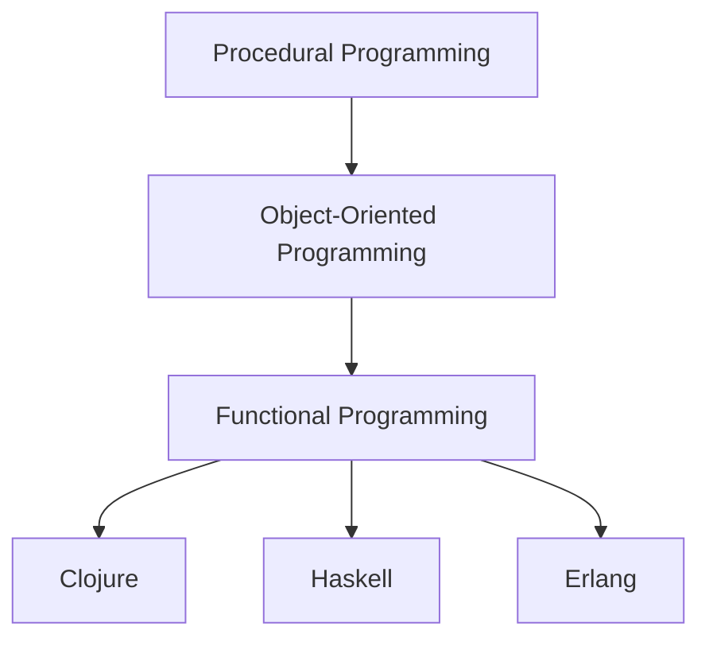

## 1.1 The Evolution of Programming Paradigms

### Historical Overview

The evolution of programming paradigms is a fascinating journey that reflects the changing needs and growing complexity of software development. This journey begins with procedural programming, advances through object-oriented programming (OOP), and arrives at the current frontier: functional programming. Each paradigm shift has been driven by the need to address the limitations of its predecessors and to better manage the complexity of software systems.

#### Procedural Programming

Procedural programming is the oldest paradigm, characterized by a sequence of instructions that operate on data. This approach is akin to following a recipe, where each step is executed in order. Languages such as C and Pascal are quintessential examples of procedural programming.

**Key Characteristics:**
- **Linear Execution:** Code is executed in a linear fashion, with control structures like loops and conditionals.
- **State Management:** Variables hold state, which can be modified throughout the program.
- **Subroutines and Functions:** Code is organized into reusable blocks.

**Limitations:**
- **Scalability Issues:** As programs grow, managing state and control flow becomes challenging.
- **Side Effects:** Functions often modify global state, leading to unpredictable behavior.
- **Code Reusability:** Limited support for modularity and encapsulation.

#### Object-Oriented Programming

In response to the limitations of procedural programming, object-oriented programming emerged, with languages like Java and C++ leading the charge. OOP introduced the concept of encapsulating data and behavior within objects, promoting code reuse and modularity.

**Key Characteristics:**
- **Encapsulation:** Bundling data and methods that operate on the data within objects.
- **Inheritance:** Creating new classes from existing ones to promote code reuse.
- **Polymorphism:** Allowing objects to be treated as instances of their parent class.

**Benefits:**
- **Modularity:** Easier to manage large codebases by breaking them into smaller, manageable objects.
- **Reusability:** Inheritance and polymorphism facilitate code reuse.
- **Abstraction:** Hides complex implementation details, exposing only the necessary parts.

**Limitations:**
- **Complexity:** OOP can lead to complex hierarchies and dependencies.
- **State Management:** Objects maintain state, leading to potential side effects.
- **Concurrency Challenges:** Managing state across threads can be difficult.

#### Rise of Functional Programming

Functional programming (FP) has been around since the 1950s, with Lisp being one of the earliest languages. However, it has gained significant traction in recent years, driven by the need for more robust concurrency and parallelism solutions. Languages like Haskell, Erlang, and Clojure have popularized FP by offering powerful abstractions and tools for managing state and side effects.

**Key Characteristics:**
- **Immutability:** Data is immutable, reducing side effects and making programs easier to reason about.
- **First-Class Functions:** Functions are treated as first-class citizens, allowing them to be passed as arguments and returned from other functions.
- **Pure Functions:** Functions have no side effects and always produce the same output for the same input.

**Benefits:**
- **Concurrency and Parallelism:** Immutability and pure functions simplify concurrent and parallel programming.
- **Predictability:** Pure functions and immutability lead to more predictable code behavior.
- **Modularity:** Higher-order functions and function composition promote code reuse and modularity.

**Influential Languages:**

- **Lisp:** One of the earliest functional languages, known for its symbolic expression and influence on later languages.
- **Haskell:** A purely functional language that emphasizes immutability and lazy evaluation.
- **Erlang:** Designed for concurrent systems, Erlang excels in distributed computing and fault tolerance.
- **Clojure:** A modern Lisp dialect that runs on the Java Virtual Machine (JVM), offering seamless Java interoperability and a focus on immutability and concurrency.

### Limitations of Imperative Programming

Imperative programming, which includes both procedural and object-oriented paradigms, is fundamentally about changing the state of a program through statements that alter variables. While this approach has been effective for many applications, it presents several challenges as systems become more complex and distributed.

#### State Management

In imperative programming, managing state is a central concern. Variables can be modified at any point in the program, leading to potential inconsistencies and bugs. This mutable state is particularly problematic in concurrent programming, where multiple threads may attempt to modify the same variable simultaneously, leading to race conditions and difficult-to-debug errors.

**Example:**

```java
// Java example of mutable state
public class Counter {
    private int count = 0;

    public void increment() {
        count++;
    }

    public int getCount() {
        return count;
    }
}
```

In this example, the `Counter` class maintains a mutable state (`count`), which can be modified by multiple threads, leading to race conditions.

#### Side Effects

Side effects occur when a function or method modifies some state outside its local environment, such as a global variable or a database. This makes reasoning about code behavior difficult, as the function's output may depend on external factors.

**Example:**

```java
// Java example of a function with side effects
public class Logger {
    public void log(String message) {
        System.out.println(message); // Side effect: writing to console
    }
}
```

The `log` method in this example has a side effect of writing to the console, which can complicate testing and debugging.

### Rise of Functional Programming

Functional programming addresses the limitations of imperative programming by emphasizing immutability, pure functions, and declarative code. This paradigm shift has been driven by the increasing need for scalable, concurrent, and maintainable software systems.

#### Immutability

In functional programming, data is immutable, meaning it cannot be changed once created. This eliminates many of the issues associated with mutable state, such as race conditions and side effects.

**Example:**

```clojure
;; Clojure example of immutability
(def counter 0)

(defn increment [count]
  (+ count 1))

(def new-counter (increment counter))
```

In this Clojure example, the `counter` variable is immutable, and the `increment` function returns a new value without modifying the original `counter`.

#### Pure Functions

Pure functions are a cornerstone of functional programming. They have no side effects and always produce the same output for the same input, making them predictable and easy to test.

**Example:**

```clojure
;; Clojure example of a pure function
(defn add [a b]
  (+ a b))
```

The `add` function is pure, as it depends only on its input arguments and has no side effects.

#### Concurrency and Parallelism

Functional programming's emphasis on immutability and pure functions makes it well-suited for concurrent and parallel programming. With no mutable state to manage, functions can be executed in parallel without the risk of race conditions.

**Example:**

```clojure
;; Clojure example of parallel execution
(defn process-data [data]
  (pmap inc data)) ;; pmap applies inc function in parallel
```

In this example, `pmap` is used to increment elements of a collection in parallel, leveraging Clojure's support for parallelism.

### Influential Languages

Several languages have played a significant role in the rise of functional programming, each contributing unique features and concepts.

#### Lisp

Lisp, developed in the late 1950s, is one of the earliest programming languages and a pioneer of functional programming. Its symbolic expression and powerful macro system have influenced many modern languages, including Clojure.

#### Haskell

Haskell is a purely functional language that emphasizes immutability, lazy evaluation, and strong static typing. It has been instrumental in advancing functional programming concepts and is widely used in academia and industry for research and development.

#### Erlang

Erlang was designed for building concurrent, distributed, and fault-tolerant systems. Its actor-based model and lightweight process support make it ideal for telecommunications and real-time systems.

#### Clojure

Clojure is a modern Lisp dialect that runs on the JVM, offering seamless Java interoperability. It emphasizes immutability, functional programming, and concurrency, making it a powerful tool for building scalable applications.

### Java OOP vs. Clojure Functional Programming

For developers transitioning from Java's object-oriented paradigm to Clojure's functional approach, understanding the key differences and similarities can facilitate the learning process.

#### Classes and Objects vs. Namespaces and Functions

In Java, code is organized into classes and objects, each encapsulating data and behavior. In Clojure, code is organized into namespaces and functions, with a focus on immutability and statelessness.

**Java Example:**

```java
// Java class with methods
public class Calculator {
    public int add(int a, int b) {
        return a + b;
    }
}
```

**Clojure Equivalent:**

```clojure
;; Clojure namespace with functions
(ns calculator)

(defn add [a b]
  (+ a b))
```

#### State Management

Java relies on mutable state, often managed through instance variables within objects. Clojure, on the other hand, promotes immutable data structures and state management through constructs like atoms, refs, and agents.

**Java Example:**

```java
// Java mutable state
public class Counter {
    private int count = 0;

    public void increment() {
        count++;
    }
}
```

**Clojure Equivalent:**

```clojure
;; Clojure immutable state
(def counter (atom 0))

(defn increment []
  (swap! counter inc))
```

#### Concurrency

Java provides concurrency support through threads and synchronization mechanisms, which can be complex and error-prone. Clojure simplifies concurrency with its immutable data structures and concurrency primitives like atoms, refs, and agents.

**Java Example:**

```java
// Java concurrency with threads
public class Counter {
    private int count = 0;

    public synchronized void increment() {
        count++;
    }
}
```

**Clojure Equivalent:**

```clojure
;; Clojure concurrency with atoms
(def counter (atom 0))

(defn increment []
  (swap! counter inc))
```

### Visual Aids

To better understand the evolution of programming paradigms and the transition from Java OOP to Clojure's functional programming, let's visualize these concepts using diagrams.



**Diagram Description:** This flowchart illustrates the evolution of programming paradigms from procedural to object-oriented to functional programming, highlighting key languages like Clojure, Haskell, and Erlang.

### References and Links

- [Clojure Official Documentation](https://clojure.org/reference)
- [Clojure Community Resources](https://clojure.org/community/resources)
- [Transitioning from OOP to Functional Programming](https://www.lispcast.com/oo-to-fp/)
- [Java Concurrency](https://docs.oracle.com/javase/tutorial/essential/concurrency/)
- [Haskell Language](https://www.haskell.org/)
- [Erlang Programming Language](https://www.erlang.org/)

### Knowledge Check

To reinforce your understanding of the evolution of programming paradigms, consider the following questions and exercises:

1. **Identify the limitations of procedural programming** and how object-oriented programming addresses them.
2. **Explain the benefits of functional programming** in managing concurrency and parallelism.
3. **Compare and contrast Java OOP and Clojure functional programming** in terms of state management and concurrency.
4. **Experiment with Clojure's immutable data structures** by modifying the provided code examples to explore different scenarios.
5. **Discuss the role of influential languages** like Lisp, Haskell, and Erlang in shaping modern functional programming.

### Encouraging Engagement

Embracing functional programming with Clojure can be a rewarding journey, offering new perspectives and tools for building scalable applications. As you explore these concepts, remember that each step brings you closer to mastering this powerful paradigm. Engage with the Clojure community, experiment with code, and apply what you've learned to real-world projects.

### Test Your Knowledge: The Evolution of Programming Paradigms Quiz



### Which programming paradigm emphasizes immutability and pure functions?

- [ ] Object-Oriented Programming
- [x] Functional Programming
- [ ] Procedural Programming
- [ ] Logic Programming

> **Explanation:** Functional programming emphasizes immutability and pure functions, which help in managing state and side effects effectively.

### What is a key characteristic of object-oriented programming?

- [x] Encapsulation
- [ ] Immutability
- [ ] Pure Functions
- [ ] Lazy Evaluation

> **Explanation:** Encapsulation is a key characteristic of object-oriented programming, where data and methods are bundled within objects.

### Which language is known for its actor-based model and fault tolerance?

- [ ] Lisp
- [ ] Haskell
- [x] Erlang
- [ ] Clojure

> **Explanation:** Erlang is known for its actor-based model and fault tolerance, making it ideal for concurrent and distributed systems.

### What is a primary benefit of using pure functions?

- [x] Predictability
- [ ] Complexity
- [ ] Mutable State
- [ ] Side Effects

> **Explanation:** Pure functions are predictable as they always produce the same output for the same input, without side effects.

### How does Clojure manage state in a concurrent environment?

- [x] Using immutable data structures
- [ ] Through synchronized methods
- [ ] By using global variables
- [ ] With mutable state

> **Explanation:** Clojure manages state in a concurrent environment using immutable data structures and concurrency primitives like atoms.

### Which of the following is a limitation of procedural programming?

- [x] Scalability Issues
- [ ] Immutability
- [ ] Function Composition
- [ ] Data Flow Management

> **Explanation:** Procedural programming faces scalability issues due to its linear execution and mutable state management.

### What is a common challenge in object-oriented programming?

- [x] Complex Hierarchies
- [ ] Lack of Encapsulation
- [ ] Immutability
- [ ] Pure Functions

> **Explanation:** Object-oriented programming can lead to complex hierarchies and dependencies, making systems harder to manage.

### Which language is a modern Lisp dialect that runs on the JVM?

- [ ] Haskell
- [ ] Erlang
- [x] Clojure
- [ ] Scala

> **Explanation:** Clojure is a modern Lisp dialect that runs on the Java Virtual Machine (JVM), offering seamless Java interoperability.

### What is the primary focus of functional programming?

- [x] Declarative Code
- [ ] Mutable State
- [ ] Object Encapsulation
- [ ] Synchronized Threads

> **Explanation:** Functional programming focuses on declarative code, emphasizing immutability and pure functions.

### True or False: Functional programming is well-suited for concurrent and parallel programming.

- [x] True
- [ ] False

> **Explanation:** True. Functional programming's emphasis on immutability and pure functions makes it well-suited for concurrent and parallel programming.



By understanding the evolution of programming paradigms, we can appreciate the strengths and limitations of each approach and make informed decisions when designing and implementing software systems. As we continue our journey into functional programming with Clojure, we will explore how these concepts can be applied to build efficient, scalable applications.
