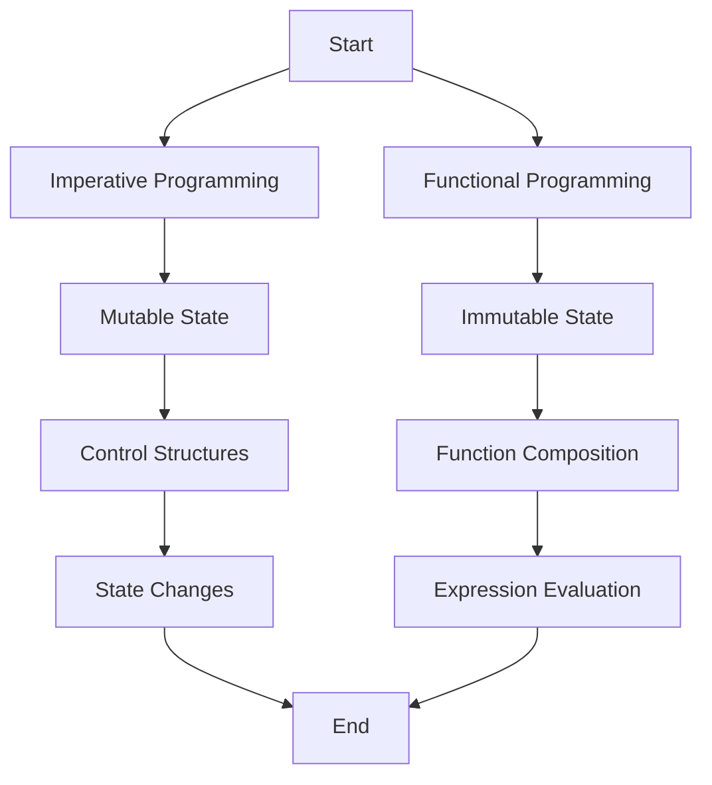

## 1.2 Imperative vs. Functional Programming

In the world of software development, programming paradigms provide frameworks for thinking about and solving problems. Two of the most prominent paradigms are imperative programming and functional programming. Each offers a distinct approach to building applications, with unique advantages and challenges. In this section, we will explore the conceptual differences between these paradigms, focusing on state management, control flow, and immutability. We'll also provide side-by-side code examples in Java and Clojure to illustrate these concepts, and analyze the pros and cons of each approach.

### Conceptual Differences

At the core of imperative programming is the idea of state and control flow. Imperative programming is about giving the computer a sequence of tasks to perform. This paradigm is characterized by statements that change a program's state, often using loops, conditionals, and variables. In contrast, functional programming is centered around expressions and immutability. It emphasizes the evaluation of functions and avoids changing state or mutable data.

#### State Management

**Imperative Programming:**

In imperative programming, state is typically managed through variables that can be modified. This mutable state is often manipulated through control structures such as loops and conditionals. For example, in Java, we might use a loop to iterate over a list and modify its elements:

```java
// Java: Imperative approach to sum a list of numbers
int sum = 0;
List<Integer> numbers = Arrays.asList(1, 2, 3, 4, 5);
for (int number : numbers) {
    sum += number; // Mutating the state of 'sum'
}
System.out.println("Sum: " + sum);
```

In this example, the state of the variable `sum` changes as we iterate over the list.

**Functional Programming:**

Functional programming, on the other hand, manages state through immutable data structures. Instead of modifying variables, new values are created as the result of function evaluations. This immutability is a cornerstone of functional programming, as it leads to more predictable and easier-to-reason-about code.

```clojure
;; Clojure: Functional approach to sum a list of numbers
(def numbers [1 2 3 4 5])
(def sum (reduce + numbers)) ; Using reduce to calculate the sum
(println "Sum:" sum)
```

In Clojure, the `reduce` function is used to compute the sum without mutating any state. The `numbers` vector remains unchanged, and `sum` is a new value derived from the function application.

### Code Examples

Let's explore a more complex example to see how both paradigms handle a common programming task: filtering and transforming a list of numbers.

**Imperative Approach (Java):**

```java
// Java: Imperative approach to filter and transform a list
List<Integer> numbers = Arrays.asList(1, 2, 3, 4, 5);
List<Integer> result = new ArrayList<>();
for (int number : numbers) {
    if (number % 2 == 0) { // Filtering even numbers
        result.add(number * 2); // Transforming by doubling
    }
}
System.out.println("Result: " + result);
```

In this Java example, we use a loop to filter even numbers and double them, storing the results in a new list. The state of `result` changes with each iteration.

**Functional Approach (Clojure):**

```clojure
;; Clojure: Functional approach to filter and transform a list
(def numbers [1 2 3 4 5])
(def result (->> numbers
                 (filter even?) ; Filtering even numbers
                 (map #(* 2 %)))) ; Transforming by doubling
(println "Result:" result)
```

In Clojure, we use the `filter` and `map` functions to achieve the same result. The `->>` threading macro helps to compose these functions cleanly, maintaining immutability throughout.

### Pros and Cons

#### Imperative Programming

**Pros:**

- **Familiarity**: Many developers are trained in imperative languages like Java and C++, making it a familiar paradigm.
- **Performance**: Direct manipulation of state can lead to performance optimizations in certain scenarios.
- **Control**: Offers fine-grained control over program execution, which can be beneficial in low-level programming tasks.

**Cons:**

- **Complexity**: Managing mutable state can lead to complex and error-prone code, especially in large systems.
- **Concurrency Challenges**: Mutable state is difficult to manage in concurrent environments, leading to potential race conditions and bugs.
- **Testing Difficulty**: Functions with side effects are harder to test and reason about.

#### Functional Programming

**Pros:**

- **Immutability**: Leads to more predictable and easier-to-debug code, as data does not change unexpectedly.
- **Concurrency**: Naturally suited for concurrent and parallel programming, as immutable data structures eliminate race conditions.
- **Modularity**: Encourages the creation of small, reusable functions, leading to more modular codebases.

**Cons:**

- **Learning Curve**: Requires a shift in mindset for developers accustomed to imperative programming.
- **Performance Overhead**: Immutable data structures can introduce performance overhead, although modern functional languages optimize for this.
- **Tooling and Ecosystem**: While growing, the ecosystem for functional languages is not as mature as that for imperative languages like Java.

### Visual Aids

To better understand the differences between imperative and functional programming, let's visualize how state is managed in both paradigms.



**Diagram Description:** This flowchart illustrates the key differences in state management between imperative and functional programming. Imperative programming focuses on mutable state and control structures, while functional programming emphasizes immutable state and function composition.

### Try It Yourself

Experiment with the provided code examples by modifying the conditions and transformations. For instance, try filtering odd numbers or applying a different transformation, such as squaring the numbers. Observe how these changes are made in both paradigms and consider the implications on state management and code readability.

### References and Links

- [Clojure Official Documentation](https://clojure.org/reference)
- [Transitioning from OOP to Functional Programming](https://www.lispcast.com/oo-to-fp/)
- [Java to Clojure: A Guide for Java Developers](https://clojure.org/guides/java_interop)

### Knowledge Check

To reinforce your understanding, consider the following questions and exercises:

1. What are the main differences between mutable and immutable state?
2. How does immutability affect concurrency in functional programming?
3. Rewrite the imperative code example to use a different transformation, such as squaring the numbers.
4. Discuss the pros and cons of using functional programming in a large-scale enterprise application.

## **Test Your Knowledge: Imperative vs. Functional Programming Quiz**



### What is a key characteristic of imperative programming?

- [x] Mutable state
- [ ] Immutable data
- [ ] Function composition
- [ ] Expression evaluation

> **Explanation:** Imperative programming often involves managing mutable state through variables and control structures.

### How does functional programming handle state?

- [ ] Through mutable variables
- [x] With immutable data structures
- [ ] By using loops
- [ ] Through direct memory manipulation

> **Explanation:** Functional programming emphasizes immutability, using data structures that do not change state.

### Which of the following is a benefit of functional programming?

- [x] Easier concurrency
- [ ] Complex state management
- [ ] Direct hardware access
- [ ] Low-level memory control

> **Explanation:** Functional programming's immutability makes it naturally suited for concurrent programming, avoiding race conditions.

### What is a common challenge when transitioning from imperative to functional programming?

- [ ] Access to libraries
- [x] Shift in mindset
- [ ] Lack of performance
- [ ] Limited language support

> **Explanation:** Developers often need to adjust their thinking from managing state imperatively to composing functions and working with immutable data.

### Which language feature is commonly associated with functional programming?

- [x] Higher-order functions
- [ ] Class inheritance
- [ ] Object encapsulation
- [ ] Loop constructs

> **Explanation:** Higher-order functions, which can take other functions as arguments or return them, are a hallmark of functional programming.

### How does imperative programming typically manage control flow?

- [x] Using loops and conditionals
- [ ] Through function composition
- [ ] By chaining expressions
- [ ] Using immutable data

> **Explanation:** Imperative programming relies on loops and conditionals to manage control flow and execute tasks sequentially.

### What is a disadvantage of using mutable state in imperative programming?

- [x] Increased complexity in concurrent environments
- [ ] Easier debugging
- [ ] Simplified code reasoning
- [ ] Enhanced modularity

> **Explanation:** Mutable state can lead to complex and error-prone code, especially in concurrent environments where race conditions may occur.

### How can functional programming improve code testability?

- [x] By avoiding side effects
- [ ] Through mutable variables
- [ ] By using direct state manipulation
- [ ] Through low-level optimizations

> **Explanation:** Functional programming's emphasis on pure functions and avoiding side effects leads to more predictable and testable code.

### Which of the following is a common tool in functional programming for data transformation?

- [x] Map and filter functions
- [ ] For loops
- [ ] Switch statements
- [ ] Direct memory access

> **Explanation:** Functional programming often uses map and filter functions to transform data without changing state.

### True or False: Functional programming languages cannot perform I/O operations.

- [ ] True
- [x] False

> **Explanation:** Functional programming languages can perform I/O operations, but they often isolate side effects to maintain purity in the rest of the code.



By understanding the differences between imperative and functional programming, you'll be better equipped to choose the right paradigm for your projects and leverage the strengths of each approach. Embrace the journey of learning functional programming, and you'll discover new ways to write clean, efficient, and scalable code.
