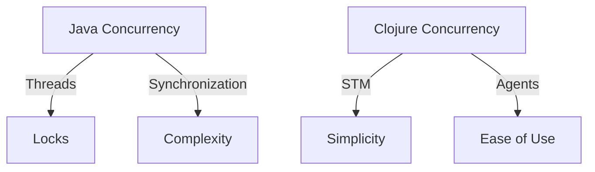

## 1.3 Benefits of Functional Programming

Functional programming (FP) offers a paradigm shift from traditional imperative programming, providing a host of benefits that enhance code quality, maintainability, and scalability. In this section, we'll explore the core benefits of functional programming, particularly in the context of Clojure, a modern Lisp dialect that excels in functional programming. We'll delve into immutability, referential transparency, concurrency, and modularity, and illustrate these concepts with clear examples and comparisons to Java's object-oriented programming (OOP) model.

### Immutability Advantages

Immutability is a cornerstone of functional programming. It refers to the idea that once a data structure is created, it cannot be altered. This concept contrasts sharply with the mutable state found in traditional OOP languages like Java, where objects can be changed after creation.

#### Reducing Bugs with Immutable Data Structures

In OOP, mutable state can lead to complex bugs, especially in concurrent environments where multiple threads may access and modify shared data. Immutability eliminates these issues by ensuring that data cannot be changed once created, leading to more predictable and reliable code.

**Example: Immutable Data Structures in Clojure**

```clojure
;; Defining an immutable vector in Clojure
(def my-vector [1 2 3])

;; Attempting to "modify" the vector creates a new vector
(def new-vector (conj my-vector 4))

;; my-vector remains unchanged
(println my-vector) ; Output: [1 2 3]
(println new-vector) ; Output: [1 2 3 4]
```

In this example, `my-vector` remains unchanged after adding an element, demonstrating how immutability prevents unintended side effects.

#### Concurrency and Immutability

Immutability simplifies concurrent programming by eliminating the need for locks or other synchronization mechanisms. Since data cannot change, there's no risk of race conditions or data corruption.

**Java vs. Clojure: Concurrency**

In Java, managing concurrency often involves complex synchronization:

```java
// Java example with synchronized block
public synchronized void addElement(List<Integer> list, int element) {
    list.add(element);
}
```

In contrast, Clojure's immutable data structures inherently support safe concurrent access:

```clojure
;; Clojure example with immutable data
(defn add-element [vec element]
  (conj vec element))
```

### Referential Transparency

Referential transparency is a property of pure functions, which always produce the same output given the same input, without side effects. This predictability simplifies reasoning about code and enhances testability.

#### Easier Reasoning and Testing

With referential transparency, we can replace a function call with its result without affecting the program's behavior. This property allows developers to reason about code more easily and facilitates automated testing.

**Example: Pure Functions in Clojure**

```clojure
;; A pure function in Clojure
(defn add [x y]
  (+ x y))

;; Referential transparency allows substitution
(println (add 2 3)) ; Output: 5
```

In this example, the `add` function is pure and referentially transparent, enabling straightforward testing and reasoning.

#### Testing with Referential Transparency

Testing pure functions is straightforward because they don't rely on external state or produce side effects. This allows for isolated unit tests that are easy to write and maintain.

**Try It Yourself**

Experiment with the `add` function by changing the inputs and observing the consistent outputs. Consider writing a test case to verify its behavior.

### Concurrency and Parallelism

Functional programming's emphasis on immutability and pure functions makes it well-suited for concurrent and parallel programming. By avoiding mutable state, FP languages like Clojure simplify the process of writing safe and efficient concurrent code.

#### Simplifying Concurrent Code

In functional programming, concurrent code is often easier to write and understand because functions don't have side effects, and data is immutable. This reduces the complexity associated with managing shared state.

**Example: Parallel Processing in Clojure**

```clojure
;; Using Clojure's pmap for parallel processing
(defn square [x] (* x x))

(def numbers (range 1 10))

;; Process numbers in parallel
(def squared-numbers (pmap square numbers))

(println squared-numbers)
```

In this example, `pmap` is used to apply the `square` function to each element of `numbers` in parallel, illustrating how Clojure simplifies parallel processing.

#### Java vs. Clojure: Concurrency Models

Java's concurrency model relies heavily on threads and locks, which can be error-prone and difficult to manage. Clojure, on the other hand, provides higher-level abstractions like software transactional memory (STM) and agents, which simplify concurrent programming.

**Mermaid Diagram: Concurrency Models Comparison**



*Diagram: Comparison of Java and Clojure concurrency models, highlighting the simplicity of Clojure's approach.*

### Modularity and Reusability

Functional programming encourages modularity and reusability through the use of higher-order functions and function composition. These features allow developers to build small, reusable components that can be combined to create complex systems.

#### Higher-Order Functions

Higher-order functions are functions that take other functions as arguments or return them as results. They enable powerful abstractions and code reuse.

**Example: Using Higher-Order Functions in Clojure**

```clojure
;; A higher-order function that applies a function to each element of a collection
(defn apply-to-all [f coll]
  (map f coll))

;; Example usage
(def numbers [1 2 3 4 5])
(def doubled (apply-to-all #(* 2 %) numbers))

(println doubled) ; Output: (2 4 6 8 10)
```

In this example, `apply-to-all` is a higher-order function that applies any given function `f` to each element of `coll`, demonstrating code reuse.

#### Function Composition

Function composition allows developers to build complex operations by combining simple functions. This leads to more readable and maintainable code.

**Example: Function Composition in Clojure**

```clojure
;; Composing functions in Clojure
(defn add-one [x] (+ x 1))
(defn square [x] (* x x))

;; Compose functions to create a new function
(def add-one-and-square (comp square add-one))

(println (add-one-and-square 2)) ; Output: 9
```

Here, `add-one-and-square` is a composed function that first adds one to its input and then squares the result, illustrating how function composition enhances modularity.

### Knowledge Check

To reinforce your understanding of the benefits of functional programming, consider the following questions:

- How does immutability reduce bugs in concurrent programs?
- What is referential transparency, and why is it beneficial for testing?
- How does functional programming simplify concurrent and parallel code?
- What are higher-order functions, and how do they enhance code reuse?

### Test Your Knowledge: Benefits of Functional Programming Quiz



### How does immutability help in concurrent programming?

- [x] It eliminates the need for locks and synchronization.
- [ ] It allows for mutable state changes.
- [ ] It increases the complexity of code.
- [ ] It requires more memory usage.

> **Explanation:** Immutability ensures that data cannot change, eliminating race conditions and the need for locks.

### What is a pure function?

- [x] A function that always produces the same output for the same input.
- [ ] A function that modifies global state.
- [ ] A function that relies on external variables.
- [ ] A function that performs I/O operations.

> **Explanation:** Pure functions are deterministic and have no side effects, making them predictable and testable.

### What is referential transparency?

- [x] The ability to replace a function call with its result without changing program behavior.
- [ ] The ability to modify data in place.
- [ ] The ability to perform side effects.
- [ ] The ability to use global variables.

> **Explanation:** Referential transparency allows for easier reasoning and testing by ensuring consistent function behavior.

### How do higher-order functions enhance code reuse?

- [x] By allowing functions to be passed as arguments or returned as results.
- [ ] By modifying the global state.
- [ ] By performing I/O operations.
- [ ] By increasing code complexity.

> **Explanation:** Higher-order functions enable powerful abstractions and code reuse by treating functions as first-class citizens.

### What is the benefit of function composition?

- [x] It allows building complex operations from simple functions.
- [ ] It increases code duplication.
- [ ] It requires more memory.
- [ ] It makes code less readable.

> **Explanation:** Function composition enhances modularity and readability by combining simple functions into complex operations.

### How does functional programming simplify parallel processing?

- [x] By using immutable data structures.
- [ ] By allowing mutable state changes.
- [ ] By increasing code complexity.
- [ ] By requiring more synchronization.

> **Explanation:** Immutable data structures ensure safe concurrent access, simplifying parallel processing.

### What is the role of software transactional memory (STM) in Clojure?

- [x] To provide a high-level abstraction for managing shared state.
- [ ] To increase the complexity of concurrency.
- [ ] To allow direct manipulation of global variables.
- [ ] To perform I/O operations.

> **Explanation:** STM simplifies concurrent programming by managing shared state without locks.

### How does Clojure's approach to concurrency differ from Java's?

- [x] Clojure uses STM and agents for simplicity.
- [ ] Clojure relies heavily on threads and locks.
- [ ] Clojure requires more synchronization.
- [ ] Clojure uses mutable state.

> **Explanation:** Clojure provides higher-level abstractions like STM and agents, simplifying concurrency.

### What is the advantage of using immutable data structures?

- [x] They prevent unintended side effects and race conditions.
- [ ] They allow for mutable state changes.
- [ ] They increase code complexity.
- [ ] They require more memory.

> **Explanation:** Immutable data structures ensure data consistency and safety in concurrent environments.

### True or False: Function composition reduces code readability.

- [ ] True
- [x] False

> **Explanation:** Function composition enhances readability by creating complex operations from simple, understandable functions.



By embracing the benefits of functional programming, developers can create code that is more reliable, maintainable, and scalable. As we continue to explore Clojure's features, you'll see how these principles are applied to build robust applications. For further reading, consider exploring the [Clojure Official Documentation](https://clojure.org/reference) and [Clojure Community Resources](https://clojure.org/community/resources).
