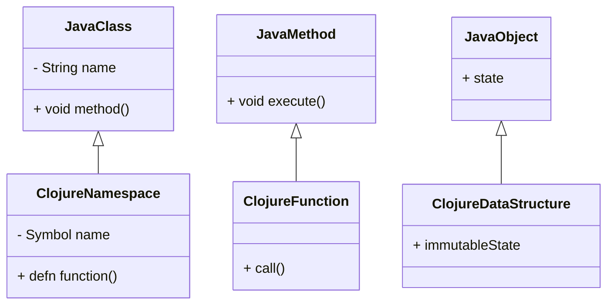

## 1.4 Overview of the Clojure Language

### **Clojure's Origins**

Clojure is a dynamic, general-purpose programming language that combines the interactive development and expressiveness of Lisp with the robust infrastructure and performance of the Java Virtual Machine (JVM). Created by Rich Hickey in 2007, Clojure was designed to address the complexities of modern software development, particularly in the areas of concurrency and data immutability. As a Lisp dialect, Clojure inherits the parenthesis-heavy syntax and the powerful macro system of Lisp, while also introducing features that make it particularly well-suited for functional programming.

Rich Hickey's vision for Clojure was to create a language that could leverage the vast ecosystem of Java libraries while providing a more functional approach to programming. This vision is realized through Clojure's seamless interoperability with Java, allowing developers to call Java methods and use Java libraries directly from Clojure code.

### **Key Features of Clojure**

#### **Immutability**

One of the cornerstone features of Clojure is its emphasis on immutability. In Clojure, data structures are immutable by default, meaning that once a data structure is created, it cannot be modified. Instead of changing the original data structure, Clojure provides functions that return new data structures with the desired changes. This immutability simplifies reasoning about code, particularly in concurrent and parallel programming contexts, as it eliminates the risk of shared mutable state.

```clojure
;; Example of immutability in Clojure
(def original-list [1 2 3])
(def new-list (conj original-list 4))

;; original-list remains unchanged
(println original-list) ; Output: [1 2 3]
(println new-list) ; Output: [1 2 3 4]
```

#### **First-Class Functions**

Clojure treats functions as first-class citizens, meaning they can be passed as arguments to other functions, returned as values from functions, and assigned to variables. This capability is fundamental to functional programming and enables powerful abstractions and code reuse.

```clojure
;; Example of first-class functions
(defn apply-twice [f x]
  (f (f x)))

(defn increment [n]
  (+ n 1))

(println (apply-twice increment 5)) ; Output: 7
```

#### **Seamless Java Interoperability**

Clojure's ability to interoperate seamlessly with Java is one of its most significant advantages. This interoperability allows developers to use existing Java libraries and frameworks within Clojure applications, providing access to a vast array of tools and resources.

```clojure
;; Example of Java interoperability
(import 'java.util.Date)

(defn current-date []
  (Date.))

(println (current-date)) ; Output: Current date and time
```

#### **Concurrency Support**

Clojure provides several concurrency primitives, such as atoms, refs, agents, and software transactional memory (STM), which simplify the management of state in concurrent applications. These primitives help developers write safe and efficient concurrent code by abstracting away the complexities of thread management.

```clojure
;; Example of using atoms for concurrency
(def counter (atom 0))

(defn increment-counter []
  (swap! counter inc))

(increment-counter)
(println @counter) ; Output: 1
```

### **Clojure Ecosystem**

The Clojure ecosystem is rich and continually growing, offering a wide range of libraries, tools, and community resources. Here are some key components of the Clojure ecosystem:

#### **Libraries**

Clojure boasts a robust set of libraries for various tasks, from web development to data analysis. Some popular libraries include:

- **Ring**: A library for building web applications.
- **Compojure**: A routing library for Ring applications.
- **Reagent**: A ClojureScript interface to React.
- **core.async**: A library for asynchronous programming using channels.

#### **Tooling**

Clojure development is supported by powerful tools that enhance productivity and streamline workflows:

- **Leiningen**: A build automation tool for Clojure projects.
- **CIDER**: An interactive development environment for Clojure, integrated with Emacs.
- **REPL**: The Read-Eval-Print Loop, an interactive programming environment that allows for rapid experimentation and feedback.

#### **Community Resources**

The Clojure community is vibrant and supportive, with numerous resources available for learning and collaboration:

- **ClojureDocs**: A community-driven documentation website.
- **ClojureVerse**: A forum for discussing Clojure-related topics.
- **Clojure Conj**: An annual conference dedicated to Clojure and its ecosystem.

### **Hello World Example**

To get a taste of Clojure's syntax and simplicity, let's walk through a basic "Hello World" program.

```clojure
;; Hello World in Clojure
(defn hello-world []
  (println "Hello, World!"))

(hello-world)
```

In this example, we define a function `hello-world` that prints "Hello, World!" to the console. This simple program demonstrates Clojure's concise syntax and the use of functions to encapsulate behavior.

### **Try It Yourself**

To experiment with the "Hello World" example, try modifying the function to print a personalized greeting. For instance, change the string to "Hello, [Your Name]!" and see the output.

### **Visual Aids**

To visualize how Clojure maps to Java concepts, consider the following diagram:



**Diagram Explanation:** This diagram illustrates how Java classes, methods, and objects correspond to Clojure namespaces, functions, and data structures. Note the emphasis on immutability in Clojure, which contrasts with the mutable state in Java objects.

### **References and Links**

For further reading and exploration, consider the following resources:

- [Clojure Official Documentation](https://clojure.org/reference)
- [Clojure Community Resources](https://clojure.org/community/resources)
- [Transitioning from OOP to Functional Programming](https://www.lispcast.com/oo-to-fp/)

### **Knowledge Check**

To reinforce your understanding of Clojure, consider the following questions:

- What are the key features of Clojure that differentiate it from other JVM languages?
- How does Clojure's immutability benefit concurrent programming?
- In what ways can Clojure interoperate with Java?
- What are some popular libraries and tools in the Clojure ecosystem?

### **Exercises**

1. Modify the "Hello World" example to include a function that takes a name as an argument and prints a personalized greeting.
2. Explore the Clojure REPL by running simple arithmetic operations and experimenting with function definitions.
3. Create a small Clojure program that uses a Java library of your choice.

### **Summary**

In this section, we've explored the origins, key features, and ecosystem of Clojure, a modern Lisp dialect for the JVM. We've seen how Clojure's emphasis on immutability, first-class functions, and Java interoperability make it a powerful tool for functional programming. By understanding these core concepts and experimenting with Clojure's syntax, you're well on your way to mastering functional programming with Clojure.

## **Test Your Knowledge: Overview of the Clojure Language Quiz**



### What is one of the key features of Clojure that aids in concurrent programming?

- [x] Immutability
- [ ] Mutable state
- [ ] Object-oriented design
- [ ] Dynamic typing

> **Explanation:** Immutability in Clojure ensures that data cannot be changed once created, which simplifies reasoning about code in concurrent environments.

### Who created Clojure?

- [x] Rich Hickey
- [ ] James Gosling
- [ ] Guido van Rossum
- [ ] Bjarne Stroustrup

> **Explanation:** Rich Hickey is the creator of Clojure, a modern Lisp for the JVM.

### How does Clojure achieve seamless interoperability with Java?

- [x] By allowing direct use of Java libraries and methods
- [ ] By converting Java code to Clojure code
- [ ] By using a separate interoperability framework
- [ ] By restricting Java usage

> **Explanation:** Clojure can directly use Java libraries and methods, leveraging the JVM's capabilities.

### What is the role of the REPL in Clojure development?

- [x] It provides an interactive programming environment
- [ ] It compiles Clojure code to Java bytecode
- [ ] It manages dependencies
- [ ] It handles error logging

> **Explanation:** The REPL (Read-Eval-Print Loop) allows developers to interactively test and debug Clojure code.

### Which of the following is a popular Clojure library for web development?

- [x] Ring
- [ ] NumPy
- [ ] Django
- [ ] Spring

> **Explanation:** Ring is a popular Clojure library for building web applications.

### What is a first-class function in Clojure?

- [x] A function that can be passed as an argument, returned as a value, and assigned to variables
- [ ] A function that is defined at the top level of a namespace
- [ ] A function that only operates on primitive data types
- [ ] A function that cannot be modified

> **Explanation:** In Clojure, functions are first-class citizens, meaning they can be passed around and manipulated like any other data type.

### What is the purpose of software transactional memory (STM) in Clojure?

- [x] To manage state changes in concurrent applications
- [ ] To optimize memory usage
- [ ] To convert Clojure code to Java
- [ ] To handle exceptions

> **Explanation:** STM in Clojure helps manage state changes safely in concurrent applications.

### What distinguishes Clojure's data structures from those in Java?

- [x] They are immutable by default
- [ ] They are mutable by default
- [ ] They are stored on the heap
- [ ] They use pointers

> **Explanation:** Clojure's data structures are immutable by default, unlike Java's mutable data structures.

### What is the primary advantage of using Clojure for JVM-based applications?

- [x] Access to Java libraries and performance
- [ ] Easier syntax than Java
- [ ] Faster compilation times
- [ ] Built-in GUI support

> **Explanation:** Clojure's interoperability with Java allows developers to leverage existing Java libraries and the JVM's performance.

### True or False: Clojure is a statically typed language.

- [ ] True
- [x] False

> **Explanation:** Clojure is a dynamically typed language, allowing for more flexibility in code but requiring careful handling of types.


