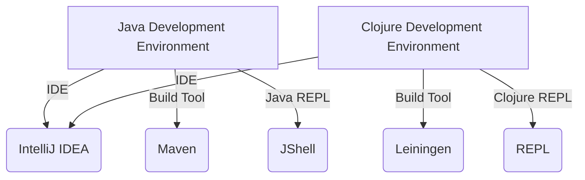

## 1.5 Setting Up the Clojure Development Environment

Embarking on your journey with Clojure requires a well-prepared development environment. This section will guide you through the installation of Clojure on various operating systems, introduce you to essential development tools, and walk you through your first REPL (Read-Eval-Print Loop) session. Let's dive in and set the stage for mastering functional programming with Clojure.

### Installing Clojure

Clojure runs on the Java Virtual Machine (JVM), making it highly portable across different operating systems. We'll cover the installation process for Windows, macOS, and Linux.

#### Installing Clojure on Windows

1. **Install Java**: Clojure requires Java. Download and install the latest version of the Java Development Kit (JDK) from [Oracle](https://www.oracle.com/java/technologies/javase-jdk11-downloads.html) or use [AdoptOpenJDK](https://adoptopenjdk.net/).

2. **Install Clojure CLI Tools**:
   - Download the Windows installer from the [Clojure website](https://clojure.org/guides/getting_started).
   - Run the installer and follow the instructions to complete the installation.

3. **Verify Installation**:
   - Open a command prompt and run:
     ```shell
     clj -M -e "(println \"Clojure installed successfully!\")"
     ```
   - If you see the message, Clojure is installed correctly.

#### Installing Clojure on macOS

1. **Install Homebrew**: If you haven't already, install Homebrew by following instructions on [brew.sh](https://brew.sh/).

2. **Install Java**: Use Homebrew to install Java:
   ```shell
   brew install openjdk
   ```

3. **Install Clojure CLI Tools**:
   ```shell
   brew install clojure/tools/clojure
   ```

4. **Verify Installation**:
   - Open Terminal and run:
     ```shell
     clj -M -e "(println \"Clojure installed successfully!\")"
     ```

#### Installing Clojure on Linux

1. **Install Java**: Use your package manager to install Java. For example, on Ubuntu:
   ```shell
   sudo apt update
   sudo apt install openjdk-11-jdk
   ```

2. **Install Clojure CLI Tools**:
   - Follow the instructions on the [Clojure installation page](https://clojure.org/guides/getting_started) to download and run the installation script.

3. **Verify Installation**:
   - Open a terminal and run:
     ```shell
     clj -M -e "(println \"Clojure installed successfully!\")"
     ```

### Development Tools

Choosing the right development tools can significantly enhance your productivity. Let's explore some popular editors and IDEs for Clojure development.

#### Cursive for IntelliJ IDEA

[Cursive](https://cursive-ide.com/) is a powerful plugin for IntelliJ IDEA, offering robust support for Clojure development.

- **Installation**: 
  - Install IntelliJ IDEA from [JetBrains](https://www.jetbrains.com/idea/).
  - Open IntelliJ IDEA, navigate to `Plugins`, search for "Cursive", and install it.

- **Features**:
  - Advanced code completion and navigation.
  - Integrated REPL support.
  - Seamless Leiningen and deps.edn project management.

#### Emacs with CIDER

[Emacs](https://www.gnu.org/software/emacs/) with [CIDER](https://docs.cider.mx/cider/) is a popular choice for developers who prefer a highly customizable editor.

- **Installation**:
  - Install Emacs using your package manager or download it from the [GNU Emacs website](https://www.gnu.org/software/emacs/download.html).
  - Add CIDER to your Emacs configuration:
    ```emacs-lisp
    (require 'package)
    (add-to-list 'package-archives '("melpa" . "https://melpa.org/packages/"))
    (package-initialize)
    (package-refresh-contents)
    (package-install 'cider)
    ```

- **Features**:
  - Interactive REPL integration.
  - Debugging and profiling tools.
  - Rich editing capabilities with Paredit and Rainbow Delimiters.

### Leiningen and deps.edn

Managing Clojure projects efficiently is crucial. Let's look at two popular tools: Leiningen and the Clojure CLI tools with `deps.edn`.

#### Leiningen

[Leiningen](https://leiningen.org/) is a build automation tool for Clojure, similar to Maven for Java.

- **Installation**:
  - Download the `lein` script from the [Leiningen website](https://leiningen.org/) and place it in your `PATH`.

- **Creating a New Project**:
  ```shell
  lein new app my-clojure-app
  cd my-clojure-app
  ```

- **Running the Project**:
  ```shell
  lein run
  ```

- **Managing Dependencies**: Add dependencies in the `project.clj` file.

#### Clojure CLI Tools and deps.edn

The Clojure CLI tools provide a lightweight alternative to Leiningen, using the `deps.edn` file for dependency management.

- **Creating a New Project**:
  ```shell
  mkdir my-clojure-app
  cd my-clojure-app
  echo '{:deps {org.clojure/clojure {:mvn/version "1.10.3"}}}' > deps.edn
  ```

- **Running the Project**:
  ```shell
  clj -M -m my-clojure-app.core
  ```

- **Managing Dependencies**: Edit the `deps.edn` file to add or update dependencies.

### First REPL Session

The REPL is a cornerstone of Clojure development, allowing for interactive coding and immediate feedback.

#### Starting a REPL

1. **Using Leiningen**:
   - Navigate to your project directory and run:
     ```shell
     lein repl
     ```

2. **Using Clojure CLI Tools**:
   - Simply run:
     ```shell
     clj
     ```

#### Running Simple Expressions

Once the REPL is running, you can start evaluating expressions.

- **Basic Arithmetic**:
  ```clojure
  (+ 1 2 3) ; => 6
  ```

- **Defining a Function**:
  ```clojure
  (defn greet [name]
    (str "Hello, " name "!"))

  (greet "Clojure") ; => "Hello, Clojure!"
  ```

- **Using Data Structures**:
  ```clojure
  (def fruits ["apple" "banana" "cherry"])
  (count fruits) ; => 3
  ```

### Try It Yourself

Experiment with the REPL by modifying the examples above. Try adding new functions, manipulating data structures, or exploring Clojure's rich set of core functions.

### Visual Aids

To better understand the setup process, let's look at a diagram comparing Java and Clojure development environments:



**Diagram Explanation**: This diagram illustrates the parallel between Java and Clojure environments, highlighting IntelliJ IDEA as a common IDE, with Maven and Leiningen serving similar roles as build tools, and JShell and the Clojure REPL providing interactive environments.

### References and Links

- [Clojure Official Documentation](https://clojure.org/reference)
- [Clojure Community Resources](https://clojure.org/community/resources)
- [Transitioning from OOP to Functional Programming](https://www.lispcast.com/oo-to-fp/)
- [Cursive for IntelliJ IDEA](https://cursive-ide.com/)
- [Emacs with CIDER](https://docs.cider.mx/cider/)
- [Leiningen](https://leiningen.org/)

### Knowledge Check

To ensure you've understood the key concepts, consider the following questions:

1. What are the steps to install Clojure on a macOS system?
2. How does Leiningen compare to Maven in terms of functionality?
3. What is the purpose of the `deps.edn` file in Clojure projects?
4. How can you start a REPL session using Clojure CLI tools?
5. What are some benefits of using a REPL in Clojure development?

### Exercises

1. **Install Clojure**: Follow the installation instructions for your operating system and verify your setup by running a simple Clojure expression in the REPL.

2. **Set Up a Project**: Create a new Clojure project using both Leiningen and the Clojure CLI tools. Compare the project structures and configuration files.

3. **Explore the REPL**: Write a few functions in the REPL, experiment with different data structures, and explore Clojure's core library functions.

### Summary

Setting up a Clojure development environment involves installing the necessary tools, choosing the right editor or IDE, and familiarizing yourself with project management tools like Leiningen and deps.edn. The REPL is an invaluable tool for interactive development, allowing you to test and refine your code in real-time.

---

## **Test Your Knowledge: Setting Up the Clojure Development Environment Quiz**



### What is the first step in setting up Clojure on Windows?

- [x] Install Java
- [ ] Install Clojure CLI tools
- [ ] Install Leiningen
- [ ] Install IntelliJ IDEA

> **Explanation:** Clojure runs on the JVM, so installing Java is the first step.

### Which tool is used for project management in Clojure?

- [x] Leiningen
- [x] Clojure CLI tools
- [ ] Maven
- [ ] Gradle

> **Explanation:** Both Leiningen and Clojure CLI tools are used for managing Clojure projects.

### How do you start a REPL session using Leiningen?

- [x] Run `lein repl`
- [ ] Run `clj`
- [ ] Run `java -jar`
- [ ] Run `lein run`

> **Explanation:** `lein repl` starts a REPL session in a Leiningen-managed project.

### What file is used for dependency management with Clojure CLI tools?

- [x] deps.edn
- [ ] project.clj
- [ ] pom.xml
- [ ] build.gradle

> **Explanation:** `deps.edn` is used for dependency management with Clojure CLI tools.

### Which editor is known for its powerful Clojure support as a plugin for IntelliJ IDEA?

- [x] Cursive
- [ ] Emacs
- [ ] Eclipse
- [ ] Visual Studio Code

> **Explanation:** Cursive is a plugin for IntelliJ IDEA that provides robust Clojure support.

### What is the purpose of the REPL in Clojure development?

- [x] To provide an interactive coding environment
- [ ] To compile Clojure code
- [ ] To manage dependencies
- [ ] To run tests

> **Explanation:** The REPL allows for interactive coding and immediate feedback.

### Which tool can be used with Emacs for Clojure development?

- [x] CIDER
- [ ] Eclipse
- [ ] Visual Studio Code
- [ ] NetBeans

> **Explanation:** CIDER is a popular choice for Clojure development in Emacs.

### What is the equivalent of Maven's `pom.xml` in Leiningen?

- [x] project.clj
- [ ] deps.edn
- [ ] build.gradle
- [ ] settings.xml

> **Explanation:** `project.clj` is used in Leiningen for project configuration.

### True or False: Clojure can only be run on Linux systems.

- [ ] True
- [x] False

> **Explanation:** Clojure is cross-platform and can run on Windows, macOS, and Linux.

### What command installs Clojure CLI tools on macOS using Homebrew?

- [x] brew install clojure/tools/clojure
- [ ] brew install clojure
- [ ] brew install leiningen
- [ ] brew install java

> **Explanation:** The command `brew install clojure/tools/clojure` installs the Clojure CLI tools on macOS.




