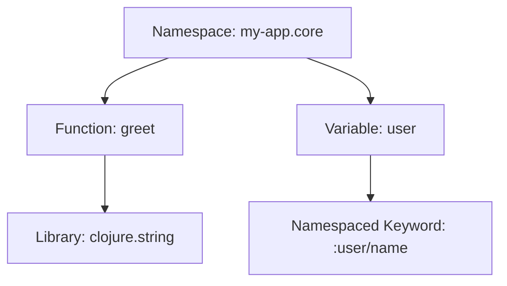

## 1.6 Namespaced Keywords and Symbolic Programming

In this section, we delve into the concepts of namespaced keywords and symbolic programming in Clojure. These features are integral to writing clear, maintainable, and scalable code. We will explore how Clojure's approach to keywords and symbolic programming can enhance your functional programming toolkit, especially if you're transitioning from a Java OOP background.

### Understanding Keywords

Keywords in Clojure are unique identifiers that are often used as keys in maps or to represent constant values. They are immutable and self-evaluating, meaning they evaluate to themselves. This makes them extremely useful for data structures where you need consistent keys.

#### Defining and Using Keywords

In Clojure, a keyword is defined by a colon followed by a name, like `:keyword`. They are often used in maps to provide a clear and concise way to reference values.

```clojure
(def person {:name "Alice"
             :age 30
             :occupation "Engineer"})

;; Accessing values using keywords
(:name person)  ;; => "Alice"
(:age person)   ;; => 30
```

In this example, `:name`, `:age`, and `:occupation` are keywords used to access values in the `person` map.

#### Benefits of Using Keywords

- **Immutability**: Keywords are immutable, ensuring that their value remains constant throughout the program.
- **Self-evaluation**: Keywords evaluate to themselves, which simplifies code and reduces errors.
- **Performance**: Keywords are optimized for use as keys in maps, providing faster lookup times compared to strings.

### Namespaces in Clojure

Namespaces in Clojure are a way to organize code and prevent naming conflicts. They allow you to group related functions, variables, and definitions under a common context, similar to packages in Java.

#### Creating and Using Namespaces

To define a namespace, use the `ns` macro at the top of your Clojure file. This sets the current namespace and can include references to other namespaces.

```clojure
(ns my-app.core
  (:require [clojure.string :as str]))

(defn greet [name]
  (str/join " " ["Hello," name "!"]))

(greet "Alice")  ;; => "Hello, Alice!"
```

Here, `my-app.core` is the namespace, and we require the `clojure.string` library, aliasing it as `str`.

#### Advantages of Namespaces

- **Organization**: Group related code together, making it easier to manage.
- **Avoid Conflicts**: Prevent naming conflicts by scoping names within a namespace.
- **Code Reusability**: Easily reuse and share code across different projects.

### Namespaced Keywords

Namespaced keywords are an extension of keywords that include a namespace prefix. They provide additional context and help avoid conflicts in larger systems.

#### Defining Namespaced Keywords

A namespaced keyword includes a namespace and a name separated by a slash, like `:namespace/name`.

```clojure
(def user {:user/id 1
           :user/name "Alice"
           :user/role "admin"})

;; Accessing values using namespaced keywords
(:user/name user)  ;; => "Alice"
```

In this example, `:user/id`, `:user/name`, and `:user/role` are namespaced keywords that help distinguish user-related data.

#### Benefits of Namespaced Keywords

- **Clarity**: Provide clear context for data, making it easier to understand and maintain.
- **Conflict Avoidance**: Reduce the risk of naming conflicts in complex systems.
- **Consistency**: Ensure consistent usage of keys across different parts of an application.

### Symbolic Programming Concepts

Symbolic programming is a paradigm where code and data are treated interchangeably. In Clojure, this is achieved through its code-as-data philosophy, where code is represented as data structures.

#### Code-as-Data Philosophy

Clojure's code-as-data approach allows you to manipulate code as if it were a regular data structure. This enables powerful metaprogramming techniques like macros.

```clojure
(defn add [x y]
  (+ x y))

;; Representing the function call as data
'(add 1 2)  ;; => (add 1 2)

;; Evaluating the data as code
(eval '(add 1 2))  ;; => 3
```

In this example, the list `(add 1 2)` is both a data structure and a function call, demonstrating Clojure's symbolic programming capabilities.

#### Advantages of Symbolic Programming

- **Flexibility**: Easily manipulate and transform code at runtime.
- **Metaprogramming**: Create macros and domain-specific languages that extend the language's capabilities.
- **Expressiveness**: Write more expressive and concise code by leveraging code-as-data.

### Try It Yourself

Experiment with the following code snippets to deepen your understanding of namespaced keywords and symbolic programming:

1. Create a map with namespaced keywords and access its values.
2. Define a namespace and import a library using an alias.
3. Represent a function call as a data structure and evaluate it.

### Visual Aids

To better understand how namespaces and namespaced keywords work, consider the following diagram:



**Diagram Description**: This diagram illustrates the relationship between a namespace, functions, variables, and namespaced keywords in a Clojure application.

### References and Links

- [Clojure Official Documentation](https://clojure.org/reference)
- [Clojure Community Resources](https://clojure.org/community/resources)
- [Transitioning from OOP to Functional Programming](https://www.lispcast.com/oo-to-fp/)

### Knowledge Check

- What are the benefits of using keywords in Clojure?
- How do namespaces help organize code in Clojure?
- What are namespaced keywords, and why are they useful?
- How does Clojure's code-as-data philosophy enable symbolic programming?

### Encouraging Engagement

Embracing functional programming can be challenging, but with each step, you'll gain a deeper understanding and see tangible benefits in your codebase. Experiment with the examples provided and try creating your own to solidify your understanding.

### Formatting and Structure

- Use clear headings and subheadings to organize content.
- Break down complex information with bullet points.
- Highlight important terms or concepts using bold or italic text sparingly.

### Writing Style

- Use first-person plural (we, let's) to create a collaborative feel.
- Avoid gender-specific pronouns; use they/them or rewrite sentences to be inclusive.
- Define acronyms and abbreviations upon first use.
- Keep sentences and paragraphs concise to aid readability.

## Test Your Knowledge: Namespaced Keywords and Symbolic Programming Quiz



### What is a keyword in Clojure?

- [x] A unique identifier used often as keys in maps
- [ ] A mutable variable
- [ ] A function that evaluates to a string
- [ ] A type of loop construct

> **Explanation:** Keywords in Clojure are unique identifiers that are often used as keys in maps and are immutable.

### How do namespaces help in Clojure?

- [x] They organize code and prevent naming conflicts
- [ ] They allow mutable state
- [ ] They are used to define loops
- [ ] They replace the need for functions

> **Explanation:** Namespaces in Clojure help organize code and prevent naming conflicts by grouping related functions and definitions.

### What is a namespaced keyword?

- [x] A keyword with a namespace prefix
- [ ] A keyword that is mutable
- [ ] A function that returns a keyword
- [ ] A loop construct

> **Explanation:** Namespaced keywords include a namespace and a name, providing additional context and avoiding conflicts.

### What is symbolic programming?

- [x] A paradigm where code and data are interchangeable
- [ ] A way to define loops
- [ ] A method for creating mutable variables
- [ ] A type of error handling

> **Explanation:** Symbolic programming treats code as data, allowing manipulation and transformation at runtime.

### How does Clojure's code-as-data philosophy benefit programming?

- [x] It allows for metaprogramming and flexibility
- [ ] It requires more memory
- [ ] It makes code less readable
- [ ] It restricts the use of functions

> **Explanation:** Clojure's code-as-data philosophy enables metaprogramming, allowing for flexible and expressive code.

### What is the syntax for defining a namespaced keyword?

- [x] `:namespace/name`
- [ ] `namespace:name`
- [ ] `namespace/name`
- [ ] `:namespace-name`

> **Explanation:** A namespaced keyword is defined with a colon, followed by the namespace and name separated by a slash.

### Why are keywords considered self-evaluating?

- [x] They evaluate to themselves
- [ ] They change their value at runtime
- [ ] They require a function to evaluate
- [ ] They are mutable

> **Explanation:** Keywords in Clojure are self-evaluating, meaning they evaluate to themselves, simplifying code.

### What is the primary use of keywords in Clojure?

- [x] As keys in maps
- [ ] As loop constructs
- [ ] As mutable variables
- [ ] As error handlers

> **Explanation:** Keywords are primarily used as keys in maps due to their immutability and performance benefits.

### Can you access a map value using a namespaced keyword?

- [x] True
- [ ] False

> **Explanation:** Namespaced keywords can be used to access values in a map, providing clear context and avoiding conflicts.

### How does symbolic programming enhance expressiveness?

- [x] By allowing code to be manipulated as data
- [ ] By restricting the use of functions
- [ ] By requiring more syntax
- [ ] By limiting code flexibility

> **Explanation:** Symbolic programming enhances expressiveness by allowing code to be manipulated as data, enabling flexible and concise expressions.



---
