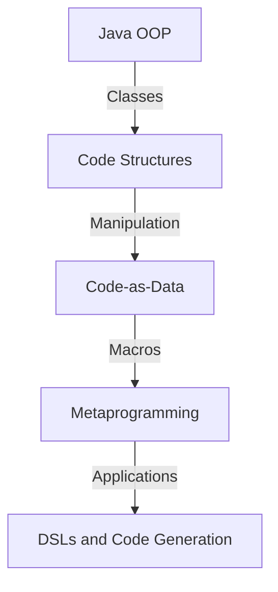

## 1.7 The Code-as-Data Philosophy in Clojure

The Code-as-Data philosophy is a core tenet of Clojure, and indeed, of all Lisp-based languages. This concept, also known as homoiconicity, allows developers to treat code as data and vice versa, providing a powerful tool for metaprogramming and dynamic code generation. In this section, we'll delve into the intricacies of this philosophy, explore its practical applications, and understand how it sets Clojure apart from other programming paradigms, especially Object-Oriented Programming (OOP) in Java.

### Homoiconicity Explained

Homoiconicity is a property of some programming languages in which the primary representation of programs is also a data structure in a primitive type of the language itself. In simpler terms, it means that code and data are interchangeable. In Clojure, and other Lisp languages, this is achieved through the use of lists, vectors, and maps.

#### Importance in Lisp Languages

Homoiconicity is significant because it allows for a high degree of flexibility and power when it comes to manipulating code. In Clojure, code is written as lists, which are the same structures used to represent data. This means that programs can be easily transformed, manipulated, and generated dynamically. This feature is not commonly found in languages like Java, where code is compiled into bytecode and is not easily manipulated at runtime.

Consider the following simple Clojure expression:

```clojure
(+ 1 2 3)
```

This expression is a list where the first element is a function (`+`) and the rest are arguments. The entire code structure can be treated as a data structure, allowing for powerful metaprogramming capabilities.

### Manipulating Code Structures

Clojure's syntax is minimal and uniform, which makes it easy to manipulate code as data. This is particularly useful in scenarios where dynamic code generation or transformation is required.

#### Lists, Vectors, and Maps

In Clojure, the primary data structures are lists, vectors, and maps, and each can be used to represent code. Here's how each can be manipulated:

- **Lists**: Used to represent function calls and expressions. They are the backbone of Clojure's syntax.
- **Vectors**: Similar to lists but optimized for random access and often used for collections of data.
- **Maps**: Key-value pairs used for associative data.

Let's see an example of manipulating a list as code:

```clojure
(def code '(+ 1 2 3))
(eval code) ; => 6
```

In this example, `code` is a list that represents a function call. By using `eval`, we can execute this list as if it were code.

#### Code Transformation

The ability to treat code as data allows for transformations that can optimize or alter the behavior of programs. For example, you can write a function that takes a piece of code and modifies it before evaluation:

```clojure
(defn transform-code [code]
  (conj code 4))

(def transformed-code (transform-code code))
(eval transformed-code) ; => 10
```

Here, `transform-code` adds an additional argument to the original code list, changing its behavior when evaluated.

### Macros Introduction

Macros are one of the most powerful features in Clojure, enabling developers to perform metaprogramming by manipulating code structures before they are compiled. They allow you to extend the language by creating new syntactic constructs.

#### How Macros Enable Metaprogramming

Macros work by taking code as input and producing new code as output. This is done at compile time, allowing for optimizations and transformations that are not possible with regular functions. Here's a simple macro example:

```clojure
(defmacro unless [condition & body]
  `(if (not ~condition)
     (do ~@body)))

(unless false
  (println "This will be printed"))
```

In this example, the `unless` macro provides a new control structure that executes the body only if the condition is false. The tilde (`~`) and at-sign (`@`) are used to splice values into the generated code.

#### Practical Applications of Macros

Macros can be used for a variety of purposes, including:

- **Creating Domain-Specific Languages (DSLs)**: Macros allow you to create custom syntaxes tailored to specific problem domains.
- **Code Generation**: Automatically generate boilerplate code, reducing redundancy and errors.
- **Optimization**: Perform compile-time optimizations that are not possible with functions.

### Practical Applications

The Code-as-Data philosophy is not just an academic concept; it has practical applications that can significantly enhance the development process.

#### Domain-Specific Languages

One of the most compelling uses of the Code-as-Data philosophy is the creation of DSLs. These are specialized languages tailored to a specific application domain. Using macros and the ability to manipulate code as data, developers can create expressive and concise DSLs that simplify complex tasks.

For instance, a DSL for querying a database might look like this:

```clojure
(query :select [:name :age]
       :from :users
       :where [:= :age 30])
```

This DSL abstracts away the complexity of SQL syntax, providing a more intuitive interface for developers.

#### Code Generation

Code generation is another area where the Code-as-Data philosophy shines. By treating code as data, you can automate the creation of repetitive or boilerplate code, reducing errors and improving maintainability.

Consider a scenario where you need to create multiple similar functions. Instead of writing each one manually, you can generate them programmatically:

```clojure
(defmacro defmath-fns [ops]
  `(do
     ~@(map (fn [[name op]]
              `(defn ~name [a b]
                 (~op a b)))
            ops)))

(defmath-fns [[add +] [subtract -] [multiply *] [divide /]])

(add 2 3) ; => 5
(subtract 5 2) ; => 3
```

In this example, the `defmath-fns` macro generates a series of mathematical functions based on the provided operations.

### Practical Use Cases

Let's explore some practical use cases of the Code-as-Data philosophy in Clojure.

#### Building DSLs

As mentioned earlier, DSLs are a powerful application of the Code-as-Data philosophy. They allow developers to create custom syntaxes that are more intuitive and easier to use for specific tasks. This can be particularly useful in domains like data processing, configuration management, and testing.

#### Automating Repetitive Tasks

By leveraging macros and code manipulation, you can automate repetitive tasks, such as generating boilerplate code or creating similar functions. This not only saves time but also reduces the likelihood of errors.

#### Enhancing Code Readability

The ability to create custom syntaxes and abstractions can enhance code readability by allowing developers to express complex logic in a more concise and intuitive manner.

### Knowledge Check

Before we conclude, let's test your understanding of the Code-as-Data philosophy in Clojure with a few questions:

- What is homoiconicity, and why is it important in Clojure?
- How can macros be used to create domain-specific languages?
- What are some practical applications of treating code as data?

### Try It Yourself

To deepen your understanding, try modifying the code examples provided in this section. For instance, extend the `defmath-fns` macro to include additional operations, or create a simple DSL for a task you're familiar with.

### Visual Aids

To better understand the concepts discussed, let's look at a few diagrams:



**Diagram Description**: This flowchart illustrates the transition from Java OOP to Clojure's Code-as-Data philosophy, highlighting key concepts like code manipulation, macros, and practical applications.

### References and Links

For further reading and exploration, consider the following resources:

- [Clojure Official Documentation](https://clojure.org/reference)
- [Clojure Community Resources](https://clojure.org/community/resources)
- [Transitioning from OOP to Functional Programming](https://www.lispcast.com/oo-to-fp/)

### Conclusion

The Code-as-Data philosophy in Clojure is a powerful concept that enables developers to treat code as data, allowing for dynamic code manipulation, metaprogramming, and the creation of domain-specific languages. By understanding and leveraging this philosophy, you can unlock new levels of flexibility and expressiveness in your Clojure applications.

## **Test Your Knowledge: The Code-as-Data Philosophy in Clojure Quiz**



### What is the primary benefit of homoiconicity in Clojure?

- [x] Code can be manipulated as data.
- [ ] It allows for faster execution of code.
- [ ] It simplifies memory management.
- [ ] It enhances type safety.

> **Explanation:** Homoiconicity allows code to be treated as data, enabling powerful metaprogramming capabilities.

### How do macros differ from functions in Clojure?

- [x] Macros operate on code before it is evaluated.
- [ ] Macros are evaluated at runtime.
- [ ] Functions can manipulate code structures.
- [ ] Macros are only for creating DSLs.

> **Explanation:** Macros transform code at compile time, allowing for code generation and manipulation before evaluation.

### Which data structure is primarily used to represent code in Clojure?

- [x] Lists
- [ ] Vectors
- [ ] Maps
- [ ] Sets

> **Explanation:** Lists are used to represent code structures, such as function calls, in Clojure.

### What is a practical use case for the Code-as-Data philosophy?

- [x] Creating domain-specific languages
- [ ] Enhancing type safety
- [ ] Improving memory allocation
- [ ] Simplifying syntax errors

> **Explanation:** The Code-as-Data philosophy is often used to create DSLs, allowing for more expressive and concise syntax.

### What does the `eval` function do in Clojure?

- [x] Executes a list as code
- [ ] Compiles code to bytecode
- [ ] Converts data to a string
- [ ] Optimizes code for performance

> **Explanation:** The `eval` function evaluates a list as code, executing it at runtime.

### How can macros enhance code readability?

- [x] By creating custom syntaxes
- [ ] By enforcing strict typing
- [ ] By reducing function calls
- [ ] By optimizing memory usage

> **Explanation:** Macros can create custom syntaxes that make code more intuitive and easier to read.

### What is the purpose of the `do` form in macros?

- [x] To execute multiple expressions sequentially
- [ ] To declare variables
- [ ] To define functions
- [ ] To create loops

> **Explanation:** The `do` form allows multiple expressions to be executed in sequence within a macro.

### Which of the following is NOT a benefit of the Code-as-Data philosophy?

- [ ] Dynamic code generation
- [ ] Metaprogramming capabilities
- [x] Improved runtime performance
- [ ] Creation of DSLs

> **Explanation:** While the Code-as-Data philosophy offers many benefits, improved runtime performance is not directly one of them.

### What is the role of the tilde (`~`) in macros?

- [x] To splice values into generated code
- [ ] To declare variables
- [ ] To define functions
- [ ] To create loops

> **Explanation:** The tilde (`~`) is used in macros to splice values into the generated code.

### True or False: In Clojure, macros can be used to optimize runtime performance.

- [ ] True
- [x] False

> **Explanation:** Macros operate at compile time and are used for code transformation, not direct runtime performance optimization.




