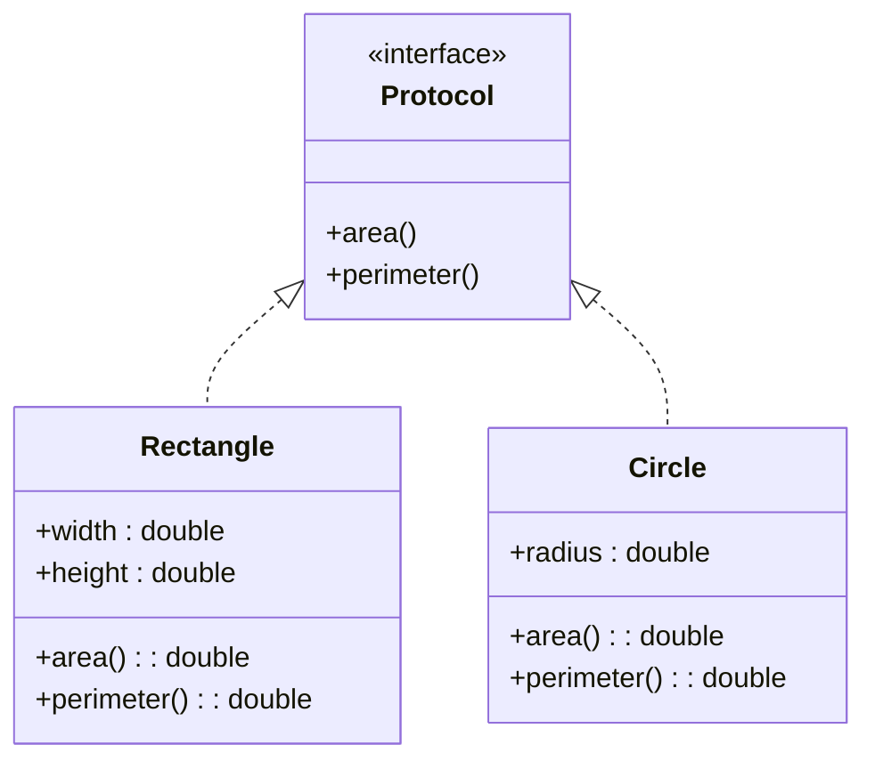

## 10.1 Introduction to Protocols

In the world of software development, the ability to define and implement flexible, scalable systems is paramount. Clojure, a modern Lisp dialect that runs on the Java Virtual Machine (JVM), provides a powerful mechanism for achieving this through protocols. Protocols in Clojure offer a way to define a set of functions that can have multiple implementations, similar to interfaces in Java. This section will delve into the purpose, definition, and benefits of using protocols in Clojure, providing a comprehensive understanding of how they enable polymorphism and abstraction in functional programming.

### **Purpose of Protocols**

Protocols in Clojure serve as a cornerstone for polymorphism and abstraction, two fundamental concepts in software design. They allow developers to define a set of functions that can be implemented by different data types, enabling a form of polymorphism that is both flexible and efficient. This is particularly useful in scenarios where you need to define operations that can be performed on different types of data without knowing the specific type in advance.

#### **Polymorphism and Abstraction**

- **Polymorphism**: In programming, polymorphism refers to the ability of different types to be treated as instances of the same class through a common interface. In Clojure, protocols provide a way to achieve polymorphism by allowing multiple data types to implement the same set of functions.
  
- **Abstraction**: Abstraction involves hiding the complex reality while exposing only the essential parts. Protocols enable abstraction by allowing developers to define a set of operations without specifying the details of how these operations are implemented.

### **Defining Protocols**

In Clojure, protocols are defined using the `defprotocol` construct. This construct allows you to specify a set of functions that must be implemented by any type that wishes to conform to the protocol. Let's explore how to define a protocol in Clojure.

```clojure
(defprotocol Shape
  "A protocol for geometric shapes."
  (area [this] "Calculate the area of the shape.")
  (perimeter [this] "Calculate the perimeter of the shape."))
```

In this example, we define a protocol named `Shape` with two functions: `area` and `perimeter`. Any data type that implements this protocol must provide concrete implementations for these functions.

#### **Implementing Protocols**

Once a protocol is defined, you can implement it for different data types using the `extend-type` or `extend-protocol` constructs. Here's how you might implement the `Shape` protocol for a `Rectangle` type:

```clojure
(defrecord Rectangle [width height])

(extend-type Rectangle
  Shape
  (area [this]
    (* (:width this) (:height this)))
  (perimeter [this]
    (* 2 (+ (:width this) (:height this)))))
```

In this example, we define a `Rectangle` type using `defrecord`, which automatically creates a constructor and accessor functions. We then use `extend-type` to implement the `Shape` protocol for the `Rectangle` type, providing concrete implementations for the `area` and `perimeter` functions.

#### **Using Protocols**

Once a protocol is implemented for a type, you can use its functions just like any other function in Clojure. Here's how you might use the `Shape` protocol with a `Rectangle` instance:

```clojure
(let [rect (->Rectangle 10 5)]
  (println "Area:" (area rect))
  (println "Perimeter:" (perimeter rect)))
```

This code creates a `Rectangle` instance with a width of 10 and a height of 5, then calculates and prints its area and perimeter using the `Shape` protocol functions.

### **Benefits of Using Protocols**

Protocols offer several advantages in Clojure, particularly when it comes to abstraction and polymorphism.

#### **1. Enhanced Flexibility**

Protocols provide a flexible way to define and implement operations that can be performed on different types of data. This flexibility is crucial in scenarios where you need to work with heterogeneous data types without knowing their specific implementations in advance.

#### **2. Improved Code Organization**

By defining a set of operations in a protocol, you can organize your code more effectively, separating the definition of operations from their implementations. This separation of concerns makes your code easier to read, maintain, and extend.

#### **3. Interoperability with Java**

Clojure's protocols are designed to interoperate seamlessly with Java interfaces. This interoperability allows you to leverage existing Java libraries and frameworks while still taking advantage of Clojure's functional programming features. You can implement a Clojure protocol in Java or extend a Java interface in Clojure, providing a powerful bridge between the two languages.

#### **4. Performance Optimization**

Protocols in Clojure are designed to be performant. They provide a fast, dynamic dispatch mechanism that is optimized for the JVM, making them suitable for performance-critical applications.

### **Comparison with Java Interfaces**

For developers transitioning from Java to Clojure, understanding the similarities and differences between Java interfaces and Clojure protocols is essential. While both constructs enable polymorphism and abstraction, there are key differences in how they are used and implemented.

#### **Java Interfaces**

In Java, interfaces are used to define a contract that classes must adhere to. They specify a set of methods that must be implemented by any class that implements the interface. Here's a simple example of a Java interface:

```java
public interface Shape {
    double area();
    double perimeter();
}
```

Classes that implement this interface must provide concrete implementations for the `area` and `perimeter` methods.

#### **Clojure Protocols**

Clojure protocols serve a similar purpose but are more flexible and dynamic. Unlike Java interfaces, which are static and require explicit implementation in classes, Clojure protocols can be extended to existing types without modifying their definitions. This flexibility allows for more dynamic and adaptable code.

### **Code Example: Java Interface vs. Clojure Protocol**

Let's compare the implementation of a `Shape` interface in Java with a `Shape` protocol in Clojure.

**Java Implementation:**

```java
public class Rectangle implements Shape {
    private double width;
    private double height;

    public Rectangle(double width, double height) {
        this.width = width;
        this.height = height;
    }

    @Override
    public double area() {
        return width * height;
    }

    @Override
    public double perimeter() {
        return 2 * (width + height);
    }
}
```

**Clojure Implementation:**

```clojure
(defrecord Rectangle [width height])

(extend-type Rectangle
  Shape
  (area [this]
    (* (:width this) (:height this)))
  (perimeter [this]
    (* 2 (+ (:width this) (:height this)))))
```

In both implementations, we define a `Rectangle` type that implements the `Shape` interface or protocol. However, the Clojure version is more concise and flexible, allowing for dynamic extension and modification.

### **Try It Yourself**

To deepen your understanding of Clojure protocols, try modifying the code examples provided above. Here are a few suggestions:

- Implement the `Shape` protocol for a `Circle` type, adding functions to calculate the area and circumference.
- Extend the `Shape` protocol to an existing Java class using Clojure's Java interoperability features.
- Experiment with adding new functions to the `Shape` protocol and implementing them for different types.

### **Visual Aids**

To better understand how protocols fit into the larger picture of Clojure's functional programming paradigm, consider the following diagram:



**Diagram Description:** This class diagram illustrates how the `Shape` protocol can be implemented by different types, such as `Rectangle` and `Circle`. Each type provides its own implementation of the `area` and `perimeter` functions, demonstrating polymorphism in action.

### **References and Links**

For further reading and exploration of Clojure protocols, consider the following resources:

- [Clojure Official Documentation](https://clojure.org/reference)
- [Clojure Community Resources](https://clojure.org/community/resources)
- [Transitioning from OOP to Functional Programming](https://www.lispcast.com/oo-to-fp/)
- [Clojure Protocols Guide](https://clojure.org/reference/protocols)

### **Knowledge Check**

To reinforce your understanding of Clojure protocols, consider the following questions:

1. What is the primary purpose of protocols in Clojure?
2. How do protocols enable polymorphism and abstraction in functional programming?
3. What are the key differences between Java interfaces and Clojure protocols?
4. How can you implement a protocol for an existing Java class in Clojure?
5. What are the benefits of using protocols for code organization and performance optimization?

### **Encouraging Engagement**

Embracing Clojure's protocols can be challenging, especially if you're accustomed to Java's object-oriented programming paradigm. However, with each step, you'll gain a deeper understanding of functional programming and see tangible benefits in your codebase. Keep experimenting, exploring, and engaging with the Clojure community to continue growing as a developer.

### **Test Your Knowledge: Introduction to Protocols Quiz**



### What is the primary purpose of protocols in Clojure?

- [x] To define a set of functions that can be implemented by different data types
- [ ] To enforce strict type checking
- [ ] To replace Java interfaces entirely
- [ ] To manage memory allocation

> **Explanation:** Protocols in Clojure are designed to define a set of functions that can be implemented by different data types, enabling polymorphism and abstraction.

### How do protocols in Clojure differ from Java interfaces?

- [x] Protocols can be extended to existing types without modifying their definitions
- [ ] Protocols require explicit class implementation
- [ ] Protocols enforce compile-time type checking
- [ ] Protocols are static and inflexible

> **Explanation:** Unlike Java interfaces, Clojure protocols can be extended to existing types dynamically, offering greater flexibility.

### What is a key benefit of using protocols in Clojure?

- [x] Improved code organization and separation of concerns
- [ ] Increased memory usage
- [ ] Slower execution time
- [ ] Reduced interoperability with Java

> **Explanation:** Protocols help organize code by separating the definition of operations from their implementations, enhancing readability and maintainability.

### How can Clojure protocols enhance performance?

- [x] By providing a fast, dynamic dispatch mechanism optimized for the JVM
- [ ] By increasing the complexity of function calls
- [ ] By limiting the number of functions that can be defined
- [ ] By enforcing strict memory allocation rules

> **Explanation:** Protocols in Clojure offer a performant dispatch mechanism that is optimized for the JVM, suitable for performance-critical applications.

### Which construct is used to define a protocol in Clojure?

- [x] `defprotocol`
- [ ] `definterface`
- [ ] `defclass`
- [ ] `defmethod`

> **Explanation:** The `defprotocol` construct is used to define a protocol in Clojure, specifying a set of functions that must be implemented.

### Can Clojure protocols interoperate with Java interfaces?

- [x] Yes, they can be implemented in Java or extended to Java interfaces in Clojure
- [ ] No, they are completely separate constructs
- [ ] Only if the Java interface is annotated with specific metadata
- [ ] Only if the protocol is defined within a Java class

> **Explanation:** Clojure protocols are designed to interoperate seamlessly with Java interfaces, allowing for flexible integration.

### What is the advantage of using `extend-type` in Clojure?

- [x] It allows you to implement a protocol for a specific data type
- [ ] It automatically generates Java bytecode
- [ ] It enforces compile-time type checking
- [ ] It limits the number of protocol functions

> **Explanation:** The `extend-type` construct in Clojure is used to implement a protocol for a specific data type, providing concrete function implementations.

### How does Clojure handle polymorphism with protocols?

- [x] By allowing multiple data types to implement the same set of functions
- [ ] By enforcing strict class hierarchies
- [ ] By using inheritance and abstract classes
- [ ] By limiting the number of data types that can implement a protocol

> **Explanation:** Clojure protocols enable polymorphism by allowing different data types to implement the same set of functions, similar to interfaces in Java.

### Can protocols be used for performance optimization in Clojure?

- [x] True
- [ ] False

> **Explanation:** Protocols in Clojure are designed to be performant, providing a fast, dynamic dispatch mechanism optimized for the JVM.

### What is the role of `extend-protocol` in Clojure?

- [x] It allows you to implement a protocol for multiple data types in a single expression
- [ ] It replaces the need for `defprotocol`
- [ ] It enforces strict type checking
- [ ] It limits the number of functions that can be defined

> **Explanation:** The `extend-protocol` construct in Clojure allows you to implement a protocol for multiple data types in a single expression, offering a concise way to define implementations.


