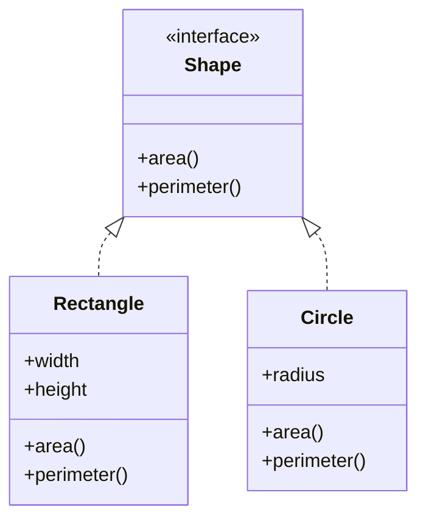

## **10.2 Defining and Implementing Protocols in Clojure**

In this section, we delve into the world of protocols in Clojure, a powerful feature that enables polymorphism and flexible design patterns in your functional applications. Protocols in Clojure provide a way to define a set of functions that can be implemented by different data types, similar to interfaces in Java. This allows for a separation of interface and implementation, promoting code reuse and modularity.

### **Understanding Protocols in Clojure**

Protocols in Clojure are akin to interfaces in Java. They define a collection of methods without implementing them. The implementation of these methods is left to the data types that satisfy the protocol. This approach allows different data types to implement the same protocol, providing polymorphic behavior.

#### **Defining a Protocol**

To define a protocol in Clojure, we use the `defprotocol` macro. This macro allows us to specify a set of functions that any implementing type must provide. Each function in a protocol can have multiple arities, just like regular functions in Clojure.

```clojure
(defprotocol Shape
  "A protocol for geometric shapes."
  (area [this] "Calculate the area of the shape.")
  (perimeter [this] "Calculate the perimeter of the shape."))
```

In the example above, we define a `Shape` protocol with two functions: `area` and `perimeter`. Any type that implements this protocol must provide implementations for these functions.

### **Implementing Protocols**

Once a protocol is defined, we can implement it for different data types using `defrecord` or `deftype`. These constructs allow us to create new types in Clojure, similar to classes in Java, and specify how they satisfy a given protocol.

#### **Using `defrecord`**

The `defrecord` construct is used to create a new record type, which is a fixed set of fields. Records are immutable and provide efficient access to their fields. Here's how we can implement the `Shape` protocol for a `Rectangle` type using `defrecord`:

```clojure
(defrecord Rectangle [width height]
  Shape
  (area [this]
    (* (:width this) (:height this)))
  (perimeter [this]
    (* 2 (+ (:width this) (:height this)))))
```

In this example, we define a `Rectangle` record with `width` and `height` fields. We then implement the `Shape` protocol by providing definitions for the `area` and `perimeter` functions.

#### **Using `deftype`**

The `deftype` construct is more flexible than `defrecord` and allows for more control over the implementation. It is used to define new types with custom behavior and can be more efficient in certain scenarios. Here's how we can implement the `Shape` protocol for a `Circle` type using `deftype`:

```clojure
(deftype Circle [radius]
  Shape
  (area [this]
    (* Math/PI (* (:radius this) (:radius this))))
  (perimeter [this]
    (* 2 Math/PI (:radius this))))
```

In this example, we define a `Circle` type with a `radius` field and implement the `Shape` protocol by defining the `area` and `perimeter` functions.

### **Protocol Functions**

Protocol functions are the methods defined within a protocol. They are similar to interface methods in Java and must be implemented by any type that satisfies the protocol. Protocol functions can have multiple arities, allowing for flexible implementations.

#### **Calling Protocol Functions**

Once a protocol is implemented for a type, we can call its functions on instances of that type. Here's how we can use the `Shape` protocol with `Rectangle` and `Circle` instances:

```clojure
(let [rect (->Rectangle 10 20)
      circ (->Circle 5)]
  (println "Rectangle Area:" (area rect))
  (println "Rectangle Perimeter:" (perimeter rect))
  (println "Circle Area:" (area circ))
  (println "Circle Perimeter:" (perimeter circ)))
```

In this example, we create instances of `Rectangle` and `Circle` and call the `area` and `perimeter` functions on them, demonstrating polymorphic behavior.

### **Examples of Implementing a Protocol for Multiple Types**

Let's explore a more complex example where we implement a protocol for multiple types. We'll define a `Drawable` protocol for objects that can be drawn on a canvas.

```clojure
(defprotocol Drawable
  "A protocol for drawable objects."
  (draw [this canvas] "Draw the object on the given canvas."))

(defrecord Line [x1 y1 x2 y2]
  Drawable
  (draw [this canvas]
    (println "Drawing line from" [x1 y1] "to" [x2 y2] "on canvas" canvas)))

(deftype Circle [x y radius]
  Drawable
  (draw [this canvas]
    (println "Drawing circle at" [x y] "with radius" radius "on canvas" canvas)))
```

In this example, we define a `Drawable` protocol with a `draw` function. We then implement this protocol for a `Line` record and a `Circle` type. Each implementation provides a custom `draw` method that prints a message to the console.

### **Try It Yourself**

To get hands-on experience, try modifying the examples above. For instance, add a new type, such as `Triangle`, and implement the `Shape` protocol for it. Experiment with different implementations and see how they interact with the existing protocol functions.

### **Visualizing Protocols and Implementations**

To better understand how protocols and their implementations interact, let's visualize the relationship using a class diagram.



**Diagram Description:** This diagram illustrates the `Shape` protocol and its implementations by `Rectangle` and `Circle`. The arrows indicate that both `Rectangle` and `Circle` satisfy the `Shape` protocol by implementing its functions.

### **Comparing Clojure Protocols with Java Interfaces**

For developers transitioning from Java, understanding the similarities and differences between Clojure protocols and Java interfaces can be beneficial.

- **Similarities:**
  - Both define a set of methods that must be implemented by any type that satisfies them.
  - They promote polymorphism, allowing different types to be used interchangeably based on a common interface.

- **Differences:**
  - Clojure protocols are more flexible and can be extended to existing types without modifying their source code.
  - Protocols support multiple arities for functions, providing more flexibility in their implementation.

### **Best Practices for Using Protocols**

When working with protocols in Clojure, consider the following best practices:

- **Define Clear Protocols:** Ensure that protocols are well-defined and describe a coherent set of operations.
- **Use Protocols for Polymorphism:** Leverage protocols to enable polymorphic behavior across different types.
- **Implement Protocols Judiciously:** Only implement protocols for types that logically satisfy the operations defined by the protocol.
- **Avoid Overusing Protocols:** While protocols are powerful, overusing them can lead to complex and hard-to-maintain codebases.

### **Further Reading and Resources**

To deepen your understanding of protocols in Clojure, consider exploring the following resources:

- [Clojure Official Documentation](https://clojure.org/reference/protocols)
- [Clojure Community Resources](https://clojure.org/community/resources)
- [Transitioning from OOP to Functional Programming](https://www.lispcast.com/oo-to-fp/)

These resources provide additional insights and examples to help you master the use of protocols in your Clojure applications.

### **Knowledge Check**

Before moving on, let's test your understanding of defining and implementing protocols in Clojure.

## **Test Your Knowledge: Defining and Implementing Protocols Quiz**



### What is the primary purpose of a protocol in Clojure?

- [x] To define a set of functions that different types can implement
- [ ] To create mutable data structures
- [ ] To manage concurrency
- [ ] To perform I/O operations

> **Explanation:** Protocols in Clojure define a set of functions that different types can implement, enabling polymorphism.

### How do you define a protocol in Clojure?

- [x] Using the `defprotocol` macro
- [ ] Using the `deftype` macro
- [ ] Using the `defrecord` macro
- [ ] Using the `defn` macro

> **Explanation:** The `defprotocol` macro is used to define protocols in Clojure.

### Which construct is used to implement a protocol for a record type?

- [x] `defrecord`
- [ ] `deftype`
- [ ] `defprotocol`
- [ ] `defn`

> **Explanation:** The `defrecord` construct is used to implement protocols for record types in Clojure.

### What is the difference between `defrecord` and `deftype`?

- [x] `defrecord` creates immutable records with fixed fields, while `deftype` allows for custom behavior.
- [ ] `defrecord` is used for mutable data, while `deftype` is for immutable data.
- [ ] `defrecord` is a Java construct, while `deftype` is a Clojure construct.
- [ ] `defrecord` is used for concurrency, while `deftype` is for I/O operations.

> **Explanation:** `defrecord` creates immutable records with fixed fields, while `deftype` allows for more custom behavior.

### Can protocol functions have multiple arities?

- [x] Yes
- [ ] No

> **Explanation:** Protocol functions can have multiple arities, allowing for flexible implementations.

### What is the advantage of protocols over Java interfaces?

- [x] Protocols can be extended to existing types without modifying their source code.
- [ ] Protocols are faster than Java interfaces.
- [ ] Protocols support mutable state.
- [ ] Protocols are only for concurrent programming.

> **Explanation:** Protocols can be extended to existing types without modifying their source code, providing flexibility.

### Which protocol function is used to calculate the area in the `Shape` protocol?

- [x] `area`
- [ ] `perimeter`
- [ ] `draw`
- [ ] `calculate`

> **Explanation:** The `area` function is defined in the `Shape` protocol to calculate the area of a shape.

### What is the role of the `draw` function in the `Drawable` protocol?

- [x] To draw the object on a canvas
- [ ] To calculate the area of the object
- [ ] To manage concurrency
- [ ] To perform I/O operations

> **Explanation:** The `draw` function in the `Drawable` protocol is used to draw the object on a canvas.

### How can you call a protocol function on a type that implements it?

- [x] By creating an instance of the type and calling the function on it
- [ ] By using the `defprotocol` macro
- [ ] By using the `deftype` macro
- [ ] By using the `defrecord` macro

> **Explanation:** You can call a protocol function by creating an instance of the type that implements it and calling the function on the instance.

### Protocols in Clojure are similar to interfaces in Java.

- [x] True
- [ ] False

> **Explanation:** Protocols in Clojure are similar to interfaces in Java as they both define a set of methods that must be implemented by any type that satisfies them.



By mastering protocols in Clojure, you can create flexible and reusable code that adheres to the principles of functional programming. Embrace the power of protocols to enhance your Clojure applications and unlock new possibilities in your software design.
