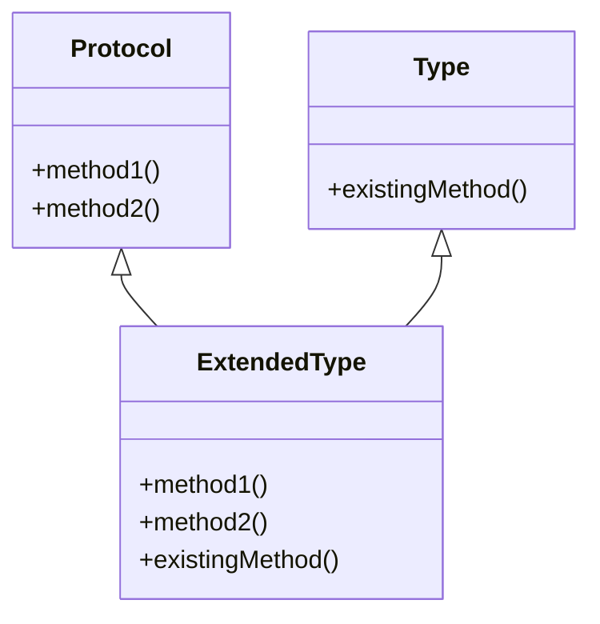

## 10.3 Extending Protocols to Existing Types

In this section, we delve into the powerful concept of extending protocols to existing types in Clojure. This feature allows developers to enhance the functionality of types they do not own, such as Java classes or Clojure's core data structures, by implementing new protocols. This capability is crucial for achieving polymorphism and code reuse in a functional programming context.

### Understanding the Extension Mechanism

Clojure's `extend-type` function is the primary mechanism for extending protocols to existing types. This function enables you to define how a particular type should behave according to a protocol's specifications. By doing so, you can add new behavior to existing types without modifying their original source code.

#### Key Concepts

- **Protocols**: Define a set of methods that can be implemented by different types. They are similar to interfaces in Java but are more flexible and dynamic.
- **Types**: Can be any existing Java class or Clojure data structure.
- **`extend-type`**: A function used to associate a protocol with a specific type, providing implementations for the protocol's methods.

### Reusing Existing Types

One of the primary benefits of extending protocols to existing types is the ability to reuse and enhance existing functionality. This approach promotes code reuse and modularity, allowing you to adapt existing types to new requirements without altering their original implementation.

#### Benefits

- **Code Reuse**: Leverage existing types and add new behavior without duplication.
- **Flexibility**: Adapt types to conform to new protocols as requirements evolve.
- **Interoperability**: Seamlessly integrate Java classes with Clojure protocols, enhancing cross-language functionality.

### Practical Examples

Let's explore practical examples of extending protocols to existing types, focusing on both Java classes and Clojure core types.

#### Example 1: Extending a Java Class

Suppose we have a Java class `Rectangle` that represents a geometric rectangle. We want to extend this class to conform to a Clojure protocol `Shape` that defines a method `area`.

```clojure
;; Define the Shape protocol
(defprotocol Shape
  (area [this] "Calculate the area of the shape."))

;; Java class Rectangle
;; Assume this class has fields `width` and `height` with corresponding getters.
;; public class Rectangle {
;;     private double width;
;;     private double height;
;;     public Rectangle(double width, double height) {
;;         this.width = width;
;;         this.height = height;
;;     }
;;     public double getWidth() { return width; }
;;     public double getHeight() { return height; }
;; }

;; Extend the Rectangle class to implement the Shape protocol
(extend-type Rectangle
  Shape
  (area [this]
    (* (.getWidth this) (.getHeight this))))

;; Usage
(let [rect (Rectangle. 5.0 3.0)]
  (println "Area of rectangle:" (area rect)))
```

In this example, we define a `Shape` protocol with an `area` method. We then use `extend-type` to implement this method for the `Rectangle` class, calculating the area based on its width and height.

#### Example 2: Extending a Clojure Core Type

Consider extending Clojure's core `Vector` type to conform to a protocol `CollectionStats` that provides methods for calculating the sum and average of numeric elements.

```clojure
;; Define the CollectionStats protocol
(defprotocol CollectionStats
  (sum [coll] "Calculate the sum of the collection.")
  (average [coll] "Calculate the average of the collection."))

;; Extend the Vector type to implement the CollectionStats protocol
(extend-type clojure.lang.PersistentVector
  CollectionStats
  (sum [coll]
    (reduce + coll))
  (average [coll]
    (/ (sum coll) (count coll))))

;; Usage
(let [numbers [1 2 3 4 5]]
  (println "Sum:" (sum numbers))
  (println "Average:" (average numbers)))
```

Here, we extend the `PersistentVector` type to implement the `CollectionStats` protocol, providing methods to calculate the sum and average of its elements.

### Try It Yourself

Experiment with extending protocols to different types. Consider the following challenges:

1. Extend a Java `ArrayList` to implement a protocol `ListOperations` with methods `add-element` and `remove-element`.
2. Extend Clojure's `Map` type to conform to a protocol `MapStats` that includes methods for counting keys and values.

### Visualizing Protocol Extensions

To better understand how protocol extensions work, let's visualize the process using a diagram.



**Diagram Description**: This diagram illustrates how an existing `Type` is extended to become an `ExtendedType` that implements a `Protocol`. The `ExtendedType` inherits methods from both the `Type` and the `Protocol`.

### References and Further Reading

- [Clojure Official Documentation](https://clojure.org/reference)
- [Clojure Community Resources](https://clojure.org/community/resources)
- [Transitioning from OOP to Functional Programming](https://www.lispcast.com/oo-to-fp/)

### Knowledge Check

To reinforce your understanding, consider these questions:

- What are the advantages of extending protocols to existing types?
- How does the `extend-type` function differ from Java's interface implementation?
- Can you extend a protocol to multiple types simultaneously?

### Exercises

1. Extend a Java `HashMap` to implement a protocol `MapOperations` with methods `get-value` and `set-value`.
2. Create a protocol `NumericOperations` and extend both `Integer` and `Double` types to implement methods `increment` and `decrement`.

### Conclusion

Extending protocols to existing types in Clojure is a powerful feature that enhances code flexibility and reusability. By understanding and applying this technique, you can create more modular and adaptable systems that seamlessly integrate with existing codebases.

## **Test Your Knowledge: Extending Protocols to Existing Types Quiz**



### What is the primary function used to extend protocols to existing types in Clojure?

- [x] `extend-type`
- [ ] `implement-type`
- [ ] `add-protocol`
- [ ] `define-type`

> **Explanation:** The `extend-type` function is used to associate a protocol with a specific type, providing implementations for the protocol's methods.

### Which of the following is a benefit of extending protocols to existing types?

- [x] Code Reuse
- [ ] Increased Complexity
- [ ] Reduced Flexibility
- [ ] Less Modularity

> **Explanation:** Extending protocols to existing types promotes code reuse and modularity, allowing you to adapt existing types to new requirements without altering their original implementation.

### How does extending protocols in Clojure differ from implementing interfaces in Java?

- [x] Clojure's protocol extension is more dynamic and flexible.
- [ ] Java interfaces are more flexible.
- [ ] Clojure requires source code modification.
- [ ] Java interfaces allow for multiple inheritance.

> **Explanation:** Clojure's protocol extension is more dynamic and flexible, allowing for runtime modifications without altering the original source code.

### What is a key advantage of using protocols in Clojure?

- [x] They provide polymorphism without inheritance.
- [ ] They enforce strict type checking.
- [ ] They require less memory.
- [ ] They simplify error handling.

> **Explanation:** Protocols in Clojure provide polymorphism without the need for inheritance, enabling flexible and dynamic method dispatch.

### Can you extend a protocol to a Java class in Clojure?

- [x] Yes
- [ ] No

> **Explanation:** Clojure allows extending protocols to Java classes, enhancing interoperability and functionality.

### What method would you use to calculate the area of a `Rectangle` in the provided example?

- [x] `area`
- [ ] `calculate`
- [ ] `compute`
- [ ] `measure`

> **Explanation:** The `area` method is defined in the `Shape` protocol and implemented for the `Rectangle` class to calculate its area.

### Which Clojure core type was extended in the example to calculate sum and average?

- [x] `PersistentVector`
- [ ] `PersistentList`
- [ ] `PersistentMap`
- [ ] `PersistentSet`

> **Explanation:** The `PersistentVector` type was extended to implement the `CollectionStats` protocol, providing methods for calculating the sum and average of its elements.

### What is a practical use case for extending protocols to existing types?

- [x] Adding new behavior to types you don't own.
- [ ] Reducing code readability.
- [ ] Increasing code complexity.
- [ ] Decreasing code performance.

> **Explanation:** Extending protocols to existing types allows you to add new behavior to types you don't own, enhancing code flexibility and functionality.

### How can extending protocols improve interoperability between Clojure and Java?

- [x] By allowing Java classes to conform to Clojure protocols.
- [ ] By enforcing strict type compatibility.
- [ ] By reducing the need for Java classes.
- [ ] By simplifying Java class creation.

> **Explanation:** Extending protocols allows Java classes to conform to Clojure protocols, enhancing interoperability and cross-language functionality.

### True or False: Extending protocols to existing types requires modifying the original type's source code.

- [ ] True
- [x] False

> **Explanation:** Extending protocols to existing types does not require modifying the original type's source code, allowing for flexible and dynamic behavior enhancements.


