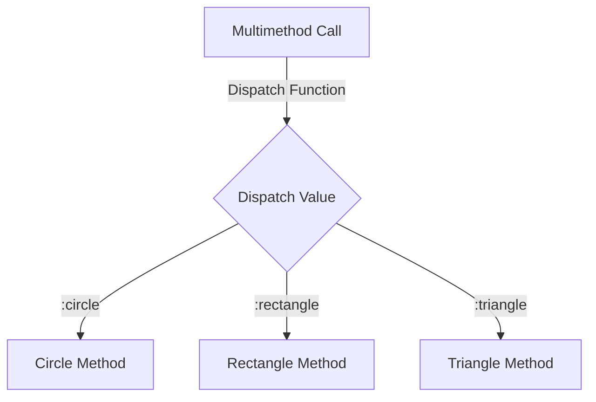

## 10.4 Multimethods and Dispatching

In the realm of Clojure, multimethods offer a powerful mechanism for achieving polymorphic behavior, allowing developers to dispatch functions based on arbitrary criteria. This flexibility provides a stark contrast to traditional object-oriented programming (OOP) paradigms, where polymorphism is often tied to class hierarchies. In this section, we will explore the concept of multimethods, how to define and use them, and when they are more appropriate than protocols.

### Understanding Multimethods

Multimethods in Clojure allow you to define a function that can have different implementations based on the result of a dispatch function. Unlike protocols, which are limited to dispatching on the type of the first argument, multimethods can dispatch on any criteria, making them a versatile tool for complex decision-making logic.

#### Key Concepts

- **Polymorphism**: The ability of different types to be treated as instances of the same type through a common interface.
- **Dispatch Function**: A function used to determine which method implementation to invoke.
- **Method Implementations**: Specific implementations of a multimethod for different dispatch values.

### Defining Multimethods

To define a multimethod in Clojure, you use the `defmulti` and `defmethod` constructs. Let's break down these components:

#### `defmulti`

The `defmulti` function is used to define a new multimethod. It takes a name and a dispatch function. The dispatch function is called with the arguments to the multimethod and should return a value that will be used to select the appropriate method implementation.

```clojure
(defmulti area :shape)
```

In this example, `area` is the name of the multimethod, and `:shape` is the dispatch function. This dispatch function assumes that the input is a map containing a `:shape` key.

#### `defmethod`

The `defmethod` function is used to define a specific implementation for a given dispatch value. It takes the name of the multimethod, the dispatch value, and the implementation function.

```clojure
(defmethod area :circle
  [shape]
  (* Math/PI (:radius shape) (:radius shape)))

(defmethod area :rectangle
  [shape]
  (* (:width shape) (:height shape)))
```

Here, we define two method implementations for the `area` multimethod: one for circles and one for rectangles. Each implementation calculates the area based on the shape's properties.

### Dispatch Functions

The dispatch function is a critical component of multimethods. It determines which method implementation to use based on the arguments passed to the multimethod. This function can be as simple or complex as needed, allowing for dispatching on multiple arguments or even external state.

#### Example: Complex Dispatch Function

```clojure
(defmulti discount
  (fn [customer purchase]
    (cond
      (:vip customer) :vip
      (> (:total purchase) 100) :bulk
      :else :regular)))

(defmethod discount :vip
  [customer purchase]
  (* (:total purchase) 0.8))

(defmethod discount :bulk
  [customer purchase]
  (* (:total purchase) 0.9))

(defmethod discount :regular
  [customer purchase]
  (:total purchase))
```

In this example, the dispatch function uses a `cond` expression to determine the appropriate discount method based on the customer's VIP status and the purchase total. This flexibility allows for highly customizable behavior.

### Use Cases for Multimethods

Multimethods are particularly useful in scenarios where:

- **Complex Dispatch Logic**: When dispatching logic cannot be easily encapsulated by simple type-based dispatch, such as when multiple arguments or external state must be considered.
- **Dynamic Behavior**: When the behavior of a function needs to change dynamically based on runtime conditions.
- **Extensibility**: When you need to add new behavior without modifying existing code, such as in plugin architectures.

#### Example: Extensible Command Pattern

Consider a system where different commands need to be executed based on user input. Multimethods can provide a clean and extensible way to handle this:

```clojure
(defmulti execute-command :command)

(defmethod execute-command :start
  [command]
  (println "Starting the system..."))

(defmethod execute-command :stop
  [command]
  (println "Stopping the system..."))

(defmethod execute-command :restart
  [command]
  (println "Restarting the system..."))

;; Usage
(execute-command {:command :start})
(execute-command {:command :stop})
```

This pattern allows new commands to be added easily without altering existing logic.

### Multimethods vs. Protocols

While both multimethods and protocols provide polymorphic behavior, they serve different purposes and are suited to different scenarios.

- **Protocols**: Best for type-based polymorphism where the behavior is determined by the type of the first argument. They are more efficient due to their reliance on Java's interface mechanism.
- **Multimethods**: Ideal for more complex dispatch scenarios where multiple factors determine the behavior. They offer greater flexibility at the cost of some performance overhead.

### Code Examples

Let's explore some practical code examples to solidify our understanding of multimethods and dispatching.

#### Example 1: Shape Area Calculation

```clojure
(defmulti calculate-area :shape)

(defmethod calculate-area :circle
  [{:keys [radius]}]
  (* Math/PI radius radius))

(defmethod calculate-area :rectangle
  [{:keys [width height]}]
  (* width height))

(defmethod calculate-area :triangle
  [{:keys [base height]}]
  (/ (* base height) 2))

;; Usage
(calculate-area {:shape :circle :radius 5})
(calculate-area {:shape :rectangle :width 4 :height 6})
(calculate-area {:shape :triangle :base 3 :height 4})
```

#### Example 2: User Role-Based Access Control

```clojure
(defmulti access-level :role)

(defmethod access-level :admin
  [_]
  "Full Access")

(defmethod access-level :user
  [_]
  "Limited Access")

(defmethod access-level :guest
  [_]
  "Guest Access")

;; Usage
(access-level {:role :admin})
(access-level {:role :user})
(access-level {:role :guest})
```

### Try It Yourself

Experiment with the following exercises to deepen your understanding of multimethods:

1. **Extend the Shape Example**: Add a new shape, such as a square, to the `calculate-area` multimethod.
2. **Modify the Discount Example**: Introduce a new discount type for loyal customers and implement the logic.
3. **Create a New Multimethod**: Design a multimethod for a different domain, such as a payment processing system, and implement various payment methods.

### Visual Aids

To help visualize how multimethods work, consider the following diagram illustrating the dispatch process:



**Diagram Description**: This diagram shows how a multimethod call is processed. The dispatch function determines the dispatch value, which then selects the appropriate method implementation.

### References and Links

- [Clojure Official Documentation](https://clojure.org/reference)
- [Clojure Multimethods Guide](https://clojure.org/reference/multimethods)
- [Transitioning from OOP to Functional Programming](https://www.lispcast.com/oo-to-fp/)

### Knowledge Check

- What is the primary difference between protocols and multimethods?
- How does a dispatch function influence the behavior of a multimethod?
- When would you choose multimethods over protocols?

### Test Your Knowledge: Multimethods and Dispatching Quiz



### What is a multimethod in Clojure?

- [x] A function that allows different implementations based on a dispatch function.
- [ ] A way to define a single implementation for all data types.
- [ ] A method that only works with immutable data structures.
- [ ] A feature exclusive to Java integration.

> **Explanation:** Multimethods enable polymorphic behavior by selecting implementations based on a dispatch function.

### Which function is used to define a multimethod in Clojure?

- [x] `defmulti`
- [ ] `defprotocol`
- [ ] `defn`
- [ ] `deftype`

> **Explanation:** `defmulti` is used to define a multimethod, specifying the dispatch function.

### How do you define a specific implementation for a multimethod?

- [x] Using `defmethod`
- [ ] Using `defmulti`
- [ ] Using `defprotocol`
- [ ] Using `definterface`

> **Explanation:** `defmethod` is used to provide specific implementations for a multimethod.

### What does the dispatch function do in a multimethod?

- [x] Determines which method implementation to use.
- [ ] Executes the method implementation.
- [ ] Manages state changes.
- [ ] Handles exceptions.

> **Explanation:** The dispatch function determines the dispatch value, selecting the appropriate method implementation.

### When are multimethods more appropriate than protocols?

- [x] When dispatch logic is complex and not based solely on type.
- [ ] When performance is the primary concern.
- [ ] When working exclusively with Java classes.
- [ ] When defining simple interfaces.

> **Explanation:** Multimethods are ideal for complex dispatch scenarios, offering flexibility beyond type-based dispatch.

### What is a potential downside of using multimethods?

- [x] They can introduce performance overhead.
- [ ] They are not compatible with Java.
- [ ] They cannot be extended.
- [ ] They require mutable data structures.

> **Explanation:** Multimethods can be less performant than protocols due to their flexible dispatching mechanism.

### Can multimethods dispatch based on multiple arguments?

- [x] Yes
- [ ] No

> **Explanation:** Multimethods can dispatch based on any criteria, including multiple arguments.

### What is the primary advantage of using multimethods?

- [x] Flexibility in dispatching based on custom logic.
- [ ] Guaranteed performance improvements.
- [ ] Simplified syntax compared to functions.
- [ ] Built-in support for concurrency.

> **Explanation:** Multimethods offer flexibility in dispatching, allowing for custom logic beyond type-based dispatch.

### How do you add a new implementation to an existing multimethod?

- [x] Use `defmethod` with the new dispatch value.
- [ ] Modify the existing `defmulti`.
- [ ] Use `defprotocol`.
- [ ] Use `deftype`.

> **Explanation:** `defmethod` is used to add new implementations to a multimethod.

### True or False: Multimethods can be used for dynamic behavior changes at runtime.

- [x] True
- [ ] False

> **Explanation:** Multimethods can dynamically select implementations based on runtime conditions, allowing for flexible behavior changes.



By mastering multimethods and dispatching in Clojure, you can create flexible, dynamic applications that adapt to complex requirements with ease. Embrace the power of functional programming and explore the possibilities that multimethods offer in your projects.
