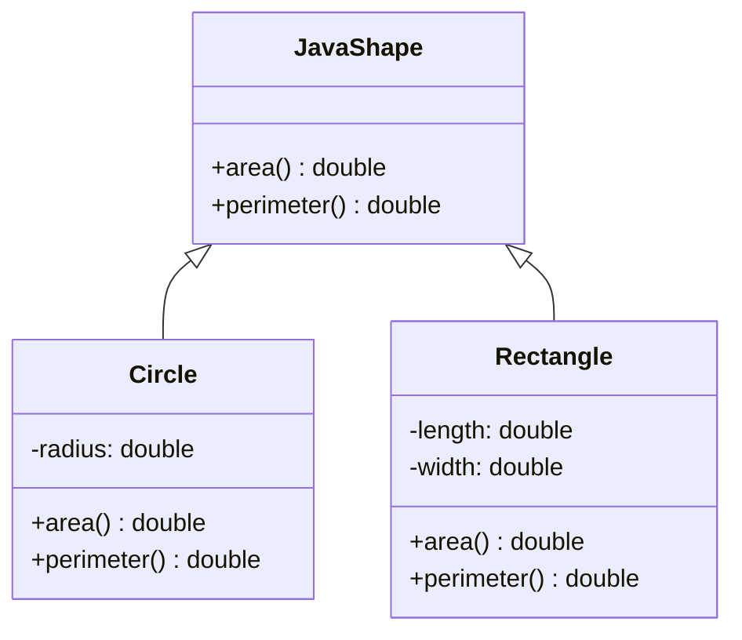
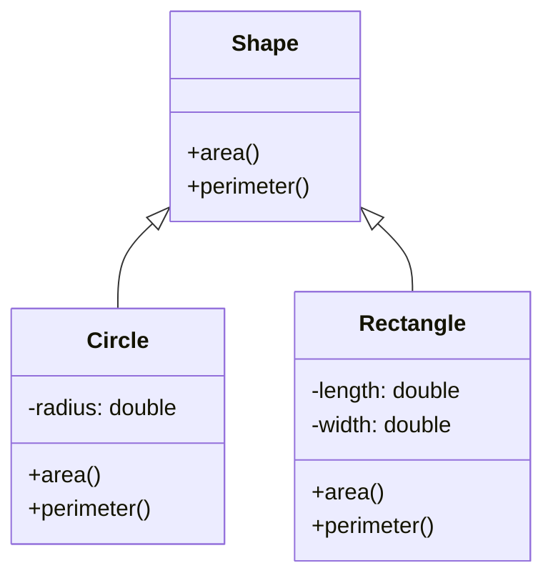

## 10.5 Designing with Polymorphism in Clojure

In the realm of software design, polymorphism is a cornerstone concept that enables flexibility and extensibility. While object-oriented programming (OOP) languages like Java often use class hierarchies and interfaces to achieve polymorphism, Clojure, a functional programming language, offers a different approach. In this section, we will explore the importance of polymorphism in design, how Clojure implements polymorphism through protocols and multimethods, and how these features support open and extensible systems.

### Polymorphism Concepts

Polymorphism allows entities to be treated as instances of their parent class, enabling a single interface to represent different types. This concept is crucial for designing systems that are both flexible and maintainable. In Java, polymorphism is typically achieved through inheritance and interfaces, where objects of different classes can be treated as objects of a common superclass.

In Clojure, the approach to polymorphism is more flexible and less hierarchical. Clojure provides two primary mechanisms for polymorphism: protocols and multimethods. These tools enable developers to define behavior that can be extended to new types without modifying existing code, a key aspect of open systems design.

#### **Protocols in Clojure**

Protocols in Clojure are similar to Java interfaces but are more dynamic and flexible. They allow you to define a set of functions that can be implemented by different data types. Protocols are ideal when you have a fixed set of operations that need to be performed on various types.

Here's a simple example of a protocol in Clojure:

```clojure
(defprotocol Shape
  (area [this])
  (perimeter [this]))

(defrecord Circle [radius]
  Shape
  (area [this] (* Math/PI (* radius radius)))
  (perimeter [this] (* 2 Math/PI radius)))

(defrecord Rectangle [length width]
  Shape
  (area [this] (* length width))
  (perimeter [this] (* 2 (+ length width))))
```

In this example, we define a `Shape` protocol with two functions: `area` and `perimeter`. We then implement this protocol for `Circle` and `Rectangle` using Clojure's `defrecord` to create concrete types.

#### **Multimethods in Clojure**

Multimethods provide a more flexible form of polymorphism that allows dispatching on arbitrary criteria, not just the type of the first argument. This is particularly useful when you need to make decisions based on multiple attributes of the input.

Here's an example of a multimethod in Clojure:

```clojure
(defmulti calculate-tax (fn [region amount] region))

(defmethod calculate-tax :us [region amount]
  (* amount 0.07))

(defmethod calculate-tax :eu [region amount]
  (* amount 0.20))

(defmethod calculate-tax :default [region amount]
  (* amount 0.10))
```

In this example, the `calculate-tax` multimethod dispatches based on the `region` argument, allowing different tax calculations for different regions. The `:default` method provides a fallback if no specific method matches.

### When to Use Protocols vs. Multimethods

Choosing between protocols and multimethods depends on the problem you are solving. Here are some guidelines to help you decide:

- **Use Protocols When:**
  - You have a fixed set of operations that need to be implemented for various types.
  - You want to leverage Clojure's type hinting and performance optimizations.
  - The operations are closely tied to the data types.

- **Use Multimethods When:**
  - You need to dispatch based on multiple criteria or complex logic.
  - The set of operations is not fixed and may evolve over time.
  - You want to support open and extensible systems where new behaviors can be added without modifying existing code.

### Open Systems Design

Clojure's polymorphism mechanisms support open systems design, which emphasizes extensibility and adaptability. In open systems, new functionality can be added without altering existing components, promoting a modular and maintainable architecture.

#### **Extending Protocols**

Protocols can be extended to new types without modifying the original protocol definition. This allows developers to add new behavior to existing systems seamlessly.

```clojure
(defrecord Triangle [base height]
  Shape
  (area [this] (* 0.5 base height))
  (perimeter [this] "Perimeter calculation not implemented"))
```

In this example, we extend the `Shape` protocol to a new `Triangle` type, demonstrating how new types can be integrated into existing systems.

#### **Extending Multimethods**

Multimethods can be extended by simply defining new methods for additional criteria, making them ideal for systems that require flexible and dynamic behavior.

```clojure
(defmethod calculate-tax :asia [region amount]
  (* amount 0.15))
```

Here, we add a new method to the `calculate-tax` multimethod for the `:asia` region, illustrating how new logic can be incorporated without altering existing code.

### Visual Aids

To better understand how Clojure's polymorphism mechanisms compare with Java's OOP approach, let's explore some visual aids.

#### **Class Diagram: Java vs. Clojure**





These diagrams illustrate how Java uses class hierarchies for polymorphism, while Clojure uses protocols to achieve similar behavior without rigid hierarchies.

### References and Links

For more information on Clojure's polymorphism mechanisms, consider exploring the following resources:

- [Clojure Official Documentation](https://clojure.org/reference)
- [Clojure Community Resources](https://clojure.org/community/resources)
- [Transitioning from OOP to Functional Programming](https://www.lispcast.com/oo-to-fp/)

### Knowledge Check

Let's reinforce your understanding with some questions:

1. What is the primary difference between protocols and multimethods in Clojure?
2. When would you choose to use a multimethod over a protocol?
3. How do protocols support open systems design?

### Exercises

1. **Extend the `Shape` protocol**: Add a new `Square` type that implements the `Shape` protocol. Calculate its area and perimeter.
2. **Create a new multimethod**: Design a multimethod that calculates shipping costs based on the destination and package weight.

### Encouraging Engagement

Embracing functional programming and Clojure's unique approach to polymorphism can be challenging, but with practice, you'll see the benefits in your codebase. Remember, the goal is to build systems that are flexible, maintainable, and scalable.

### Best Practices for Tags

Ensure that your tags accurately reflect the content of this section. Consider using tags such as "Clojure", "Polymorphism", "Protocols", "Multimethods", "Functional Programming", "Design Patterns", "Open Systems", and "Scalable Applications".

## **Test Your Knowledge: Designing with Polymorphism in Clojure Quiz**



### What is a key benefit of using protocols in Clojure?

- [x] They allow for dynamic and flexible implementation of functions for different types.
- [ ] They enforce strict type hierarchies like in Java.
- [ ] They require modification of existing code to add new types.
- [ ] They are only useful for primitive data types.

> **Explanation:** Protocols in Clojure enable dynamic and flexible function implementations across different types without modifying existing code.

### When should you prefer multimethods over protocols?

- [x] When dispatching based on multiple criteria.
- [ ] When you have a fixed set of operations.
- [ ] When performance is a primary concern.
- [ ] When you need strict type checking.

> **Explanation:** Multimethods are preferred when you need to dispatch based on multiple criteria or complex logic.

### How do protocols support open systems design?

- [x] By allowing new types to implement existing protocols without modifying them.
- [ ] By enforcing a rigid hierarchy of types.
- [ ] By requiring all types to be defined at compile time.
- [ ] By limiting the extensibility of the system.

> **Explanation:** Protocols support open systems by enabling new types to implement existing protocols seamlessly.

### What is the purpose of the `defmethod` function in Clojure?

- [x] To define a new method for a multimethod.
- [ ] To create a new protocol.
- [ ] To implement a protocol for a type.
- [ ] To define a new namespace.

> **Explanation:** `defmethod` is used to define a new method for a multimethod, allowing for custom behavior based on dispatch criteria.

### Which of the following is true about Clojure's polymorphism mechanisms?

- [x] They support open and extensible systems.
- [ ] They are limited to single inheritance.
- [x] They allow for dynamic dispatch based on multiple criteria.
- [ ] They require all types to be defined in advance.

> **Explanation:** Clojure's polymorphism mechanisms support open systems and allow for dynamic dispatch, making them highly flexible.

### What is a key advantage of using multimethods?

- [x] They allow for dispatching based on arbitrary criteria.
- [ ] They enforce a fixed set of operations.
- [ ] They require less code than protocols.
- [ ] They are faster than protocols.

> **Explanation:** Multimethods allow for dispatching based on arbitrary criteria, providing flexibility in defining behavior.

### How can you extend a protocol to a new type?

- [x] By implementing the protocol functions for the new type.
- [ ] By modifying the original protocol definition.
- [ ] By using `defmulti`.
- [ ] By creating a new namespace.

> **Explanation:** You can extend a protocol to a new type by implementing the protocol functions for that type.

### What is the role of `defmulti` in Clojure?

- [x] To define a multimethod with a dispatch function.
- [ ] To create a new protocol.
- [ ] To define a new record.
- [ ] To implement a protocol for a type.

> **Explanation:** `defmulti` is used to define a multimethod with a dispatch function that determines which method to invoke.

### How do multimethods enhance code flexibility?

- [x] By allowing new methods to be added without modifying existing code.
- [ ] By enforcing a strict order of method definitions.
- [ ] By requiring all methods to be defined at once.
- [ ] By limiting the criteria for dispatching.

> **Explanation:** Multimethods enhance flexibility by allowing new methods to be added independently of existing code.

### True or False: Protocols in Clojure are similar to interfaces in Java.

- [x] True
- [ ] False

> **Explanation:** Protocols in Clojure are similar to interfaces in Java, but they offer more dynamic and flexible implementations.


