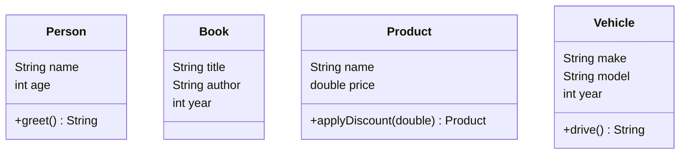

## 10.6 Records and Types in Clojure

In Clojure, records and types offer powerful mechanisms for defining structured data, enhancing performance, and integrating seamlessly with Java interfaces. This section delves into the intricacies of using `defrecord` to create named data structures, implementing interfaces, and leveraging the performance benefits of records over traditional maps. We will provide comprehensive examples and guide you through the practical applications of records in your Clojure projects.

### Defining Records

Clojure's `defrecord` is a construct that allows you to define a new data type with named fields. Unlike maps, which are flexible but can be inefficient for certain operations, records provide a more performant alternative with fixed fields.

#### Syntax and Structure

To define a record, use the `defrecord` macro. Here's a basic example:

```clojure
(defrecord Person [name age])
```

This creates a new `Person` type with two fields: `name` and `age`. Instances of this record can be created using the constructor function automatically provided by `defrecord`.

```clojure
(def john (->Person "John Doe" 30))
```

#### Accessing Fields

Fields in a record can be accessed using keywords:

```clojure
(println (:name john)) ; Output: John Doe
(println (:age john))  ; Output: 30
```

Alternatively, you can use the accessor functions that are automatically generated:

```clojure
(println (.name john)) ; Output: John Doe
(println (.age john))  ; Output: 30
```

#### Modifying Records

While records are immutable, you can create a modified copy using the `assoc` function:

```clojure
(def older-john (assoc john :age 31))
```

### Implementing Interfaces

One of the advantages of Clojure records is their ability to implement protocols and Java interfaces. This feature is essential for polymorphism and interoperability with Java.

#### Implementing Protocols

Suppose we have a protocol `Greetable`:

```clojure
(defprotocol Greetable
  (greet [this]))
```

We can implement this protocol in our `Person` record:

```clojure
(defrecord Person [name age]
  Greetable
  (greet [this] (str "Hello, my name is " name)))
```

Now, instances of `Person` can be used with the `greet` function:

```clojure
(println (greet john)) ; Output: Hello, my name is John Doe
```

#### Implementing Java Interfaces

Clojure records can also implement Java interfaces, which is particularly useful for integrating with existing Java libraries.

```clojure
(defrecord Person [name age]
  java.io.Serializable
  Greetable
  (greet [this] (str "Hello, my name is " name)))
```

### Performance Considerations

Records offer several performance benefits over maps, particularly in scenarios where you have a fixed set of fields and need efficient access and update operations.

#### Memory Efficiency

Records are more memory-efficient than maps because they store fields in a fixed structure rather than a hash map. This efficiency can be crucial in applications with large datasets or performance-critical components.

#### Faster Field Access

Accessing fields in a record is faster than in a map because records use direct field access, whereas maps require a hash lookup.

### Examples of Using Records

Let's explore some practical examples of using records in application code.

#### Example 1: Modeling a Simple Domain

Consider an application that manages a library of books. We can define a `Book` record:

```clojure
(defrecord Book [title author year])
```

Create instances of `Book`:

```clojure
(def book1 (->Book "Clojure for the Brave and True" "Daniel Higginbotham" 2015))
(def book2 (->Book "Programming Clojure" "Stuart Halloway" 2018))
```

Access and modify fields:

```clojure
(println (:title book1)) ; Output: Clojure for the Brave and True
(def updated-book1 (assoc book1 :year 2020))
```

#### Example 2: Implementing Business Logic

Suppose we want to implement a discount system for a shopping cart. We can define a `Product` record and a protocol for discountable items:

```clojure
(defprotocol Discountable
  (apply-discount [this discount]))

(defrecord Product [name price]
  Discountable
  (apply-discount [this discount]
    (assoc this :price (* price (- 1 discount)))))
```

Create a product and apply a discount:

```clojure
(def laptop (->Product "Laptop" 1000.0))
(def discounted-laptop (apply-discount laptop 0.1))
(println (:price discounted-laptop)) ; Output: 900.0
```

### Try It Yourself

Experiment with the following code by modifying the fields and implementing additional protocols:

```clojure
(defrecord Vehicle [make model year])
(defprotocol Drivable
  (drive [this]))

(defrecord Car [make model year]
  Drivable
  (drive [this] (str "Driving a " make " " model)))

(def my-car (->Car "Toyota" "Corolla" 2021))
(println (drive my-car))
```

### Visual Aids

To better understand how records and types map to Java classes, consider the following diagram:



This diagram illustrates how Clojure records correspond to Java-like classes with fields and methods.

### References and Links

- [Clojure Official Documentation](https://clojure.org/reference)
- [Clojure Community Resources](https://clojure.org/community/resources)
- [Transitioning from OOP to Functional Programming](https://www.lispcast.com/oo-to-fp/)
- [Clojure Protocols and Records](https://clojure.org/reference/protocols)
- [Java Interoperability in Clojure](https://clojure.org/reference/java_interop)

### Knowledge Check

To reinforce your understanding of records and types in Clojure, consider the following exercises:

1. Define a `Customer` record with fields `id`, `name`, and `email`. Implement a protocol `Contactable` with a method `contact-info` that returns a string with the customer's contact information.

2. Create a record `Order` with fields `order-id`, `customer`, and `items`. Implement a method to calculate the total price of the order.

3. Modify the `Person` record to implement a new protocol `Identifiable` with a method `get-id` that returns a unique identifier for the person.

### Encouraging Engagement

Embracing records and types in Clojure can significantly enhance your application's performance and maintainability. As you experiment with these constructs, you'll discover new ways to model data and integrate with Java systems seamlessly. Keep exploring and applying these concepts to see the tangible benefits in your codebase.

## **Test Your Knowledge: Records and Types in Clojure Quiz**



### Which Clojure construct is used to define a named data structure with fields?

- [x] defrecord
- [ ] defstruct
- [ ] deftype
- [ ] defclass

> **Explanation:** `defrecord` is used to define a named data structure with fields in Clojure.

### How do you create an instance of a Clojure record?

- [x] Using the constructor function
- [ ] Using the `new` keyword
- [ ] Using `def` keyword
- [ ] Using `create-instance` function

> **Explanation:** Instances of a record are created using the constructor function automatically provided by `defrecord`.

### What is the primary advantage of using records over maps in Clojure?

- [x] Performance benefits
- [ ] Flexibility
- [ ] Dynamic field addition
- [ ] Built-in serialization

> **Explanation:** Records provide performance benefits over maps due to their fixed structure and efficient field access.

### How can a Clojure record implement a Java interface?

- [x] By specifying the interface in the `defrecord` definition
- [ ] By using `extend-type`
- [ ] By using `extend-protocol`
- [ ] By using `implement-interface`

> **Explanation:** A Clojure record can implement a Java interface by specifying the interface in the `defrecord` definition.

### Which method is used to create a modified copy of a Clojure record?

- [x] assoc
- [ ] update
- [ ] merge
- [ ] modify

> **Explanation:** `assoc` is used to create a modified copy of a Clojure record by updating its fields.

### What is the purpose of the `defprotocol` construct in Clojure?

- [x] To define a set of functions that can be implemented by different types
- [ ] To define a new data type
- [ ] To create a new namespace
- [ ] To implement Java interfaces

> **Explanation:** `defprotocol` is used to define a set of functions that can be implemented by different types in Clojure.

### How can you access a field in a Clojure record?

- [x] Using keywords
- [x] Using accessor functions
- [ ] Using `get` function
- [ ] Using `field-access`

> **Explanation:** Fields in a Clojure record can be accessed using keywords or accessor functions.

### Which of the following is true about Clojure records?

- [x] They are immutable
- [ ] They allow dynamic field addition
- [ ] They are mutable
- [ ] They require explicit field declaration

> **Explanation:** Clojure records are immutable, meaning their fields cannot be changed after creation.

### What is the output of the following code snippet?
```clojure
(defrecord Animal [species age])
(def dog (->Animal "Dog" 5))
(println (:species dog))
```

- [x] Dog
- [ ] 5
- [ ] Animal
- [ ] species

> **Explanation:** The code accesses the `species` field of the `dog` record, which is "Dog".

### True or False: Clojure records can implement multiple protocols.

- [x] True
- [ ] False

> **Explanation:** Clojure records can implement multiple protocols, allowing them to support various functionalities.


