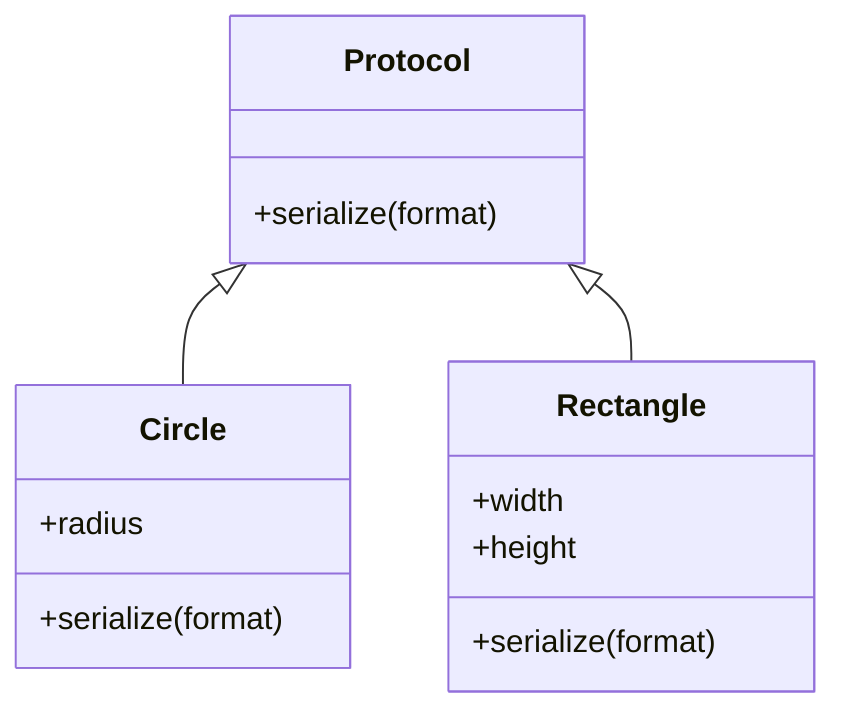

## 10.7 Best Practices for Protocols and Multimethods

In the realm of functional programming with Clojure, protocols and multimethods are powerful tools for achieving polymorphism and extensibility. They allow us to define flexible and reusable code structures that can adapt to different data types and behaviors. However, to harness their full potential, it's crucial to adhere to best practices that ensure maintainability, clarity, and robustness. In this section, we will delve into the design guidelines for protocols and multimethods, explore common pitfalls to avoid, and provide strategies for testing and documenting these polymorphic constructs.

### Design Guidelines for Protocols and Multimethods

#### Understand the Purpose of Protocols

Protocols in Clojure are akin to interfaces in Java. They define a set of functions that must be implemented by any data type that extends the protocol. When designing protocols, keep the following in mind:

- **Define Clear and Concise Protocols**: Aim for protocols that encapsulate a single responsibility or cohesive set of behaviors. This aligns with the Single Responsibility Principle (SRP) in object-oriented design.
- **Use Descriptive Names**: Protocol names should clearly convey their purpose. For instance, a protocol for serializing objects might be named `Serializable`.
- **Limit the Number of Functions**: Avoid bloated protocols with too many functions. Instead, break them down into smaller, focused protocols.

```clojure
(defprotocol Serializable
  "A protocol for serializing objects to different formats."
  (serialize [this format] "Serialize the object to the specified format."))
```

#### Design Multimethods with Flexibility

Multimethods in Clojure provide a way to define polymorphic functions based on custom dispatch logic. Unlike protocols, which are tied to specific data types, multimethods can dispatch on any value or combination of values.

- **Choose Appropriate Dispatch Functions**: The dispatch function should be chosen carefully to ensure it accurately represents the polymorphic behavior you want to achieve.
- **Use Hierarchies for Complex Dispatch Logic**: Clojure supports hierarchical dispatch, allowing you to define relationships between different dispatch values.

```clojure
(defmulti area
  "Calculate the area of a shape."
  (fn [shape] (:type shape)))

(defmethod area :circle
  [shape]
  (* Math/PI (:radius shape) (:radius shape)))

(defmethod area :rectangle
  [shape]
  (* (:width shape) (:height shape)))
```

#### Embrace Extensibility

Both protocols and multimethods are designed to be extended. Ensure your design allows for future extensions without breaking existing functionality.

- **Favor Open/Closed Principle**: Design protocols and multimethods so that they are open for extension but closed for modification. This means you can add new implementations or dispatch methods without altering the existing codebase.
- **Document Extension Points**: Clearly document how new data types can implement a protocol or how new dispatch values can be added to a multimethod.

### Avoiding Common Pitfalls

#### Overusing Protocols and Multimethods

While protocols and multimethods are powerful, they are not a panacea. Overusing them can lead to unnecessary complexity.

- **Avoid Premature Abstraction**: Don't create protocols or multimethods until you have a clear need for polymorphic behavior. Start with simple functions and refactor as needed.
- **Beware of Performance Overhead**: Multimethods can introduce performance overhead due to their dynamic dispatch mechanism. Use them judiciously in performance-critical code paths.

#### Inconsistent Naming and Documentation

Consistency in naming and documentation is crucial for maintainability.

- **Maintain Consistent Naming Conventions**: Use consistent naming conventions for protocols, functions, and dispatch values. This aids readability and understanding.
- **Document Intent and Usage**: Provide clear documentation for each protocol and multimethod, including their intended use and any assumptions or constraints.

### Testing Polymorphic Functions

Testing is an integral part of ensuring the reliability of your protocols and multimethods. Here are some strategies to effectively test these constructs:

#### Test Protocol Implementations

- **Write Unit Tests for Each Implementation**: Ensure that each data type implementing a protocol is thoroughly tested. Use mock data and edge cases to validate behavior.
- **Use Property-Based Testing**: Leverage property-based testing tools like `test.check` to verify that protocol implementations adhere to expected properties across a wide range of inputs.

```clojure
(ns myapp.test
  (:require [clojure.test :refer :all]
            [myapp.core :refer :all]))

(deftest test-serialize
  (testing "Serialization of objects"
    (is (= "{\"name\":\"John\"}" (serialize {:name "John"} :json)))))
```

#### Test Multimethod Dispatch Logic

- **Verify Dispatch Functionality**: Write tests to ensure that multimethods dispatch correctly based on the provided input.
- **Test All Dispatch Methods**: Ensure that each dispatch method is tested, including edge cases and invalid inputs.

```clojure
(deftest test-area
  (testing "Area calculation"
    (is (= 28.27 (area {:type :circle :radius 3})))
    (is (= 20 (area {:type :rectangle :width 4 :height 5})))))
```

### Documentation Tips

Proper documentation is key to the successful use and extension of protocols and multimethods.

#### Document Protocols Thoroughly

- **Include Purpose and Usage**: Clearly state the purpose of the protocol and how it should be used.
- **Provide Examples**: Include examples of how to implement the protocol for different data types.

#### Document Multimethods and Dispatch Logic

- **Describe Dispatch Criteria**: Clearly explain the dispatch logic and criteria used by the multimethod.
- **List Supported Dispatch Values**: Provide a list of all supported dispatch values and their corresponding methods.

### Encouraging Experimentation

To deepen your understanding of protocols and multimethods, experiment with the following exercises:

1. **Create a Protocol for a Payment System**: Define a protocol for processing payments with different methods (e.g., credit card, PayPal). Implement this protocol for at least two payment methods.

2. **Design a Multimethod for Shape Drawing**: Create a multimethod that draws different shapes (e.g., circle, rectangle) based on their type. Extend this multimethod with a new shape.

3. **Refactor Existing Code**: Identify a part of your codebase that could benefit from protocols or multimethods. Refactor it to use these constructs and observe the improvements.

### Visual Aids

To visualize the relationship between protocols, multimethods, and their implementations, consider the following diagram:



**Diagram Description**: This class diagram illustrates how the `Serializable` protocol is implemented by both `Circle` and `Rectangle` classes, each providing their own version of the `serialize` function.

### References and Further Reading

- [Clojure Official Documentation](https://clojure.org/reference)
- [Clojure Community Resources](https://clojure.org/community/resources)
- [Transitioning from OOP to Functional Programming](https://www.lispcast.com/oo-to-fp/)
- [Clojure Testing with `clojure.test`](https://clojure.github.io/clojure/clojure.test-api.html)
- [Property-Based Testing with `test.check`](https://github.com/clojure/test.check)

### Knowledge Check

To reinforce your understanding, try answering the following questions:

## **Test Your Knowledge: Best Practices for Protocols and Multimethods Quiz**



### What is the primary purpose of a protocol in Clojure?

- [x] To define a set of functions for polymorphic behavior
- [ ] To implement inheritance in Clojure
- [ ] To manage state changes in concurrent applications
- [ ] To create immutable data structures

> **Explanation:** Protocols in Clojure are used to define a set of functions that enable polymorphic behavior across different data types.

### Which of the following is a best practice when designing protocols?

- [x] Define clear and concise protocols
- [ ] Include as many functions as possible
- [ ] Use generic names for protocols
- [ ] Avoid documenting protocols

> **Explanation:** Best practices for designing protocols include defining clear and concise protocols that encapsulate a single responsibility.

### What is a common pitfall when using multimethods?

- [x] Introducing performance overhead
- [ ] Using too few dispatch values
- [ ] Relying on static dispatch logic
- [ ] Avoiding dynamic dispatch

> **Explanation:** Multimethods can introduce performance overhead due to their dynamic dispatch mechanism, so they should be used judiciously.

### How can you test protocol implementations effectively?

- [x] Write unit tests for each implementation
- [ ] Avoid testing edge cases
- [ ] Rely solely on integration tests
- [ ] Use only manual testing

> **Explanation:** Writing unit tests for each implementation ensures that the protocol functions behave as expected across different data types.

### What should be included in the documentation of a multimethod?

- [x] Dispatch criteria and supported values
- [ ] Only the dispatch function
- [ ] Implementation details of each method
- [ ] Internal logic of the dispatch function

> **Explanation:** The documentation of a multimethod should include the dispatch criteria and a list of supported dispatch values.

### True or False: Protocols in Clojure are similar to interfaces in Java.

- [x] True
- [ ] False

> **Explanation:** Protocols in Clojure are similar to interfaces in Java as they both define a set of functions that must be implemented by data types.

### Which of the following is NOT a characteristic of a well-designed protocol?

- [ ] Clear purpose
- [ ] Limited number of functions
- [x] Complex implementation details
- [ ] Descriptive naming

> **Explanation:** A well-designed protocol should have a clear purpose, a limited number of functions, and descriptive naming, but should not include complex implementation details.

### What is the benefit of using property-based testing for protocols?

- [x] Verifying expected properties across various inputs
- [ ] Testing only the happy path
- [ ] Avoiding edge cases
- [ ] Simplifying test setup

> **Explanation:** Property-based testing helps verify that protocol implementations adhere to expected properties across a wide range of inputs.

### Why is it important to document extension points in protocols and multimethods?

- [x] To guide future extensions without breaking existing functionality
- [ ] To prevent any future modifications
- [ ] To limit the use of protocols
- [ ] To ensure protocols are never extended

> **Explanation:** Documenting extension points helps guide future extensions and ensures that they do not break existing functionality.

### Which of the following is a strategy for avoiding premature abstraction with protocols?

- [x] Start with simple functions and refactor as needed
- [ ] Define protocols for every function
- [ ] Avoid using functions altogether
- [ ] Implement all possible use cases upfront

> **Explanation:** To avoid premature abstraction, start with simple functions and refactor to protocols as the need for polymorphic behavior arises.



By following these best practices, you can effectively leverage protocols and multimethods to create flexible, maintainable, and scalable applications in Clojure. As you continue to explore these constructs, remember to document your work, test thoroughly, and embrace the extensibility that Clojure offers.
