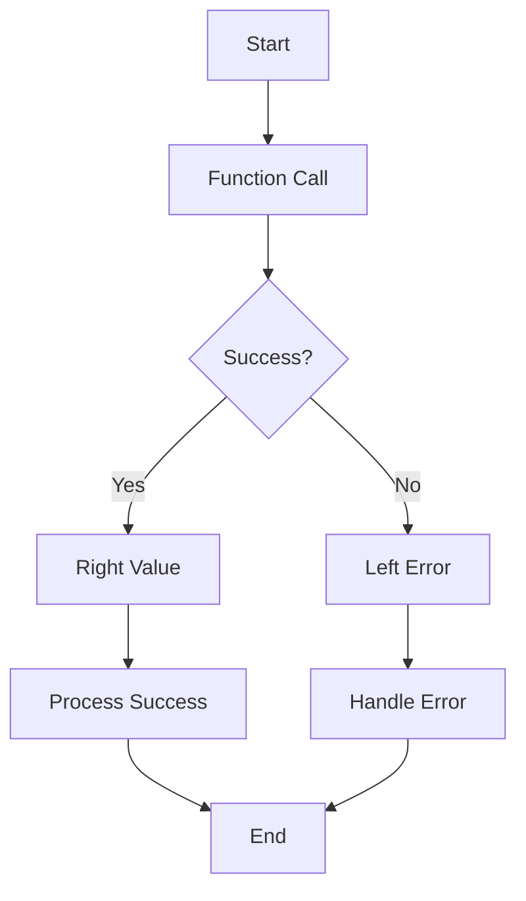

## 11.1 Functional Approaches to Error Handling

Error handling is a crucial aspect of software development, ensuring that applications can gracefully manage unexpected situations. In functional programming, error handling is approached with a focus on maintaining pure functions and predictable behavior. Let's delve into the principles and techniques of error handling in Clojure, a functional programming language that offers unique tools and paradigms for managing errors.

### Error Handling Principles

Functional programming emphasizes the use of pure functions—functions that, given the same input, always produce the same output without side effects. This predictability is a cornerstone of functional error handling. By ensuring that functions remain pure, we can build systems that are easier to reason about, test, and maintain.

#### Predictable Behavior

Predictable behavior in error handling means that functions should handle errors in a way that is consistent and expected by their callers. This can be achieved by:

- **Returning Error Values**: Instead of throwing exceptions, functions can return error values that represent the failure state. This approach aligns with the functional programming principle of explicitness.
- **Using Monadic Structures**: Monads like `Either` and `Maybe` encapsulate error handling within a functional context, providing a structured way to manage errors without breaking the flow of the program.

### Returning vs. Throwing Errors

In traditional object-oriented programming (OOP) languages like Java, exceptions are often used to handle errors. Exceptions can be powerful, but they also introduce non-local control flow, making it harder to reason about the behavior of a program. In contrast, functional programming often favors returning errors as values.

#### Returning Error Values

Returning error values involves designing functions to return a result that indicates either success or failure. This can be done using data structures like tuples or custom types that encapsulate both the result and any potential error.

**Example: Returning Error Values**

```clojure
(defn divide [numerator denominator]
  (if (zero? denominator)
    {:error "Division by zero"}
    {:result (/ numerator denominator)}))

;; Usage
(let [result (divide 10 0)]
  (if (:error result)
    (println "Error:" (:error result))
    (println "Result:" (:result result))))
```

In this example, the `divide` function returns a map containing either a `:result` or an `:error` key. This approach makes it clear when an error has occurred and allows the caller to handle it appropriately.

#### Throwing Exceptions

While returning error values is common in functional programming, there are cases where throwing exceptions might be appropriate, especially when interfacing with Java libraries or when an error is truly exceptional and should halt execution.

**Example: Throwing Exceptions**

```clojure
(defn divide-or-throw [numerator denominator]
  (if (zero? denominator)
    (throw (IllegalArgumentException. "Division by zero"))
    (/ numerator denominator)))

;; Usage
(try
  (println (divide-or-throw 10 0))
  (catch IllegalArgumentException e
    (println "Caught exception:" (.getMessage e))))
```

Here, the `divide-or-throw` function throws an exception if the denominator is zero. This approach is more aligned with traditional OOP error handling but can be useful in certain scenarios.

### Either/Maybe Monads

Monads provide a powerful abstraction for handling errors in a functional context. The `Either` and `Maybe` monads are commonly used for this purpose.

#### Either Monad

The `Either` monad represents a computation that can result in either a success (Right) or a failure (Left). This allows us to chain operations together, propagating errors without interrupting the flow of the program.

**Example: Either Monad**

```clojure
(defn safe-divide [numerator denominator]
  (if (zero? denominator)
    (left "Division by zero")
    (right (/ numerator denominator))))

(defn process-division [numerator denominator]
  (let [result (safe-divide numerator denominator)]
    (match result
      (left error) (println "Error:" error)
      (right value) (println "Result:" value))))

;; Usage
(process-division 10 0)
(process-division 10 2)
```

In this example, `safe-divide` returns an `Either` type, and `process-division` uses pattern matching to handle the result. This approach keeps error handling explicit and composable.

#### Maybe Monad

The `Maybe` monad is used to represent computations that might fail to return a value. It encapsulates the concept of optionality, similar to Java's `Optional` type.

**Example: Maybe Monad**

```clojure
(defn safe-root [x]
  (if (neg? x)
    nil
    (Math/sqrt x)))

(defn process-root [x]
  (let [result (safe-root x)]
    (if result
      (println "Square root:" result)
      (println "Error: Negative input"))))

;; Usage
(process-root -1)
(process-root 9)
```

Here, `safe-root` returns `nil` for negative inputs, representing a failure to compute a square root. The caller checks for `nil` to handle the error case.

### Examples of Functional Error Handling

Let's explore some examples that demonstrate functional error handling in Clojure, using the principles and techniques discussed.

#### Example 1: File Reading

Consider a function that reads a file and returns its contents. We can handle errors like file not found or permission denied by returning error values.

```clojure
(defn read-file [filename]
  (try
    {:result (slurp filename)}
    (catch Exception e
      {:error (.getMessage e)})))

;; Usage
(let [result (read-file "nonexistent.txt")]
  (if (:error result)
    (println "Error:" (:error result))
    (println "Contents:" (:result result))))
```

In this example, `read-file` returns a map with either the file contents or an error message. This makes it easy for the caller to handle different error cases.

#### Example 2: API Request

When making an API request, we can use the `Either` monad to handle potential errors like network failures or invalid responses.

```clojure
(defn fetch-data [url]
  (try
    (let [response (http/get url)]
      (if (= 200 (:status response))
        (right (:body response))
        (left "Invalid response")))
    (catch Exception e
      (left (.getMessage e)))))

(defn process-api-response [url]
  (let [result (fetch-data url)]
    (match result
      (left error) (println "Error:" error)
      (right data) (println "Data:" data))))

;; Usage
(process-api-response "http://example.com/api")
```

In this example, `fetch-data` returns an `Either` type, allowing the caller to handle errors in a structured way.

### Visual Aids

To better understand the flow of error handling in functional programming, let's look at a diagram that illustrates the data flow in a function using the `Either` monad.



This diagram shows how a function call can result in either a success or an error, and how each case is handled separately.

### References and Links

For further reading on functional error handling, consider exploring the following resources:

- [Clojure Official Documentation](https://clojure.org/reference)
- [Transitioning from OOP to Functional Programming](https://www.lispcast.com/oo-to-fp/)
- [Functional Error Handling in Clojure](https://clojure.org/guides/error_handling)
- [Clojure Community Resources](https://clojure.org/community/resources)

### Knowledge Check

To reinforce your understanding of functional error handling in Clojure, consider the following questions and exercises:

1. Explain the difference between returning error values and throwing exceptions in functional programming.
2. How does the `Either` monad help in managing errors functionally?
3. Write a function that uses the `Maybe` monad to handle a potential null value.
4. Modify the `fetch-data` function to handle timeouts as a specific error case.

### Encouraging Engagement

Embracing functional error handling can transform the way you write and maintain code. By focusing on pure functions and predictable behavior, you'll create systems that are more robust and easier to understand. As you explore these concepts, remember that each step forward is a step toward mastering functional programming.

### Formatting and Structure

This section has been organized with clear headings and subheadings to guide you through the principles and practices of functional error handling. Key concepts have been highlighted, and code examples are provided to illustrate each point.

### Best Practices for Tags

When tagging this content, consider using specific and relevant tags that reflect the article's focus on Clojure, functional programming, and error handling.

### Test Your Knowledge: Functional Approaches to Error Handling Quiz



### What is a key principle of error handling in functional programming?

- [x] Maintaining pure functions
- [ ] Using global state
- [ ] Relying on side effects
- [ ] Ignoring errors

> **Explanation:** Functional programming emphasizes pure functions, which do not rely on or modify global state, making error handling predictable and explicit.


### Which monad is commonly used to represent computations that might fail?

- [x] Maybe
- [ ] List
- [ ] Set
- [ ] Vector

> **Explanation:** The `Maybe` monad encapsulates computations that might fail to return a value, representing optionality.


### How does the Either monad help in error handling?

- [x] It encapsulates success and failure in a single structure
- [ ] It throws exceptions automatically
- [ ] It uses global variables for error tracking
- [ ] It hides errors from the caller

> **Explanation:** The `Either` monad represents computations that can result in either a success (Right) or a failure (Left), allowing errors to be handled functionally.


### What is the advantage of returning error values over throwing exceptions?

- [x] It keeps error handling explicit and composable
- [ ] It simplifies debugging
- [ ] It always improves performance
- [ ] It eliminates the need for error handling

> **Explanation:** Returning error values makes error handling explicit and allows functions to remain pure, facilitating composability.


### Which of the following is a common use case for throwing exceptions in Clojure?

- [x] Interfacing with Java libraries
- [ ] Handling all errors
- [ ] Avoiding error handling
- [ ] Ignoring null values

> **Explanation:** Throwing exceptions can be appropriate when interfacing with Java libraries or when dealing with truly exceptional cases.


### What is a potential drawback of using exceptions for error handling?

- [x] Non-local control flow
- [ ] Improved performance
- [ ] Increased readability
- [ ] Simplified code

> **Explanation:** Exceptions introduce non-local control flow, making it harder to reason about program behavior.


### How can the Maybe monad be used in Clojure?

- [x] To represent computations that might return nil
- [ ] To automatically retry failed computations
- [ ] To enforce type safety
- [ ] To eliminate all errors

> **Explanation:** The `Maybe` monad is used to represent computations that might fail to return a value, encapsulating optionality.


### What is a key benefit of using monads for error handling?

- [x] They provide a structured way to manage errors
- [ ] They eliminate the need for error handling
- [ ] They always improve performance
- [ ] They simplify syntax

> **Explanation:** Monads like `Either` and `Maybe` provide a structured way to manage errors, keeping error handling explicit and composable.


### How does the `safe-divide` function handle division by zero?

- [x] It returns an Either monad with a Left value
- [ ] It throws an exception
- [ ] It returns nil
- [ ] It logs an error

> **Explanation:** The `safe-divide` function returns an `Either` monad with a `Left` value to indicate an error.


### True or False: Functional error handling always avoids exceptions.

- [ ] True
- [x] False

> **Explanation:** While functional programming often favors returning error values, exceptions can still be used in certain scenarios, such as interfacing with Java libraries or handling truly exceptional cases.


