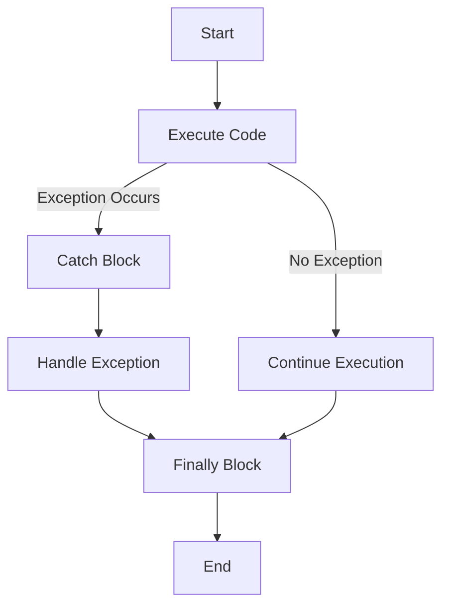

## 11.2 Exception Handling in Clojure

In the realm of functional programming, managing errors and exceptions is a crucial aspect of building robust and reliable applications. Clojure, with its roots in both Lisp and the Java Virtual Machine (JVM), provides a unique blend of functional programming paradigms and Java interoperability for exception handling. In this section, we will delve into the intricacies of exception handling in Clojure, exploring how to throw and catch exceptions, create custom exceptions, and apply best practices for effective error management.

### Throwing Exceptions

In Clojure, exceptions are thrown using the `throw` function. This function is similar to Java's `throw` statement and is used to signal that something unexpected has occurred. The `throw` function expects an instance of `java.lang.Throwable` or any of its subclasses, which includes exceptions and errors.

```clojure
;; Example: Throwing a simple exception
(defn divide [numerator denominator]
  (if (zero? denominator)
    (throw (IllegalArgumentException. "Denominator cannot be zero"))
    (/ numerator denominator)))

;; Usage
(try
  (divide 10 0)
  (catch IllegalArgumentException e
    (println "Caught exception:" (.getMessage e))))
```

In the above example, we define a `divide` function that throws an `IllegalArgumentException` if the denominator is zero. This is a straightforward way to enforce constraints and signal errors.

### Catching Exceptions

Catching exceptions in Clojure is done using the `try`, `catch`, and `finally` constructs, which are similar to Java's try-catch-finally blocks. These constructs allow us to handle exceptions gracefully and execute cleanup code if necessary.

```clojure
;; Example: Catching exceptions
(defn safe-divide [numerator denominator]
  (try
    (/ numerator denominator)
    (catch ArithmeticException e
      (println "ArithmeticException caught:" (.getMessage e))
      nil)
    (finally
      (println "Execution completed."))))

;; Usage
(safe-divide 10 0)
```

In this example, the `safe-divide` function attempts to divide two numbers. If an `ArithmeticException` occurs (e.g., division by zero), it is caught, and a message is printed. The `finally` block ensures that "Execution completed." is printed regardless of whether an exception was thrown.

### Custom Exceptions

Creating custom exceptions in Clojure involves defining a new class that extends `java.lang.Exception` or any of its subclasses. This is particularly useful when you need to represent domain-specific errors that are not covered by standard exceptions.

```clojure
;; Example: Defining a custom exception
(gen-class
  :name myapp.exceptions.CustomException
  :extends java.lang.Exception
  :constructors {[String] [String]}
  :init init
  :state state)

;; Throwing a custom exception
(defn risky-operation []
  (throw (myapp.exceptions.CustomException. "Something went wrong!")))

;; Catching the custom exception
(try
  (risky-operation)
  (catch myapp.exceptions.CustomException e
    (println "CustomException caught:" (.getMessage e))))
```

Here, we define `CustomException` using `gen-class`, which is a macro for generating Java-compatible classes in Clojure. We then throw and catch this custom exception in a function, demonstrating how to extend the exception handling mechanism for specific needs.

### Best Practices

While exceptions are a powerful tool for error handling, they should be used judiciously. Here are some best practices to consider:

1. **Use Exceptions Sparingly**: Exceptions should be reserved for truly exceptional conditions. For regular control flow, consider using alternative mechanisms such as `nil`, `Either`, or `Maybe` types.

2. **Prefer Pure Functions**: In functional programming, strive to keep functions pure and side-effect-free. This often means avoiding exceptions within core logic and instead returning error values that can be handled at a higher level.

3. **Leverage Java Interoperability**: Clojure's seamless integration with Java allows you to use existing Java exceptions and libraries. This can be particularly useful when working with Java codebases or libraries.

4. **Document Exception Behavior**: Clearly document which exceptions a function might throw and under what conditions. This helps other developers understand how to use the function correctly.

5. **Consider Performance Implications**: Throwing and catching exceptions can be costly in terms of performance. Ensure that exceptions are not used in performance-critical sections of code.

6. **Use `try` Blocks Wisely**: Keep `try` blocks small and focused. This makes it easier to understand which operations might throw exceptions and how they are handled.

7. **Avoid Swallowing Exceptions**: Ensure that exceptions are not silently ignored. At a minimum, log the exception or rethrow it to ensure that potential issues are not missed.

### Comparing Exception Handling in Java and Clojure

For developers transitioning from Java to Clojure, understanding the similarities and differences in exception handling can be helpful. In Java, exception handling is a core part of the language, with checked and unchecked exceptions. Clojure simplifies this model by only dealing with unchecked exceptions, as it does not enforce compile-time checks for exception handling.

```java
// Java Example: Exception Handling
try {
    int result = divide(10, 0);
} catch (ArithmeticException e) {
    System.out.println("Caught exception: " + e.getMessage());
} finally {
    System.out.println("Execution completed.");
}
```

In Clojure, the equivalent code is more concise due to its functional nature and the lack of checked exceptions:

```clojure
;; Clojure Example: Exception Handling
(try
  (divide 10 0)
  (catch ArithmeticException e
    (println "Caught exception:" (.getMessage e)))
  (finally
    (println "Execution completed.")))
```

### Visualizing Exception Handling Flow

To better understand the flow of exception handling in Clojure, let's visualize it using a flowchart. This diagram illustrates the process of executing code, encountering an exception, and handling it with `try`, `catch`, and `finally`.



**Diagram Description**: This flowchart represents the flow of exception handling in Clojure. The process begins with executing code. If no exception occurs, execution continues normally. If an exception occurs, control moves to the catch block, where the exception is handled. Regardless of whether an exception occurred, the finally block is executed, and then the process ends.

### Further Reading and Resources

For more information on exception handling and error management in Clojure, consider exploring the following resources:

- [Clojure Official Documentation](https://clojure.org/reference)
- [Clojure Community Resources](https://clojure.org/community/resources)
- [Java Exception Handling](https://docs.oracle.com/javase/tutorial/essential/exceptions/)
- [Transitioning from OOP to Functional Programming](https://www.lispcast.com/oo-to-fp/)

### Knowledge Check

To reinforce your understanding of exception handling in Clojure, consider the following questions:

1. What is the primary function used to throw exceptions in Clojure?
2. How does Clojure's exception handling differ from Java's?
3. When should custom exceptions be used in Clojure?
4. What are some best practices for using exceptions in functional programming?

### Exercises

1. **Implement a Function with Exception Handling**: Write a function that reads a file and handles potential IOExceptions. Ensure that the function gracefully handles the case where the file does not exist.

2. **Create a Custom Exception**: Define a custom exception for a domain-specific error in your application. Use this exception in a function and demonstrate how to catch it.

3. **Refactor Java Code to Clojure**: Take a Java method that uses checked exceptions and refactor it into a Clojure function using unchecked exceptions. Discuss the differences in approach.

### Test Your Knowledge: Exception Handling in Clojure Quiz



### What function is used to throw exceptions in Clojure?

- [x] throw
- [ ] catch
- [ ] try
- [ ] finally

> **Explanation:** The `throw` function is used to throw exceptions in Clojure.

### How do you catch exceptions in Clojure?

- [x] Using try and catch
- [ ] Using throw and catch
- [ ] Using if and else
- [ ] Using when and unless

> **Explanation:** Exceptions are caught in Clojure using the `try` and `catch` constructs.

### What should you extend to create a custom exception in Clojure?

- [x] java.lang.Exception
- [ ] java.lang.Error
- [ ] java.lang.Throwable
- [ ] clojure.lang.ExceptionInfo

> **Explanation:** Custom exceptions in Clojure should extend `java.lang.Exception`.

### What is a key difference between Java and Clojure exception handling?

- [x] Clojure does not have checked exceptions
- [ ] Clojure requires checked exceptions
- [ ] Java does not have checked exceptions
- [ ] Clojure uses checked exceptions

> **Explanation:** Unlike Java, Clojure does not enforce checked exceptions.

### When should you use exceptions in functional programming?

- [x] For truly exceptional conditions
- [ ] For regular control flow
- [ ] For handling all errors
- [ ] For logging purposes

> **Explanation:** Exceptions should be reserved for truly exceptional conditions.

### What is a best practice for try blocks?

- [x] Keep them small and focused
- [ ] Make them as large as possible
- [ ] Avoid using them
- [ ] Only use them for logging

> **Explanation:** Keeping try blocks small and focused helps in understanding and managing exceptions effectively.

### What should you do with exceptions in performance-critical code?

- [x] Avoid using them
- [ ] Use them liberally
- [ ] Log them only
- [ ] Ignore them

> **Explanation:** Exceptions can be costly in terms of performance, so they should be avoided in performance-critical code.

### How can you document exception behavior?

- [x] Clearly state which exceptions might be thrown
- [ ] Ignore exceptions in documentation
- [ ] Only document runtime exceptions
- [ ] Use comments sparingly

> **Explanation:** Clearly documenting which exceptions might be thrown helps developers understand how to use functions correctly.

### What is a common mistake when handling exceptions?

- [x] Swallowing exceptions
- [ ] Logging exceptions
- [ ] Documenting exceptions
- [ ] Catching exceptions

> **Explanation:** Swallowing exceptions can lead to missed issues and should be avoided.

### True or False: Clojure's exception handling is similar to Java's in terms of syntax.

- [x] True
- [ ] False

> **Explanation:** Clojure's exception handling syntax is similar to Java's, using `try`, `catch`, and `finally`.



By mastering exception handling in Clojure, we can build applications that are not only functional but also resilient and robust. Embrace these practices to enhance your Clojure development skills and create scalable, maintainable software solutions.
