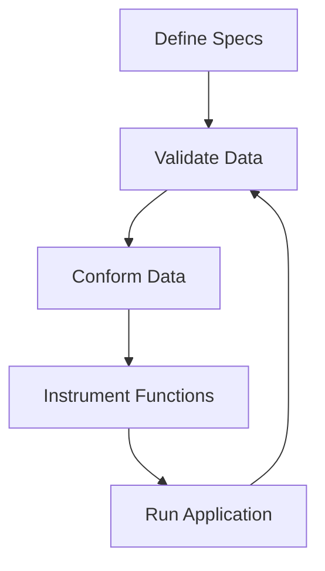

## 11.3 Using `clojure.spec` for Data Validation

In the world of functional programming with Clojure, ensuring that your data adheres to expected structures and constraints is crucial for building robust applications. `clojure.spec` is a powerful library that allows developers to define specifications for data and functions, validate data against these specifications, and instrument functions to ensure they receive valid inputs. This section will delve into the intricacies of `clojure.spec`, providing you with the tools to master data validation in your Clojure applications.

### Introduction to `clojure.spec`

`clojure.spec` is a Clojure library designed to provide a powerful way to describe the structure of data, validate it, and generate test data. It allows you to specify the shape and constraints of your data and functions, enabling more reliable and maintainable code. Unlike traditional type systems, `clojure.spec` is more flexible and expressive, making it a perfect fit for Clojure's dynamic nature.

#### Key Features of `clojure.spec`

- **Declarative Data Specifications**: Define what your data should look like using simple and expressive syntax.
- **Validation and Conformance**: Check if data conforms to a specification and transform it if necessary.
- **Instrumentation**: Automatically check function arguments against their specifications.
- **Generative Testing**: Generate test data automatically based on specifications.

### Writing Specs

The first step in using `clojure.spec` is writing specifications, or "specs," for your data. Specs are defined using the `s/def` function, which associates a spec with a keyword. Let's explore how to define specs for various data structures.

#### Defining Simple Specs

To define a spec for a simple data type, such as an integer or a string, you can use predicates. Predicates are functions that return a boolean value. For example, to define a spec for an integer, you can use the `int?` predicate:

```clojure
(require '[clojure.spec.alpha :as s])

;; Define a spec for an integer
(s/def ::age int?)
```

In this example, `::age` is a namespaced keyword representing the spec for an integer. The `int?` predicate ensures that any data conforming to this spec must be an integer.

#### Defining Composite Specs

For more complex data structures, such as maps, you can use `s/keys` to specify the required and optional keys. Here's an example of defining a spec for a map representing a person:

```clojure
;; Define a spec for a person map
(s/def ::name string?)
(s/def ::email string?)
(s/def ::person (s/keys :req [::name ::email] :opt [::age]))
```

In this example, the `::person` spec requires a map with `::name` and `::email` keys, both of which must be strings. The `::age` key is optional and must be an integer if present.

#### Using Predicates and Custom Specs

You can also define custom predicates and use them in your specs. For instance, if you want to specify that an age must be a positive integer, you can define a custom predicate:

```clojure
;; Define a custom predicate for positive integers
(defn positive-int? [n]
  (and (int? n) (pos? n)))

;; Use the custom predicate in a spec
(s/def ::positive-age positive-int?)
```

This custom predicate checks if a number is both an integer and positive, and it's used to define the `::positive-age` spec.

### Validating Data

Once you have defined your specs, you can validate data against them using `s/valid?` and `s/conform`.

#### Using `s/valid?`

The `s/valid?` function checks if a given piece of data conforms to a spec. It returns `true` if the data is valid and `false` otherwise. Here's how you can use it:

```clojure
;; Check if a value is a valid age
(s/valid? ::age 30) ;=> true
(s/valid? ::age "thirty") ;=> false
```

In this example, `s/valid?` checks if `30` is a valid `::age`, which it is, and if `"thirty"` is valid, which it is not.

#### Using `s/conform`

The `s/conform` function not only checks if data conforms to a spec but also returns a conformed value. If the data is invalid, it returns `:clojure.spec.alpha/invalid`. Here's an example:

```clojure
;; Conform a valid age
(s/conform ::age 30) ;=> 30

;; Attempt to conform an invalid age
(s/conform ::age "thirty") ;=> :clojure.spec.alpha/invalid
```

`conform` is particularly useful when you want to transform data during validation.

### Instrumenting Functions

One of the powerful features of `clojure.spec` is the ability to instrument functions. Instrumentation allows you to automatically validate function arguments against their specs, catching errors early in the development process.

#### Defining Function Specs

To instrument a function, you first need to define specs for its arguments and return value. You do this using `s/fdef`. Here's an example:

```clojure
;; Define a function spec
(s/fdef calculate-bmi
  :args (s/cat :weight number? :height number?)
  :ret number?)

;; Define the function
(defn calculate-bmi [weight height]
  (/ weight (* height height)))
```

In this example, the `calculate-bmi` function takes two arguments, `weight` and `height`, both of which must be numbers. The return value is also a number.

#### Enabling Instrumentation

To enable instrumentation, use the `s/instrument` function. This will automatically validate the arguments of the instrumented function against their specs:

```clojure
(require '[clojure.spec.test.alpha :as stest])

;; Instrument the function
(stest/instrument `calculate-bmi)

;; Call the function with valid arguments
(calculate-bmi 70 1.75) ;=> 22.857142857142858

;; Call the function with invalid arguments
(calculate-bmi "seventy" 1.75) ;=> Throws an exception
```

In this example, calling `calculate-bmi` with invalid arguments throws an exception, helping you catch errors early.

### Visualizing Data Flow with `clojure.spec`

To better understand how `clojure.spec` integrates into your application, consider the following data flow diagram. This diagram illustrates how data is validated and transformed using specs.



**Diagram Description**: This flowchart shows the process of defining specs, validating and conforming data, instrumenting functions, and running the application. The cycle emphasizes continuous validation throughout the application's lifecycle.

### Practical Example: Validating User Input

Let's apply what we've learned to a practical example. Suppose you're building a user registration system and need to validate user input.

#### Step 1: Define Specs

First, define specs for the user data:

```clojure
(s/def ::username (s/and string? #(> (count %) 3)))
(s/def ::password (s/and string? #(> (count %) 8)))
(s/def ::email (s/and string? #(re-matches #".+@.+\..+" %)))

(s/def ::user (s/keys :req [::username ::password ::email]))
```

#### Step 2: Validate User Input

Next, validate the user input against the specs:

```clojure
(defn validate-user [user]
  (if (s/valid? ::user user)
    (println "User data is valid.")
    (println "Invalid user data.")))

;; Example usage
(validate-user {:username "john_doe" :password "securePass123" :email "john@example.com"})
```

#### Step 3: Instrument Functions

Finally, instrument any functions that process user data to ensure they receive valid input:

```clojure
(s/fdef process-user
  :args (s/cat :user ::user)
  :ret nil?)

(defn process-user [user]
  (println "Processing user:" user))

(stest/instrument `process-user)

;; This will throw an exception if the user data is invalid
(process-user {:username "john_doe" :password "securePass123" :email "john@example.com"})
```

### Best Practices for Using `clojure.spec`

- **Start Simple**: Begin by defining specs for simple data types and gradually move to more complex structures.
- **Use Specs for Documentation**: Specs serve as documentation for your data structures and functions, making your code more understandable.
- **Combine Specs with Tests**: Use specs in conjunction with unit tests to ensure comprehensive coverage.
- **Leverage Generative Testing**: Use `clojure.spec`'s generative testing capabilities to automatically generate test data and explore edge cases.

### References and Further Reading

- [Clojure Official Documentation](https://clojure.org/reference)
- [clojure.spec Guide](https://clojure.org/guides/spec)
- [Clojure Community Resources](https://clojure.org/community/resources)
- [Transitioning from OOP to Functional Programming](https://www.lispcast.com/oo-to-fp/)

### Knowledge Check

Before moving on, let's reinforce your understanding of `clojure.spec` with a few questions:

- What is the primary purpose of `clojure.spec` in Clojure applications?
- How do you define a spec for a map with required and optional keys?
- What is the difference between `s/valid?` and `s/conform`?
- How does instrumentation help in function validation?

### Exercises

1. **Define a Spec for a Product**: Create a spec for a product map with required keys `:name` (string) and `:price` (positive number), and an optional key `:description` (string).

2. **Validate Product Data**: Write a function that validates a product map against the spec you defined.

3. **Instrument a Function**: Define and instrument a function that processes product data, ensuring it receives valid input.

**Solutions**

1. Define a Spec for a Product:
   ```clojure
   (s/def ::name string?)
   (s/def ::price (s/and number? pos?))
   (s/def ::description string?)

   (s/def ::product (s/keys :req [::name ::price] :opt [::description]))
   ```

2. Validate Product Data:
   ```clojure
   (defn validate-product [product]
     (if (s/valid? ::product product)
       (println "Product data is valid.")
       (println "Invalid product data.")))
   ```

3. Instrument a Function:
   ```clojure
   (s/fdef process-product
     :args (s/cat :product ::product)
     :ret nil?)

   (defn process-product [product]
     (println "Processing product:" product))

   (stest/instrument `process-product)
   ```

### Summary

In this section, we've explored the `clojure.spec` library, a powerful tool for specifying, validating, and instrumenting data in Clojure. By defining specs, validating data, and instrumenting functions, you can ensure that your Clojure applications are robust and reliable. As you continue to build scalable applications, remember to leverage `clojure.spec` to maintain data integrity and enhance your codebase's maintainability.

## **Test Your Knowledge: Using `clojure.spec` for Data Validation Quiz**



### What is the primary purpose of `clojure.spec` in Clojure applications?

- [x] To define, validate, and instrument data structures and functions.
- [ ] To replace the Clojure core library.
- [ ] To provide a new syntax for Clojure.
- [ ] To handle concurrency in Clojure applications.

> **Explanation:** `clojure.spec` is designed to define specifications for data and functions, validate data against these specifications, and instrument functions to ensure they receive valid inputs.

### How do you define a spec for a map with required and optional keys?

- [x] Using `s/keys` with `:req` and `:opt` options.
- [ ] Using `s/map` with `:required` and `:optional` options.
- [ ] Using `s/def` with `:req` and `:opt` options.
- [ ] Using `s/spec` with `:req` and `:opt` options.

> **Explanation:** `s/keys` is used to define specs for maps, specifying required keys with `:req` and optional keys with `:opt`.

### What is the difference between `s/valid?` and `s/conform`?

- [x] `s/valid?` returns a boolean, while `s/conform` returns a conformed value or `:clojure.spec.alpha/invalid`.
- [ ] `s/valid?` returns a conformed value, while `s/conform` returns a boolean.
- [ ] Both functions return the same result.
- [ ] `s/valid?` is used for functions, while `s/conform` is used for data.

> **Explanation:** `s/valid?` checks if data conforms to a spec and returns a boolean, whereas `s/conform` returns the conformed value or `:clojure.spec.alpha/invalid` if the data is invalid.

### How does instrumentation help in function validation?

- [x] By automatically checking function arguments against their specs.
- [ ] By replacing function arguments with default values.
- [ ] By logging function calls.
- [ ] By optimizing function performance.

> **Explanation:** Instrumentation automatically checks function arguments against their specs, catching errors early in the development process.

### Which function is used to enable instrumentation in `clojure.spec`?

- [x] `stest/instrument`
- [ ] `s/instrument`
- [ ] `s/enable`
- [ ] `s/check`

> **Explanation:** `stest/instrument` is used to enable instrumentation, validating function arguments against their specs.

### What is a key benefit of using `clojure.spec` for data validation?

- [x] It provides a declarative way to specify data structures and constraints.
- [ ] It automatically generates user interfaces.
- [ ] It replaces all error handling in Clojure.
- [ ] It eliminates the need for testing.

> **Explanation:** `clojure.spec` offers a declarative approach to specifying data structures and constraints, enhancing code reliability and maintainability.

### How can you define a custom predicate for a spec?

- [x] By defining a function that returns a boolean and using it in `s/def`.
- [ ] By using a macro to generate a predicate.
- [ ] By creating a new spec type.
- [ ] By overriding existing predicates.

> **Explanation:** Custom predicates are defined as functions returning a boolean and can be used in `s/def` to create specs.

### What is the role of `s/fdef` in `clojure.spec`?

- [x] To define specs for function arguments and return values.
- [ ] To define specs for data types.
- [ ] To generate random data.
- [ ] To optimize function calls.

> **Explanation:** `s/fdef` is used to define specs for function arguments and return values, facilitating function instrumentation.

### Which function checks if data conforms to a spec and returns a boolean?

- [x] `s/valid?`
- [ ] `s/conform`
- [ ] `s/check`
- [ ] `s/assert`

> **Explanation:** `s/valid?` checks if data conforms to a spec and returns a boolean indicating validity.

### True or False: `clojure.spec` can be used for generative testing.

- [x] True
- [ ] False

> **Explanation:** True. `clojure.spec` supports generative testing by automatically generating test data based on specifications.




