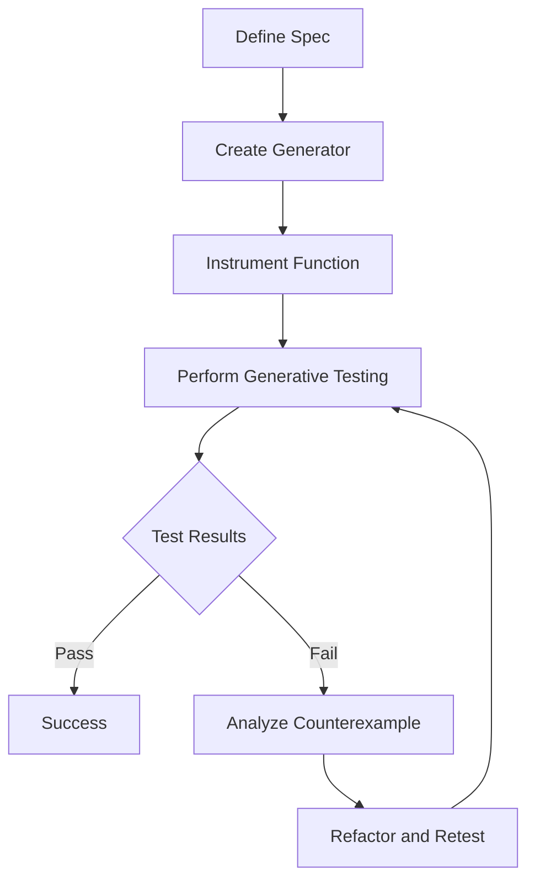

## 11.4 Generative Testing with `clojure.spec`

In this section, we delve into the realm of generative testing using `clojure.spec`, a powerful tool for ensuring the robustness and reliability of your Clojure applications. Generative testing, often referred to as property-based testing, allows us to define properties that our code should satisfy and automatically generate test cases to verify these properties. This approach not only enhances our testing capabilities but also helps uncover edge cases that traditional example-based testing might miss.

### Property-Based Testing

**Property-based testing** is a testing paradigm where the focus is on specifying the properties or invariants that a function or system should uphold, rather than providing specific input-output examples. This approach is particularly useful in functional programming, where functions are expected to behave predictably for a wide range of inputs.

In Clojure, `clojure.spec` provides robust support for property-based testing through its integration with test generators. By defining a spec for your functions, you can leverage `clojure.spec` to automatically generate a wide variety of inputs, ensuring that your functions behave correctly across a broad spectrum of scenarios.

#### Writing Generators

To perform generative testing, we first need to create generators that can produce a wide range of inputs for our functions. `clojure.spec` allows us to define custom generators for our specs, which can then be used to test our functions.

Here's a step-by-step guide to writing generators in `clojure.spec`:

1. **Define a Spec**: Start by defining a spec for the data you want to generate. This spec will describe the shape and constraints of the data.

2. **Create a Generator**: Use `clojure.spec.gen.alpha` to create a generator for your spec. You can either use built-in generators or define custom ones.

3. **Integrate with Tests**: Use the generated data to test your functions, ensuring that they satisfy the specified properties.

Let's look at an example:

```clojure
(require '[clojure.spec.alpha :as s]
         '[clojure.spec.gen.alpha :as gen])

;; Define a spec for a simple map with specific keys
(s/def ::person (s/keys :req-un [::name ::age]))

;; Define specs for the individual keys
(s/def ::name string?)
(s/def ::age (s/int-in 0 120))

;; Create a generator for the person spec
(def person-gen (s/gen ::person))

;; Example usage: Generate a sample person
(gen/sample person-gen 5)
```

In this example, we define a spec for a `person` map that requires `name` and `age` keys. We then create a generator for this spec, which can produce sample data for testing.

#### Using `stest`

Once we have our generators, we can use `stest` from `clojure.spec.test.alpha` to perform generative testing on our functions. The `stest/check` function is particularly useful for this purpose, as it automatically generates test cases based on the defined specs and checks that the function behaves as expected.

Here's how to use `stest/check`:

1. **Instrument the Function**: Use `stest/instrument` to ensure that the function is being checked against its spec.

2. **Perform the Check**: Call `stest/check` with the function you want to test. This will generate a series of test cases and verify that the function satisfies its spec.

3. **Analyze the Results**: Review the results to identify any failures or counterexamples.

Consider the following example:

```clojure
(require '[clojure.spec.test.alpha :as stest])

(defn add-person [db person]
  ;; Function to add a person to a database
  (conj db person))

;; Define a spec for the add-person function
(s/fdef add-person
  :args (s/cat :db (s/coll-of ::person) :person ::person)
  :ret (s/coll-of ::person))

;; Instrument the function
(stest/instrument `add-person)

;; Perform generative testing
(stest/check `add-person)
```

In this example, we define a function `add-person` that adds a person to a database. We specify a spec for the function's arguments and return value, instrument the function, and then use `stest/check` to perform generative testing.

#### Interpreting Results

When `stest/check` identifies a failure, it provides a counterexample that demonstrates the failure. Analyzing these counterexamples is crucial for understanding why the function did not satisfy its spec and how to fix the issue.

Here's how to interpret the results:

1. **Review the Counterexample**: Examine the input data that caused the failure. This will help you understand the edge case that was not handled correctly.

2. **Identify the Root Cause**: Determine why the function failed for the given input. This might involve reviewing the function logic or the spec definition.

3. **Refactor and Retest**: Modify the function or spec to handle the edge case, and then rerun the tests to ensure the issue is resolved.

### Visual Aids

To better understand the process of generative testing with `clojure.spec`, let's look at a flowchart that illustrates the steps involved:



**Figure 1**: Flowchart illustrating the process of generative testing with `clojure.spec`.

### References and Links

For further reading on `clojure.spec` and generative testing, consider exploring the following resources:

- [Clojure Official Documentation](https://clojure.org/reference/spec)
- [Clojure Spec Guide](https://clojure.org/guides/spec)
- [Generative Testing with Clojure](https://www.lispcast.com/generative-testing-with-clojure/)
- [Transitioning from OOP to Functional Programming](https://www.lispcast.com/oo-to-fp/)

### Knowledge Check

To reinforce your understanding of generative testing with `clojure.spec`, try answering the following questions:

1. What is property-based testing, and how does it differ from example-based testing?
2. How do you create custom generators for your specs in `clojure.spec`?
3. What is the purpose of `stest/instrument`, and how is it used in generative testing?
4. How can you interpret and analyze counterexamples provided by `stest/check`?

### Encouraging Engagement

Embracing generative testing can significantly enhance the reliability of your Clojure applications. By defining clear properties and leveraging automatic test generation, you'll uncover edge cases and ensure your code behaves correctly across a wide range of inputs. As you explore `clojure.spec`, remember that each step brings you closer to mastering functional programming and building scalable applications.

### Test Your Knowledge: Generative Testing with `clojure.spec` Quiz



### What is the primary goal of property-based testing?

- [x] To verify that functions satisfy specified properties across a wide range of inputs.
- [ ] To test functions with a fixed set of example inputs.
- [ ] To ensure that functions have no side effects.
- [ ] To optimize the performance of functions.

> **Explanation:** Property-based testing focuses on verifying that functions satisfy specified properties across a wide range of inputs, rather than relying on fixed example inputs.

### How do you define a custom generator in `clojure.spec`?

- [x] By using `clojure.spec.gen.alpha` to create a generator for a spec.
- [ ] By writing a separate function that generates random data.
- [ ] By specifying a range of values in the spec definition.
- [ ] By using a loop to iterate over possible values.

> **Explanation:** Custom generators are defined using `clojure.spec.gen.alpha`, which allows you to create generators for specific specs.

### What is the role of `stest/instrument` in generative testing?

- [x] It ensures that functions are checked against their specs during testing.
- [ ] It generates random inputs for testing functions.
- [ ] It optimizes the performance of the test suite.
- [ ] It logs the results of each test case.

> **Explanation:** `stest/instrument` ensures that functions are checked against their specs during testing, allowing generative tests to verify function behavior.

### How can you analyze a counterexample provided by `stest/check`?

- [x] By reviewing the input data that caused the failure and identifying the root cause.
- [ ] By ignoring it and rerunning the test suite.
- [ ] By modifying the spec to exclude the counterexample.
- [ ] By optimizing the function for performance.

> **Explanation:** Analyzing a counterexample involves reviewing the input data that caused the failure and identifying the root cause to address the issue.

### Which of the following is a benefit of generative testing?

- [x] It uncovers edge cases that example-based testing might miss.
- [x] It ensures that functions satisfy properties for a wide range of inputs.
- [ ] It reduces the need for unit tests.
- [ ] It guarantees 100% code coverage.

> **Explanation:** Generative testing uncovers edge cases and ensures that functions satisfy properties for a wide range of inputs, complementing unit tests.

### What is a common use case for `clojure.spec` in testing?

- [x] Validating function inputs and outputs against defined specs.
- [ ] Optimizing the performance of the codebase.
- [ ] Logging errors during execution.
- [ ] Managing application state.

> **Explanation:** `clojure.spec` is commonly used to validate function inputs and outputs against defined specs, ensuring correctness.

### How does `clojure.spec` support property-based testing?

- [x] By providing generators that produce a wide range of inputs for testing.
- [ ] By optimizing the execution of test cases.
- [ ] By logging each test case to a file.
- [ ] By reducing the number of tests needed.

> **Explanation:** `clojure.spec` supports property-based testing by providing generators that produce a wide range of inputs for testing, allowing for comprehensive verification.

### What should you do after identifying a failure in generative testing?

- [x] Analyze the counterexample, refactor the function or spec, and retest.
- [ ] Ignore the failure and proceed with development.
- [ ] Optimize the function for better performance.
- [ ] Modify the test suite to exclude the failure.

> **Explanation:** After identifying a failure, you should analyze the counterexample, refactor the function or spec, and retest to ensure the issue is resolved.

### True or False: Generative testing guarantees that all possible edge cases are covered.

- [ ] True
- [x] False

> **Explanation:** Generative testing significantly increases the likelihood of uncovering edge cases but does not guarantee that all possible edge cases are covered.



By mastering generative testing with `clojure.spec`, you are well on your way to building more robust and reliable Clojure applications. Keep experimenting and refining your skills to fully harness the power of functional programming.
