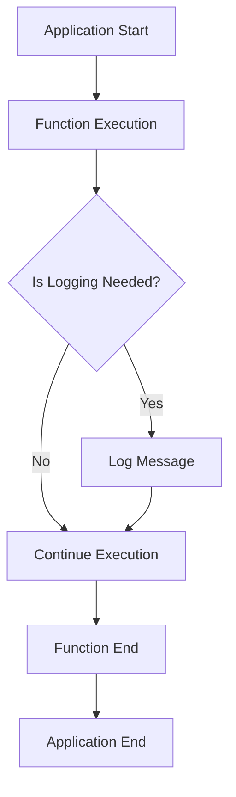

## 11.6 Structured Logging in Functional Code

As we delve deeper into the world of functional programming with Clojure, one aspect that stands out for its critical role in maintaining robust applications is logging. In this section, we will explore the importance of structured logging in functional code, how to implement it without introducing side effects, and the tools available to aid this process. 

### Importance of Logging

Logging is a fundamental practice in software development, especially in production systems, where it serves as a vital tool for diagnosing issues, understanding system behavior, and ensuring smooth operation. Let's explore why logging is crucial:

- **Diagnosis and Debugging**: Logging provides insights into the application's runtime behavior, making it easier to diagnose and fix issues.
- **Monitoring and Auditing**: Logs can be used to monitor system health and audit user actions, which is essential for security and compliance.
- **Performance Tuning**: By analyzing logs, developers can identify performance bottlenecks and optimize system performance.
- **Historical Record**: Logs serve as a historical record of system events, which can be invaluable for post-mortem analysis.

In functional programming, logging must be approached carefully to maintain the purity and immutability principles that are core to the paradigm.

### Functional Logging Practices

In functional programming, maintaining purity and avoiding side effects are paramount. This poses a challenge for logging, which inherently involves side effects. Here are some strategies to incorporate logging while adhering to functional principles:

- **Pure Functions**: Ensure that logging does not alter the behavior of pure functions. Use logging in higher-order functions or at the boundaries of your system where side effects are expected.
- **Separation of Concerns**: Keep logging logic separate from business logic. This can be achieved by using middleware or decorators that handle logging.
- **Immutable Data**: Use immutable data structures for log messages to maintain consistency and thread safety.
- **Contextual Information**: Pass contextual information explicitly to logging functions to avoid hidden dependencies.

#### Code Example: Logging in a Pure Function

```clojure
(defn pure-add [a b]
  ;; This function remains pure as it does not perform any logging directly
  (+ a b))

(defn log-addition [a b result]
  ;; Logging is done separately to maintain purity in pure-add
  (println (str "Adding " a " and " b " resulted in " result)))

(defn add-with-logging [a b]
  (let [result (pure-add a b)]
    (log-addition a b result)
    result))

;; Usage
(add-with-logging 3 4)
```

In this example, `pure-add` remains a pure function, while `log-addition` handles the side effect of logging.

### Logging Libraries

Clojure offers several libraries that facilitate structured logging, making it easier to manage logs in a functional application. Two popular libraries are Timber and tools.logging.

#### Timber

[Timber](https://github.com/functionalbytes/timber) is a structured logging library designed for Clojure. It provides a functional interface for logging, allowing developers to incorporate logging without compromising on functional purity.

- **Structured Logs**: Timber allows for structured log messages, which can be easily parsed and analyzed.
- **Functional Interface**: The library provides a functional API that integrates seamlessly with Clojure's functional paradigms.
- **Extensibility**: Timber can be extended with custom loggers to suit specific needs.

#### tools.logging

[tools.logging](https://clojure.github.io/tools.logging/) is a popular logging library that provides a simple, idiomatic way to log messages in Clojure applications.

- **Flexibility**: It supports multiple logging backends, allowing developers to choose the best fit for their needs.
- **Ease of Use**: The library offers a straightforward API for logging at various levels (e.g., info, warn, error).
- **Integration**: tools.logging can be easily integrated into existing Clojure projects.

#### Code Example: Using tools.logging

```clojure
(require '[clojure.tools.logging :as log])

(defn divide [numerator denominator]
  (try
    (/ numerator denominator)
    (catch ArithmeticException e
      (log/error e "Division by zero error")
      nil)))

;; Usage
(divide 10 0)
```

In this example, tools.logging is used to log an error message when a division by zero occurs.

### Contextual Logging

Contextual logging involves including additional context in log messages to provide more information about the application's state at the time of logging. This can significantly aid in debugging and understanding system behavior.

- **Request Context**: Include information about the current request, such as user ID or session ID, in log messages.
- **Execution Context**: Log details about the execution environment, such as thread ID or function name.
- **Custom Context**: Add application-specific context, such as transaction ID or operation type.

#### Code Example: Contextual Logging with tools.logging

```clojure
(require '[clojure.tools.logging :as log])

(defn process-request [user-id request]
  (log/info {:user-id user-id :request request} "Processing request")
  ;; Simulate request processing
  (Thread/sleep 1000)
  (log/info {:user-id user-id :request request} "Request processed"))

;; Usage
(process-request 123 {:action "login" :timestamp "2024-11-25T12:34:56Z"})
```

In this example, contextual information such as user ID and request details are included in the log messages.

### Visual Aids: Logging Workflow

To better understand how structured logging fits into a functional application, let's visualize the logging workflow:



**Figure 1: Logging Workflow in a Functional Application**

### References and Links

For further reading on logging in Clojure, consider the following resources:

- [Clojure Official Documentation](https://clojure.org/reference)
- [Clojure Community Resources](https://clojure.org/community/resources)
- [Timber Logging Library](https://github.com/functionalbytes/timber)
- [tools.logging Documentation](https://clojure.github.io/tools.logging/)

### Knowledge Check

To ensure understanding, consider the following questions:

1. Why is logging important in production systems?
2. How can logging be implemented in a functional way without introducing side effects?
3. What are the benefits of using structured logging?
4. How does contextual logging aid in debugging?

### Encouraging Engagement

Embracing structured logging in functional programming can be challenging, but with each step, you'll gain a deeper understanding and see tangible benefits in your codebase. Experiment with the code examples provided, and explore the libraries mentioned to find the best fit for your applications.

### Best Practices for Tags

When tagging this section, consider using the following tags:

- "Clojure"
- "Functional Programming"
- "Structured Logging"
- "Error Handling"
- "Logging Libraries"
- "Contextual Logging"
- "Debugging"
- "Production Systems"

## **Test Your Knowledge: Structured Logging in Functional Code Quiz**



### What is the primary purpose of logging in production systems?

- [x] Diagnosing issues and understanding system behavior
- [ ] Improving application performance
- [ ] Enhancing user interface design
- [ ] Reducing code complexity

> **Explanation:** Logging is crucial for diagnosing issues and understanding the behavior of systems in production environments.

### How can logging be incorporated into functional code without introducing side effects?

- [x] By using higher-order functions or middleware
- [ ] By directly embedding logging statements in pure functions
- [ ] By using global variables to store log messages
- [ ] By avoiding logging altogether

> **Explanation:** Logging should be handled in higher-order functions or at system boundaries to avoid side effects in pure functions.

### Which library is designed for structured logging in Clojure?

- [x] Timber
- [ ] Logback
- [ ] SLF4J
- [ ] Log4j

> **Explanation:** Timber is a structured logging library specifically designed for Clojure applications.

### What is a benefit of contextual logging?

- [x] It provides additional information for debugging
- [ ] It reduces the size of log files
- [ ] It simplifies the logging process
- [ ] It eliminates the need for error handling

> **Explanation:** Contextual logging includes additional information in log messages, aiding in debugging and understanding system behavior.

### Which of the following is an example of contextual information?

- [x] User ID
- [ ] Log file path
- [x] Request details
- [ ] Log level

> **Explanation:** Contextual information can include user IDs and request details, which provide more context for log messages.

### What is a key feature of the tools.logging library?

- [x] It supports multiple logging backends
- [ ] It only logs error messages
- [ ] It requires a specific logging format
- [ ] It is only compatible with Java applications

> **Explanation:** tools.logging is flexible and supports multiple logging backends, making it versatile for various applications.

### How does structured logging differ from traditional logging?

- [x] It uses structured data formats like JSON
- [ ] It logs messages in plain text
- [x] It allows for easier parsing and analysis
- [ ] It requires manual log parsing

> **Explanation:** Structured logging uses formats like JSON, which are easier to parse and analyze compared to traditional plain text logs.

### What is the role of immutable data in logging?

- [x] It ensures consistency and thread safety
- [ ] It allows for mutable log messages
- [ ] It simplifies log message formatting
- [ ] It reduces the need for logging

> **Explanation:** Using immutable data structures in logging ensures consistency and thread safety, which is crucial in concurrent applications.

### What should be included in a log message to make it more informative?

- [x] Contextual information
- [ ] Only the error message
- [ ] Log file location
- [ ] Function name only

> **Explanation:** Including contextual information in log messages makes them more informative and useful for debugging.

### True or False: Logging should alter the behavior of pure functions.

- [ ] True
- [x] False

> **Explanation:** Logging should not alter the behavior of pure functions; it should be handled separately to maintain functional purity.


