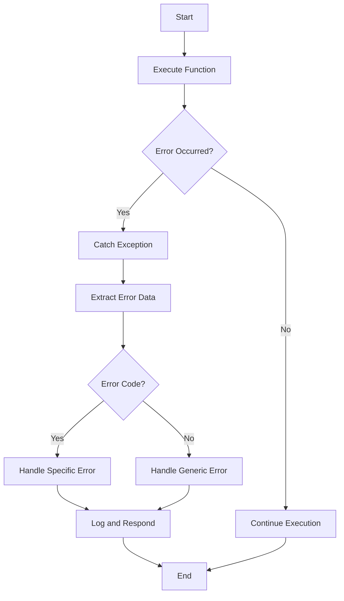

## 11.7 Best Practices for Error Reporting

In the realm of software development, effective error reporting is crucial for maintaining robust and user-friendly applications. In Clojure, a functional language known for its immutability and expressive syntax, error reporting takes on unique characteristics that align with its functional paradigms. This section delves into best practices for error reporting in Clojure, focusing on crafting clear error messages, differentiating between developer and user errors, utilizing error codes, and centralizing error handling logic.

### Clear Error Messages

#### Importance of Informative and Actionable Error Messages

Error messages are the primary means of communication between your application and its users or developers when something goes wrong. They should be informative, providing enough context to understand what went wrong, and actionable, suggesting potential solutions or next steps.

- **Clarity and Precision**: Ensure that error messages are clear and precise. Avoid technical jargon that might confuse end-users. For developers, include sufficient technical details to aid in debugging.
  
- **Contextual Information**: Provide context about where the error occurred, such as the function name, input values, or the specific condition that triggered the error.

- **Actionable Suggestions**: Whenever possible, include suggestions for resolving the error. This could be as simple as checking input values or consulting documentation for more complex issues.

**Example:**

```clojure
(defn divide [numerator denominator]
  (if (zero? denominator)
    (throw (ex-info "Division by zero error" 
                    {:numerator numerator 
                     :denominator denominator
                     :suggestion "Ensure the denominator is not zero."}))
    (/ numerator denominator)))

;; Usage
(try
  (divide 10 0)
  (catch Exception e
    (println "Error:" (.getMessage e))
    (println "Details:" (ex-data e))))
```

In this example, the error message clearly states the problem ("Division by zero error") and provides actionable advice ("Ensure the denominator is not zero").

### User-Friendly Errors

#### Differentiating Between Developer and User Errors

In Clojure, as in any programming language, it's crucial to distinguish between errors meant for developers and those intended for end-users. Developer errors often contain technical details useful for debugging, while user errors should be simplified and focused on guiding the user.

- **Developer Errors**: These should include stack traces, variable states, and other technical details. Use Clojure's `ex-info` and `ex-data` to encapsulate additional debugging information.

- **User Errors**: Simplify these messages. Focus on what the user can do to correct the issue. Avoid exposing internal logic or sensitive information.

**Example:**

```clojure
(defn process-user-input [input]
  (try
    ;; Simulate processing
    (if (nil? input)
      (throw (ex-info "Input cannot be nil" 
                      {:user-message "Please provide valid input."}))
      (println "Processing input:" input))
    (catch Exception e
      (let [user-message (get (ex-data e) :user-message)]
        (println (or user-message "An unexpected error occurred."))))))
```

In this example, the error intended for the user is extracted from the exception data, ensuring that only relevant information is presented.

### Error Codes and Handling Strategies

#### Using Error Codes or Types

Error codes or types provide a structured way to categorize and handle errors. They enable developers to write more predictable and maintainable error handling logic.

- **Consistent Error Codes**: Define a set of error codes or types that are consistent across your application. This allows for easier pattern matching and handling.

- **Categorize Errors**: Group similar errors under a common code or type. This can simplify error handling logic and make it more robust.

**Example:**

```clojure
(defn fetch-resource [resource-id]
  (let [resource (find-resource resource-id)]
    (if resource
      resource
      (throw (ex-info "Resource not found" 
                      {:error-code :resource-not-found
                       :resource-id resource-id})))))

;; Handling errors
(try
  (fetch-resource 42)
  (catch Exception e
    (case (:error-code (ex-data e))
      :resource-not-found (println "The requested resource could not be found.")
      (println "An unexpected error occurred."))))
```

Here, an error code `:resource-not-found` is used to categorize the error, allowing for specific handling logic.

### Centralized Error Handling

#### Centralizing Error Handling Logic

Centralized error handling promotes consistency and reduces redundancy in your codebase. It allows you to manage error responses in a single location, making it easier to update and maintain.

- **Middleware for Error Handling**: In web applications, use middleware to catch and handle errors centrally. This ensures that all errors are processed consistently.

- **Error Handling Functions**: Create utility functions for common error handling tasks, such as logging or transforming error messages.

**Example:**

```clojure
(defn handle-error [e]
  (let [error-data (ex-data e)]
    (case (:error-code error-data)
      :resource-not-found (println "Resource not found.")
      :validation-error (println "Input validation failed.")
      (println "An unexpected error occurred."))))

(defn with-error-handling [f]
  (try
    (f)
    (catch Exception e
      (handle-error e))))

;; Usage
(with-error-handling #(fetch-resource 42))
```

In this example, `handle-error` centralizes the logic for processing different error codes, while `with-error-handling` provides a reusable wrapper for executing functions with error handling.

### Visual Aids

To better understand how error handling in Clojure can be structured, let's look at a flowchart that illustrates the error handling process:



**Diagram Description**: This flowchart depicts the process of executing a function with error handling. If an error occurs, the exception is caught, error data is extracted, and specific or generic error handling logic is applied based on the presence of an error code.

### References and Links

For further reading and deeper dives into error handling and reporting in Clojure, consider the following resources:

- [Clojure Official Documentation](https://clojure.org/reference)
- [Clojure Community Resources](https://clojure.org/community/resources)
- [Transitioning from OOP to Functional Programming](https://www.lispcast.com/oo-to-fp/)

### Knowledge Check

To reinforce your understanding of best practices for error reporting in Clojure, consider the following questions and exercises:

- What are the key differences between developer and user error messages?
- How can error codes improve error handling consistency?
- Implement a centralized error handling function for a simple Clojure application.
- Modify the `divide` function example to include logging of errors to a file.

### Encouraging Engagement

Embracing functional programming in Clojure, especially in the context of error handling, can be challenging but rewarding. As you continue to explore these concepts, remember that each step you take will enhance the robustness and user-friendliness of your applications. Keep experimenting with the examples provided, and don't hesitate to dive deeper into the resources linked above.

### Test Your Knowledge: Best Practices for Error Reporting Quiz



### Which of the following is a key characteristic of a good error message?

- [x] Informative and actionable
- [ ] Brief and cryptic
- [ ] Technical and complex
- [ ] Vague and general

> **Explanation:** A good error message should be informative and actionable, providing context and suggesting solutions.

### How should developer errors differ from user errors?

- [x] Developer errors should include technical details.
- [ ] User errors should include stack traces.
- [x] User errors should be simplified.
- [ ] Developer errors should be vague.

> **Explanation:** Developer errors should contain technical details useful for debugging, while user errors should be simplified and focused on guiding the user.

### What is the benefit of using error codes in error handling?

- [x] They enable structured and consistent error handling.
- [ ] They make error messages longer.
- [ ] They confuse users with technical jargon.
- [ ] They are only useful for logging.

> **Explanation:** Error codes provide a structured way to categorize and handle errors, enabling consistent error handling logic.

### What is a best practice for centralized error handling?

- [x] Use middleware for error handling in web applications.
- [ ] Scatter error handling logic throughout the codebase.
- [ ] Avoid using utility functions for error handling.
- [ ] Handle errors individually in each function.

> **Explanation:** Centralizing error handling, such as using middleware in web applications, promotes consistency and reduces redundancy.

### Which of the following is a benefit of providing actionable suggestions in error messages?

- [x] Users can resolve issues more easily.
- [ ] It makes error messages longer.
- [x] It improves user experience.
- [ ] It confuses users with technical details.

> **Explanation:** Actionable suggestions help users resolve issues and improve the overall user experience.

### What should be included in a developer error message?

- [x] Stack traces and variable states
- [ ] Simplified user instructions
- [ ] Only the error code
- [ ] Vague descriptions

> **Explanation:** Developer error messages should include technical details like stack traces and variable states to aid debugging.

### How can centralized error handling improve a codebase?

- [x] By reducing redundancy and promoting consistency
- [ ] By scattering error handling logic
- [x] By making updates easier
- [ ] By complicating error handling

> **Explanation:** Centralized error handling reduces redundancy, promotes consistency, and makes updates easier.

### What is a key consideration when writing user error messages?

- [x] Simplify and focus on guidance
- [ ] Include technical jargon
- [ ] Provide detailed stack traces
- [ ] Use complex language

> **Explanation:** User error messages should be simplified and focused on providing guidance without technical jargon.

### What role do error codes play in error handling?

- [x] They categorize errors for easier handling.
- [ ] They make error messages longer.
- [ ] They are only for logging purposes.
- [ ] They confuse users.

> **Explanation:** Error codes categorize errors, making them easier to handle consistently.

### True or False: Centralized error handling should be avoided in functional programming.

- [ ] True
- [x] False

> **Explanation:** Centralized error handling is beneficial in functional programming as it promotes consistency and reduces redundancy.



By following these best practices for error reporting in Clojure, you can create applications that are not only robust and scalable but also user-friendly and easy to maintain. As you continue to develop your skills in functional programming, remember that effective error handling is a key component of successful software development.
