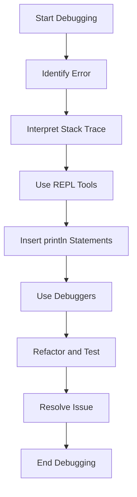

## 11.8 Debugging Functional Programs

Debugging functional programs, especially in a language like Clojure, requires a shift in mindset from traditional object-oriented debugging techniques. With its emphasis on immutability and pure functions, Clojure offers unique challenges and opportunities for debugging. In this section, we will explore various strategies and tools that can help you effectively debug Clojure programs.

### Debugging Techniques in Clojure

#### REPL-Driven Development

One of the most powerful tools in a Clojure developer's toolkit is the REPL (Read-Eval-Print Loop). REPL-driven development allows you to interactively evaluate code, test functions, and inspect data structures in real-time. This iterative process not only speeds up development but also aids in debugging by allowing you to experiment and refine your code on the fly.

**Steps for Effective REPL-Driven Debugging:**

1. **Evaluate Small Units of Code:** Break down your code into small, testable units. Evaluate these units in the REPL to verify their correctness.
   
2. **Use `def` and `defn`:** Temporarily redefine functions and variables in the REPL to test changes without modifying your source files.

3. **Inspect Data Structures:** Use built-in functions like `prn`, `pprint`, and `print-table` to inspect and visualize data structures.

4. **Leverage REPL History:** Use the REPL's command history to revisit previous evaluations and refine your approach.

5. **Integrate with Editors:** Utilize REPL integration with editors like Emacs (via CIDER) or IntelliJ IDEA (via Cursive) to streamline your workflow.

**Code Example:**

```clojure
;; Define a simple function to calculate the factorial of a number
(defn factorial [n]
  (if (<= n 1)
    1
    (* n (factorial (dec n)))))

;; Evaluate the function in the REPL
(factorial 5) ;; => 120

;; Test edge cases
(factorial 0) ;; => 1
(factorial -1) ;; => 1 (May need handling for negative numbers)
```

#### Inserting `println` Statements

While functional programming encourages immutability and side-effect-free functions, inserting `println` statements can still be a practical way to trace program execution and inspect intermediate values.

**Best Practices for Using `println`:**

- **Targeted Insertion:** Insert `println` statements at strategic points in your code to log variable values and function calls.
- **Remove or Comment Out:** Once debugging is complete, remove or comment out `println` statements to maintain code cleanliness.
- **Use Conditional Logging:** Implement conditional logging to enable or disable logging based on environment variables or configuration settings.

**Code Example:**

```clojure
(defn process-data [data]
  (println "Processing data:" data)
  (map inc data))

;; Debugging output
(process-data [1 2 3]) ;; Output: Processing data: [1 2 3]
```

#### Using Debuggers

Clojure supports several debuggers that can help you step through code, set breakpoints, and inspect program state.

**Popular Debugging Tools:**

- **nREPL:** A networked REPL server that provides a powerful platform for interactive development and debugging.
- **CIDER:** An Emacs package that integrates with nREPL, offering advanced debugging features such as breakpoints and stack trace navigation.
- **Flow-Storm:** A time-travel debugger that allows you to explore program execution history and replay code execution.

### Understanding Stack Traces

Stack traces are invaluable for diagnosing errors in Clojure programs. However, interpreting them can be challenging due to the presence of Java interop and Clojure's dynamic nature.

**Steps to Interpret Stack Traces:**

1. **Identify the Root Cause:** Look for the first occurrence of an error message or exception in the stack trace.
   
2. **Trace Function Calls:** Follow the sequence of function calls leading up to the error to understand the execution path.

3. **Filter Noise:** Use tools like `clojure.stacktrace` to filter out irrelevant parts of the stack trace and focus on the most informative sections.

4. **Map to Source Code:** Relate stack trace entries to your source code files and line numbers to pinpoint the error location.

**Code Example:**

```clojure
;; Simulate an error by dividing by zero
(defn divide [a b]
  (/ a b))

;; Call the function with zero as the divisor
(divide 10 0) ;; Throws ArithmeticException

;; Example stack trace:
;; java.lang.ArithmeticException: Divide by zero
;; at user/divide (form-init1234567890.clj:3)
;; at user/eval1234567890 (form-init1234567890.clj:6)
```

### REPL Tools for Interactive Debugging

#### nREPL

nREPL is a Clojure networked REPL server that provides a robust platform for interactive development and debugging. It supports various clients, including CIDER, which enhances the debugging experience with features like code evaluation, stack trace analysis, and more.

**nREPL Features:**

- **Remote Debugging:** Connect to remote Clojure processes for debugging.
- **Middleware Support:** Extend functionality with middleware for tasks like code completion and error handling.
- **Integration with Editors:** Seamless integration with popular editors like Emacs and IntelliJ IDEA.

**Setting Up nREPL:**

1. **Add nREPL Dependency:** Include nREPL in your `project.clj` or `deps.edn` file.
   
2. **Start nREPL Server:** Launch the nREPL server from the command line or your editor.

3. **Connect Client:** Use a compatible client, such as CIDER, to connect to the nREPL server and start debugging.

#### CIDER

CIDER is an Emacs package that provides a comprehensive Clojure development environment, including advanced debugging capabilities.

**CIDER Debugging Features:**

- **Breakpoints:** Set breakpoints in your code to pause execution and inspect state.
- **Stack Trace Navigation:** Navigate through stack traces to understand error contexts.
- **Interactive Code Evaluation:** Evaluate code snippets and expressions directly within Emacs.

**Using CIDER for Debugging:**

1. **Install CIDER:** Add CIDER to your Emacs configuration and install the package.
   
2. **Connect to nREPL:** Use CIDER's commands to connect to an nREPL server and start debugging.

3. **Set Breakpoints:** Use CIDER's breakpoint functionality to pause execution and inspect variables.

4. **Evaluate Code:** Interactively evaluate code and expressions to test hypotheses and debug issues.

**Code Example:**

```clojure
;; Example function with a potential error
(defn safe-divide [a b]
  (if (zero? b)
    (throw (Exception. "Division by zero"))
    (/ a b)))

;; Use CIDER to set a breakpoint and evaluate the function
(safe-divide 10 0) ;; Set breakpoint here to inspect state
```

### Time-Travel Debugging with Flow-Storm

Flow-Storm is a time-travel debugger for Clojure that allows you to explore program execution history and replay code execution. This advanced debugging technique can be particularly useful for understanding complex interactions and side effects.

**Flow-Storm Features:**

- **Execution History:** Record and replay program execution to understand behavior over time.
- **State Inspection:** Inspect variable values and function calls at different points in time.
- **Interactive Exploration:** Navigate through execution history to identify issues and test fixes.

**Using Flow-Storm:**

1. **Install Flow-Storm:** Add Flow-Storm to your project dependencies and start the debugger.
   
2. **Record Execution:** Use Flow-Storm to record program execution and capture state changes.

3. **Replay and Debug:** Replay execution history to analyze program behavior and identify issues.

**Code Example:**

```clojure
;; Example function to debug with Flow-Storm
(defn complex-calculation [x]
  (let [result (* x x)]
    (println "Result:" result)
    result))

;; Use Flow-Storm to record and replay execution
(complex-calculation 5)
```

### Visual Aids

#### Understanding the Debugging Workflow



*Diagram 1: Debugging Workflow in Clojure - This flowchart illustrates the typical steps involved in debugging a Clojure program, from identifying errors to resolving issues.*

### References and Links

- [Clojure Official Documentation](https://clojure.org/reference)
- [nREPL Documentation](https://nrepl.org/)
- [CIDER GitHub Repository](https://github.com/clojure-emacs/cider)
- [Flow-Storm Debugger](https://github.com/jpmonettas/flow-storm-debugger)
- [Transitioning from OOP to Functional Programming](https://www.lispcast.com/oo-to-fp/)

### Knowledge Check

**Key Takeaways:**

- Embrace REPL-driven development to iteratively test and debug Clojure code.
- Use `println` statements strategically for tracing program execution.
- Leverage debuggers like nREPL and CIDER for advanced debugging capabilities.
- Interpret stack traces to diagnose and resolve errors effectively.
- Explore time-travel debugging with Flow-Storm for complex debugging scenarios.

### Test Your Knowledge: Debugging Functional Programs Quiz



### What is the primary advantage of REPL-driven development in Clojure?

- [x] It allows for interactive code evaluation and testing.
- [ ] It automatically fixes errors in your code.
- [ ] It generates documentation for your code.
- [ ] It compiles code into Java bytecode.

> **Explanation:** REPL-driven development facilitates interactive code evaluation and testing, allowing developers to refine their code iteratively.

### Which tool is used for time-travel debugging in Clojure?

- [ ] nREPL
- [x] Flow-Storm
- [ ] CIDER
- [ ] Leiningen

> **Explanation:** Flow-Storm is a time-travel debugger for Clojure that allows developers to explore execution history and replay code execution.

### How can you filter out irrelevant parts of a stack trace in Clojure?

- [ ] By using `println` statements
- [ ] By using a debugger
- [x] By using `clojure.stacktrace`
- [ ] By modifying the source code

> **Explanation:** The `clojure.stacktrace` library can be used to filter and format stack traces, making them easier to interpret.

### What is a common use of `println` statements in debugging?

- [x] To log variable values and function calls
- [ ] To compile code into Java bytecode
- [ ] To generate unit tests
- [ ] To format code for readability

> **Explanation:** `println` statements are commonly used to log variable values and function calls, helping trace program execution.

### Which of the following is a feature of CIDER?

- [x] Breakpoints
- [ ] Automatic code generation
- [x] Stack trace navigation
- [ ] Code obfuscation

> **Explanation:** CIDER offers features like breakpoints and stack trace navigation, enhancing the debugging experience in Emacs.

### What is the purpose of the `def` and `defn` forms in REPL-driven debugging?

- [x] To redefine functions and variables temporarily
- [ ] To compile code into Java bytecode
- [ ] To log errors
- [ ] To generate documentation

> **Explanation:** `def` and `defn` forms are used to temporarily redefine functions and variables in the REPL for testing purposes.

### Which tool provides middleware support for tasks like code completion and error handling?

- [x] nREPL
- [ ] CIDER
- [x] Leiningen
- [ ] Flow-Storm

> **Explanation:** nREPL supports middleware, extending its functionality for tasks like code completion and error handling.

### What is the first step in interpreting a stack trace?

- [x] Identify the root cause
- [ ] Compile the code
- [ ] Insert `println` statements
- [ ] Use time-travel debugging

> **Explanation:** The first step in interpreting a stack trace is to identify the root cause of the error, which is typically the first occurrence of an exception.

### Which REPL tool is known for its integration with Emacs?

- [ ] Flow-Storm
- [x] CIDER
- [ ] Leiningen
- [ ] nREPL

> **Explanation:** CIDER is an Emacs package that integrates with nREPL, providing a comprehensive Clojure development environment.

### True or False: Time-travel debugging allows you to modify code during execution.

- [x] True
- [ ] False

> **Explanation:** Time-travel debugging allows you to explore and modify code execution history, providing insights into program behavior over time.


