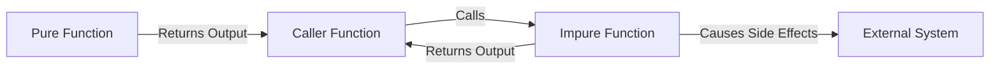

## 12.1 Understanding Side Effects and Purity

In the realm of functional programming, understanding the concepts of side effects and purity is crucial for building robust and maintainable applications. These concepts form the foundation of functional programming paradigms and significantly influence how we reason about, design, and test our code. In this section, we will delve into what constitutes a side effect, explore the distinction between pure and impure functions, and examine the implications of side effects on code reasoning and testing.

### Definition of Side Effects

A side effect occurs when a function interacts with the outside world or changes its state in a way that goes beyond returning a value. This can include:

- **I/O Operations**: Reading from or writing to a file, printing to the console, or interacting with a database.
- **State Changes**: Modifying a global variable, changing the state of an object, or altering the contents of a data structure.
- **Exception Throwing**: Raising an exception that disrupts the normal flow of execution.

In functional programming, side effects are often seen as undesirable because they introduce complexity and unpredictability into the code. Let's explore these concepts further.

### Pure vs. Impure Functions

**Pure Functions** are the cornerstone of functional programming. A function is considered pure if it satisfies the following criteria:

1. **Deterministic Output**: Given the same input, a pure function always produces the same output.
2. **No Side Effects**: The function does not alter any state or interact with the outside world.

**Impure Functions**, on the other hand, do not adhere to these criteria. They might produce different outputs for the same inputs or cause side effects.

#### Benefits of Pure Functions

- **Predictability**: Pure functions are predictable and easier to reason about since their output depends solely on their input.
- **Testability**: Testing pure functions is straightforward because they do not rely on external state or cause side effects.
- **Concurrency**: Pure functions can be executed in parallel without the risk of race conditions or data corruption.

#### Code Example: Pure vs. Impure Functions

Let's consider a simple example in Clojure to illustrate the difference between pure and impure functions:

```clojure
; Pure Function: Adds two numbers
(defn add [a b]
  (+ a b))

; Impure Function: Prints a message and returns the sum
(defn add-and-print [a b]
  (println "Adding numbers")
  (+ a b))
```

In the example above, `add` is a pure function because it simply returns the sum of its arguments without causing any side effects. Conversely, `add-and-print` is impure because it prints to the console, which is a side effect.

### Identifying Side Effects

Recognizing side effects in your code is essential for maintaining purity. Here are some common indicators of side effects:

- **I/O Operations**: Functions that read from or write to external sources, such as files or databases, typically have side effects.
- **State Modification**: Functions that alter global variables or the state of objects are impure.
- **Randomness**: Functions that generate random numbers or rely on external state (e.g., current time) can produce different outputs for the same inputs.

#### Exercise: Spot the Side Effects

Consider the following Clojure function:

```clojure
(defn update-user [user-id new-email]
  (let [user (get-user-from-db user-id)]
    (println "Updating user email")
    (assoc user :email new-email)))
```

- **Question**: Identify the side effects in the `update-user` function.

**Answer**: The function `update-user` has two side effects:
1. It prints a message to the console.
2. It likely involves a database operation (`get-user-from-db`), which is an I/O operation.

### Impact on Reasoning and Testing

Side effects can complicate reasoning about code and make testing more challenging. Here's how:

#### Reasoning About Code

- **Complexity**: Functions with side effects can behave differently depending on the state of the system or the order of execution, making them harder to understand and predict.
- **Dependencies**: Impure functions often depend on external state or systems, introducing hidden dependencies that can lead to bugs.

#### Testing Challenges

- **Isolation**: Testing impure functions requires setting up and tearing down external systems or state, which can be cumbersome.
- **Reproducibility**: Tests for impure functions may produce different results on different runs due to their reliance on external state.

### Strategies for Managing Side Effects

While side effects are sometimes unavoidable, especially in real-world applications, there are strategies to manage them effectively:

1. **Isolation**: Isolate side effects to specific parts of your codebase, keeping the majority of your functions pure.
2. **Encapsulation**: Use higher-order functions to encapsulate side effects, allowing you to control when and how they occur.
3. **Testing**: Use mocks and stubs to simulate external systems during testing, enabling you to test impure functions in isolation.

#### Code Example: Isolating Side Effects

Here's an example of how you might isolate side effects in Clojure:

```clojure
; Pure function to calculate the new email
(defn calculate-new-email [user new-domain]
  (str (:username user) "@" new-domain))

; Impure function to update user email in the database
(defn update-user-email [user-id new-domain]
  (let [user (get-user-from-db user-id)
        new-email (calculate-new-email user new-domain)]
    (println "Updating user email in database")
    (update-user-in-db user-id new-email)))
```

In this example, `calculate-new-email` is a pure function that computes the new email address. The impure function `update-user-email` handles the side effects, such as database operations and printing to the console.

### Visualizing Side Effects and Purity

To further illustrate the relationship between side effects and purity, let's use a diagram to visualize how functions interact with external systems.



**Diagram Description**: This diagram shows that pure functions only return output to the caller, while impure functions interact with external systems, causing side effects.

### References and Further Reading

For more information on functional programming and managing side effects, consider exploring the following resources:

- [Clojure Official Documentation](https://clojure.org/reference)
- [Functional Programming in Clojure](https://www.lispcast.com/oo-to-fp/)
- [Managing Side Effects in Functional Programming](https://clojure.org/community/resources)

### Knowledge Check

To reinforce your understanding of side effects and purity, try answering the following questions:

1. What constitutes a side effect in a function?
2. How do pure functions differ from impure functions?
3. Why are side effects considered undesirable in functional programming?

### Exercises

1. Refactor an impure function in your codebase to isolate its side effects.
2. Write a pure function that calculates the factorial of a number without using mutable state.

### Encouraging Engagement

Embracing functional programming can be challenging, but with each step, you'll gain a deeper understanding and see tangible benefits in your codebase. Remember, the journey to mastering functional programming is a gradual process, and every effort you make to write pure functions brings you closer to creating scalable and maintainable applications.

### Conclusion

Understanding side effects and purity is essential for leveraging the full potential of functional programming. By recognizing and managing side effects, you can write code that is more predictable, easier to test, and better suited for concurrent execution. As you continue to explore functional programming with Clojure, keep these principles in mind, and apply them to create efficient and scalable applications.

## **Test Your Knowledge: Understanding Side Effects and Purity Quiz**



### What is a side effect in a function?

- [x] An operation that interacts with the outside world or changes state
- [ ] A function that returns a value
- [ ] A function that takes no arguments
- [ ] A function that is recursive

> **Explanation:** A side effect refers to any operation that interacts with the outside world or changes the state of the system, such as I/O operations or modifying global variables.


### Which of the following is a characteristic of pure functions?

- [x] They produce the same output for the same input
- [ ] They modify global variables
- [ ] They perform I/O operations
- [ ] They throw exceptions

> **Explanation:** Pure functions always produce the same output for the same input and do not cause any side effects, such as modifying state or performing I/O operations.


### Why are side effects considered undesirable in functional programming?

- [x] They introduce complexity and unpredictability
- [ ] They make code run faster
- [ ] They improve code readability
- [ ] They enhance security

> **Explanation:** Side effects introduce complexity and unpredictability, making code harder to reason about and test, which is why they are generally avoided in functional programming.


### How can you test impure functions effectively?

- [x] Use mocks and stubs to simulate external systems
- [ ] Test them in production
- [ ] Avoid testing them
- [ ] Only test them manually

> **Explanation:** Using mocks and stubs allows you to simulate external systems, making it possible to test impure functions in isolation without relying on actual external dependencies.


### Which of the following is NOT a side effect?

- [ ] Writing to a file
- [ ] Modifying a global variable
- [x] Returning a computed value
- [ ] Printing to the console

> **Explanation:** Returning a computed value is not a side effect; it is the expected behavior of a function. Side effects involve interactions with the outside world or state changes.


### What is the benefit of isolating side effects in your code?

- [x] It makes the code easier to reason about and test
- [ ] It makes the code more difficult to maintain
- [ ] It decreases performance
- [ ] It increases the number of bugs

> **Explanation:** Isolating side effects makes the code easier to reason about and test, as it allows you to focus on pure functions that are predictable and independent of external state.


### What is a common indicator of side effects in a function?

- [x] Performing I/O operations
- [ ] Using local variables
- [ ] Returning a value
- [ ] Using recursion

> **Explanation:** Performing I/O operations, such as reading from or writing to a file, is a common indicator of side effects in a function.


### How do pure functions aid in concurrency?

- [x] They can be executed in parallel without risk of race conditions
- [ ] They require locks to prevent data corruption
- [ ] They slow down execution
- [ ] They increase the need for synchronization

> **Explanation:** Pure functions can be executed in parallel without the risk of race conditions or data corruption because they do not rely on or modify shared state.


### Which of the following strategies helps manage side effects?

- [x] Encapsulating side effects in specific functions
- [ ] Spreading side effects throughout the codebase
- [ ] Avoiding the use of functions
- [ ] Ignoring side effects

> **Explanation:** Encapsulating side effects in specific functions helps manage them by isolating them from the rest of the code, allowing you to control when and how they occur.


### True or False: Pure functions can throw exceptions.

- [ ] True
- [x] False

> **Explanation:** Pure functions do not throw exceptions as they do not cause side effects. They are deterministic and only depend on their input to produce output.


