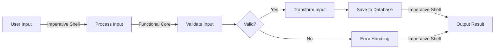

## 12.2 Strategies for Isolating Side Effects

In the realm of functional programming, managing side effects is crucial for building scalable and maintainable applications. Clojure, with its emphasis on immutability and pure functions, provides a robust platform for isolating side effects. In this section, we will explore strategies to achieve this through concepts like the **Functional Core, Imperative Shell**, designing for purity, and using effect systems. We'll also delve into practical examples and refactoring techniques to separate pure logic from side-effecting operations.

### Functional Core, Imperative Shell

The **Functional Core, Imperative Shell** is a design pattern that advocates for isolating side effects at the edges of your system. This approach allows the core logic of your application to remain pure, making it easier to test, reason about, and maintain.

#### Concept Overview

- **Functional Core**: This is the part of your application where the majority of the logic resides. It consists of pure functions that do not cause side effects. Pure functions are deterministic, meaning they always produce the same output given the same input, and they do not alter any state or interact with the outside world.

- **Imperative Shell**: This is the layer that interacts with the outside world, handling input/output operations, state changes, and other side effects. By confining side effects to this shell, you can keep the core logic clean and functional.

#### Benefits

- **Testability**: Pure functions are inherently easier to test because they do not depend on external state or produce side effects.
- **Maintainability**: Separating concerns makes the codebase easier to understand and modify.
- **Scalability**: Isolating side effects helps in scaling applications, as the core logic remains consistent and predictable.

#### Implementing Functional Core, Imperative Shell in Clojure

Let's consider an example of a simple application that processes user input and stores it in a database.

```clojure
;; Functional Core
(defn process-input [input]
  (let [validated-input (validate input)
        transformed-input (transform validated-input)]
    transformed-input))

(defn validate [input]
  ;; Pure validation logic
  (if (valid? input)
    input
    (throw (ex-info "Invalid input" {:input input}))))

(defn transform [input]
  ;; Pure transformation logic
  (str/upper-case input))

;; Imperative Shell
(defn save-to-database [db input]
  ;; Side-effecting operation
  (jdbc/insert! db :users {:name input}))

(defn handle-user-input [db input]
  (try
    (let [processed-input (process-input input)]
      (save-to-database db processed-input))
    (catch Exception e
      (println "Error processing input:" (.getMessage e)))))
```

In this example, the `process-input`, `validate`, and `transform` functions form the **Functional Core**, while `save-to-database` and `handle-user-input` are part of the **Imperative Shell**. This separation allows us to test the core logic independently of the database operations.

### Designing for Purity

Designing for purity involves structuring your application such that the majority of the logic is composed of pure functions. This requires a conscious effort to identify and isolate side effects early in the design process.

#### Guidelines for Designing Pure Applications

1. **Identify Side Effects**: Recognize operations that interact with the outside world, such as file I/O, network requests, and database operations.

2. **Encapsulate Side Effects**: Use higher-order functions to encapsulate side effects, passing them as arguments to pure functions when necessary.

3. **Leverage Immutability**: Use Clojure's immutable data structures to avoid unintended state changes.

4. **Compose Functions**: Build complex logic by composing smaller pure functions, enhancing modularity and reusability.

5. **Use Pure Data Transformations**: Focus on transforming data rather than changing state.

#### Example: Designing a Pure Function

Consider a function that calculates the total price of items in a shopping cart, including tax.

```clojure
(defn calculate-total [items tax-rate]
  (let [subtotal (reduce + (map :price items))]
    (* subtotal (+ 1 tax-rate))))
```

This function is pure because it only depends on its input arguments and does not cause side effects. By designing functions in this manner, you can ensure that your core logic remains pure and testable.

### Using Effect Systems

Effect systems are advanced techniques for managing side effects in functional programming. They provide a formal way to describe and control side effects, often using types or monads.

#### Brief Overview of Effect Systems

- **Effect Typing**: Some languages use type systems to track and manage side effects, ensuring that functions are pure unless explicitly annotated otherwise.

- **Monads**: While not native to Clojure, monads are a common way to handle side effects in functional programming. They encapsulate side effects, allowing you to chain operations while maintaining purity.

- **Libraries**: In Clojure, libraries like `core.async` can help manage side effects by providing abstractions for asynchronous operations.

#### Example: Using `core.async` for Side Effect Management

```clojure
(require '[clojure.core.async :as async])

(defn fetch-data [url]
  (let [ch (async/chan)]
    (async/go
      (let [response (http/get url)]
        (async/>! ch response)))
    ch))

(defn process-data [url]
  (let [ch (fetch-data url)]
    (async/go
      (let [response (async/<! ch)]
        (println "Data received:" response)))))
```

In this example, `core.async` is used to manage asynchronous HTTP requests. By using channels, we can separate the logic of fetching data from the logic of processing it, maintaining a clear boundary between pure and side-effecting code.

### Example Refactoring: Separating Pure Logic from Side Effects

Refactoring existing code to separate pure logic from side effects can significantly improve its maintainability and testability. Let's refactor a simple logging application to demonstrate this.

#### Initial Code with Intertwined Logic

```clojure
(defn log-message [db message]
  (let [timestamped-message (str (java.time.Instant/now) " - " message)]
    (jdbc/insert! db :logs {:message timestamped-message})
    (println "Logged message:" timestamped-message)))
```

#### Refactored Code with Separation

```clojure
;; Pure Function
(defn create-log-entry [message]
  (str (java.time.Instant/now) " - " message))

;; Side-effecting Function
(defn save-log-entry [db log-entry]
  (jdbc/insert! db :logs {:message log-entry}))

(defn log-message [db message]
  (let [log-entry (create-log-entry message)]
    (save-log-entry db log-entry)
    (println "Logged message:" log-entry)))
```

In the refactored code, `create-log-entry` is a pure function that generates the log entry, while `save-log-entry` handles the side effect of saving it to the database. This separation allows us to test `create-log-entry` independently and ensures that side effects are managed explicitly.

### Visual Aids: Understanding the Separation

To further illustrate the concept of separating side effects, let's use a flowchart to depict the data flow in a typical application using the Functional Core, Imperative Shell pattern.



**Diagram Description**: This flowchart illustrates how user input is processed through a functional core, where validation and transformation occur, before interacting with the database in the imperative shell. Errors are handled in the shell, ensuring that side effects are isolated.

### References and Further Reading

- [Clojure Official Documentation](https://clojure.org/reference)
- [Clojure Community Resources](https://clojure.org/community/resources)
- [Transitioning from OOP to Functional Programming](https://www.lispcast.com/oo-to-fp/)
- [Functional Programming in Clojure](https://clojure.org/about/rationale)
- [Core.async Guide](https://clojure.org/guides/core_async)

### Knowledge Check

- **What is the Functional Core, Imperative Shell pattern?**
- **How can you identify side effects in your code?**
- **What are the benefits of designing for purity?**
- **How can effect systems help manage side effects?**
- **Try refactoring a piece of code to separate pure logic from side-effecting operations.**

### Encouraging Engagement

Embracing functional programming can be challenging, but with each step, you'll gain a deeper understanding and see tangible benefits in your codebase. Remember, the goal is to write clean, maintainable, and scalable code by isolating side effects and leveraging the power of pure functions.

### Test Your Knowledge: Strategies for Isolating Side Effects Quiz



### What is the main benefit of the Functional Core, Imperative Shell pattern?

- [x] It isolates side effects, making the core logic easier to test and maintain.
- [ ] It allows for more efficient use of memory.
- [ ] It simplifies the integration of third-party libraries.
- [ ] It improves the performance of I/O operations.

> **Explanation:** The Functional Core, Imperative Shell pattern isolates side effects, making the core logic easier to test and maintain, which is crucial for building scalable applications.


### How can you identify side effects in your code?

- [x] Look for operations that interact with the outside world, such as I/O and state changes.
- [ ] Focus on functions that perform calculations.
- [ ] Identify functions that use recursion.
- [ ] Search for functions that return complex data structures.

> **Explanation:** Side effects are typically associated with operations that interact with the outside world, such as I/O and state changes.


### What is a pure function?

- [x] A function that always produces the same output given the same input and has no side effects.
- [ ] A function that modifies global state.
- [ ] A function that interacts with a database.
- [ ] A function that performs network operations.

> **Explanation:** A pure function always produces the same output given the same input and has no side effects, making it predictable and easy to test.


### Which Clojure library can help manage asynchronous side effects?

- [x] core.async
- [ ] clojure.spec
- [ ] clojure.java.jdbc
- [ ] ring

> **Explanation:** `core.async` is a Clojure library that provides abstractions for managing asynchronous operations, helping to isolate side effects.


### What is the purpose of using effect systems in functional programming?

- [x] To provide a formal way to describe and control side effects.
- [ ] To improve the performance of pure functions.
- [ ] To simplify the syntax of functional code.
- [ ] To enhance the readability of imperative code.

> **Explanation:** Effect systems provide a formal way to describe and control side effects, ensuring that functions remain pure unless explicitly annotated otherwise.


### How does immutability help in designing pure applications?

- [x] It prevents unintended state changes, ensuring predictability.
- [ ] It allows for faster execution of functions.
- [ ] It simplifies the integration of third-party libraries.
- [ ] It reduces the size of the codebase.

> **Explanation:** Immutability prevents unintended state changes, ensuring predictability and making it easier to reason about the code.


### What is a common technique to encapsulate side effects in functional programming?

- [x] Using higher-order functions to pass side effects as arguments.
- [ ] Using global variables to store state.
- [ ] Implementing complex inheritance hierarchies.
- [ ] Utilizing multithreading for all operations.

> **Explanation:** Using higher-order functions to pass side effects as arguments is a common technique to encapsulate side effects in functional programming.


### Which of the following is NOT a benefit of pure functions?

- [ ] They are easier to test.
- [x] They can modify global state.
- [ ] They are predictable.
- [ ] They do not depend on external state.

> **Explanation:** Pure functions do not modify global state; they are easier to test, predictable, and do not depend on external state.


### Why is it important to refactor code to separate pure logic from side effects?

- [x] It improves maintainability and testability.
- [ ] It increases the number of lines of code.
- [ ] It complicates the codebase.
- [ ] It makes the code less efficient.

> **Explanation:** Refactoring code to separate pure logic from side effects improves maintainability and testability, making the codebase easier to manage.


### True or False: In Clojure, all functions are pure by default.

- [ ] True
- [x] False

> **Explanation:** In Clojure, functions are not pure by default. While Clojure encourages pure functions, developers must explicitly ensure that their functions are pure by avoiding side effects.


