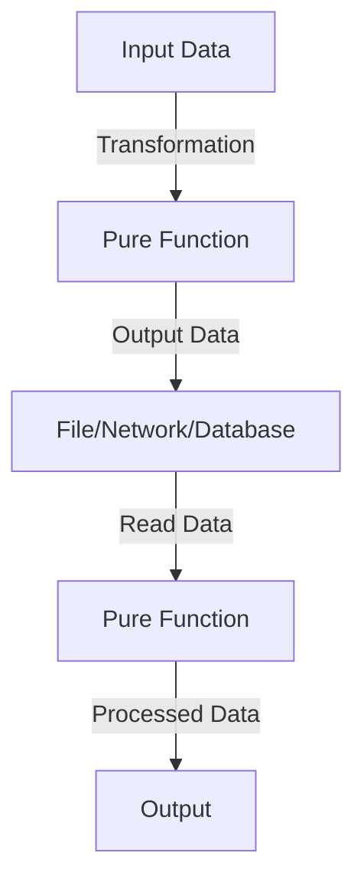

## 12.3 Handling Input/Output in Functional Programs

In functional programming, handling input/output (I/O) operations presents unique challenges. Unlike imperative programming, where I/O is often interwoven with logic, functional programming emphasizes purity and immutability. This chapter explores strategies for managing I/O in Clojure while maintaining functional purity, leveraging lazy evaluation, and utilizing asynchronous techniques.

### Pure Approaches to I/O

Functional programming aims to minimize side effects, and I/O operations are inherently side-effectful. To handle I/O while preserving functional purity, we can adopt several strategies:

1. **Explicitly Pass Data In and Out**: Treat I/O operations as transformations of data, where functions take input data and return output data, without altering the state.

2. **Separate I/O from Logic**: Isolate I/O operations from core logic by using higher-order functions or monadic structures to encapsulate side effects.

3. **Use Pure Functions for Transformation**: Ensure that functions responsible for data processing remain pure, while impure I/O operations are confined to specific areas of the codebase.

#### Example: Reading and Writing Files

Let's consider a simple example of reading from and writing to files in Clojure:

```clojure
(ns io-example
  (:require [clojure.java.io :as io]))

;; Function to read lines from a file and return as a sequence
(defn read-lines [file-path]
  (with-open [reader (io/reader file-path)]
    (doall (line-seq reader))))

;; Function to write a sequence of lines to a file
(defn write-lines [file-path lines]
  (with-open [writer (io/writer file-path)]
    (doseq [line lines]
      (.write writer (str line "\n")))))

;; Usage
(let [lines (read-lines "input.txt")]
  (write-lines "output.txt" lines))
```

In this example, `read-lines` and `write-lines` are responsible for I/O operations. They are isolated from the rest of the logic, which allows us to test the core logic independently.

### Lazy Evaluation and I/O

Lazy evaluation is a powerful concept in Clojure that can significantly impact I/O operations. By deferring computation until the result is needed, laziness can help manage large datasets efficiently. However, it also requires careful handling to avoid unexpected behavior during I/O.

#### Managing Laziness in I/O

When working with lazy sequences in I/O, it's crucial to realize that the actual I/O operation may not occur until the sequence is consumed. This can lead to deferred side effects, which might not be desirable in certain contexts.

Consider the following example:

```clojure
(defn lazy-read-lines [file-path]
  (line-seq (io/reader file-path)))

;; Consuming the lazy sequence
(doseq [line (lazy-read-lines "input.txt")]
  (println line))
```

In this example, `lazy-read-lines` returns a lazy sequence of lines from the file. The file is only read when the sequence is consumed, which can be beneficial for performance but requires awareness of when the side effect occurs.

#### Ensuring Timely Execution

To ensure that I/O operations are executed at the desired time, you can force the evaluation of a lazy sequence using functions like `doall` or `dorun`:

```clojure
(let [lines (lazy-read-lines "input.txt")]
  (dorun lines)) ;; Forces evaluation without retaining the result
```

### Using Callbacks and Futures

Asynchronous programming techniques, such as callbacks and futures, are essential for handling I/O operations without blocking the main thread. These techniques allow your program to continue executing while waiting for I/O operations to complete, improving responsiveness and performance.

#### Callbacks

Callbacks are functions that are passed as arguments to other functions and are executed after a certain event, such as the completion of an I/O operation.

```clojure
(defn async-read-file [file-path callback]
  (future
    (let [lines (read-lines file-path)]
      (callback lines))))

;; Usage
(async-read-file "input.txt" #(println "File content:" %))
```

In this example, `async-read-file` reads a file asynchronously and invokes the provided callback function with the file's contents once the reading is complete.

#### Futures

Futures in Clojure provide a simple way to perform asynchronous computations. A future represents a computation that will be completed at some point in the future.

```clojure
(defn async-write-file [file-path lines]
  (future
    (write-lines file-path lines)))

;; Usage
(def future-result (async-write-file "output.txt" ["Line 1" "Line 2"]))
```

Here, `async-write-file` writes lines to a file asynchronously using a future. The main program can continue executing while the file is being written.

### Examples of I/O Operations

Let's explore more examples of handling different types of I/O operations in Clojure, including network requests and database interactions.

#### Handling Network Requests

Using the `clj-http` library, we can perform HTTP requests in a functional manner:

```clojure
(ns http-example
  (:require [clj-http.client :as client]))

(defn fetch-url [url]
  (client/get url))

;; Usage
(let [response (fetch-url "http://example.com")]
  (println (:status response))
  (println (:body response)))
```

In this example, `fetch-url` performs an HTTP GET request and returns the response. The function is pure, as it returns the response data without altering any state.

#### Database Interactions

Clojure provides libraries like `clojure.java.jdbc` for interacting with databases. Here's an example of querying a database:

```clojure
(ns db-example
  (:require [clojure.java.jdbc :as jdbc]))

(def db-spec {:subprotocol "postgresql"
              :subname "//localhost:5432/mydb"
              :user "user"
              :password "password"})

(defn fetch-users []
  (jdbc/query db-spec ["SELECT * FROM users"]))

;; Usage
(let [users (fetch-users)]
  (doseq [user users]
    (println user)))
```

In this example, `fetch-users` queries the database and returns the result set. The function remains pure by returning data without side effects.

### Try It Yourself

To deepen your understanding, try modifying the provided examples:

- **File I/O**: Modify the `read-lines` and `write-lines` functions to handle JSON data using the `cheshire` library.
- **Network Requests**: Implement a function that performs a POST request using `clj-http`.
- **Database Interactions**: Extend the `fetch-users` function to filter users based on specific criteria.

### Visual Aids

To visualize the flow of data in functional I/O operations, consider the following diagrams:

#### Data Flow in Functional I/O



**Figure 1: Data flow in functional I/O operations.**

This diagram illustrates how data flows through pure functions, with I/O operations isolated to specific stages.

### References and Links

- [Clojure Official Documentation](https://clojure.org/reference)
- [Clojure Community Resources](https://clojure.org/community/resources)
- [Transitioning from OOP to Functional Programming](https://www.lispcast.com/oo-to-fp/)
- [clj-http GitHub Repository](https://github.com/dakrone/clj-http)
- [clojure.java.jdbc GitHub Repository](https://github.com/clojure/java.jdbc)

### Knowledge Check

To reinforce your understanding, consider the following questions:

- How can you maintain functional purity when performing I/O operations?
- What are the benefits and challenges of using lazy evaluation in I/O?
- How do callbacks and futures help manage asynchronous I/O operations?

### Encouraging Engagement

Handling I/O in functional programming can be challenging, but by embracing these techniques, you'll gain a deeper understanding and see tangible benefits in your codebase. Remember, practice and experimentation are key to mastering these concepts.

### Conclusion

In this section, we've explored various strategies for handling I/O operations in functional programming with Clojure. By maintaining functional purity, leveraging lazy evaluation, and utilizing asynchronous techniques, you can build efficient and scalable applications that handle I/O effectively.

## **Test Your Knowledge: Handling Input/Output in Functional Programs Quiz**



### What is a key strategy for maintaining functional purity in I/O operations?

- [x] Isolating I/O operations from core logic
- [ ] Mixing I/O operations with data transformation
- [ ] Using mutable state to manage I/O
- [ ] Avoiding I/O operations altogether

> **Explanation:** Isolating I/O operations from core logic ensures that the main logic remains pure and testable.

### How does lazy evaluation impact I/O operations?

- [x] It defers the execution of I/O until the result is needed
- [ ] It executes I/O operations immediately
- [ ] It prevents I/O operations from occurring
- [ ] It makes I/O operations faster

> **Explanation:** Lazy evaluation defers computation until the result is needed, which can delay the execution of I/O operations.

### What is a benefit of using futures for I/O operations?

- [x] They allow asynchronous execution without blocking
- [ ] They simplify synchronous I/O operations
- [ ] They eliminate the need for callbacks
- [ ] They ensure immediate execution of I/O

> **Explanation:** Futures enable asynchronous execution, allowing the program to continue running while waiting for I/O to complete.

### In the context of I/O, what is a callback?

- [x] A function executed after an I/O operation completes
- [ ] A synchronous I/O operation
- [ ] A function that prevents I/O
- [ ] A method for reading files

> **Explanation:** A callback is a function passed to another function to be executed after an I/O operation completes.

### Which library is commonly used in Clojure for HTTP requests?

- [x] clj-http
- [ ] clojure.java.jdbc
- [ ] Cheshire
- [ ] Ring

> **Explanation:** `clj-http` is a popular library for performing HTTP requests in Clojure.

### What is the purpose of the `doall` function in the context of lazy sequences?

- [x] It forces the evaluation of a lazy sequence
- [ ] It defers the evaluation of a lazy sequence
- [ ] It creates a lazy sequence
- [ ] It optimizes the lazy sequence

> **Explanation:** `doall` forces the evaluation of a lazy sequence, ensuring that side effects occur immediately.

### How can you handle asynchronous I/O in Clojure?

- [x] Using futures and callbacks
- [ ] Using only synchronous functions
- [ ] Avoiding I/O operations
- [ ] Using mutable state

> **Explanation:** Futures and callbacks are tools for handling asynchronous I/O in Clojure.

### What is an advantage of separating I/O from logic in functional programming?

- [x] It makes the core logic more testable
- [ ] It complicates the codebase
- [ ] It requires more resources
- [ ] It increases side effects

> **Explanation:** Separating I/O from logic makes the core logic more testable by keeping it pure.

### Which function is used to read lines lazily from a file in Clojure?

- [x] line-seq
- [ ] read-lines
- [ ] slurp
- [ ] spit

> **Explanation:** `line-seq` is used to create a lazy sequence of lines from a file.

### True or False: Lazy evaluation can lead to deferred side effects in I/O operations.

- [x] True
- [ ] False

> **Explanation:** True. Lazy evaluation can defer the execution of I/O operations until the sequence is consumed.


