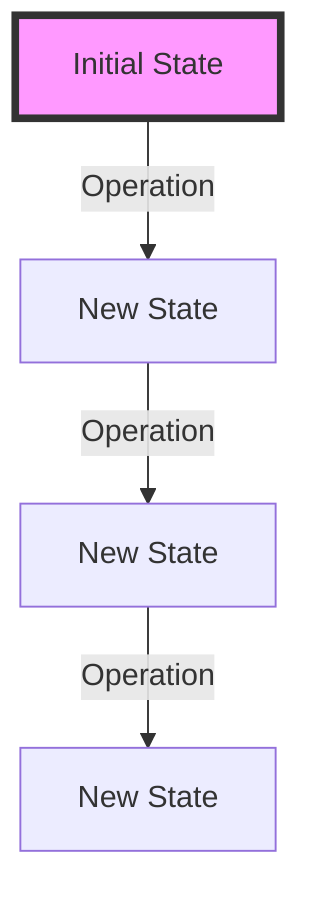
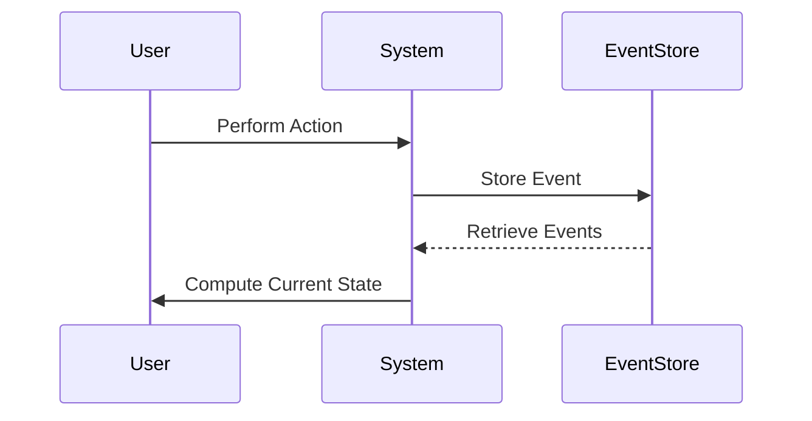

## 12.4 Managing State Changes Functionally

In functional programming, managing state changes is a critical aspect that requires a shift from traditional imperative paradigms. Clojure, as a functional language, provides powerful constructs to handle state changes in a way that enhances code reliability, scalability, and maintainability. In this section, we will explore various patterns and practices for managing state changes functionally using Clojure.

### State Management Patterns

Functional programming emphasizes the use of immutable data structures and pure functions. This approach helps in managing state changes by ensuring that data is not altered directly, reducing the risk of side effects and making the code more predictable.

#### Immutable Data Structures

Clojure's core data structures—vectors, lists, maps, and sets—are immutable. This means that any operation on these structures does not modify them but instead returns a new structure with the desired changes. This immutability is fundamental to functional programming and helps in managing state changes effectively.

```clojure
;; Example of using immutable data structures in Clojure
(def original-map {:a 1 :b 2})

;; Adding a new key-value pair returns a new map
(def updated-map (assoc original-map :c 3))

;; original-map remains unchanged
(println original-map) ;; Output: {:a 1, :b 2}
(println updated-map)  ;; Output: {:a 1, :b 2, :c 3}
```

**Key Takeaway:** By using immutable data structures, we can ensure that our functions do not have unintended side effects, which is crucial for maintaining state predictably.

#### Pure Functions

A pure function is one that, given the same input, will always produce the same output and does not have any side effects. Pure functions are the building blocks of functional programming and are essential for managing state changes.

```clojure
;; Example of a pure function
(defn add [x y]
  (+ x y))

;; Calling the function with the same arguments always yields the same result
(println (add 2 3)) ;; Output: 5
```

**Key Takeaway:** Pure functions help in isolating state changes and make the code easier to test and reason about.

### State Monads

State monads provide a way to handle state changes functionally by encapsulating state transformations. While Clojure does not have built-in support for monads, the concept can be implemented using libraries or custom code.

#### Conceptual Understanding

A state monad can be thought of as a function that takes a state and returns a value along with a new state. This allows for chaining state transformations in a functional way.

```clojure
;; A simple state monad implementation
(defn state-monad [state]
  (fn [f]
    (let [[value new-state] (f state)]
      [value new-state])))

;; Example usage
(defn increment-state [state]
  [(inc state) (inc state)])

(def increment-monad (state-monad 0))

(let [[value new-state] (increment-monad increment-state)]
  (println value)      ;; Output: 1
  (println new-state)) ;; Output: 1
```

**Key Takeaway:** State monads allow for managing state changes in a controlled and predictable manner, enabling complex state transformations to be composed functionally.

### Event Sourcing

Event sourcing is a pattern where state changes are represented as a sequence of immutable events. This approach aligns well with functional programming principles and provides a robust way to manage state changes.

#### Introduction to Event Sourcing

In event sourcing, every state change is captured as an event, and the current state is derived by replaying these events. This not only provides a complete audit trail but also allows for easy state reconstruction and debugging.

```clojure
;; Example of event sourcing in Clojure
(def events (atom []))

(defn apply-event [state event]
  (case (:type event)
    :add (update state :value + (:amount event))
    :subtract (update state :value - (:amount event))
    state))

(defn add-event [event]
  (swap! events conj event))

(defn current-state []
  (reduce apply-event {:value 0} @events))

;; Adding events
(add-event {:type :add :amount 10})
(add-event {:type :subtract :amount 5})

;; Calculating the current state
(println (current-state)) ;; Output: {:value 5}
```

**Key Takeaway:** Event sourcing provides a powerful mechanism for managing state changes by treating them as a series of immutable events, enhancing traceability and reliability.

### Examples of Functional State Management

Let's explore some practical examples of managing state changes functionally using the patterns discussed above.

#### Example 1: Banking Transactions with Event Sourcing

Consider a simple banking application where we need to manage account balances. By using event sourcing, we can track all transactions as events and compute the account balance by replaying these events.

```clojure
;; Define a transaction event
(defn transaction-event [type amount]
  {:type type :amount amount})

;; Apply a transaction event to an account state
(defn apply-transaction [state event]
  (case (:type event)
    :deposit (update state :balance + (:amount event))
    :withdraw (update state :balance - (:amount event))
    state))

;; Calculate the account balance from a list of transaction events
(defn calculate-balance [events]
  (reduce apply-transaction {:balance 0} events))

;; Example transactions
(def transactions [(transaction-event :deposit 100)
                   (transaction-event :withdraw 50)
                   (transaction-event :deposit 200)])

;; Calculate the balance
(println (calculate-balance transactions)) ;; Output: {:balance 250}
```

#### Example 2: Inventory Management with Immutable Data Structures

In an inventory management system, we can use immutable data structures to track stock levels without directly modifying the existing state.

```clojure
;; Define an initial inventory
(def inventory {:apples 10 :oranges 5})

;; Function to update inventory
(defn update-inventory [inventory item count]
  (assoc inventory item (+ (get inventory item 0) count)))

;; Add 5 apples to the inventory
(def updated-inventory (update-inventory inventory :apples 5))

;; Check the updated inventory
(println updated-inventory) ;; Output: {:apples 15, :oranges 5}
```

### Visualizing State Management Patterns

To better understand the flow of state management in functional programming, let's visualize some of the patterns using diagrams.

#### Diagram: Immutable Data Flow



**Caption:** This diagram illustrates how operations on immutable data structures produce new states without altering the original state.

#### Diagram: Event Sourcing Process



**Caption:** This sequence diagram shows how event sourcing captures and retrieves events to compute the current state.

### References and Further Reading

- [Clojure Official Documentation](https://clojure.org/reference)
- [Clojure Community Resources](https://clojure.org/community/resources)
- [Transitioning from OOP to Functional Programming](https://www.lispcast.com/oo-to-fp/)
- [Clojure STM Guide](https://clojure.org/reference/refs)

### Knowledge Check

To reinforce your understanding of managing state changes functionally, consider the following questions:

1. What are the benefits of using immutable data structures in functional programming?
2. How do pure functions contribute to predictable state management?
3. Describe the concept of a state monad and how it can be used in Clojure.
4. Explain how event sourcing can enhance traceability and reliability in state management.
5. How can you implement a simple event sourcing mechanism in Clojure?

### Encouraging Engagement

Embracing functional programming can be challenging, but with each step, you'll gain a deeper understanding and see tangible benefits in your codebase. Experiment with the examples provided, and explore how you can apply these patterns to your own projects.

### Test Your Knowledge: Managing State Changes Functionally Quiz



### What is a key advantage of using immutable data structures in Clojure?

- [x] They prevent accidental state changes.
- [ ] They allow direct modification of data.
- [ ] They are faster than mutable structures.
- [ ] They require less memory.

> **Explanation:** Immutable data structures prevent accidental state changes, which is crucial for maintaining predictability in functional programming.

### How do pure functions help in managing state?

- [x] They ensure consistent outputs for the same inputs.
- [ ] They allow side effects.
- [ ] They modify global state.
- [ ] They are difficult to test.

> **Explanation:** Pure functions ensure that for the same inputs, the outputs are consistent, making state management predictable and easier to test.

### What is a state monad?

- [x] A construct to encapsulate state transformations.
- [ ] A type of mutable data structure.
- [ ] A method for direct state modification.
- [ ] A Clojure built-in function.

> **Explanation:** A state monad is a construct that encapsulates state transformations, allowing for functional state management.

### What is event sourcing?

- [x] A pattern that captures state changes as immutable events.
- [ ] A method for modifying state directly.
- [ ] A type of database.
- [ ] A Clojure library.

> **Explanation:** Event sourcing captures state changes as immutable events, providing a robust way to manage state.

### In event sourcing, how is the current state derived?

- [x] By replaying a sequence of events.
- [ ] By directly modifying a state variable.
- [ ] By using mutable data structures.
- [ ] By calling a global function.

> **Explanation:** The current state in event sourcing is derived by replaying a sequence of immutable events.

### Which of the following is an example of a pure function?

- [x] A function that returns the same result for the same inputs.
- [ ] A function that modifies a global variable.
- [ ] A function that performs I/O operations.
- [ ] A function that relies on external state.

> **Explanation:** A pure function consistently returns the same result for the same inputs, without side effects.

### How can immutable data structures enhance code reliability?

- [x] By preventing unintended modifications.
- [ ] By allowing direct data changes.
- [ ] By increasing complexity.
- [ ] By requiring more memory.

> **Explanation:** Immutable data structures enhance code reliability by preventing unintended modifications, ensuring consistency.

### What is the role of the `assoc` function in Clojure?

- [x] To create a new map with an added key-value pair.
- [ ] To modify an existing map directly.
- [ ] To remove a key-value pair from a map.
- [ ] To sort a map.

> **Explanation:** The `assoc` function creates a new map with an added key-value pair, leaving the original map unchanged.

### Which pattern aligns well with functional programming principles?

- [x] Event sourcing
- [ ] Direct state modification
- [ ] Global state management
- [ ] Mutable data structures

> **Explanation:** Event sourcing aligns well with functional programming principles by treating state changes as immutable events.

### True or False: Clojure's core data structures are mutable.

- [ ] True
- [x] False

> **Explanation:** False. Clojure's core data structures are immutable, which is a key feature of functional programming.



By understanding and applying these patterns, you can effectively manage state changes in your Clojure applications, leading to more robust, scalable, and maintainable code.
