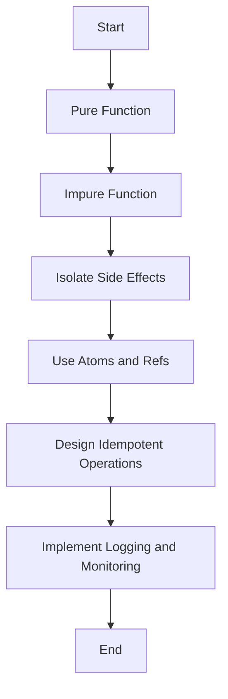

## 12.5 Best Practices for Managing Side Effects in Clojure

In functional programming, side effects—operations that interact with the outside world or change the state of the system—are often viewed with caution. Clojure, a functional language, encourages developers to minimize side effects and isolate them when necessary. This section explores best practices for managing side effects in Clojure, focusing on isolating side effects, using concurrency primitives, designing idempotent operations, and implementing logging and monitoring.

### Isolating Side Effects

Isolating side effects is crucial in functional programming as it allows us to maintain the purity of functions and makes our code more predictable and easier to test. In Clojure, we can achieve this by confining side-effecting operations to specific parts of the codebase.

#### Pure vs. Impure Functions

A pure function is one that, given the same input, will always return the same output and does not cause any observable side effects. In contrast, an impure function may produce different results for the same input or interact with the external world (e.g., modifying a global variable, writing to a file).

**Example of a Pure Function:**

```clojure
(defn add [x y]
  (+ x y))
```

**Example of an Impure Function:**

```clojure
(defn log-message [message]
  (println message)) ; This has a side effect of printing to the console.
```

#### Strategies for Isolating Side Effects

1. **Functional Core, Imperative Shell**: Structure your application such that the core logic is pure and functional, while side effects are handled at the outer layers. This pattern ensures that the majority of your codebase remains pure and testable.

2. **Use Higher-Order Functions**: Leverage higher-order functions to pass side-effecting operations as arguments. This can help in controlling when and how side effects are executed.

3. **Separate State Management**: Use Clojure's state management constructs like atoms, refs, and agents to manage state changes separately from pure logic.

### Use of Atoms and Refs

Clojure provides several concurrency primitives to manage mutable state safely in a multithreaded environment. Atoms and refs are two such primitives that help in isolating and controlling side effects.

#### Atoms

Atoms provide a way to manage shared, synchronous, independent state. They are ideal for situations where state changes are infrequent and do not require coordination with other state changes.

**Example of Using Atoms:**

```clojure
(def counter (atom 0))

(defn increment-counter []
  (swap! counter inc)) ; Atomically increments the counter
```

#### Refs

Refs are used for coordinated, synchronous state changes. They are suitable for managing complex state that requires transactions, ensuring consistency across multiple state changes.

**Example of Using Refs:**

```clojure
(def account-balance (ref 1000))

(defn transfer [amount]
  (dosync
    (alter account-balance - amount))) ; Ensures atomicity of the transaction
```

### Idempotent Operations

Idempotency is a property that ensures that performing an operation multiple times has the same effect as performing it once. Designing side-effecting operations to be idempotent can help in making systems more robust and fault-tolerant.

#### Designing Idempotent Functions

1. **Use Conditional Checks**: Before performing an operation, check if it is necessary. For example, before updating a database record, verify if the update is required.

2. **Idempotent HTTP Methods**: In web applications, use HTTP methods like GET, PUT, and DELETE that are naturally idempotent.

**Example of an Idempotent Function:**

```clojure
(defn update-record [db id new-value]
  (when (not= (get db id) new-value)
    (assoc db id new-value))) ; Only update if the value has changed
```

### Logging and Monitoring

Logging and monitoring are essential for understanding the behavior of side-effecting code and diagnosing issues in production systems. They provide insights into how and when side effects occur, aiding in debugging and performance tuning.

#### Implementing Logging

1. **Use Logging Libraries**: Utilize libraries like `clojure.tools.logging` or `log4j` for structured logging.

2. **Log at Appropriate Levels**: Use different logging levels (e.g., DEBUG, INFO, WARN, ERROR) to capture the right amount of detail.

3. **Log Contextual Information**: Include contextual information in log messages to make them more informative.

**Example of Logging in Clojure:**

```clojure
(require '[clojure.tools.logging :as log])

(defn process-data [data]
  (log/info "Processing data" data)
  ;; process data
  )
```

#### Monitoring Side Effects

1. **Use Monitoring Tools**: Implement monitoring tools like Prometheus or Grafana to track metrics and visualize side effects over time.

2. **Set Up Alerts**: Configure alerts for abnormal patterns or errors in side-effecting operations.

### Conclusion

Managing side effects effectively is a critical aspect of building scalable and maintainable applications in Clojure. By isolating side effects, using concurrency primitives like atoms and refs, designing idempotent operations, and implementing robust logging and monitoring, we can create systems that are both reliable and easy to understand.

### Try It Yourself

Experiment with the following code examples by modifying the state management logic or adding additional logging to see how it affects the behavior of the application. Consider implementing a small application that tracks user interactions and logs them to a file, ensuring that all operations are idempotent.

### Visual Aids



*Diagram: A flowchart illustrating the process of managing side effects in Clojure.*

### References and Links

- [Clojure Official Documentation](https://clojure.org/reference)
- [Clojure Community Resources](https://clojure.org/community/resources)
- [Transitioning from OOP to Functional Programming](https://www.lispcast.com/oo-to-fp/)
- [Clojure STM Guide](https://clojure.org/reference/refs)

### Test Your Knowledge: Best Practices for Side Effects in Clojure Quiz



### What is the primary benefit of isolating side effects in functional programming?

- [x] It makes the code more predictable and easier to test.
- [ ] It increases the speed of execution.
- [ ] It reduces the need for documentation.
- [ ] It allows for more complex algorithms.

> **Explanation:** Isolating side effects helps maintain the purity of functions, making the code more predictable and easier to test.


### Which Clojure construct is ideal for managing independent state changes?

- [x] Atoms
- [ ] Refs
- [ ] Agents
- [ ] Vars

> **Explanation:** Atoms are used for managing independent state changes that are synchronous.


### How do refs ensure consistency in state changes?

- [x] By using transactions to coordinate changes.
- [ ] By locking the state.
- [ ] By using asynchronous updates.
- [ ] By duplicating the state.

> **Explanation:** Refs use transactions to ensure that state changes are coordinated and consistent.


### What is an idempotent operation?

- [x] An operation that has the same effect no matter how many times it is performed.
- [ ] An operation that never fails.
- [ ] An operation that is performed once and never again.
- [ ] An operation that always returns a different result.

> **Explanation:** Idempotent operations have the same effect regardless of how many times they are executed.


### What is a key practice in designing idempotent functions?

- [x] Use conditional checks before performing operations.
- [ ] Avoid using any conditions.
- [x] Ensure operations are necessary before execution.
- [ ] Always perform operations without checks.

> **Explanation:** Designing idempotent functions involves using conditional checks to ensure operations are necessary.


### Which logging level is used for capturing detailed information?

- [x] DEBUG
- [ ] INFO
- [ ] WARN
- [ ] ERROR

> **Explanation:** The DEBUG level is used for capturing detailed information useful during development.


### What tool can be used for monitoring side effects in a Clojure application?

- [x] Prometheus
- [ ] Git
- [x] Grafana
- [ ] Docker

> **Explanation:** Prometheus and Grafana are tools used for monitoring applications, including side effects.


### What is the purpose of logging contextual information?

- [x] To make log messages more informative.
- [ ] To increase the size of log files.
- [ ] To obscure the log details.
- [ ] To reduce the number of log entries.

> **Explanation:** Logging contextual information helps make log messages more informative and useful for debugging.


### How can side effects be managed in a multithreaded environment in Clojure?

- [x] By using concurrency primitives like atoms and refs.
- [ ] By avoiding side effects altogether.
- [ ] By using only pure functions.
- [ ] By using global variables.

> **Explanation:** Concurrency primitives like atoms and refs help manage side effects safely in a multithreaded environment.


### True or False: Idempotent operations are naturally resistant to errors caused by repeated execution.

- [x] True
- [ ] False

> **Explanation:** Idempotent operations are designed to have the same effect regardless of how many times they are executed, making them resistant to errors from repeated execution.


