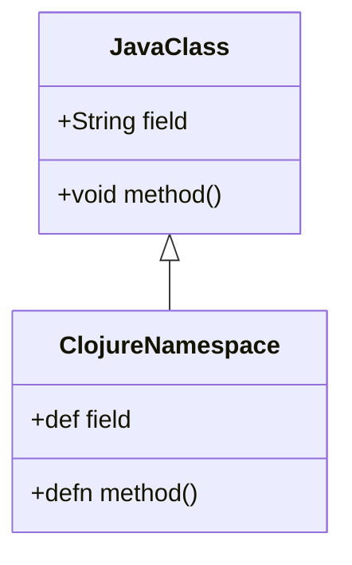

## 12.6 Interoperability with Java Libraries

In this section, we delve into the seamless interoperability between Clojure and Java, which allows developers to leverage the vast ecosystem of Java libraries while enjoying the benefits of Clojure's functional programming paradigm. We'll explore how to call Java methods, handle exceptions, and integrate Java classes into your Clojure projects effectively.

### Java Interop Basics

Clojure is built on the Java Virtual Machine (JVM), which means it can directly interact with Java classes and methods. This interoperability is one of Clojure's most powerful features, enabling developers to use existing Java libraries without needing to rewrite them in Clojure.

#### Calling Java Methods

In Clojure, calling Java methods is straightforward. You can call both static and instance methods, access fields, and create new objects using a concise syntax. Let's explore these operations in detail.

##### Static Methods

To call a static method in Java from Clojure, use the `.` operator followed by the method name and class. Here's the syntax:

```clojure
(. ClassName methodName args)
```

For example, to call the `Math` class's `sqrt` method:

```clojure
(defn calculate-square-root [x]
  (Math/sqrt x))

;; Usage
(calculate-square-root 9) ; => 3.0
```

##### Instance Methods

Instance methods require an object instance. Use the `.` operator with the instance followed by the method name:

```clojure
(. instance methodName args)
```

For example, to call the `toUpperCase` method on a `String` object:

```clojure
(defn uppercase-string [s]
  (.toUpperCase s))

;; Usage
(uppercase-string "clojure") ; => "CLOJURE"
```

##### Accessing Fields

Accessing fields in Java classes is similar to calling methods. Use the `.` operator with the instance and the field name:

```clojure
(. fieldName instance)
```

For example, accessing the `PI` field in the `Math` class:

```clojure
(def pi-value Math/PI)

;; Usage
pi-value ; => 3.141592653589793
```

##### Creating Objects

Creating Java objects in Clojure involves using the `new` keyword or the `ClassName.` constructor syntax:

```clojure
(new ClassName args)
;; or
(ClassName. args)
```

For example, to create a new `ArrayList`:

```clojure
(defn create-list []
  (java.util.ArrayList.))

;; Usage
(def my-list (create-list))
(.add my-list "Clojure")
(.add my-list "Java")
my-list ; => ["Clojure", "Java"]
```

### Exception Handling

Handling Java exceptions in Clojure is crucial when working with Java libraries. Clojure provides `try`, `catch`, and `finally` constructs similar to Java's exception handling.

```clojure
(try
  ;; Code that may throw an exception
  (let [result (some-java-method)]
    (println "Result:" result))
  (catch Exception e
    (println "An error occurred:" (.getMessage e)))
  (finally
    (println "Cleanup actions here.")))
```

This example demonstrates how to catch exceptions thrown by Java methods and handle them appropriately in Clojure.

### Practical Examples

Let's look at some practical examples of using Java libraries from Clojure to solidify our understanding.

#### Example 1: Using Apache Commons Lang

Apache Commons Lang is a popular Java library with utility methods for manipulating core classes. We'll use it to demonstrate calling Java methods from Clojure.

```clojure
(ns myproject.core
  (:import [org.apache.commons.lang3 StringUtils]))

(defn is-blank? [s]
  (StringUtils/isBlank s))

;; Usage
(is-blank? " ") ; => true
(is-blank? "Clojure") ; => false
```

#### Example 2: Integrating JavaFX for GUI

JavaFX is a powerful library for building graphical user interfaces. Let's create a simple JavaFX application in Clojure.

```clojure
(ns myproject.gui
  (:import [javafx.application Application]
           [javafx.scene Scene]
           [javafx.scene.control Button]
           [javafx.scene.layout StackPane]
           [javafx.stage Stage]))

(defn -start [^Stage stage]
  (let [button (Button. "Say 'Hello, Clojure!'")
        root (StackPane.)]
    (.setOnAction button
                  (reify javafx.event.EventHandler
                    (handle [_ _]
                      (println "Hello, Clojure!"))))
    (.getChildren root)
    (.add root button)
    (.setScene stage (Scene. root 300 250))
    (.setTitle stage "Hello Clojure")
    (.show stage)))

(defn -main [& args]
  (Application/launch myproject.gui args))
```

This example shows how to set up a simple JavaFX application using Clojure, demonstrating the power of Java interop for building GUI applications.

### Visual Aids

To help visualize the relationship between Java classes and Clojure namespaces, consider the following diagram:



**Diagram Description:** This class diagram illustrates how a Java class with fields and methods maps to a Clojure namespace with corresponding definitions and functions.

### References and Links

- [Clojure Official Documentation](https://clojure.org/reference)
- [Apache Commons Lang](https://commons.apache.org/proper/commons-lang/)
- [JavaFX Documentation](https://openjfx.io/)
- [Transitioning from OOP to Functional Programming](https://www.lispcast.com/oo-to-fp/)

### Knowledge Check

Let's reinforce what we've learned with some questions and exercises.

#### Questions

1. How do you call a static method from a Java class in Clojure?
2. What is the syntax for creating a new Java object in Clojure?
3. How do you handle exceptions thrown by Java methods in Clojure?

#### Exercise

- Modify the JavaFX example to include a text field that updates the button's label when the button is clicked.

### Encouraging Engagement

Interoperability between Java and Clojure opens up a world of possibilities for developers. By leveraging Java libraries, you can enhance your Clojure applications with powerful, well-tested functionality. Embrace the challenge of integrating these two paradigms, and you'll find your skills and your codebase enriched.

### Test Your Knowledge: Interoperability with Java Libraries Quiz



### How do you call a static method from a Java class in Clojure?

- [x] (. ClassName methodName args)
- [ ] (ClassName/methodName args)
- [ ] (methodName ClassName args)
- [ ] (ClassName.methodName args)

> **Explanation:** The correct syntax for calling a static method in Clojure is `(. ClassName methodName args)`.

### What is the syntax for creating a new Java object in Clojure?

- [x] (new ClassName args)
- [ ] (ClassName.new args)
- [ ] (ClassName args)
- [ ] (new args ClassName)

> **Explanation:** To create a new Java object in Clojure, use `(new ClassName args)` or `(ClassName. args)`.

### How do you handle exceptions thrown by Java methods in Clojure?

- [x] Using try, catch, and finally
- [ ] Using catch and throw
- [ ] Using try and throw
- [ ] Using catch and finally

> **Explanation:** Clojure uses `try`, `catch`, and `finally` constructs for handling exceptions, similar to Java.

### Which operator is used to call instance methods in Clojure?

- [x] .
- [ ] ::
- [ ] ->
- [ ] :

> **Explanation:** The `.` operator is used to call instance methods in Clojure.

### What is the benefit of Clojure's interoperability with Java?

- [x] Access to Java's extensive library ecosystem
- [ ] Faster execution speed
- [x] Ability to use Java's mature frameworks
- [ ] Simplified syntax

> **Explanation:** Clojure's interoperability allows access to Java's extensive libraries and frameworks, enhancing functionality.

### In Clojure, how do you access a static field from a Java class?

- [x] ClassName/fieldName
- [ ] (ClassName fieldName)
- [ ] ClassName.fieldName
- [ ] (fieldName ClassName)

> **Explanation:** Access a static field using `ClassName/fieldName`.

### How can you integrate JavaFX in a Clojure application?

- [x] By importing JavaFX classes and using them in Clojure
- [ ] By rewriting JavaFX in Clojure
- [x] By leveraging Clojure's Java interop capabilities
- [ ] By using a Clojure-specific GUI library

> **Explanation:** JavaFX can be integrated by importing its classes and using them directly in Clojure through Java interop.

### What is the purpose of the `import` statement in Clojure?

- [x] To bring Java classes into the Clojure namespace
- [ ] To define new functions
- [ ] To create new objects
- [ ] To handle exceptions

> **Explanation:** The `import` statement is used to bring Java classes into the Clojure namespace for use.

### How do you call a method on a Java object in Clojure?

- [x] (. methodName instance args)
- [ ] (methodName instance args)
- [ ] (instance methodName args)
- [ ] (. instance methodName args)

> **Explanation:** The correct syntax is `(. methodName instance args)`.

### True or False: Clojure can only interact with Java libraries that are written in a functional style.

- [x] False
- [ ] True

> **Explanation:** Clojure can interact with any Java library, regardless of its programming style, due to its robust interop capabilities.


