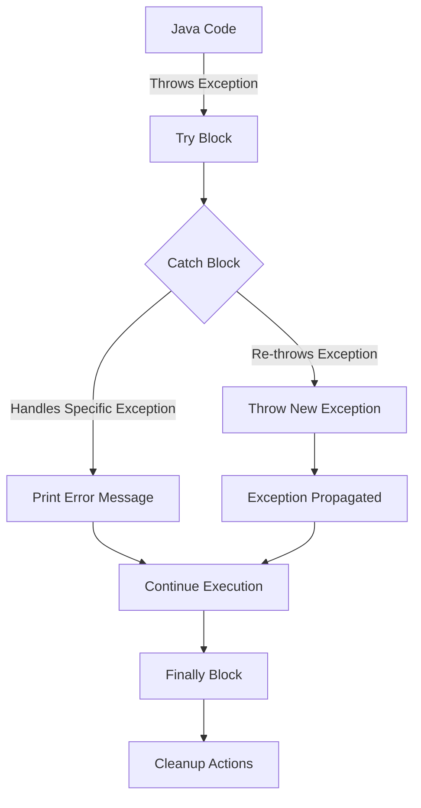

## 12.7 Handling Java Exceptions in Clojure

In the world of software development, exceptions are a crucial mechanism for error handling and control flow. When working with Clojure, a language that runs on the Java Virtual Machine (JVM), understanding how to handle Java exceptions becomes essential, especially when you are leveraging Java libraries or integrating with existing Java codebases. In this section, we will explore how to catch, interact with, and manage Java exceptions in Clojure, providing you with the knowledge to build robust, error-resistant applications.

### Catching Exceptions

Clojure provides a straightforward mechanism for catching exceptions through the `try` and `catch` constructs. This approach is similar to Java's exception handling, allowing you to handle errors gracefully without disrupting the flow of your application.

#### Using `try` and `catch`

In Clojure, you use the `try` block to encapsulate code that might throw exceptions, followed by one or more `catch` blocks to handle specific exception types. Here is a basic example:

```clojure
(try
  (let [result (/ 10 0)]  ; This will throw an ArithmeticException
    (println "Result:" result))
  (catch ArithmeticException e
    (println "Caught an arithmetic exception:" (.getMessage e)))
  (catch Exception e
    (println "Caught a generic exception:" (.getMessage e))))
```

**Explanation:**
- The `try` block contains code that might throw an exception.
- The `catch` block specifies the type of exception to handle. In this case, `ArithmeticException` is caught first, followed by a generic `Exception` to catch any other exceptions.
- The `(.getMessage e)` method retrieves the exception's message.

### Interacting with Java Exception Hierarchy

Java has a rich hierarchy of exceptions, and understanding how to interact with these in Clojure is crucial for effective error handling. Java exceptions are divided into checked and unchecked exceptions:

- **Checked Exceptions**: Must be declared in a method or constructor's `throws` clause if they can be thrown by the execution of the method or constructor and propagate outside the method or constructor boundary.
- **Unchecked Exceptions**: Include `RuntimeException` and its subclasses, which do not need to be declared or caught.

#### Handling Specific Java Exceptions

When working with Java libraries, you might encounter specific exceptions that need to be handled. Here is how you can catch a specific Java exception in Clojure:

```clojure
(import 'java.io.FileNotFoundException)

(try
  (with-open [rdr (clojure.java.io/reader "nonexistent-file.txt")]
    (doseq [line (line-seq rdr)]
      (println line)))
  (catch FileNotFoundException e
    (println "File not found:" (.getMessage e)))
  (catch Exception e
    (println "An error occurred:" (.getMessage e))))
```

**Explanation:**
- We import `FileNotFoundException` from Java.
- The `try` block attempts to read a non-existent file, which throws a `FileNotFoundException`.
- The `catch` block specifically handles `FileNotFoundException`, allowing us to provide a meaningful error message.

### Re-throwing Exceptions

In certain scenarios, you might want to re-throw an exception after catching it, either to propagate it up the call stack or to wrap it in a different exception type. Clojure allows you to re-throw exceptions using the `throw` keyword.

#### Re-throwing an Exception

```clojure
(try
  (throw (IllegalArgumentException. "Invalid argument"))
  (catch IllegalArgumentException e
    (println "Caught an illegal argument exception:" (.getMessage e))
    (throw e)))  ; Re-throwing the exception
```

**Explanation:**
- We explicitly throw an `IllegalArgumentException`.
- After catching the exception, we print a message and re-throw the exception using `throw e`.

#### Wrapping and Re-throwing Exceptions

Sometimes, you might want to wrap an exception in a custom exception type before re-throwing it. This can be useful for providing additional context or information about the error.

```clojure
(defn wrap-and-throw [e]
  (throw (RuntimeException. "Wrapped exception" e)))

(try
  (throw (IllegalArgumentException. "Invalid argument"))
  (catch IllegalArgumentException e
    (wrap-and-throw e)))
```

**Explanation:**
- We define a function `wrap-and-throw` that wraps an exception in a `RuntimeException`.
- In the `catch` block, we call `wrap-and-throw` to wrap and re-throw the original exception.

### Best Practices for Exception Handling

When working with Java exceptions in Clojure, following best practices can help you write more maintainable and robust code.

#### 1. Catch Specific Exceptions

Always catch the most specific exception type possible. This ensures that you handle only the exceptions you expect and prevents catching unintended exceptions that might mask other issues.

#### 2. Provide Meaningful Error Messages

When catching exceptions, provide meaningful error messages that can help diagnose the problem. Use the exception's message and any relevant context to construct informative messages.

#### 3. Avoid Swallowing Exceptions

Avoid catching exceptions without handling them appropriately. Swallowing exceptions can lead to silent failures and make debugging difficult. If you catch an exception, ensure you have a valid reason for doing so.

#### 4. Use `finally` for Cleanup

If you need to perform cleanup actions, such as closing resources, use the `finally` block. The `finally` block executes regardless of whether an exception was thrown, ensuring that resources are always released.

```clojure
(try
  (let [result (/ 10 0)]
    (println "Result:" result))
  (catch ArithmeticException e
    (println "Caught an arithmetic exception:" (.getMessage e)))
  (finally
    (println "Cleanup actions go here")))
```

#### 5. Consider Functional Alternatives

Where possible, consider using functional programming techniques to handle errors without exceptions. For example, use `either` or `option` types to represent success or failure without throwing exceptions.

#### 6. Document Exception Handling

Document the exceptions your functions might throw, especially when they interact with Java libraries. This helps other developers understand the potential error cases and how to handle them.

### Visual Aids

To better understand how Java exceptions map to Clojure's handling mechanisms, consider the following diagram illustrating the flow of exception handling:



**Diagram Explanation:**
- The flowchart shows how exceptions thrown by Java code are caught by the `try` block.
- The `catch` block handles specific exceptions or re-throws them.
- The `finally` block performs cleanup actions, ensuring resources are released.

### References and Links

For further reading and deeper insights into handling exceptions in Clojure, consider the following resources:

- [Clojure Official Documentation](https://clojure.org/reference)
- [Java Exception Handling](https://docs.oracle.com/javase/tutorial/essential/exceptions/)
- [Clojure Community Resources](https://clojure.org/community/resources)
- [Transitioning from OOP to Functional Programming](https://www.lispcast.com/oo-to-fp/)

### Knowledge Check

To reinforce your understanding of handling Java exceptions in Clojure, try the following exercises:

1. Modify the code examples to catch additional specific exceptions.
2. Experiment with wrapping exceptions in custom exception types.
3. Implement a function that uses `either` or `option` types for error handling instead of exceptions.

### Test Your Knowledge: Handling Java Exceptions in Clojure Quiz



### Which Clojure construct is used to catch exceptions?

- [x] try
- [ ] catch
- [ ] throw
- [ ] finally

> **Explanation:** The `try` construct is used to catch exceptions in Clojure, similar to Java's try-catch mechanism.

### What is the purpose of the `catch` block in Clojure?

- [x] To handle specific exceptions
- [ ] To throw new exceptions
- [ ] To execute code unconditionally
- [ ] To perform cleanup actions

> **Explanation:** The `catch` block is used to handle specific exceptions that occur within the `try` block.

### How can you re-throw an exception in Clojure?

- [x] Using the `throw` keyword
- [ ] Using the `catch` keyword
- [ ] Using the `finally` keyword
- [ ] Using the `try` keyword

> **Explanation:** The `throw` keyword is used to re-throw exceptions in Clojure.

### What is the role of the `finally` block?

- [x] To perform cleanup actions
- [ ] To handle specific exceptions
- [ ] To throw new exceptions
- [ ] To catch exceptions

> **Explanation:** The `finally` block is used to perform cleanup actions, ensuring resources are released regardless of exceptions.

### Which of the following is a best practice for exception handling?

- [x] Catch specific exceptions
- [ ] Swallow exceptions
- [ ] Catch all exceptions
- [ ] Avoid using `finally`

> **Explanation:** Catching specific exceptions ensures that only expected exceptions are handled, preventing unintended behavior.

### What is a functional alternative to exception handling?

- [x] Using `either` or `option` types
- [ ] Using `try` and `catch`
- [ ] Using `throw` and `finally`
- [ ] Using `import` and `export`

> **Explanation:** `Either` or `option` types provide a functional alternative to exception handling by representing success or failure without throwing exceptions.

### How can you provide meaningful error messages?

- [x] Use the exception's message and context
- [ ] Use generic messages
- [ ] Avoid printing messages
- [ ] Use random messages

> **Explanation:** Providing meaningful error messages involves using the exception's message and relevant context to help diagnose the problem.

### What should you avoid when handling exceptions?

- [x] Swallowing exceptions
- [ ] Catching specific exceptions
- [ ] Using `finally` for cleanup
- [ ] Documenting exceptions

> **Explanation:** Swallowing exceptions can lead to silent failures, making debugging difficult.

### How can you document exception handling?

- [x] Describe potential exceptions in function documentation
- [ ] Avoid mentioning exceptions
- [ ] Use generic documentation
- [ ] Only document critical exceptions

> **Explanation:** Documenting potential exceptions helps other developers understand error cases and how to handle them.

### True or False: The `finally` block executes only if an exception is thrown.

- [ ] True
- [x] False

> **Explanation:** The `finally` block executes regardless of whether an exception is thrown, ensuring cleanup actions are performed.



By mastering Java exception handling in Clojure, you can build applications that gracefully manage errors, maintain stability, and provide a seamless experience when integrating Java libraries. Embrace these techniques and best practices to enhance your Clojure applications and ensure they are robust and resilient.
