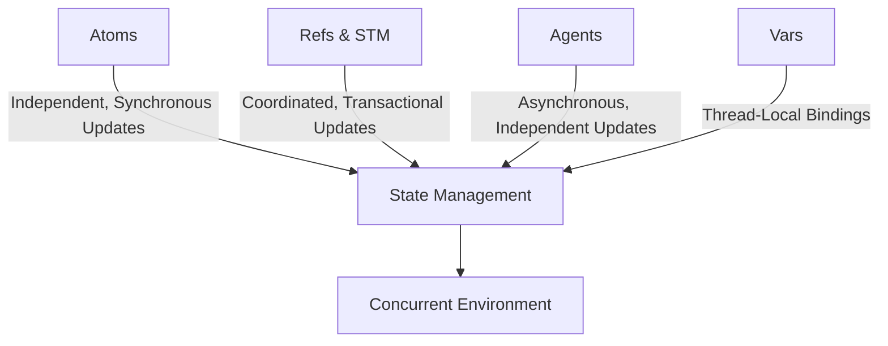

## 13.2 Clojure's Concurrency Primitives

Concurrency is a cornerstone of modern software development, allowing applications to perform multiple tasks simultaneously and efficiently. Clojure, as a functional programming language, offers a unique approach to concurrency through its built-in concurrency primitives: Atoms, Refs, Agents, and Vars. These tools enable developers to manage state changes in a concurrent environment while maintaining the integrity and consistency of data.

### Overview of Concurrency Primitives

Clojure's concurrency model is designed to simplify the complexities of managing shared state in a concurrent environment. By providing a set of primitives that handle state changes in a controlled manner, Clojure allows developers to focus on building scalable applications without the typical pitfalls of concurrency, such as race conditions and deadlocks.

#### Atoms

Atoms in Clojure are used for managing independent, synchronous state changes. They provide a simple way to handle mutable state using compare-and-swap (CAS) semantics. This means that an Atom can be updated atomically, ensuring that changes to its state are consistent and thread-safe.

**Key Features of Atoms:**

- **Independence**: Atoms are ideal for state that does not require coordination with other state changes.
- **Synchronous Updates**: Changes to an Atom's state are applied immediately.
- **CAS Semantics**: Atoms use compare-and-swap to ensure that updates are atomic.

**Code Example:**

```clojure
(def counter (atom 0))

;; Increment the counter atomically
(swap! counter inc)

;; Reset the counter to a specific value
(reset! counter 10)

;; Access the current value
@counter ; => 10
```

In this example, we define an Atom `counter` initialized to `0`. We use `swap!` to increment the counter atomically and `reset!` to set it to a specific value. The `@` symbol is used to dereference the Atom and obtain its current value.

#### Refs and Software Transactional Memory (STM)

Refs in Clojure are used for coordinated, synchronous updates across multiple shared states. They leverage Software Transactional Memory (STM) to ensure that changes to multiple Refs are applied atomically and consistently.

**Key Features of Refs and STM:**

- **Coordination**: Refs are ideal for state that requires coordination with other state changes.
- **Transactional Updates**: Changes to Refs are made within a transaction, ensuring atomicity.
- **Consistency**: STM ensures that all changes within a transaction are consistent.

**Code Example:**

```clojure
(def account-a (ref 100))
(def account-b (ref 200))

;; Transfer money between accounts
(dosync
  (alter account-a - 50)
  (alter account-b + 50))

;; Access the current values
[@account-a @account-b] ; => [50 250]
```

In this example, we define two Refs, `account-a` and `account-b`, representing bank account balances. We use `dosync` to create a transaction that transfers money from one account to another. The `alter` function is used to update the values within the transaction.

#### Agents

Agents in Clojure are used for managing asynchronous, independent state changes. They process actions in a separate thread pool, allowing for non-blocking updates to state.

**Key Features of Agents:**

- **Asynchronous Updates**: Agents process actions asynchronously, allowing other tasks to continue executing.
- **Independent State**: Agents are ideal for state that does not require coordination with other state changes.
- **Error Handling**: Agents can handle errors in a separate thread, preventing them from affecting the main application flow.

**Code Example:**

```clojure
(def log-agent (agent []))

;; Add a log entry asynchronously
(send log-agent conj "Log entry 1")

;; Wait for all actions to complete
(await log-agent)

;; Access the current log
@log-agent ; => ["Log entry 1"]
```

In this example, we define an Agent `log-agent` initialized to an empty vector. We use `send` to add a log entry asynchronously. The `await` function is used to wait for all actions to complete before accessing the current state.

#### Vars and Dynamic Bindings

Vars in Clojure provide a way to define thread-local bindings, allowing for dynamic scope in a concurrent environment. They are useful for managing global state that needs to be accessed across different threads.

**Key Features of Vars:**

- **Dynamic Bindings**: Vars can have thread-local bindings, allowing for dynamic scope.
- **Global State**: Vars are ideal for managing global state that needs to be accessed across different threads.
- **Concurrency Control**: Vars provide a way to control access to shared state in a concurrent environment.

**Code Example:**

```clojure
(def ^:dynamic *config* {:timeout 1000})

;; Use dynamic binding to change the value for a specific scope
(binding [*config* {:timeout 2000}]
  (println "Timeout in this scope:" (:timeout *config*)))

;; Access the global value
(println "Global timeout:" (:timeout *config*))
```

In this example, we define a dynamic Var `*config*` representing a configuration map. We use `binding` to change the value of `*config*` for a specific scope, while the global value remains unchanged.

### Visual Aids

To better understand the relationship between these concurrency primitives, let's examine a diagram that illustrates how they interact in a concurrent environment.



**Diagram Description:** This diagram illustrates how Atoms, Refs & STM, Agents, and Vars contribute to state management in a concurrent environment. Each primitive has a unique role, allowing developers to choose the appropriate tool for their specific concurrency needs.

### References and Links

For further reading on Clojure's concurrency primitives, consider the following resources:

- [Clojure Official Documentation](https://clojure.org/reference)
- [Clojure STM Guide](https://clojure.org/reference/refs)
- [Transitioning from OOP to Functional Programming](https://www.lispcast.com/oo-to-fp/)
- [Clojure Community Resources](https://clojure.org/community/resources)

### Knowledge Check

To reinforce your understanding of Clojure's concurrency primitives, consider the following questions:

1. What are the main differences between Atoms and Refs in Clojure?
2. How do Agents handle asynchronous updates in a concurrent environment?
3. What role do Vars play in managing global state across threads?
4. How does Software Transactional Memory (STM) ensure consistency in state changes?
5. How can you use dynamic bindings to manage thread-local state in Clojure?

### Encouraging Engagement

Embracing functional programming with Clojure's concurrency primitives can be challenging, but with each step, you'll gain a deeper understanding and see tangible benefits in your codebase. We encourage you to experiment with the provided code examples and explore how these primitives can be applied to your own projects.

### Try It Yourself

To solidify your understanding of Clojure's concurrency primitives, try modifying the provided code examples. For instance, experiment with different state updates using Atoms, Refs, and Agents, and observe how these changes affect the overall behavior of the application. By actively engaging with the code, you'll develop a stronger grasp of Clojure's concurrency model.

### Test Your Knowledge: Clojure's Concurrency Primitives Quiz



### What is the primary use of Atoms in Clojure?

- [x] Managing independent, synchronous state changes
- [ ] Coordinating updates across multiple states
- [ ] Handling asynchronous state changes
- [ ] Defining thread-local bindings

> **Explanation:** Atoms are used for managing independent, synchronous state changes with compare-and-swap semantics.

### How do Refs ensure consistency in state changes?

- [x] By using Software Transactional Memory (STM)
- [ ] Through asynchronous processing
- [ ] By using thread-local bindings
- [ ] By leveraging dynamic scope

> **Explanation:** Refs use Software Transactional Memory (STM) to ensure that changes to multiple Refs are applied atomically and consistently.

### What is the role of Agents in Clojure's concurrency model?

- [x] Managing asynchronous, independent state changes
- [ ] Coordinating updates across multiple states
- [ ] Defining thread-local bindings
- [ ] Handling synchronous state changes

> **Explanation:** Agents are used for managing asynchronous, independent state changes, processing actions in a separate thread pool.

### How can Vars provide thread-local bindings?

- [x] Through dynamic scope
- [ ] By using Software Transactional Memory (STM)
- [ ] By leveraging asynchronous processing
- [ ] By using compare-and-swap semantics

> **Explanation:** Vars can have thread-local bindings, allowing for dynamic scope in a concurrent environment.

### Which concurrency primitive is best suited for coordinated state changes?

- [ ] Atoms
- [x] Refs
- [ ] Agents
- [ ] Vars

> **Explanation:** Refs are ideal for state that requires coordination with other state changes, using STM for transactional updates.

### What is the main advantage of using Agents for state management?

- [x] Asynchronous processing
- [ ] Synchronous updates
- [ ] Thread-local bindings
- [ ] Transactional consistency

> **Explanation:** Agents process actions asynchronously, allowing for non-blocking updates to state.

### How do Atoms ensure atomic updates?

- [x] Using compare-and-swap semantics
- [ ] Through dynamic scope
- [ ] By leveraging Software Transactional Memory (STM)
- [ ] By using thread-local bindings

> **Explanation:** Atoms use compare-and-swap semantics to ensure that updates are atomic and thread-safe.

### What is the purpose of the `dosync` block in Clojure?

- [x] To create a transaction for Refs
- [ ] To manage asynchronous updates
- [ ] To define thread-local bindings
- [ ] To handle dynamic scope

> **Explanation:** The `dosync` block is used to create a transaction for Refs, ensuring that changes are applied atomically and consistently.

### How can dynamic bindings be used in Clojure?

- [x] To manage thread-local state
- [ ] To coordinate updates across multiple states
- [ ] To handle asynchronous state changes
- [ ] To ensure transactional consistency

> **Explanation:** Dynamic bindings allow Vars to have thread-local bindings, managing state for a specific scope.

### True or False: Agents in Clojure can handle errors in a separate thread.

- [x] True
- [ ] False

> **Explanation:** Agents can handle errors in a separate thread, preventing them from affecting the main application flow.



By mastering Clojure's concurrency primitives, you'll be well-equipped to build efficient, scalable applications that leverage the full power of functional programming.
