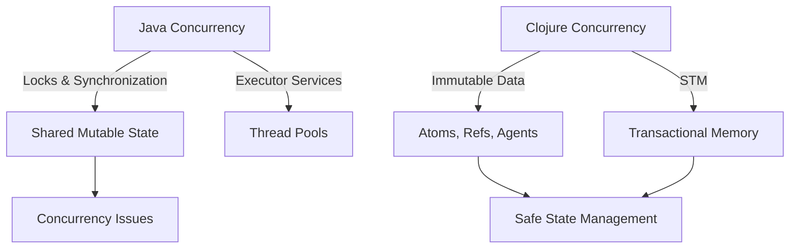

## 13.3 Managing State in Concurrent Applications

In the realm of concurrent programming, managing state effectively is crucial for building robust and scalable applications. Clojure, with its functional programming paradigm and emphasis on immutability, offers unique solutions for handling state in concurrent environments. In this section, we will delve into the strategies for managing state in concurrent applications using Clojure's concurrency primitives, explore the risks of shared mutable state, and provide practical examples to illustrate these concepts.

### State Management Strategies

Concurrency introduces challenges in state management, particularly when multiple threads attempt to read or modify shared data. In traditional Object-Oriented Programming (OOP) languages like Java, developers often rely on locks and synchronization mechanisms to manage concurrent access to mutable state. However, these approaches can lead to complex and error-prone code. In contrast, Clojure provides a set of concurrency primitives that leverage immutable data structures, enabling developers to manage state changes in a more declarative and less error-prone manner.

#### Avoiding Shared Mutable State

One of the fundamental principles in Clojure is the avoidance of shared mutable state. Mutable state shared across threads can lead to race conditions, deadlocks, and other concurrency issues. By embracing immutability, Clojure eliminates these problems at the source.

**Immutable Data Structures**: Clojure's core data structures (lists, vectors, maps, and sets) are immutable by default. This means that once a data structure is created, it cannot be altered. Instead, any operation that modifies a data structure returns a new version of that structure, leaving the original unchanged.

**Example**:
```clojure
(def original-list [1 2 3])
(def new-list (conj original-list 4))

;; original-list remains unchanged
;; new-list is [1 2 3 4]
```

By using immutable data structures, we ensure that data cannot be inadvertently modified by concurrent threads, thus avoiding the pitfalls of shared mutable state.

#### Coordinated vs. Independent State Changes

In concurrent applications, state changes can be categorized into two types: coordinated and independent. Understanding the distinction between these types is crucial for selecting the appropriate concurrency primitive in Clojure.

**Coordinated State Changes**: When multiple state changes need to be coordinated, such as ensuring that two related variables are updated atomically, Clojure's `Refs` and Software Transactional Memory (STM) system provide a robust solution.

**Independent State Changes**: For state changes that are independent and do not require coordination with other state changes, Clojure offers `Atoms` and `Agents` as lightweight alternatives.

##### Refs and Software Transactional Memory

Refs are used to manage coordinated state changes. They allow multiple variables to be updated in a consistent and atomic manner using transactions. This is particularly useful when you need to ensure that a series of updates either all succeed or all fail, maintaining the integrity of your application's state.

**Example**:
```clojure
(def account-a (ref 100))
(def account-b (ref 200))

(defn transfer [amount]
  (dosync
    (alter account-a - amount)
    (alter account-b + amount)))

;; This transaction will ensure that both account-a and account-b are updated atomically
```

In this example, the `dosync` block ensures that the updates to `account-a` and `account-b` are performed atomically. If any part of the transaction fails, the entire transaction is rolled back.

##### Atoms for Independent State Changes

Atoms provide a simple way to manage independent state changes. They are ideal for scenarios where a single piece of state is updated by multiple threads without the need for coordination with other state changes.

**Example**:
```clojure
(def counter (atom 0))

(defn increment-counter []
  (swap! counter inc))

;; Each call to increment-counter will safely update the counter atom
```

Atoms use compare-and-swap (CAS) to ensure that updates are applied safely, even when multiple threads attempt to modify the state simultaneously.

##### Agents for Asynchronous State Changes

Agents are similar to Atoms but are designed for managing asynchronous state changes. They allow updates to be performed in the background, freeing up the main thread to continue processing other tasks.

**Example**:
```clojure
(def logger (agent []))

(defn log-message [message]
  (send logger conj message))

;; Messages are added to the logger asynchronously
```

Agents are useful for tasks that can be performed independently and do not require immediate feedback, such as logging or background processing.

### Example Implementations

Let's explore a practical example that demonstrates effective state management in a concurrent application using Clojure's concurrency primitives.

**Scenario**: A bank application that processes transactions concurrently, ensuring that account balances are updated correctly and consistently.

**Implementation**:
```clojure
(def accounts (atom {:account-a 1000 :account-b 1500}))

(defn transfer-funds [from-account to-account amount]
  (swap! accounts
    (fn [accs]
      (let [from-balance (get accs from-account)
            to-balance (get accs to-account)]
        (if (>= from-balance amount)
          (-> accs
              (assoc from-account (- from-balance amount))
              (assoc to-account (+ to-balance amount)))
          accs)))))

;; Simulate concurrent transactions
(future (transfer-funds :account-a :account-b 100))
(future (transfer-funds :account-b :account-a 50))
```

In this example, we use an `atom` to manage the account balances. The `swap!` function ensures that updates to the account balances are applied atomically, even when multiple transactions are processed concurrently.

### Visual Aids

To better understand the concurrency models in Clojure, let's compare them with Java's concurrency mechanisms using a diagram.



**Diagram Description**: This diagram illustrates the differences between Java's and Clojure's concurrency models. Java relies on locks and synchronization to manage shared mutable state, which can lead to concurrency issues. In contrast, Clojure uses immutable data structures and concurrency primitives like Atoms, Refs, and Agents, along with Software Transactional Memory (STM), to provide safe and efficient state management.

### References and Links

- [Clojure Official Documentation](https://clojure.org/reference)
- [Clojure Concurrency Guide](https://clojure.org/reference/atoms)
- [Understanding Software Transactional Memory](https://clojure.org/reference/refs)
- [Functional Programming vs. OOP](https://www.lispcast.com/oo-to-fp/)

### Knowledge Check

To reinforce your understanding of managing state in concurrent applications, consider the following questions:

- What are the benefits of using immutable data structures in concurrent programming?
- How do Atoms differ from Refs in terms of state management?
- When would you choose to use Agents over Atoms or Refs?

### Encouraging Engagement

Embracing functional programming and Clojure's concurrency model can be challenging, but with each step, you'll gain a deeper understanding and see tangible benefits in your codebase. Experiment with the code examples provided, and try modifying them to suit your own use cases.

### Formatting and Structure

This section is organized with clear headings and subheadings to guide you through the concepts of state management in concurrent applications. Key terms are highlighted, and code examples are provided to illustrate each concept.

### Best Practices for Tags

Use specific and relevant tags to categorize this content, such as "Clojure", "Concurrency", "State Management", "Functional Programming", "Atoms", "Refs", "Agents", and "Immutable Data".

### Test Your Knowledge: Managing State in Concurrent Applications Quiz



### What is one of the main advantages of using immutable data structures in concurrent programming?

- [x] They prevent race conditions by ensuring data cannot be modified by multiple threads simultaneously.
- [ ] They allow for faster data processing.
- [ ] They reduce memory usage.
- [ ] They simplify code syntax.

> **Explanation:** Immutable data structures prevent race conditions by ensuring that data cannot be modified by multiple threads simultaneously, eliminating the need for locks and synchronization.

### Which Clojure primitive is best suited for managing coordinated state changes?

- [ ] Atoms
- [x] Refs
- [ ] Agents
- [ ] Vars

> **Explanation:** Refs are designed for managing coordinated state changes using Software Transactional Memory, ensuring atomic updates across multiple variables.

### How do Atoms ensure safe updates in concurrent environments?

- [ ] By using locks
- [ ] By using threads
- [x] By using compare-and-swap (CAS)
- [ ] By using transactions

> **Explanation:** Atoms use compare-and-swap (CAS) to ensure that updates are applied safely, even when multiple threads attempt to modify the state simultaneously.

### What is the primary use case for Agents in Clojure?

- [ ] Coordinated state changes
- [x] Asynchronous state changes
- [ ] Synchronous state changes
- [ ] Immutable data storage

> **Explanation:** Agents are used for managing asynchronous state changes, allowing updates to be performed in the background.

### Which of the following is a characteristic of Software Transactional Memory (STM) in Clojure?

- [x] It allows for atomic updates across multiple Refs.
- [ ] It uses locks to manage state.
- [ ] It is used for asynchronous updates.
- [ ] It requires manual synchronization.

> **Explanation:** Software Transactional Memory (STM) allows for atomic updates across multiple Refs, ensuring consistency and integrity of state changes.

### How does Clojure's approach to concurrency differ from Java's?

- [x] Clojure uses immutable data structures and concurrency primitives, while Java relies on locks and synchronization.
- [ ] Clojure uses more threads than Java.
- [ ] Clojure does not support concurrency.
- [ ] Java has better support for functional programming.

> **Explanation:** Clojure uses immutable data structures and concurrency primitives like Atoms, Refs, and Agents, while Java relies on locks and synchronization to manage shared mutable state.

### When should you use Refs over Atoms in Clojure?

- [ ] For independent state changes
- [x] For coordinated state changes
- [ ] For asynchronous state changes
- [ ] For immutable data storage

> **Explanation:** Refs are used for coordinated state changes, where multiple variables need to be updated atomically using transactions.

### What is the role of the `dosync` block in Clojure?

- [ ] To lock variables
- [x] To ensure atomic transactions with Refs
- [ ] To create threads
- [ ] To manage asynchronous tasks

> **Explanation:** The `dosync` block is used to ensure atomic transactions with Refs, allowing multiple state changes to be coordinated within a transaction.

### What is a potential drawback of using locks and synchronization in Java for concurrency?

- [x] They can lead to complex and error-prone code.
- [ ] They are faster than Clojure's concurrency primitives.
- [ ] They simplify state management.
- [ ] They eliminate race conditions.

> **Explanation:** Locks and synchronization can lead to complex and error-prone code, making it difficult to manage concurrency effectively.

### True or False: In Clojure, all data structures are mutable by default.

- [ ] True
- [x] False

> **Explanation:** In Clojure, all core data structures are immutable by default, meaning they cannot be modified once created.


