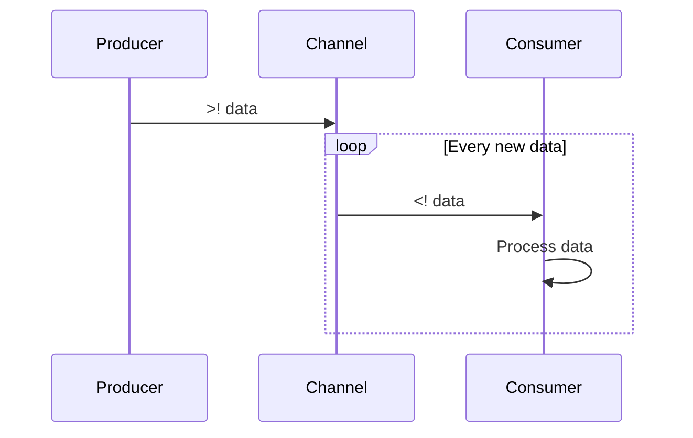

## 13.4 Utilizing `core.async` for Concurrent Tasks

Concurrency in programming is a powerful tool that allows us to perform multiple operations simultaneously, improving the efficiency and responsiveness of our applications. In Clojure, the `core.async` library provides a robust framework for handling concurrency using channels and go blocks. This section will guide you through understanding and utilizing `core.async` for concurrent tasks, drawing parallels to Java's concurrency model to ease the transition for Java developers.

### Introduction to `core.async`

The [`core.async`](https://github.com/clojure/core.async) library is a Clojure library that provides facilities for asynchronous programming. It introduces the concept of channels and go blocks, which allow you to write concurrent code in a more straightforward and manageable way. Unlike traditional threading models, `core.async` abstracts away the complexities of thread management and synchronization, enabling you to focus on the logic of your concurrent tasks.

#### Channels

Channels in `core.async` are similar to queues in Java's concurrent programming. They serve as conduits for passing messages between different parts of your program, facilitating communication between concurrent processes. Channels can be buffered or unbuffered, depending on your needs.

- **Unbuffered Channels**: These channels block the sending process until the receiving process is ready to accept the message, ensuring synchronization between sender and receiver.
  
- **Buffered Channels**: These channels allow a specified number of messages to be sent without blocking, providing a way to decouple the sender and receiver processes.

Here's a simple example of creating and using a channel in Clojure:

```clojure
(require '[clojure.core.async :refer [chan >! <! go]])

;; Create an unbuffered channel
(def my-channel (chan))

;; A go block to send a message
(go (>! my-channel "Hello, core.async!"))

;; A go block to receive a message
(go (println "Received message:" (<! my-channel)))
```

In the example above, we create an unbuffered channel and use two go blocks to send and receive a message. The `>!` operator is used to put a message onto the channel, while the `<!` operator is used to take a message from the channel.

#### Go Blocks

Go blocks in `core.async` are lightweight threads that allow you to write asynchronous code without blocking actual threads. They are similar to Java's `Runnable` interface but are managed by the `core.async` runtime, which efficiently handles the scheduling and execution of these blocks.

- **Non-blocking Execution**: Go blocks do not block the underlying thread, allowing for efficient use of system resources.
  
- **Parking and Blocking**: Within a go block, operations that would typically block (like reading from a channel) instead "park" the block, allowing other go blocks to execute. This is akin to yielding control in a cooperative multitasking environment.

Here's an example demonstrating the use of go blocks:

```clojure
(require '[clojure.core.async :refer [chan go >! <!]])

(defn async-task []
  (let [c (chan)]
    (go
      (Thread/sleep 1000) ;; Simulate a time-consuming task
      (>! c "Task completed"))
    c))

(defn run-async-task []
  (let [result-chan (async-task)]
    (go
      (println "Result:" (<! result-chan)))))

(run-async-task)
```

In this example, `async-task` returns a channel that will eventually contain the result of a simulated time-consuming task. The `run-async-task` function demonstrates how to initiate the task and handle the result asynchronously.

### Parking and Blocking

Understanding the concepts of parking and blocking is crucial when working with `core.async`. In traditional threading models, blocking occurs when a thread waits for a resource or condition, potentially leading to inefficiencies if not managed properly. In contrast, `core.async` employs parking, a mechanism where a go block relinquishes control when it encounters a blocking operation, allowing other go blocks to execute.

- **Parking**: Occurs within go blocks when performing operations like channel reads (`<!`) or writes (`>!`). The go block is suspended, freeing up the underlying thread for other tasks.

- **Blocking**: In contrast, blocking operations, such as those outside go blocks or in traditional threading models, halt the execution of the current thread until the operation completes.

Here's an example illustrating parking in go blocks:

```clojure
(require '[clojure.core.async :refer [chan go >! <!]])

(defn producer [c]
  (go
    (dotimes [i 5]
      (Thread/sleep 500) ;; Simulate work
      (>! c i))
    (close! c)))

(defn consumer [c]
  (go
    (loop []
      (when-let [value (<! c)]
        (println "Consumed:" value)
        (recur)))))

(let [c (chan)]
  (producer c)
  (consumer c))
```

In this example, the `producer` function sends numbers to a channel, and the `consumer` function reads from the channel. The use of go blocks ensures that both functions can operate concurrently, with the consumer parking when waiting for new values.

### Practical Examples

To solidify your understanding of `core.async`, let's explore some practical examples of using it for pipelines, event handling, and concurrent task coordination.

#### Pipelines

Pipelines are a common pattern in concurrent programming, allowing data to flow through a series of processing steps. `core.async` makes it easy to implement pipelines using channels and go blocks.

```clojure
(require '[clojure.core.async :refer [chan go >! <! pipeline]])

(defn process-item [item]
  (* item 2)) ;; Example processing function

(defn run-pipeline []
  (let [input (chan)
        output (chan)]
    (pipeline 5 output (map process-item) input)
    (go
      (dotimes [i 10]
        (>! input i))
      (close! input))
    (go
      (loop []
        (when-let [result (<! output)]
          (println "Processed:" result)
          (recur))))))

(run-pipeline)
```

In this example, we use the `pipeline` function to process items from the `input` channel, doubling each item before sending it to the `output` channel. The `pipeline` function manages the concurrency, allowing up to five items to be processed simultaneously.

#### Event Handling

Event-driven architectures benefit greatly from `core.async`, as channels can be used to decouple event producers and consumers.

```clojure
(require '[clojure.core.async :refer [chan go >! <!]])

(defn event-producer [event-chan]
  (go
    (dotimes [i 3]
      (Thread/sleep 1000) ;; Simulate event generation
      (>! event-chan {:event-type :click :event-id i}))
    (close! event-chan)))

(defn event-consumer [event-chan]
  (go
    (loop []
      (when-let [event (<! event-chan)]
        (println "Handling event:" event)
        (recur)))))

(let [event-chan (chan)]
  (event-producer event-chan)
  (event-consumer event-chan))
```

In this example, the `event-producer` generates events and sends them to the `event-chan`, while the `event-consumer` handles each event as it arrives. This separation of concerns allows for flexible and scalable event handling.

#### Concurrent Task Coordination

Coordinating multiple concurrent tasks is a common requirement in complex applications. `core.async` provides tools to manage task coordination effectively.

```clojure
(require '[clojure.core.async :refer [chan go >! <! alts!]])

(defn task [id]
  (go
    (Thread/sleep (rand-int 2000)) ;; Simulate variable task duration
    (println "Task" id "completed")
    id))

(defn coordinate-tasks []
  (let [tasks (mapv task (range 5))
        results (chan)]
    (go
      (dotimes [_ 5]
        (let [[result _] (alts! tasks)]
          (>! results result)))
      (close! results))
    (go
      (loop []
        (when-let [result (<! results)]
          (println "Result received:" result)
          (recur))))))

(coordinate-tasks)
```

In this example, we create multiple tasks with varying durations and use `alts!` to wait for any task to complete, sending the result to the `results` channel. This approach allows for efficient task coordination and result collection.

### Visual Aids

To better understand how `core.async` works, let's visualize the flow of data and control between channels and go blocks using a sequence diagram.



**Diagram Explanation**: This sequence diagram illustrates the interaction between a producer, a channel, and a consumer. The producer sends data to the channel, and the consumer retrieves and processes the data. The loop represents the continuous flow of data through the channel.

### References and Links

- [Clojure Official Documentation](https://clojure.org/reference)
- [Clojure Community Resources](https://clojure.org/community/resources)
- [Transitioning from OOP to Functional Programming](https://www.lispcast.com/oo-to-fp/)
- [core.async GitHub Repository](https://github.com/clojure/core.async)

### Knowledge Check

To reinforce your understanding of `core.async`, consider the following questions and exercises:

1. **What are the key differences between parking and blocking in `core.async`?**
2. **How would you implement a simple producer-consumer pattern using `core.async`?**
3. **Modify the pipeline example to include error handling for processing failures.**
4. **Experiment with different buffer sizes in channels and observe their impact on performance.**

### Encouraging Engagement

Embracing functional programming with `core.async` can be challenging, but each step you take will deepen your understanding and reveal the benefits of this powerful concurrency model. Keep experimenting with the examples provided, and don't hesitate to explore the official documentation and community resources for further insights.

### Test Your Knowledge: Utilizing `core.async` for Concurrent Tasks Quiz



### What is the primary purpose of channels in `core.async`?

- [x] To facilitate communication between concurrent processes
- [ ] To manage memory allocation
- [ ] To handle exceptions
- [ ] To perform I/O operations

> **Explanation:** Channels are used in `core.async` to enable communication between different concurrent processes, similar to message queues.

### What is a go block in `core.async`?

- [x] A lightweight thread for asynchronous code execution
- [ ] A data structure for storing state
- [ ] A mechanism for error handling
- [ ] A type of channel

> **Explanation:** Go blocks are used to execute asynchronous code without blocking the underlying thread, making them efficient for concurrent tasks.

### How does parking differ from blocking in `core.async`?

- [x] Parking allows go blocks to yield control, while blocking halts execution
- [ ] Parking is used for error handling, blocking is not
- [ ] Parking is faster than blocking
- [ ] Parking is specific to buffered channels

> **Explanation:** Parking allows go blocks to yield control when waiting for resources, unlike blocking, which halts execution until the resource is available.

### What is the function of `alts!` in `core.async`?

- [x] To wait for any of multiple channels to be ready
- [ ] To create a new channel
- [ ] To close a channel
- [ ] To perform a blocking read

> **Explanation:** `alts!` is used to wait for any of multiple channels to be ready, allowing for efficient task coordination.

### Which operator is used to send a message to a channel in a go block?

- [x] >!
- [ ] <!
- [ ] >>
- [ ] <<

> **Explanation:** The `>!` operator is used within go blocks to send messages to channels.

### Can go blocks in `core.async` block the underlying thread?

- [ ] Yes
- [x] No

> **Explanation:** Go blocks do not block the underlying thread; they are managed by the `core.async` runtime for efficient execution.

### What is a practical use case for `core.async` pipelines?

- [x] Data processing through multiple steps
- [ ] Memory management
- [ ] Exception handling
- [ ] User authentication

> **Explanation:** Pipelines in `core.async` are used for processing data through multiple steps, often in parallel.

### How do buffered channels differ from unbuffered channels?

- [x] Buffered channels allow multiple messages without blocking
- [ ] Buffered channels are faster
- [ ] Buffered channels are used for error handling
- [ ] Buffered channels are read-only

> **Explanation:** Buffered channels can hold multiple messages, allowing senders to continue without waiting for a receiver.

### Which function is used to create a channel in `core.async`?

- [x] chan
- [ ] go
- [ ] alts!
- [ ] close!

> **Explanation:** The `chan` function is used to create a new channel in `core.async`.

### True or False: `core.async` can be used to implement event-driven architectures.

- [x] True
- [ ] False

> **Explanation:** `core.async` is well-suited for event-driven architectures, allowing for decoupled event producers and consumers.



By mastering `core.async`, you can unlock the full potential of concurrency in your Clojure applications, creating scalable and responsive systems. Keep exploring and experimenting to deepen your understanding and proficiency in functional programming with Clojure.
