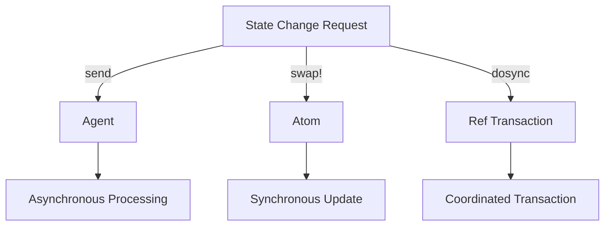

## 13.5 Agents, Atoms, and Refs in Depth

Concurrency is a critical aspect of modern software development, especially in the realm of functional programming. Clojure, as a functional language, provides robust concurrency primitives that help in managing state changes without the pitfalls of traditional locking mechanisms. In this section, we will delve deep into three of Clojure's concurrency primitives: Agents, Atoms, and Refs. We will explore their features, use cases, and how they compare to traditional Java concurrency mechanisms.

### Agents Detailed

Agents in Clojure are designed for managing asynchronous, independent state changes. They are ideal for tasks that do not require immediate consistency but need to be processed eventually. Let's explore how Agents work, including error handling, validators, and watcher functions.

#### How Agents Work

Agents are created using the `agent` function, which takes an initial state. You can send actions to an Agent using `send` or `send-off`, depending on whether the action is CPU-bound or I/O-bound.

```clojure
(def my-agent (agent 0))

;; Increment the agent's state asynchronously
(send my-agent inc)

;; Check the agent's state
@my-agent  ; => 1
```

- **`send` vs. `send-off`**: Use `send` for CPU-bound tasks as it uses a fixed thread pool. Use `send-off` for I/O-bound tasks, which can block, as it uses a separate thread pool.

#### Error Handling

Agents handle errors gracefully by default. If an error occurs during the execution of an action, the agent goes into a failed state. You can check if an agent has failed using `agent-error`.

```clojure
(send my-agent (fn [_] (/ 1 0)))  ; Causes an error

(agent-error my-agent)  ; => ArithmeticException: Divide by zero

;; Clear the error state
(restart-agent my-agent 0)
```

- **Error Recovery**: Use `restart-agent` to reset the agent's state after handling the error.

#### Validators and Watcher Functions

Validators ensure that the state of an agent is always valid. You can define a validator function when creating an agent.

```clojure
(def my-agent (agent 0 :validator pos?))

(send my-agent dec)  ; Throws an exception because -1 is not positive
```

Watchers are functions that are triggered whenever the state of an agent changes. They are useful for logging or triggering side effects.

```clojure
(add-watch my-agent :watcher
  (fn [key agent old-state new-state]
    (println "Agent state changed from" old-state "to" new-state)))
```

### Atoms Advanced Usage

Atoms provide a way to manage synchronous, independent state changes. They are ideal for managing shared, mutable state that requires immediate consistency.

#### Basic Usage of Atoms

Atoms are created using the `atom` function. You can change the state of an atom using `swap!` or `reset!`.

```clojure
(def my-atom (atom 0))

(swap! my-atom inc)  ; => 1
@my-atom  ; => 1

(reset! my-atom 42)  ; => 42
@my-atom  ; => 42
```

#### Validators

Like agents, atoms can also have validators to ensure that their state remains valid.

```clojure
(def my-atom (atom 0 :validator pos?))

(swap! my-atom dec)  ; Throws an exception because -1 is not positive
```

#### Watches

Watches allow you to observe state changes in atoms, similar to agents.

```clojure
(add-watch my-atom :watcher
  (fn [key atom old-state new-state]
    (println "Atom state changed from" old-state "to" new-state)))
```

### Refs and Transactions

Refs are used for managing coordinated, synchronous state changes across multiple variables. They are ideal for scenarios where multiple state changes need to be consistent.

#### Transactional Properties

Refs use Software Transactional Memory (STM) to manage transactions. Transactions ensure that all state changes are atomic, consistent, isolated, and durable (ACID).

```clojure
(def account1 (ref 100))
(def account2 (ref 200))

(dosync
  (alter account1 - 50)
  (alter account2 + 50))
```

- **`dosync`**: Encloses a transaction, ensuring that all changes within it are applied atomically.

#### Consistency Across State Changes

Refs ensure consistency by retrying transactions that conflict. This is similar to optimistic locking in databases.

```clojure
(dosync
  (alter account1 - 50)
  (alter account2 + 50))
```

- **Conflict Resolution**: If another transaction modifies `account1` or `account2` during this transaction, it will automatically retry.

### Choosing the Right Primitive

Choosing the right concurrency primitive is crucial for building efficient and scalable applications. Here's a guide to help you decide:

- **Use Agents** when you need to manage asynchronous, independent state changes. They are ideal for tasks that can be processed in the background without immediate consistency.
- **Use Atoms** for synchronous, independent state changes that require immediate consistency. They are suitable for managing shared state in a single-threaded context.
- **Use Refs** when you need to coordinate multiple state changes and ensure consistency. They are perfect for managing complex transactions that involve multiple variables.

### Parallels with Java

For Java developers, understanding Clojure's concurrency primitives can be easier by drawing parallels with Java's concurrency mechanisms:

- **Agents** are akin to Java's `ExecutorService` for managing asynchronous tasks, but with built-in state management.
- **Atoms** are similar to `AtomicReference`, providing a way to manage shared state with atomic operations.
- **Refs** can be compared to database transactions, ensuring consistency across multiple state changes.

### Visualizing Concurrency Models

To better understand how these concurrency models work, let's visualize them using diagrams.



**Diagram Explanation**: This diagram illustrates how state change requests are handled by different concurrency primitives in Clojure. Agents process changes asynchronously, atoms update state synchronously, and refs coordinate transactions.

### References and Further Reading

For more information on Clojure's concurrency primitives, consider exploring the following resources:

- [Clojure Official Documentation](https://clojure.org/reference)
- [Clojure STM Guide](https://clojure.org/reference/refs)
- [Transitioning from OOP to Functional Programming](https://www.lispcast.com/oo-to-fp/)

### Knowledge Check

Before we conclude, let's test your understanding of Agents, Atoms, and Refs with a few questions.

## **Test Your Knowledge: Agents, Atoms, and Refs in Depth Quiz**



### What is the primary use case for Agents in Clojure?

- [x] Managing asynchronous, independent state changes
- [ ] Coordinating multiple state changes
- [ ] Ensuring immediate consistency
- [ ] Handling synchronous state changes

> **Explanation:** Agents are designed for managing asynchronous, independent state changes that do not require immediate consistency.

### How do you reset an agent that has encountered an error?

- [x] Use `restart-agent`
- [ ] Use `reset!`
- [ ] Use `swap!`
- [ ] Use `dosync`

> **Explanation:** `restart-agent` is used to reset an agent's state after handling an error.

### Which function is used to enclose a transaction for Refs?

- [x] `dosync`
- [ ] `send`
- [ ] `swap!`
- [ ] `send-off`

> **Explanation:** `dosync` is used to enclose a transaction, ensuring atomic and consistent state changes for Refs.

### What is a validator used for in Clojure's concurrency primitives?

- [x] Ensuring state validity
- [ ] Logging state changes
- [ ] Handling errors
- [ ] Managing asynchronous tasks

> **Explanation:** Validators ensure that the state of a concurrency primitive remains valid according to a specified condition.

### Which concurrency primitive is best for managing shared, mutable state with immediate consistency?

- [x] Atoms
- [ ] Agents
- [ ] Refs
- [ ] STM

> **Explanation:** Atoms are best suited for managing shared, mutable state that requires immediate consistency.

### What is the purpose of a watcher function?

- [x] Observing state changes
- [ ] Validating state
- [ ] Handling errors
- [ ] Managing transactions

> **Explanation:** Watcher functions are used to observe state changes in concurrency primitives like atoms and agents.

### Which concurrency primitive uses Software Transactional Memory (STM)?

- [x] Refs
- [ ] Atoms
- [ ] Agents
- [ ] Executors

> **Explanation:** Refs use Software Transactional Memory (STM) to manage transactions and ensure consistency across state changes.

### How do you handle I/O-bound tasks with Agents?

- [x] Use `send-off`
- [ ] Use `send`
- [ ] Use `swap!`
- [ ] Use `reset!`

> **Explanation:** `send-off` is used for I/O-bound tasks, as it uses a separate thread pool that can block.

### What happens when a transaction conflicts in Refs?

- [x] It automatically retries
- [ ] It fails immediately
- [ ] It raises an exception
- [ ] It logs an error

> **Explanation:** Refs automatically retry transactions that conflict, similar to optimistic locking in databases.

### True or False: Atoms can have validators to ensure valid state.

- [x] True
- [ ] False

> **Explanation:** Atoms can have validators to ensure that their state remains valid according to a specified condition.



By understanding and effectively utilizing Clojure's concurrency primitives, we can build scalable, efficient applications that handle state changes gracefully. Embrace these tools, and you'll find new ways to manage concurrency in your functional programming journey.
