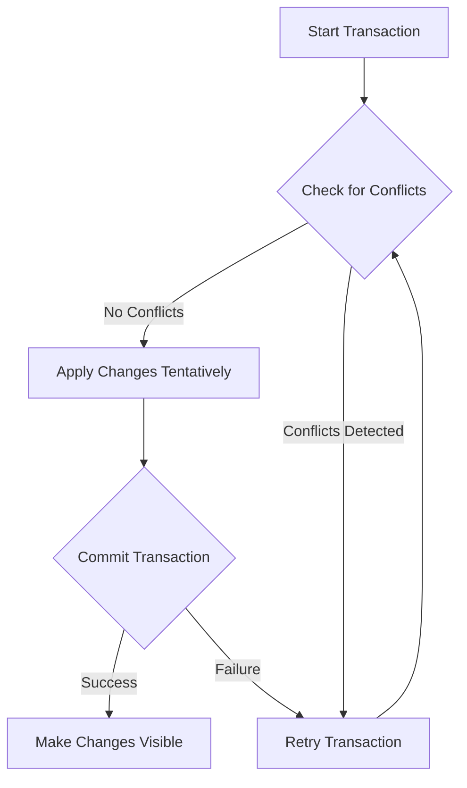

## 13.6 Software Transactional Memory Explained

Concurrency is a crucial aspect of modern software development, especially as we build applications that need to efficiently utilize multi-core processors. In Clojure, Software Transactional Memory (STM) offers a robust model for managing concurrency, allowing developers to handle shared state in a way that avoids the pitfalls of traditional locking mechanisms. This section provides an in-depth exploration of STM, its benefits, and how it is implemented in Clojure.

### Concept of STM

Software Transactional Memory is a concurrency control mechanism analogous to database transactions for memory operations. It allows multiple threads to operate on shared data without explicit locks, reducing the risk of deadlocks and race conditions. STM in Clojure is designed to provide a simpler and more intuitive model for managing shared state, emphasizing immutability and functional programming principles.

**Advantages of STM over Traditional Locking Mechanisms:**

1. **Simplicity**: STM abstracts the complexities of locking, allowing developers to focus on the logic of their transactions rather than the intricacies of lock management.
2. **Deadlock Prevention**: By eliminating the need for explicit locks, STM inherently avoids deadlocks, a common problem in traditional concurrency models.
3. **Optimistic Concurrency**: STM operates on the principle of optimistic concurrency, allowing transactions to proceed without waiting for locks and only retrying if conflicts occur.
4. **Isolation**: STM ensures that transactions are isolated from each other, providing a consistent view of the data.

### Transactional Boundaries

In Clojure, transactional boundaries are defined using the `dosync` macro. This macro establishes a context within which all operations on Refs are part of a single transaction. Within a `dosync` block, changes to Refs are tentative and only become visible to other transactions upon successful completion of the block.

```clojure
;; Example of a transactional boundary using dosync
(def account-a (ref 100))
(def account-b (ref 200))

(defn transfer [amount from-account to-account]
  (dosync
    (alter from-account - amount)
    (alter to-account + amount)))

;; Transfer 50 from account-a to account-b
(transfer 50 account-a account-b)

;; Check balances
(println @account-a) ; => 50
(println @account-b) ; => 250
```

In this example, the `transfer` function uses `dosync` to ensure that the operations on `account-a` and `account-b` are atomic. If any part of the transaction fails, the entire transaction is retried, maintaining consistency.

### Consistency and Isolation

STM in Clojure ensures consistency and isolation through the use of Refs. Refs are mutable references to immutable data structures, and they can only be modified within a `dosync` block. This ensures that changes are consistent and isolated from other transactions until they are committed.

- **Consistency**: STM guarantees that all operations within a transaction are completed successfully or not at all. This all-or-nothing approach ensures that the system remains in a consistent state.
- **Isolation**: Transactions in STM are isolated from each other, meaning that intermediate states are not visible to other transactions. This prevents issues such as dirty reads and ensures that each transaction operates on a consistent snapshot of the data.

### Retry and Retries

One of the key features of STM is its ability to handle conflicts through automatic retries. When a conflict is detected—such as when two transactions attempt to modify the same Ref simultaneously—STM automatically retries the transaction. This retry mechanism is transparent to the developer, simplifying the handling of concurrency.

```clojure
(def counter (ref 0))

(defn increment-counter []
  (dosync
    (alter counter inc)))

;; Simulate concurrent updates
(future (increment-counter))
(future (increment-counter))

;; Wait for futures to complete
(Thread/sleep 100)

(println @counter) ; => 2
```

In this example, two concurrent updates to `counter` are handled by STM's retry mechanism, ensuring that both increments are applied correctly.

### Limitations

While STM offers many advantages, it also has some limitations that developers need to be aware of:

1. **Side Effects**: STM transactions should avoid side effects, such as I/O operations, because they may be retried multiple times. This can lead to unintended consequences if side effects are not idempotent.
2. **Performance**: Although STM simplifies concurrency, it can introduce performance overhead due to the need for transaction management and retries. In performance-critical applications, this overhead should be carefully evaluated.
3. **Complexity in Large Systems**: In very large systems with high contention, the retry mechanism can lead to increased transaction conflicts, potentially affecting performance.

### Visualizing STM in Clojure

To better understand how STM works in Clojure, let's visualize the process using a flowchart. This diagram illustrates the lifecycle of a transaction within STM, from initiation to commit or retry.



**Diagram Explanation:**

- **Start Transaction**: A transaction begins, and operations are performed on Refs within a `dosync` block.
- **Check for Conflicts**: STM checks for conflicts with other transactions. If no conflicts are detected, changes are applied tentatively.
- **Apply Changes Tentatively**: Changes are made to Refs but are not yet visible to other transactions.
- **Commit Transaction**: The transaction attempts to commit. If successful, changes are made visible; otherwise, the transaction is retried.

### Practical Considerations

When using STM in Clojure, consider the following best practices to maximize its benefits:

- **Avoid Side Effects**: Keep transactions pure by avoiding side effects. If side effects are necessary, consider using agents or other concurrency primitives outside of STM.
- **Minimize Transaction Scope**: Keep transactions as small as possible to reduce contention and improve performance.
- **Profile and Optimize**: Use profiling tools to identify performance bottlenecks related to STM and optimize accordingly.

### Try It Yourself

Experiment with the provided examples by modifying the transaction logic or introducing intentional conflicts to see how STM handles them. For instance, try adding more concurrent updates to the `counter` example and observe the behavior.

### References and Further Reading

- [Clojure Official Documentation](https://clojure.org/reference)
- [Clojure STM Guide](https://clojure.org/reference/refs)
- [Transitioning from OOP to Functional Programming](https://www.lispcast.com/oo-to-fp/)

### Test Your Knowledge: Software Transactional Memory Explained Quiz



### What is the primary advantage of STM over traditional locking mechanisms?

- [x] Simplifies concurrency management
- [ ] Increases execution speed
- [ ] Reduces memory usage
- [ ] Enhances security

> **Explanation:** STM simplifies concurrency management by abstracting away the complexities of locks.

### How does STM ensure consistency in transactions?

- [x] All-or-nothing transactions
- [ ] By using locks
- [ ] Through manual conflict resolution
- [ ] By delaying execution

> **Explanation:** STM ensures consistency by applying all-or-nothing transactions, meaning they either complete fully or not at all.

### What is the role of `dosync` in Clojure's STM?

- [x] Defines transactional boundaries
- [ ] Synchronizes threads
- [ ] Locks resources
- [ ] Manages memory

> **Explanation:** `dosync` defines the transactional boundaries within which Ref operations occur.

### What happens when a conflict is detected in STM?

- [x] The transaction is retried
- [ ] The transaction is aborted
- [ ] The transaction is ignored
- [ ] The transaction is locked

> **Explanation:** When a conflict is detected, STM automatically retries the transaction.

### Why should side effects be avoided in STM transactions?

- [x] Transactions may be retried
- [ ] They increase transaction speed
- [ ] They simplify the code
- [ ] They enhance security

> **Explanation:** Side effects should be avoided because transactions may be retried, leading to unintended consequences.

### Which Clojure construct is used to modify Refs within a transaction?

- [x] `alter`
- [ ] `swap!`
- [ ] `reset!`
- [ ] `set!`

> **Explanation:** `alter` is used to modify Refs within a transaction.

### What is a limitation of STM in high-contention environments?

- [x] Increased transaction conflicts
- [ ] Decreased memory usage
- [ ] Enhanced security
- [ ] Simplified code

> **Explanation:** In high-contention environments, STM can lead to increased transaction conflicts.

### How does STM handle multiple threads operating on shared data?

- [x] Optimistic concurrency
- [ ] Pessimistic locking
- [ ] Manual synchronization
- [ ] Thread pooling

> **Explanation:** STM uses optimistic concurrency, allowing transactions to proceed without waiting for locks.

### What is the primary purpose of Refs in Clojure's STM?

- [x] To hold mutable references to immutable data
- [ ] To synchronize threads
- [ ] To manage memory
- [ ] To lock resources

> **Explanation:** Refs hold mutable references to immutable data, allowing safe concurrent modifications.

### True or False: STM transactions can include I/O operations without any issues.

- [ ] True
- [x] False

> **Explanation:** False. STM transactions should avoid I/O operations because they may be retried, leading to unintended side effects.



By understanding and effectively utilizing Software Transactional Memory in Clojure, developers can build scalable, concurrent applications while maintaining simplicity and avoiding common concurrency pitfalls. Embrace the power of STM to manage shared state efficiently and confidently in your Clojure projects.
