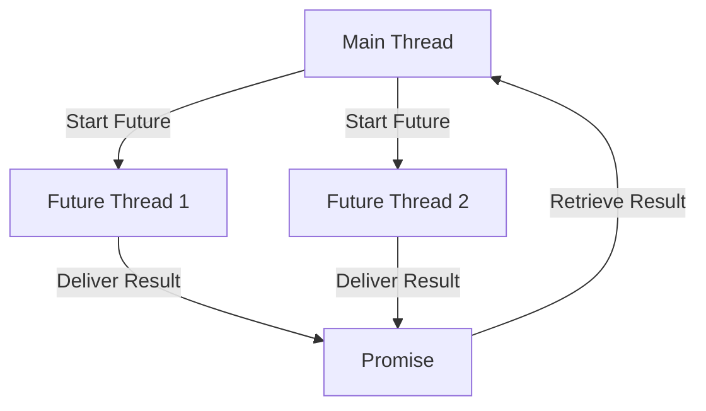

## 13.7 Parallel Processing in Clojure

In the realm of modern computing, efficiently utilizing available hardware resources is paramount. As developers, we often encounter the terms **concurrency** and **parallelism**, which, while related, refer to different concepts. Understanding these distinctions is crucial for leveraging Clojure's capabilities to build high-performance, scalable applications.

### Difference Between Concurrency and Parallelism

**Concurrency** involves managing multiple tasks at once, allowing them to make progress without necessarily executing simultaneously. It is about structure and dealing with many things at once. In contrast, **parallelism** is about performing multiple computations simultaneously, focusing on execution and speeding up processing by utilizing multiple processors or cores.

To draw a parallel with Java, concurrency is akin to using threads to handle multiple tasks, while parallelism would be using those threads to divide a single task into subtasks that can be executed simultaneously.

Understanding these concepts helps us choose the right tools and techniques for our applications. In Clojure, we have several powerful tools for parallel processing, which we'll explore in this section.

### Parallelism Tools in Clojure

Clojure offers several constructs that facilitate parallel processing:

- **`pmap`**: A parallel version of the `map` function, which processes elements of a collection concurrently.
- **`future`**: Executes a block of code in a separate thread, allowing the main program to continue executing.
- **`promise`**: A synchronization construct that represents a value that will be delivered in the future.
- **Reducers and `fold`**: A framework for parallel reductions, enabling efficient processing of large datasets.

Let's delve into each of these tools and see how they can be applied in practice.

### Using `pmap`

The `pmap` function is a parallel version of the `map` function. It is particularly useful when you have a computationally intensive task that can be applied independently to each element of a collection. `pmap` distributes the computation across available processors, thus speeding up the process.

```clojure
(defn expensive-computation [x]
  ;; Simulate a time-consuming computation
  (Thread/sleep 1000)
  (* x x))

;; Using pmap to perform parallel computation
(defn parallel-square [numbers]
  (pmap expensive-computation numbers))

;; Example usage
(time (doall (parallel-square (range 1 11))))
```

In this example, `expensive-computation` simulates a time-consuming task by sleeping for one second. When using `pmap`, each computation is executed in parallel, significantly reducing the total execution time compared to using `map`.

**Try It Yourself**: Modify the `expensive-computation` function to perform a different task, such as fetching data from a URL or processing a file, and observe how `pmap` improves performance.

### Futures and Promises

**Futures** in Clojure allow you to execute code in a separate thread and obtain the result at a later time. This is particularly useful for tasks that can be performed independently of the main program flow.

```clojure
;; Using future to execute a task in parallel
(defn future-example []
  (let [f (future (expensive-computation 10))]
    (println "Doing other work...")
    (println "Result from future:" @f)))

(future-example)
```

In this example, the `expensive-computation` is executed in a separate thread, allowing the main program to continue executing other tasks. The result of the future is retrieved using the `@` dereference operator.

**Promises** are similar to futures but provide more control over when the result is delivered. They are useful for coordinating between different threads.

```clojure
;; Using promise to coordinate between threads
(defn promise-example []
  (let [p (promise)]
    (future
      (Thread/sleep 2000)
      (deliver p "Result after delay"))
    (println "Waiting for result...")
    (println "Received:" @p)))

(promise-example)
```

In this example, a promise is created and delivered a value after a delay. The main thread waits for the promise to be fulfilled before continuing.

### Reducers and `fold`

Reducers provide a way to perform parallel reductions over collections, which is particularly useful for processing large datasets. The `fold` function is a key part of this framework, allowing you to specify a combining function and a reducing function.

```clojure
(require '[clojure.core.reducers :as r])

(defn parallel-sum [numbers]
  (r/fold + numbers))

;; Example usage
(println "Parallel sum:" (parallel-sum (range 1 100001)))
```

In this example, `fold` is used to sum a large range of numbers in parallel. The `+` function is both the combining and reducing function, enabling efficient parallel processing.

**Try It Yourself**: Experiment with different combining and reducing functions to perform other operations, such as finding the maximum value or concatenating strings.

### Examples of Parallel Computations

Let's explore some practical examples of parallel computations using the tools we've discussed.

#### Example 1: Parallel Image Processing

Suppose we have a collection of image file paths and we want to apply a filter to each image in parallel.

```clojure
(defn apply-filter [image-path]
  ;; Simulate image processing
  (Thread/sleep 500)
  (str "Processed " image-path))

(defn process-images [image-paths]
  (pmap apply-filter image-paths))

;; Example usage
(println "Image processing results:" (doall (process-images ["img1.jpg" "img2.jpg" "img3.jpg"])))
```

In this example, `pmap` is used to apply `apply-filter` to each image path concurrently, speeding up the processing time.

#### Example 2: Parallel Data Fetching

Consider a scenario where we need to fetch data from multiple URLs in parallel.

```clojure
(require '[clojure.java.io :as io])

(defn fetch-data [url]
  ;; Simulate data fetching
  (Thread/sleep 1000)
  (str "Data from " url))

(defn fetch-all-data [urls]
  (pmap fetch-data urls))

;; Example usage
(println "Fetched data:" (doall (fetch-all-data ["http://example.com/1" "http://example.com/2" "http://example.com/3"])))
```

Here, `pmap` is used to fetch data from each URL concurrently, reducing the total time required to gather all data.

### Visualizing Parallel Processing

To better understand how these parallel processing tools work, let's visualize the flow of data and execution using a diagram.



**Diagram Description**: This diagram illustrates the flow of execution when using futures and promises. The main thread starts two futures, each executing in its own thread. Once the computations are complete, results are delivered to a promise, which the main thread retrieves.

### Knowledge Check

Before we conclude, let's review some key concepts:

- **Concurrency vs. Parallelism**: Concurrency is about managing multiple tasks, while parallelism is about speeding up computations by executing them simultaneously.
- **`pmap`**: Use `pmap` for parallel mapping over collections to improve performance.
- **Futures and Promises**: Use futures to execute code in parallel and promises to coordinate results between threads.
- **Reducers and `fold`**: Use reducers for parallel reductions over large datasets.

### Conclusion

Embracing parallel processing in Clojure allows us to build applications that efficiently utilize available hardware resources. By understanding and leveraging tools like `pmap`, `future`, `promise`, and reducers, we can significantly improve the performance and scalability of our applications.

### Further Reading

For more information on Clojure's concurrency and parallelism capabilities, consider exploring the following resources:

- [Clojure Official Documentation](https://clojure.org/reference)
- [Clojure Community Resources](https://clojure.org/community/resources)
- [Transitioning from OOP to Functional Programming](https://www.lispcast.com/oo-to-fp/)

## **Test Your Knowledge: Parallel Processing in Clojure Quiz**



### What is the primary difference between concurrency and parallelism?

- [x] Concurrency is about managing multiple tasks, while parallelism is about speeding up computations.
- [ ] Concurrency is about speeding up computations, while parallelism is about managing multiple tasks.
- [ ] Both concurrency and parallelism are the same.
- [ ] Concurrency involves only single-threaded execution.

> **Explanation:** Concurrency involves handling multiple tasks at once, whereas parallelism focuses on speeding up computations by executing them simultaneously.

### Which Clojure function is used for parallel mapping over collections?

- [x] `pmap`
- [ ] `map`
- [ ] `reduce`
- [ ] `filter`

> **Explanation:** `pmap` is the parallel version of `map`, used for processing elements of a collection concurrently.

### How do you retrieve the result of a future in Clojure?

- [x] Using the `@` dereference operator
- [ ] Using the `get` function
- [ ] Using the `deref` function
- [ ] Using the `future` function

> **Explanation:** The result of a future is retrieved using the `@` dereference operator.

### What is a promise in Clojure?

- [x] A synchronization construct that represents a value that will be delivered in the future
- [ ] A function that executes code in parallel
- [ ] A data structure for storing future results
- [ ] A tool for reducing collections

> **Explanation:** A promise is a synchronization construct used to coordinate between threads by representing a value that will be delivered in the future.

### Which function is used for parallel reductions in Clojure?

- [x] `fold`
- [ ] `reduce`
- [ ] `map`
- [ ] `filter`

> **Explanation:** The `fold` function is used for parallel reductions over collections, allowing efficient processing of large datasets.

### What is the purpose of the `deliver` function in Clojure?

- [x] To provide a value to a promise
- [ ] To execute a function in parallel
- [ ] To retrieve the result of a future
- [ ] To map over a collection

> **Explanation:** The `deliver` function is used to provide a value to a promise, fulfilling it.

### How can you improve the performance of a computationally intensive task applied to each element of a collection?

- [x] Use `pmap`
- [ ] Use `map`
- [ ] Use `reduce`
- [ ] Use `filter`

> **Explanation:** `pmap` improves performance by processing elements of a collection concurrently.

### What is the role of reducers in Clojure?

- [x] To perform parallel reductions over collections
- [ ] To execute code in parallel
- [ ] To synchronize threads
- [ ] To map over collections

> **Explanation:** Reducers provide a framework for parallel reductions, enabling efficient processing of large datasets.

### Which of the following is true about `future` in Clojure?

- [x] It executes code in a separate thread.
- [ ] It is used for mapping over collections.
- [ ] It is a synchronization construct.
- [ ] It is used for reducing collections.

> **Explanation:** `future` executes code in a separate thread, allowing the main program to continue executing.

### True or False: `pmap` is always faster than `map`.

- [ ] True
- [x] False

> **Explanation:** While `pmap` can be faster for computationally intensive tasks, it introduces overhead and may not always be faster than `map` for lightweight tasks.


