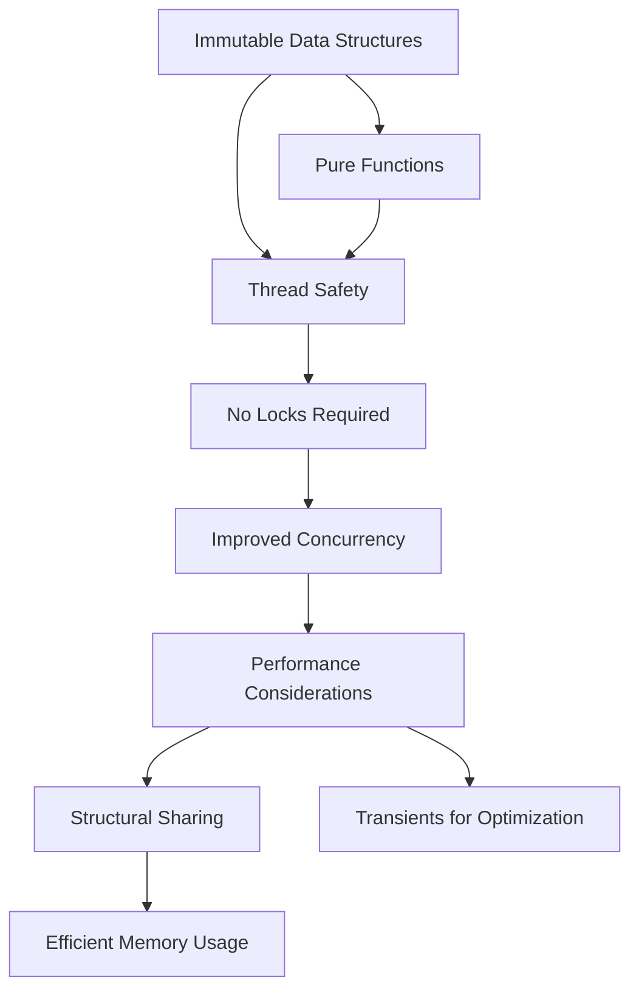

## 13.8 Thread Safety and Immutability

In the realm of concurrent programming, thread safety is paramount. Clojure, with its emphasis on immutability and functional programming, offers a powerful approach to building thread-safe applications. In this section, we will delve into how immutability eliminates the need for locks, prevents synchronization issues, and impacts performance. We will also discuss best practices for ensuring thread safety in your Clojure applications.

### Immutability for Thread Safety

Immutability lies at the heart of Clojure's approach to thread safety. Unlike mutable objects in traditional object-oriented programming (OOP), immutable data structures cannot be altered once created. This fundamental property simplifies concurrent programming by eliminating the need for locks when sharing data between threads.

#### Immutable Data Structures

Clojure's core data structures—lists, vectors, maps, and sets—are immutable by default. When you perform operations on these structures, rather than modifying the original, Clojure creates a new version with the desired changes. This approach is made efficient through structural sharing, where the new data structure shares unmodified parts with the original.

```clojure
;; Example of immutability in Clojure
(def original-vector [1 2 3 4])
(def new-vector (conj original-vector 5))

(println original-vector) ; Output: [1 2 3 4]
(println new-vector)      ; Output: [1 2 3 4 5]
```

In this example, `new-vector` is a new data structure that includes the additional element `5`. The `original-vector` remains unchanged, showcasing the immutability principle.

#### Avoiding Synchronization Issues

Immutability naturally prevents many common synchronization issues encountered in multithreaded programming. With mutable state, developers often resort to locks or other synchronization mechanisms to ensure thread safety. These mechanisms can lead to complex code and potential deadlocks.

By using immutable data structures, Clojure sidesteps these issues. Since data cannot be changed, there is no risk of concurrent modifications leading to inconsistent states. This allows multiple threads to safely read from the same data without the need for locks.

```clojure
;; Function demonstrating thread-safe data access
(defn process-data [data]
  (map inc data))

(def shared-data [1 2 3 4 5])

;; Multiple threads can safely call process-data
(future (println (process-data shared-data)))
(future (println (process-data shared-data)))
```

In this example, the `process-data` function operates on the `shared-data` vector, which is immutable. Multiple threads can safely execute this function concurrently without synchronization concerns.

#### Pure Functions and Immutability

Pure functions are a cornerstone of functional programming. A pure function is deterministic and has no side effects, meaning it always produces the same output for the same input and does not alter any state outside its scope. This predictability is crucial for thread safety.

By combining pure functions with immutable data structures, Clojure ensures that functions do not inadvertently modify shared data. This minimizes the risk of race conditions and other concurrency-related bugs.

```clojure
;; Example of a pure function
(defn add [a b]
  (+ a b))

;; Pure functions can be safely used in concurrent contexts
(future (println (add 1 2)))
(future (println (add 3 4)))
```

### Best Practices for Ensuring Thread Safety

While immutability provides a solid foundation for thread safety, there are additional best practices to consider when designing concurrent applications in Clojure.

#### Minimize Side Effects

Side effects occur when a function interacts with the outside world, such as modifying a global variable or performing I/O operations. In concurrent applications, side effects can lead to unpredictable behavior and make it difficult to ensure thread safety.

To minimize side effects:

- **Encapsulate State**: Use local bindings to manage state within functions, avoiding global variables.
- **Limit I/O Operations**: Perform I/O operations at the boundaries of your application, keeping core logic pure.
- **Use Atoms, Refs, and Agents**: When stateful constructs are necessary, leverage Clojure's atoms, refs, and agents to manage state changes safely.

#### Careful Use of Stateful Constructs

While immutability is preferred, there are cases where stateful constructs are necessary. Clojure provides several mechanisms to manage state changes safely:

- **Atoms**: Use atoms for managing independent, synchronous state changes. Atoms provide a way to update state using compare-and-swap (CAS) operations.

  ```clojure
  ;; Example of using an atom for state management
  (def counter (atom 0))

  (defn increment-counter []
    (swap! counter inc))

  ;; Safely increment counter in multiple threads
  (future (increment-counter))
  (future (increment-counter))
  ```

- **Refs**: Use refs for coordinated, synchronous state changes. Refs leverage software transactional memory (STM) to ensure atomic updates across multiple references.

  ```clojure
  ;; Example of using refs for coordinated state changes
  (def account-a (ref 100))
  (def account-b (ref 200))

  (defn transfer [amount]
    (dosync
      (alter account-a - amount)
      (alter account-b + amount)))

  ;; Safely transfer funds between accounts
  (future (transfer 50))
  ```

- **Agents**: Use agents for managing asynchronous state changes. Agents process actions in a separate thread, allowing for non-blocking updates.

  ```clojure
  ;; Example of using an agent for asynchronous updates
  (def log-agent (agent []))

  (defn log-message [msg]
    (send log-agent conj msg))

  ;; Asynchronously log messages
  (log-message "Starting process")
  (log-message "Process completed")
  ```

### Performance Implications

While immutability and functional programming offer significant advantages for thread safety, they also have performance implications that must be considered when designing applications.

#### Efficient Use of Immutability

Immutability can lead to increased memory usage and performance overhead due to the creation of new data structures. However, Clojure mitigates these concerns through structural sharing, which minimizes the duplication of unchanged parts of data structures.

To optimize performance:

- **Use Persistent Data Structures**: Leverage Clojure's persistent data structures, which are designed for efficient immutability.
- **Profile and Optimize**: Use profiling tools to identify performance bottlenecks and optimize critical sections of your code.
- **Leverage Transients**: For performance-critical sections, consider using transients, which provide a way to perform mutable-like operations within a controlled scope.

  ```clojure
  ;; Example of using transients for performance optimization
  (defn build-large-vector [n]
    (persistent!
      (reduce conj! (transient []) (range n))))

  (println (build-large-vector 1000000))
  ```

#### Balancing Concurrency and Performance

Concurrency can improve performance by leveraging multiple CPU cores, but it also introduces complexity. To balance concurrency and performance:

- **Identify Parallelizable Tasks**: Break down tasks into independent units that can be executed concurrently.
- **Use Clojure's Concurrency Primitives**: Leverage Clojure's concurrency primitives, such as futures and promises, to manage concurrent tasks efficiently.
- **Avoid Over-Parallelization**: Excessive parallelism can lead to contention and degrade performance. Profile your application to find the optimal level of concurrency.

### Visual Aids

To better understand the relationship between immutability, thread safety, and performance, let's visualize these concepts:



**Figure 1**: This diagram illustrates how immutable data structures contribute to thread safety by eliminating the need for locks, thereby enhancing concurrency and performance. Structural sharing and transients are strategies to optimize memory usage and execution speed.

### References and Links

- [Clojure Official Documentation](https://clojure.org/reference)
- [Clojure Community Resources](https://clojure.org/community/resources)
- [Transitioning from OOP to Functional Programming](https://www.lispcast.com/oo-to-fp/)
- [Clojure STM Guide](https://clojure.org/reference/refs)

### Knowledge Check

To reinforce your understanding of thread safety and immutability in Clojure, consider the following questions and exercises:

1. **What is the primary advantage of using immutable data structures in concurrent applications?**
2. **Explain how pure functions contribute to thread safety.**
3. **Describe a scenario where using an atom would be appropriate for state management.**
4. **What are the performance implications of immutability, and how can they be mitigated?**
5. **Experiment with the provided code examples by modifying them to introduce mutable state. What issues arise, and how can they be resolved?**

### Encouraging Engagement

Embracing functional programming and immutability can be challenging, but with each step, you'll gain a deeper understanding and see tangible benefits in your codebase. As you explore these concepts, remember to experiment with the code examples and apply these principles to your own projects. The journey to mastering Clojure is rewarding, and the skills you develop will enhance your ability to build scalable, concurrent applications.

### Test Your Knowledge: Thread Safety and Immutability Quiz



### What is a key benefit of using immutable data structures in Clojure?

- [x] They eliminate the need for locks in concurrent programming.
- [ ] They allow for direct modification of shared data.
- [ ] They require complex synchronization mechanisms.
- [ ] They increase the risk of race conditions.

> **Explanation:** Immutable data structures cannot be changed once created, which eliminates the need for locks and prevents race conditions.

### How do pure functions contribute to thread safety?

- [x] They have no side effects and do not modify shared state.
- [ ] They rely on global variables to maintain state.
- [ ] They require external synchronization for safety.
- [ ] They can produce different outputs for the same inputs.

> **Explanation:** Pure functions are deterministic and do not modify shared state, making them inherently thread-safe.

### When is it appropriate to use an atom in Clojure?

- [x] When managing independent, synchronous state changes.
- [ ] When coordinating multiple state changes atomically.
- [ ] When performing asynchronous updates.
- [ ] When requiring complex locking mechanisms.

> **Explanation:** Atoms are suitable for managing independent state changes using compare-and-swap operations.

### What is a potential performance concern with immutability?

- [x] Increased memory usage due to new data structure creation.
- [ ] Difficulty in maintaining consistent state.
- [ ] Complexity in implementing synchronization.
- [ ] Risk of deadlocks in concurrent applications.

> **Explanation:** Immutability can lead to increased memory usage, but Clojure mitigates this with structural sharing.

### How can transients be used to optimize performance?

- [x] By allowing mutable-like operations within a controlled scope.
- [ ] By enabling direct modification of immutable structures.
- [ ] By requiring additional synchronization mechanisms.
- [ ] By increasing the complexity of state management.

> **Explanation:** Transients provide a way to perform efficient, mutable-like operations in a controlled manner, optimizing performance.

### What is a best practice for minimizing side effects in concurrent applications?

- [x] Encapsulate state within functions using local bindings.
- [ ] Use global variables to manage shared state.
- [ ] Perform I/O operations throughout the application.
- [ ] Rely on external libraries for state management.

> **Explanation:** Encapsulating state within functions using local bindings helps minimize side effects and ensures thread safety.

### How does Clojure's software transactional memory (STM) contribute to thread safety?

- [x] By ensuring atomic updates across multiple references.
- [ ] By allowing direct modification of shared data.
- [ ] By requiring complex locking mechanisms.
- [ ] By increasing the risk of race conditions.

> **Explanation:** STM in Clojure ensures atomic updates across multiple references, preventing race conditions and ensuring consistency.

### What is a potential drawback of excessive parallelism in applications?

- [x] Contention and degraded performance.
- [ ] Increased memory usage due to new data structures.
- [ ] Difficulty in maintaining consistent state.
- [ ] Complexity in implementing synchronization.

> **Explanation:** Excessive parallelism can lead to contention for resources, degrading performance.

### How can you balance concurrency and performance in Clojure applications?

- [x] Identify parallelizable tasks and use concurrency primitives.
- [ ] Use global variables to manage shared state.
- [ ] Perform I/O operations throughout the application.
- [ ] Rely on external libraries for state management.

> **Explanation:** Identifying parallelizable tasks and using Clojure's concurrency primitives helps balance concurrency and performance.

### True or False: Immutability eliminates the need for locks in concurrent programming.

- [x] True
- [ ] False

> **Explanation:** True. Immutability ensures that data cannot be changed, eliminating the need for locks and preventing race conditions.


