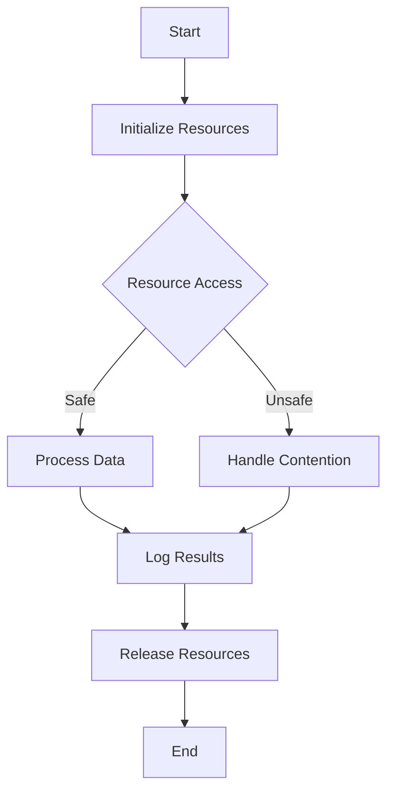

## 13.9 Dealing with Shared Resources

In the realm of concurrent programming, managing shared resources is a critical challenge. Shared resources, such as files, databases, or network connections, can lead to resource contention if not handled properly. In Clojure, a functional programming language that emphasizes immutability and concurrency, we have several tools and strategies to manage these resources effectively. This section will delve into resource contention, locking mechanisms, connection pools, and managing side effects in a thread-safe manner, providing examples to illustrate these concepts.

### Resource Contention

Resource contention occurs when multiple threads or processes attempt to access a shared resource simultaneously, potentially leading to conflicts or inconsistent states. In Java, developers often rely on synchronized blocks or locks to manage access to shared resources. In Clojure, while we can use similar mechanisms, we also have the advantage of functional programming paradigms that reduce the need for explicit locks.

#### Challenges of Managing Shared Resources

1. **Race Conditions**: Occur when the outcome of a program depends on the sequence or timing of uncontrollable events.
2. **Deadlocks**: Happen when two or more threads are blocked forever, each waiting for the other to release a resource.
3. **Starvation**: Occurs when a thread is perpetually denied access to resources it needs for execution.
4. **Resource Leaks**: Result from failing to release resources, leading to exhaustion over time.

To effectively manage these challenges, we need to understand the tools available in Clojure for handling shared resources.

### Locking Mechanisms

In some cases, especially when dealing with mutable state or side effects, using locks or synchronization primitives is necessary. Clojure provides several constructs for managing state changes in a thread-safe manner.

#### Atoms

Atoms provide a way to manage shared, synchronous, independent state. They are ideal for managing state that is updated infrequently and does not require coordination with other state changes.

```clojure
(def counter (atom 0))

(defn increment-counter []
  (swap! counter inc))

;; Usage
(increment-counter)
```

In this example, `swap!` is used to apply a function to the current state of the atom, ensuring that updates are atomic and thread-safe.

#### Refs and Software Transactional Memory (STM)

Refs and STM provide coordinated, synchronous updates to shared state. They are useful when you need to ensure consistency across multiple related pieces of state.

```clojure
(def account1 (ref 100))
(def account2 (ref 200))

(defn transfer [from to amount]
  (dosync
    (alter from - amount)
    (alter to + amount)))

;; Usage
(transfer account1 account2 50)
```

The `dosync` block ensures that the operations on `account1` and `account2` are atomic and isolated from other transactions.

#### Agents

Agents are used for managing asynchronous, independent state. They are suitable for state that is updated frequently and does not require immediate consistency.

```clojure
(def logger (agent []))

(defn log-message [msg]
  (send logger conj msg))

;; Usage
(log-message "This is a log message.")
```

Here, `send` is used to asynchronously update the state of the agent, allowing other operations to proceed without waiting for the update to complete.

### Connection Pools

Managing database connections or network connections efficiently is crucial in concurrent applications. Connection pooling is a technique that allows multiple clients to share a small number of connections, reducing the overhead of establishing connections repeatedly.

#### Implementing Connection Pools

In Clojure, we can use libraries like [HikariCP](https://github.com/brettwooldridge/HikariCP) for efficient connection pooling. Here's a basic setup using HikariCP with Clojure:

```clojure
(require '[hikari-cp.core :as hikari])

(def db-spec
  {:jdbc-url "jdbc:postgresql://localhost:5432/mydb"
   :username "user"
   :password "password"
   :maximum-pool-size 10})

(defonce pool (hikari/make-datasource db-spec))

(defn query-db [sql]
  (with-open [conn (.getConnection pool)]
    (let [stmt (.createStatement conn)]
      (-> stmt
          (.executeQuery sql)
          (resultset-seq)))))
```

This example demonstrates creating a connection pool and executing a query using a pooled connection. The `with-open` macro ensures that the connection is returned to the pool after use.

### Managing Side Effects

In functional programming, managing side effects is crucial to maintaining purity and referential transparency. In concurrent applications, side effects can lead to unpredictable behavior if not handled carefully.

#### Strategies for Handling Side Effects

1. **Isolate Side Effects**: Keep side effects at the edges of your application, using pure functions for the core logic.
2. **Use STM for Consistency**: When side effects involve shared state, use STM to ensure atomicity and consistency.
3. **Leverage Agents for Asynchronous Updates**: Use agents to handle side effects that can be processed asynchronously, such as logging or sending notifications.

#### Example: Thread-Safe Logging

```clojure
(def log-agent (agent []))

(defn log [message]
  (send log-agent conj message))

(defn flush-logs []
  (send log-agent
        (fn [logs]
          (doseq [log logs]
            (println log))
          [])))

;; Usage
(log "Starting application")
(log "An error occurred")
(flush-logs)
```

In this example, logs are collected asynchronously using an agent, and flushed to the console in a thread-safe manner.

### Examples of Safely Managing Shared Resources

Let's explore a more comprehensive example that combines several of the concepts discussed:

#### Example: Bank Account Transfers with Logging

```clojure
(def accounts (ref {:alice 1000 :bob 500}))

(defn transfer [from to amount]
  (dosync
    (when (>= (get @accounts from) amount)
      (alter accounts update from - amount)
      (alter accounts update to + amount)
      (log (str "Transferred " amount " from " from " to " to)))))

(defn check-balance [account]
  (@accounts account))

;; Usage
(transfer :alice :bob 100)
(println "Alice's balance:" (check-balance :alice))
(println "Bob's balance:" (check-balance :bob))
(flush-logs)
```

In this example, we use refs to manage account balances and ensure atomic transfers. Logging is handled asynchronously using an agent, demonstrating a thread-safe approach to managing shared resources.

### Try It Yourself

Experiment with the examples provided by modifying them to suit different scenarios. For instance, try implementing a connection pool for a different database or adjust the logging mechanism to write to a file instead of the console. These exercises will deepen your understanding of managing shared resources in Clojure.

### Visual Aids

Below is a diagram illustrating the flow of data and control in a Clojure application managing shared resources:



This flowchart represents a typical lifecycle of resource management in a concurrent Clojure application, highlighting the importance of safe resource access and proper release.

### References and Links

For further reading and exploration, consider the following resources:

- [Clojure Official Documentation](https://clojure.org/reference)
- [Clojure Community Resources](https://clojure.org/community/resources)
- [Transitioning from OOP to Functional Programming](https://www.lispcast.com/oo-to-fp/)
- [Clojure STM Guide](https://clojure.org/reference/refs)
- [HikariCP Connection Pooling](https://github.com/brettwooldridge/HikariCP)

### Knowledge Check

To reinforce your understanding of managing shared resources in Clojure, consider the following questions:

1. What are the common challenges associated with resource contention?
2. How do atoms differ from refs in Clojure?
3. What are the benefits of using connection pools in concurrent applications?
4. How can side effects be managed in a thread-safe manner in Clojure?
5. What role do agents play in handling asynchronous updates?

### Conclusion

Managing shared resources in concurrent applications is a complex but essential task. By leveraging Clojure's concurrency primitives and functional programming paradigms, we can effectively handle resource contention, ensure thread safety, and maintain the integrity of our applications. As you continue to explore Clojure, remember to experiment with these concepts and apply them to real-world scenarios.

## **Test Your Knowledge: Dealing with Shared Resources Quiz**



### What is a common challenge when managing shared resources?

- [x] Race conditions
- [ ] Immutable state
- [ ] Pure functions
- [ ] Lazy evaluation

> **Explanation:** Race conditions occur when multiple threads access shared resources simultaneously, leading to unpredictable results.


### Which Clojure construct is used for managing asynchronous state?

- [ ] Atoms
- [x] Agents
- [ ] Refs
- [ ] Vars

> **Explanation:** Agents are used for managing asynchronous, independent state updates in Clojure.


### What is the main advantage of using connection pools?

- [x] Efficient resource management
- [ ] Increased latency
- [ ] Reduced security
- [ ] Simplified code

> **Explanation:** Connection pools allow multiple clients to share a small number of connections, reducing the overhead of establishing connections repeatedly.


### How can side effects be isolated in a functional program?

- [x] By keeping them at the edges of the application
- [ ] By using mutable state
- [ ] By avoiding pure functions
- [ ] By using lazy evaluation

> **Explanation:** Isolating side effects at the edges of the application helps maintain purity and referential transparency.


### Which mechanism ensures atomic updates to shared state in Clojure?

- [ ] Agents
- [x] Refs and STM
- [ ] Atoms
- [ ] Vars

> **Explanation:** Refs and STM provide coordinated, synchronous updates to shared state, ensuring atomicity and consistency.


### What is the purpose of the `dosync` block in Clojure?

- [x] To ensure atomic transactions
- [ ] To manage asynchronous updates
- [ ] To create lazy sequences
- [ ] To define pure functions

> **Explanation:** The `dosync` block is used to group operations on refs into a single atomic transaction.


### How does Clojure handle logging in a thread-safe manner?

- [ ] By using lazy sequences
- [ ] By using mutable state
- [x] By using agents
- [ ] By using refs

> **Explanation:** Clojure uses agents to handle logging asynchronously, ensuring thread safety.


### What is a potential issue with not releasing shared resources?

- [x] Resource leaks
- [ ] Increased performance
- [ ] Immutable state
- [ ] Pure functions

> **Explanation:** Failing to release shared resources can lead to resource leaks, exhausting available resources over time.


### Which Clojure construct is best for managing synchronous, independent state?

- [x] Atoms
- [ ] Agents
- [ ] Refs
- [ ] Vars

> **Explanation:** Atoms are used for managing synchronous, independent state updates in Clojure.


### True or False: Connection pools are only useful in single-threaded applications.

- [ ] True
- [x] False

> **Explanation:** Connection pools are particularly useful in multi-threaded applications to efficiently manage shared resources.


