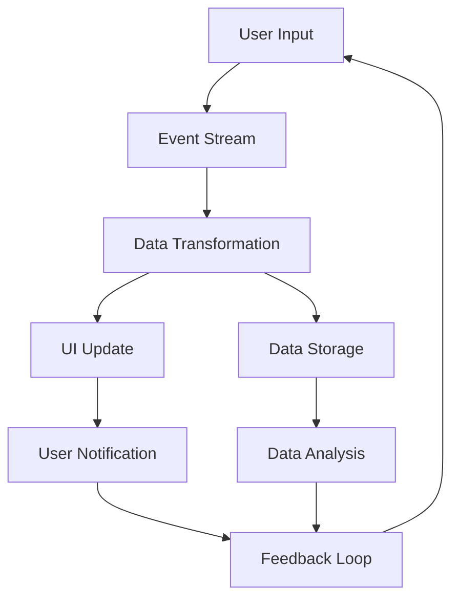

## 14.1 Introduction to Reactive Programming Concepts

Reactive programming is a programming paradigm that focuses on data flows and the propagation of changes. It allows developers to build systems that are responsive, resilient, and elastic, making it an ideal choice for applications that need to handle asynchronous data and real-time updates.

### Reactive Programming Defined

Reactive programming is about creating systems that react to changes in data. This paradigm is particularly useful in environments where data is constantly changing, and applications need to respond to these changes in real-time. At its core, reactive programming involves:

- **Data Flows**: Understanding how data moves through a system and how changes in one part of the system can affect other parts.
- **Change Propagation**: Ensuring that changes in data are automatically propagated throughout the system, so that all components are always up-to-date.

In reactive programming, data is treated as a continuous stream of events, rather than as discrete, static values. This allows developers to create applications that can respond to changes in data as they occur, rather than having to poll for updates or manually refresh data.

### Event Streams

An event stream is a sequence of events that occur over time. In reactive programming, event streams are used to represent data that changes over time. These streams can be processed, filtered, and transformed in real-time, allowing developers to build applications that are responsive to changes in data.

In Clojure, event streams can be represented using various libraries and constructs that allow for the creation and manipulation of streams. For example, the `core.async` library provides tools for working with asynchronous data streams, enabling developers to build complex data pipelines that can process data in real-time.

```clojure
(require '[clojure.core.async :as async])

(defn event-stream []
  (let [ch (async/chan)]
    (async/go-loop []
      (let [event (async/<! ch)]
        (println "Received event:" event)
        (recur)))
    ch))

(defn emit-events [ch]
  (async/go
    (doseq [event (range 5)]
      (async/>! ch event)
      (async/<! (async/timeout 1000)))))

(let [ch (event-stream)]
  (emit-events ch))
```

In this example, we create a simple event stream using Clojure's `core.async` library. We define a channel `ch` that acts as our event stream, and a loop that listens for events on this channel. The `emit-events` function generates events and sends them to the channel, simulating a real-time data stream.

### Functional Reactive Programming (FRP)

Functional Reactive Programming (FRP) combines the principles of functional programming with reactive programming models to handle time-varying values. FRP provides a way to express dynamic data flows and computations in a declarative manner, making it easier to reason about complex systems.

In FRP, computations are expressed as functions over time-varying values, known as signals or behaviors. These signals represent continuous data streams, and can be combined and transformed using functional combinators.

Clojure's functional programming paradigm is well-suited to FRP, as it provides powerful abstractions for working with immutable data and pure functions. By combining these abstractions with reactive programming models, Clojure developers can build applications that are both responsive and maintainable.

### Benefits of Reactive Programming

Reactive programming offers several benefits, particularly in environments where data is constantly changing and applications need to respond to these changes in real-time:

- **Easier Reasoning About Asynchronous Data**: Reactive programming allows developers to express asynchronous data flows in a declarative manner, making it easier to understand and reason about complex systems.
- **More Responsive Applications**: By treating data as a continuous stream of events, reactive programming enables applications to respond to changes in data as they occur, resulting in more responsive and interactive user experiences.
- **Improved Scalability**: Reactive programming models are inherently scalable, as they allow applications to process data in parallel and distribute workloads across multiple threads or nodes.

### Real-World Applications

Reactive programming is particularly beneficial in scenarios where applications need to handle real-time data and respond to changes in a timely manner. Some examples of real-world applications that can benefit from reactive programming include:

- **Graphical User Interfaces (GUIs)**: GUIs often involve complex interactions between different components, and need to respond to user input and other events in real-time. Reactive programming can simplify the development of GUIs by allowing developers to express these interactions as data flows.
- **Real-Time Data Processing**: Applications that process real-time data, such as financial trading systems or IoT devices, can benefit from reactive programming by allowing data to be processed and analyzed as it arrives.
- **Collaborative Applications**: Applications that involve multiple users interacting in real-time, such as collaborative editing tools or online games, can use reactive programming to synchronize data and ensure consistency across all clients.

### Visualizing Reactive Programming Concepts

To better understand how reactive programming works, let's visualize the flow of data in a reactive system using a Mermaid.js diagram. This diagram illustrates how data flows through a system, with changes in one part of the system automatically propagating to other parts.



**Diagram Description**: This diagram represents a simple reactive system where user input generates an event stream. The events are transformed and used to update the UI and store data. The stored data is then analyzed, and the results are fed back into the system to provide user notifications and further input.

### Code Example: Building a Reactive System in Clojure

Let's build a simple reactive system in Clojure that processes user input and updates a UI in real-time. We'll use the `reagent` library, which provides a reactive interface for building web applications with ClojureScript.

First, we'll define a simple component that displays a counter and a button to increment it:

```clojure
(ns my-app.core
  (:require [reagent.core :as r]))

(defn counter []
  (let [count (r/atom 0)]
    (fn []
      [:div
       [:p "Current count: " @count]
       [:button {:on-click #(swap! count inc)} "Increment"]])))
```

In this example, we define a `counter` component that uses a reactive atom `count` to store the current count. The component renders a paragraph displaying the current count, and a button that increments the count when clicked.

Next, we'll create a simple Reagent application that renders the `counter` component:

```clojure
(ns my-app.core
  (:require [reagent.core :as r]))

(defn app []
  [:div
   [counter]])

(defn init []
  (r/render [app] (.getElementById js/document "app")))

(init)
```

In this example, we define an `app` component that renders the `counter` component, and an `init` function that initializes the application by rendering the `app` component into the DOM.

### Try It Yourself

To experiment with this code, try modifying the `counter` component to include additional functionality, such as a button to decrement the count or a reset button to set the count back to zero. You can also try adding new components that interact with the `counter` component, such as a history log that records each increment.

### Further Reading

To learn more about reactive programming and how to implement it in Clojure, check out the following resources:

- [Clojure Official Documentation](https://clojure.org/reference)
- [Clojure Community Resources](https://clojure.org/community/resources)
- [Transitioning from OOP to Functional Programming](https://www.lispcast.com/oo-to-fp/)
- [Reagent Documentation](https://reagent-project.github.io/)

### Knowledge Check

Let's test your understanding of reactive programming concepts with a quiz. Answer the questions below to see how well you've grasped the material.

## **Test Your Knowledge: Introduction to Reactive Programming Concepts Quiz**



### What is reactive programming primarily focused on?

- [x] Data flows and change propagation
- [ ] Object-oriented design patterns
- [ ] Static data structures
- [ ] Synchronous data processing

> **Explanation:** Reactive programming is primarily focused on data flows and the propagation of changes, allowing systems to respond to changes in data in real-time.

### What is an event stream in reactive programming?

- [x] A sequence of events over time
- [ ] A static collection of data
- [ ] A synchronous data processing model
- [ ] A type of database

> **Explanation:** An event stream is a sequence of events that occur over time, representing data that changes continuously.

### How does Functional Reactive Programming (FRP) enhance reactive programming?

- [x] By combining functional programming with reactive models
- [ ] By introducing object-oriented principles
- [ ] By using imperative control structures
- [ ] By focusing on static data analysis

> **Explanation:** FRP enhances reactive programming by combining functional programming principles with reactive models, allowing for declarative expression of dynamic data flows.

### What is a key benefit of reactive programming?

- [x] Easier reasoning about asynchronous data
- [ ] Increased complexity in code
- [ ] Reduced application responsiveness
- [ ] Limited scalability

> **Explanation:** One key benefit of reactive programming is that it allows for easier reasoning about asynchronous data, making complex systems more understandable.

### In which scenarios is reactive programming particularly beneficial?

- [x] GUI applications and real-time data processing
- [ ] Static website development
- [ ] Batch processing systems
- [ ] Command-line utilities

> **Explanation:** Reactive programming is particularly beneficial in scenarios like GUI applications and real-time data processing, where responsiveness and real-time updates are crucial.

### How can event streams be represented in Clojure?

- [x] Using libraries like `core.async`
- [ ] Using Java classes
- [ ] Using static arrays
- [ ] Using imperative loops

> **Explanation:** In Clojure, event streams can be represented using libraries like `core.async`, which provide tools for working with asynchronous data streams.

### What does the `reagent` library provide in ClojureScript?

- [x] A reactive interface for building web applications
- [ ] A static type system
- [ ] An imperative control structure
- [ ] A database management system

> **Explanation:** The `reagent` library provides a reactive interface for building web applications with ClojureScript, allowing for the creation of dynamic and interactive UIs.

### What is a signal in Functional Reactive Programming?

- [x] A time-varying value
- [ ] A static constant
- [ ] A synchronous function
- [ ] A database query

> **Explanation:** In FRP, a signal is a time-varying value that represents a continuous data stream, which can be combined and transformed using functional combinators.

### What is the role of the `swap!` function in the `counter` component example?

- [x] To increment the count stored in the reactive atom
- [ ] To reset the count to zero
- [ ] To render the component into the DOM
- [ ] To create a new reactive atom

> **Explanation:** The `swap!` function is used to increment the count stored in the reactive atom, updating the state of the `counter` component.

### True or False: Reactive programming is only suitable for web applications.

- [ ] True
- [x] False

> **Explanation:** False. Reactive programming is suitable for a wide range of applications, including GUI applications, real-time data processing, collaborative applications, and more.



By embracing reactive programming concepts, we can build scalable and responsive applications that handle real-time data efficiently. As you continue your journey into functional programming with Clojure, consider exploring more advanced topics in reactive programming to further enhance your skills.
