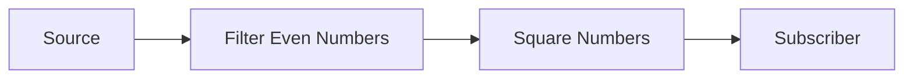

## 14.2 Implementing Functional Reactive Programming in Clojure

Functional Reactive Programming (FRP) is a paradigm that combines functional programming with reactive programming to handle asynchronous data streams and propagate changes. In this section, we delve into how Clojure supports FRP, explore libraries that facilitate FRP implementation, and provide practical examples to illustrate these concepts.

### Clojure's Approach to FRP

Clojure's functional nature makes it an excellent fit for reactive programming patterns. By leveraging immutable data structures, first-class functions, and a robust concurrency model, Clojure provides a solid foundation for implementing FRP. Clojure's emphasis on immutability and pure functions aligns well with the principles of FRP, which focus on handling time-varying values and event-driven computations.

#### Libraries for FRP

To implement FRP in Clojure, we can utilize libraries such as [Reagi](https://github.com/weavejester/reagi) and [RxJava](https://github.com/ReactiveX/RxJava). These libraries provide abstractions for working with reactive streams, enabling developers to build responsive applications efficiently.

- **Reagi**: A Clojure library inspired by the Rx family of reactive extensions. It provides a simple API for creating and manipulating streams of data.
- **RxJava**: While primarily a Java library, RxJava can be used in Clojure projects to implement reactive programming, thanks to Clojure's seamless Java interoperability.

### Core Concepts of FRP

Before diving into code examples, let's explore some core concepts of FRP that are crucial for understanding how to implement it in Clojure.

#### Signals and Behaviors

- **Signals**: Represent time-varying values. In FRP, signals are akin to variables that change over time, and computations can react to these changes.
- **Behaviors**: Describe the dynamic behavior of a value over time. Behaviors can be thought of as functions that take time as an implicit argument and return a value.

#### Observers

- **Observers**: Entities that subscribe to signals and receive updates when the signal's value changes. Observers can be functions or objects that react to new data.

### Basic Implementation of FRP in Clojure

Let's explore how to implement reactive streams and transformations in Clojure using Reagi. We'll start by setting up a basic reactive stream and perform some transformations on it.

#### Setting Up Reagi

First, add Reagi to your project dependencies. In your `project.clj` file, include:

```clojure
:dependencies [[org.clojure/clojure "1.10.3"]
               [reagi "0.10.1"]]
```

#### Creating a Simple Reactive Stream

Let's create a simple reactive stream that emits a sequence of numbers. We'll use Reagi's `events` function to create an event stream.

```clojure
(require '[reagi.core :as r])

;; Create a simple event stream
(def numbers (r/events (range 10)))

;; Subscribe to the stream and print each number
(r/subscribe numbers println)
```

In this example, we create an event stream of numbers from 0 to 9 and subscribe to it using the `println` function. This setup will print each number to the console as it is emitted by the stream.

#### Transforming Streams

Reactive streams can be transformed using various operators. Let's apply some transformations to our stream.

```clojure
;; Filter even numbers and map to their squares
(def transformed (-> numbers
                     (r/filter even?)
                     (r/map #(* % %))))

;; Subscribe and print the transformed stream
(r/subscribe transformed println)
```

Here, we use the `filter` operator to retain only even numbers and the `map` operator to square each number. The transformed stream is then subscribed to, printing the squares of even numbers.

#### Combining Streams

Reagi allows combining multiple streams using combinators. Let's see how to merge two streams.

```clojure
;; Create another stream of numbers
(def more-numbers (r/events (range 10 20)))

;; Merge the two streams
(def combined (r/merge numbers more-numbers))

;; Subscribe and print the combined stream
(r/subscribe combined println)
```

In this example, we create another stream of numbers from 10 to 19 and merge it with the original stream. The combined stream emits numbers from both streams in the order they are emitted.

### Advanced FRP Concepts

Now that we have a basic understanding of FRP in Clojure, let's explore some advanced concepts and techniques.

#### Handling Asynchronous Data

FRP excels at handling asynchronous data streams. We can simulate asynchronous data using Clojure's core.async library in conjunction with Reagi.

```clojure
(require '[clojure.core.async :as async])

;; Create a channel and a stream from it
(def ch (async/chan))
(def async-stream (r/from-channel ch))

;; Put data into the channel asynchronously
(async/go
  (doseq [n (range 5)]
    (async/>! ch n)
    (async/<! (async/timeout 1000))))

;; Subscribe to the async stream
(r/subscribe async-stream println)
```

In this example, we create a channel and a stream from it using `r/from-channel`. We then put data into the channel asynchronously using `async/go`, simulating a delay with `async/timeout`. The stream emits data as it becomes available.

#### Error Handling in Streams

Handling errors gracefully is crucial in reactive programming. Reagi provides mechanisms to handle errors within streams.

```clojure
;; Create a stream that throws an error
(def error-stream (r/events (concat (range 5) (throw (Exception. "Oops!")))))

;; Handle errors using `catch`
(def safe-stream (r/catch error-stream
                          (fn [e] (println "Error occurred:" (.getMessage e)))))

;; Subscribe to the safe stream
(r/subscribe safe-stream println)
```

In this example, we create a stream that throws an error and use the `r/catch` operator to handle it. The error message is printed, and the stream continues processing.

### Visualizing FRP with Diagrams

To better understand the flow of data in FRP, let's visualize a simple reactive stream using a diagram.



**Diagram Description**: This flowchart represents a simple reactive stream where a source emits numbers, which are filtered to retain only even numbers. The even numbers are then squared before being passed to the subscriber.

### Integrating RxJava with Clojure

While Reagi is a Clojure-specific library, RxJava is a popular choice for implementing FRP in Java and can be integrated into Clojure projects. Let's see how to use RxJava in Clojure.

#### Setting Up RxJava

Add RxJava to your project dependencies:

```clojure
:dependencies [[org.clojure/clojure "1.10.3"]
               [io.reactivex.rxjava3/rxjava "3.0.0"]]
```

#### Creating Observables

RxJava provides the `Observable` class to represent streams. Let's create a simple observable in Clojure.

```clojure
(import '[io.reactivex.rxjava3.core Observable])

;; Create an observable that emits numbers
(def observable (Observable/create
                  (fn [emitter]
                    (doseq [n (range 5)]
                      (.onNext emitter n))
                    (.onComplete emitter))))

;; Subscribe to the observable
(.subscribe observable println)
```

In this example, we create an observable that emits numbers from 0 to 4 and subscribe to it using `println`.

#### Transforming Observables

RxJava provides operators for transforming observables. Let's apply some transformations.

```clojure
;; Map to squares and filter even numbers
(def transformed-observable
  (.filter
   (.map observable #(* % %))
   even?))

;; Subscribe to the transformed observable
(.subscribe transformed-observable println)
```

Here, we use the `map` operator to square each number and the `filter` operator to retain only even squares. The transformed observable is then subscribed to.

### Best Practices for Implementing FRP in Clojure

Implementing FRP effectively requires adhering to best practices. Here are some guidelines to follow:

- **Use Immutability**: Leverage Clojure's immutable data structures to prevent unintended side effects.
- **Favor Pure Functions**: Ensure that your reactive computations are pure functions to maintain predictability.
- **Handle Errors Gracefully**: Use error handling mechanisms to manage exceptions and ensure the robustness of your streams.
- **Optimize Performance**: Minimize the use of blocking operations and leverage Clojure's concurrency primitives for efficient data processing.

### Try It Yourself

Experiment with the code examples provided in this section. Try modifying the streams to emit different types of data or apply different transformations. Consider integrating RxJava into a Clojure project and explore its extensive API for reactive programming.

### References and Further Reading

- [Clojure Official Documentation](https://clojure.org/reference)
- [Reagi GitHub Repository](https://github.com/weavejester/reagi)
- [RxJava GitHub Repository](https://github.com/ReactiveX/RxJava)
- [Transitioning from OOP to Functional Programming](https://www.lispcast.com/oo-to-fp/)

### Knowledge Check

To reinforce your understanding of FRP in Clojure, complete the following exercises and quiz.

## **Test Your Knowledge: Implementing FRP in Clojure Quiz**



### What is a signal in FRP?

- [x] A time-varying value
- [ ] A static value
- [ ] A function that never changes
- [ ] A database connection

> **Explanation:** In FRP, a signal represents a value that changes over time, allowing computations to react to these changes.

### Which library is Clojure-specific for implementing FRP?

- [x] Reagi
- [ ] RxJava
- [ ] Spring
- [ ] Akka

> **Explanation:** Reagi is a Clojure library specifically designed for implementing functional reactive programming.

### What does the `map` operator do in a reactive stream?

- [x] Transforms each element of the stream
- [ ] Filters elements based on a condition
- [ ] Merges two streams
- [ ] Creates a new stream

> **Explanation:** The `map` operator applies a transformation function to each element of the stream, producing a new stream with the transformed elements.

### How can you handle errors in a Reagi stream?

- [x] Using the `r/catch` operator
- [ ] Using a try-catch block
- [ ] By ignoring them
- [ ] By restarting the stream

> **Explanation:** The `r/catch` operator in Reagi is used to handle errors within a stream, allowing for graceful error management.

### Which of the following is a core concept of FRP?

- [x] Behaviors
- [x] Observers
- [ ] Classes
- [ ] Interfaces

> **Explanation:** Behaviors and observers are core concepts in FRP, representing dynamic values over time and entities that react to changes, respectively.

### What is the purpose of the `r/merge` operator?

- [x] To combine multiple streams into one
- [ ] To split a stream into multiple streams
- [ ] To filter a stream
- [ ] To transform elements of a stream

> **Explanation:** The `r/merge` operator combines multiple streams into a single stream, allowing data from different sources to be processed together.

### How can you simulate asynchronous data in Clojure?

- [x] Using `clojure.core.async`
- [ ] Using Java threads
- [ ] Using a database
- [ ] Using a file system

> **Explanation:** The `clojure.core.async` library provides tools for handling asynchronous data, such as channels and go blocks.

### What is an observable in RxJava?

- [x] A stream that emits data over time
- [ ] A static value
- [ ] A function that never changes
- [ ] A database connection

> **Explanation:** In RxJava, an observable represents a stream that emits data over time, allowing subscribers to react to the data.

### What is the main advantage of using FRP?

- [x] Handling asynchronous data streams efficiently
- [ ] Reducing code complexity
- [ ] Improving database performance
- [ ] Enhancing UI design

> **Explanation:** FRP excels at handling asynchronous data streams efficiently, making it ideal for building responsive applications.

### True or False: RxJava can be used in Clojure projects.

- [x] True
- [ ] False

> **Explanation:** RxJava can be integrated into Clojure projects due to Clojure's seamless interoperability with Java libraries.



By mastering FRP in Clojure, you can build scalable, responsive applications that efficiently handle asynchronous data streams. Embrace the functional programming mindset, and explore the vast possibilities that FRP offers in modern software development.
